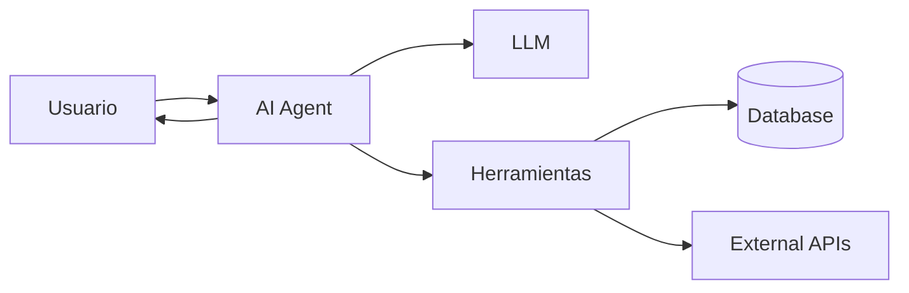
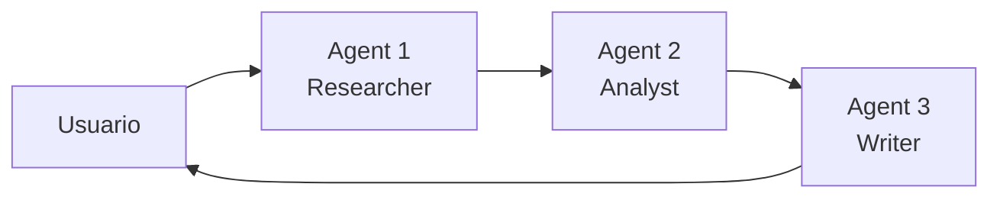
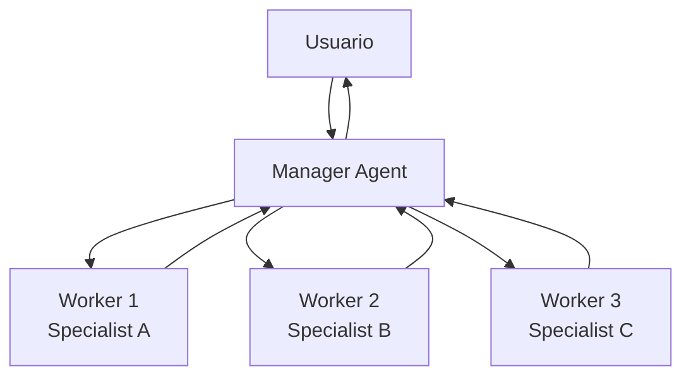
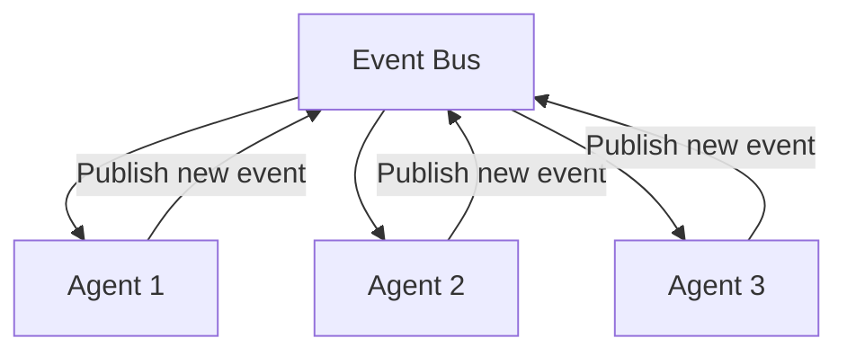
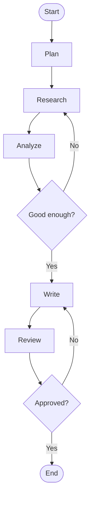
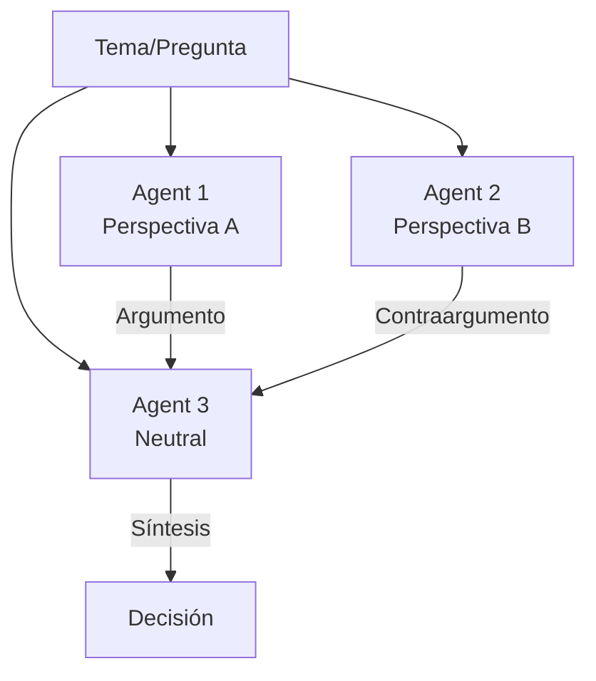
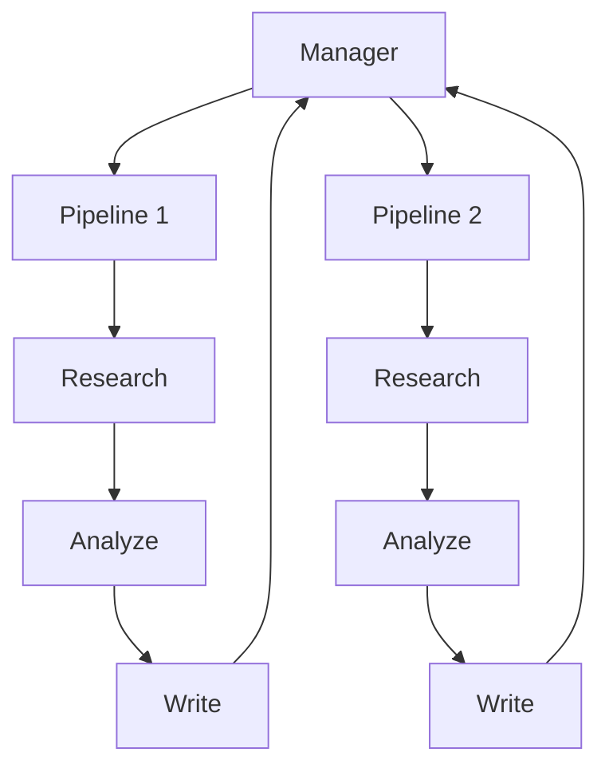
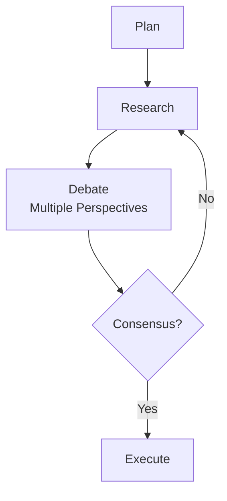

# Architecture Patterns - AI Agent Systems

## 🎯 Overview

Esta guía presenta patrones de arquitectura probados para sistemas de AI Agents, con diagramas Mermaid, trade-offs y cuándo usar cada uno.

---

## Pattern 1: Single Agent (Básico)

### Diagrama



### Descripción

Un solo agente maneja todas las responsabilidades. Interactúa con herramientas y retorna respuestas al usuario.

### Cuándo Usar
- ✅ Casos de uso simples (chatbot, Q&A)
- ✅ Prototipado rápido
- ✅ Scope bien definido
- ✅ Recursos limitados

### Trade-offs

**Pros:**
- Simplicidad
- Fácil debugging
- Bajo overhead
- Menor costo

**Cons:**
- No escala en complejidad
- Single point of failure
- Difícil especialización

### Ejemplo de Código

```python
from langchain.agents import create_openai_functions_agent
from langchain_openai import ChatOpenAI
from langchain.tools import Tool

llm = ChatOpenAI(model="gpt-4o-mini")

tools = [
    Tool(name="search", func=search_web, description="Search the web"),
    Tool(name="calculator", func=calculate, description="Perform calculations")
]

agent = create_openai_functions_agent(llm, tools, prompt)
result = agent.invoke({"input": "What is 25 * 4 and search for AI news"})
```

### Casos de Uso
- Customer support chatbot
- Simple Q&A system
- Document analysis tool

---

## Pattern 2: Pipeline (Sequential)

### Diagrama



### Descripción

Múltiples agentes especializados procesan la tarea secuencialmente. Output de uno es input del siguiente.

### Cuándo Usar
- ✅ Workflow lineal claro
- ✅ Especialización por etapa
- ✅ Cada etapa transforma datos
- ✅ Necesitas audit trail

### Trade-offs

**Pros:**
- Especialización clara
- Fácil rastrear progreso
- Debugging  etapa por etapa
- Paralelizable (si hay múltiples pipes)

**Cons:**
- Latencia acumulativa
- Rigidez (difícil saltar etapas)
- Error propagation

### Ejemplo de Código

```python
from crewai import Agent, Task, Crew, Process

# Agentes especializados
researcher = Agent(role='Researcher', goal='Gather data', ...)
analyst = Agent(role='Analyst', goal='Analyze data', ...)
writer = Agent(role='Writer', goal='Create report', ...)

# Tareas en secuencia
task1 = Task(description='Research topic X', agent=researcher)
task2 = Task(description='Analyze findings', agent=analyst, context=[task1])
task3 = Task(description='Write report', agent=writer, context=[task2])

# Crew ejecuta secuencialmente
crew = Crew(
    agents=[researcher, analyst, writer],
    tasks=[task1, task2, task3],
    process=Process.sequential
)
```

### Casos de Uso
- Content generation pipeline
- Data processing workflow
- Research → Analysis → Report

---

## Pattern 3: Hierarchical (Manager-Worker)

### Diagrama



### Descripción

Un agente manager coordina y delega a workers especializados. Manager decide quién hace qué.

### Cuándo Usar
- ✅ Tareas complejas con subtareas
- ✅ Necesitas coordinación central
- ✅ Workers tienen especialidades distintas
- ✅ Paralelización de subtareas

### Trade-offs

**Pros:**
- Orquestación centralizada
- Paralelización natural
- Escalable (añadir workers)
- Separación de concerns

**Cons:**
- Manager es bottleneck
- Single point of failure
- Mayor complejidad

### Ejemplo de Código

```python
from crewai import Agent, Task, Crew, Process

# Manager
manager = Agent(
    role='Project Manager',
    goal='Coordinate team to deliver project',
    allow_delegation=True
)

# Workers
backend_dev = Agent(role='Backend Developer', ...)
frontend_dev = Agent(role='Frontend Developer', ...)
qa_engineer = Agent(role='QA Engineer', ...)

crew = Crew(
    agents=[manager, backend_dev, frontend_dev, qa_engineer],
    tasks=[main_task],
    process=Process.hierarchical,  # Manager delega
    manager_llm=ChatOpenAI(model="gpt-4o")
)
```

### Casos de Uso
- Software development team
- Multi-domain research
- Complex project execution

---

## Pattern 4: Event-Driven (Reactive)

### Diagrama



### Descripción

Agentes reaccionan a eventos. No hay flujo predefinido. Sistema emerge de interacciones.

### Cuándo Usar
- ✅ Flujo no predecible
- ✅ Agentes independientes
- ✅ Escalabilidad horizontal
- ✅ Real-time reactions

### Trade-offs

**Pros:**
- Altamente desacoplado
- Fácil añadir agentes
- Fault tolerant
- Escalable

**Cons:**
- Difícil debugging
- Comportamiento emergent (impredecible)
- Necesita event infrastructure

### Ejemplo de Código

```python
import asyncio
from dataclasses import dataclass
from typing import Callable

@dataclass
class Event:
    type: str
    data: dict

class EventBus:
    def __init__(self):
        self.subscribers = {}
    
    def subscribe(self, event_type: str, handler: Callable):
        if event_type not in self.subscribers:
            self.subscribers[event_type] = []
        self.subscribers[event_type].append(handler)
    
    async def publish(self, event: Event):
        if event.type in self.subscribers:
            await asyncio.gather(*[
                handler(event) for handler in self.subscribers[event.type]
            ])

# Agentes suscritos a eventos
bus = EventBus()

async def monitoring_agent(event):
    if "error" in event.data:
        await bus.publish(Event("alert", {"severity": "high"}))

async def logging_agent(event):
    print(f"Log: {event.type} - {event.data}")

bus.subscribe("system_event", monitoring_agent)
bus.subscribe("system_event", logging_agent)

# Publicar evento
await bus.publish(Event("system_event", {"error": "Database timeout"}))
```

### Casos de Uso
- Monitoring systems
- IoT agent networks
- Real-time trading systems

---

## Pattern 5: State Machine (LangGraph)

### Diagrama



### Descripción

Workflow explícito como máquina de estados. Transiciones condicionales entre nodos.

### Cuándo Usar
- ✅ Workflow complejo con loops
- ✅ Necesitas control explícito
- ✅ Debugging crítico
- ✅ Persistence de estado

### Trade-offs

**Pros:**
- Control total
- Debugging visual
- Fácil persist state
- Condicionales complejos

**Cons:**
- Más verboso
- Menos flexible
- Requiere diseño upfront

### Ejemplo de Código

```python
from langgraph.graph import StateGraph, END
from typing import TypedDict

class State(TypedDict):
    task: str
    research_done: bool
    analysis: str
    iterations: int

def research(state):
    # Research logic
    return {**state, "research_done": True}

def analyze(state):
    # Analysis logic
    return {**state, "analysis": "...", "iterations": state['iterations'] + 1}

def should_continue(state):
    if state['iterations'] >= 3 or quality_check(state['analysis']):
        return "end"
    return "research"

# Build graph
workflow = StateGraph(State)
workflow.add_node("research", research)
workflow.add_node("analyze", analyze)

workflow.set_entry_point("research")
workflow.add_edge("research", "analyze")
workflow.add_conditional_edges(
    "analyze",
    should_continue,
    {"research": "research", "end": END}
)

app = workflow.compile()
```

### Casos de Uso
- Complex approval workflows
- Iterative refinement tasks
- Production ML pipelines

---

## Pattern 6: Debate / Consensus

### Diagrama



### Descripción

Múltiples agentes con perspectivas diferentes debaten hasta consenso o síntesis.

### Cuándo Usar
- ✅ Decisiones complejas
- ✅ Necesitas múltiples perspectivas
- ✅ Evitar sesgo de un solo agente
- ✅ Calidad > velocidad

### Trade-offs

**Pros:**
- Múltiples perspectivas
- Reduce sesgos
- Better decisions
- Auto-validación

**Cons:**
- Alto costo (múltiples LLM calls)
- Lento
- Puede no converger

### Ejemplo de Código

```python
from autogen import AssistantAgent, GroupChat, GroupChatManager

bull = AssistantAgent(
    "bull_investor",
    system_message="Eres optimista, enfócate en oportunidades"
)

bear = AssistantAgent(
    "bear_investor",
    system_message="Eres pesimista, enfócate en riesgos"
)

analyst = AssistantAgent(
    "neutral_analyst",
    system_message="Sintetiza argumentos y decide"
)

groupchat = GroupChat(
    agents=[bull, bear, analyst],
    messages=[],
    max_round=12
)

manager = GroupChatManager(groupchat=groupchat)

# Inicia debate
result = manager.chat("Should we invest in company X?")
```

### Casos de Uso
- Investment decisions
- Strategic planning
- Complex problem solving

---

## 🎯 Pattern Selection Matrix

| Pattern | Complexity | Cost | Latency | Use Cases |
|---------|------------|------|---------|-----------|
| **Single Agent** | Low | $ | Low | Simple tasks, prototypes |
| **Pipeline** | Medium | $$ | Medium | Sequential workflows |
| **Hierarchical** | Medium-High | $$$ | Medium | Complex coordination |
| **Event-Driven** | High | $$$ | Low | Real-time, reactive |
| **State Machine** | High | $$ | Medium | Complex logic, loops |
| **Debate** | Medium | $$$$ | High | Critical decisions |

---

## 🔄 Hybrid Patterns

### Pattern: Hierarchical + Pipeline



**Cuándo:** Múltiples workflows paralelos con coordinación

---

### Pattern: State Machine + Debate



**Cuándo:** Decisiones críticas en workflow complejo

---

## 📋 Architecture Decision Checklist

Al elegir arquitectura, considera:

**Funcional:**
- [ ] ¿El workflow es lineal o tiene branches?
- [ ] ¿Puede haber loops/iteraciones?
- [ ] ¿Necesitas paralelización?
- [ ] ¿Qué nivel de especialización se requiere?

**No-Funcional:**
- [ ] ¿Cuál es el presupuesto de latencia?
- [ ] ¿Cuál es el presupuesto de costo?
- [ ] ¿Qué nivel de fault tolerance necesitas?
- [ ] ¿Necesitas auditable/debuggable?

**Escala:**
- [ ] ¿Cuántos usuarios/requests esperados?
- [ ] ¿Crecerá la complejidad con el tiempo?
- [ ] ¿Necesitas add agents dinámicamente?

---

## 🚀 Migration Paths

### De Single → Pipeline
**Trigger:** Necesitas especialización  
**Effort:** Low  
**Pattern:** Divide agente en stages

### De Pipeline → Hierarchical
**Trigger:** Necesitas paralelización  
**Effort:** Medium  
**Pattern:** Añade manager, convierte stages en workers

### De Cualquiera → Event-Driven
**Trigger:** Necesitas reactive/real-time  
**Effort:** High  
**Pattern:** Rewrite con event bus

---

**Pro Tip:** Empieza simple (Single Agent), evoluciona según necesidad. No over-engineer desde el principio. La mejor arquitectura es la que resuelve TU problema específico.
