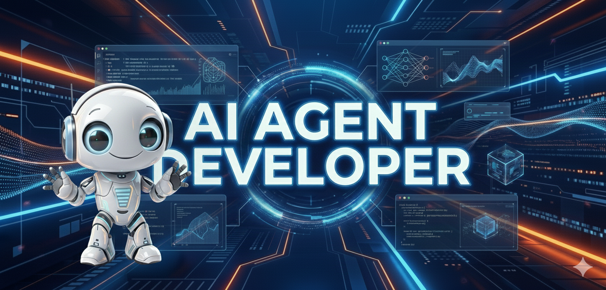
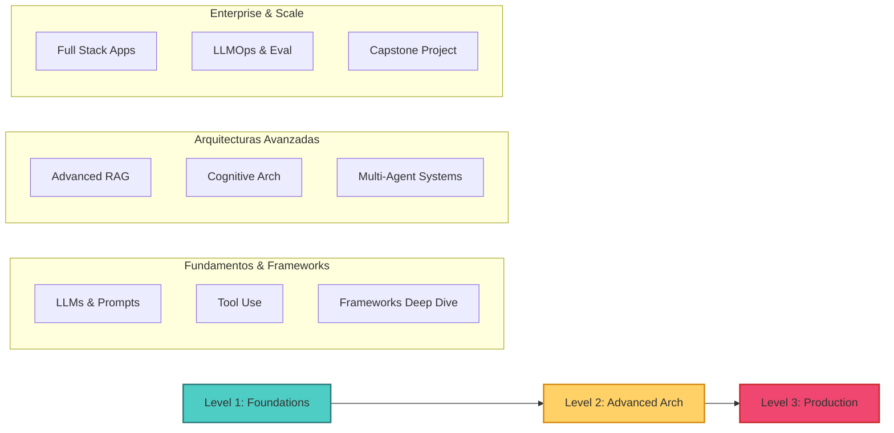

# Professional AI Agent Developer



<div align="center">

[](https://www.python.org/)
[](LICENSE)
[]()
[]()

**Master the Future of AI Engineering: From Foundations to Autonomous Enterprise Systems**

[🚀 Comenzar Curso](module0/README.md) • [📚 Documentación](docs/FRAMEWORK_COMPARISON.md) • [🛠️ Tech Stack](#-tech-stack-2025)

</div>

---

## 🌟 Why This Course?

Bienvenido al programa más avanzado y actualizado para dominar la **Ingeniería de Agentes IA**. Este no es otro tutorial básico; es una **maestría técnica** diseñada para llevarte de cero a desplegar sistemas multi-agente en producción.

> [!IMPORTANT]
> **Actualizado Noviembre 2025**: Incluye las últimas tecnologías lanzadas este mes, incluyendo **GPT-5.1**, **Gemini 3.0 Pro**, **Claude 4.5 Sonnet** y **Llama 4**.

### 🚀 Diferenciadores Clave

| Característica | ❌ Cursos Típicos | ✅ Professional AI Agent Dev |
| :--- | :--- | :--- |
| **Modelos** | GPT-4 / Claude 3.5 | **GPT-5.1, Gemini 3.0, Llama 4** |
| **Profundidad** | Scripts básicos | **Arquitecturas Enterprise (RAG, Swarms)** |
| **Frameworks** | Solo LangChain | **LangGraph, CrewAI, AutoGen, Semantic Kernel** |
| **Enfoque** | Demos de juguete | **Production-Ready & Scalable** |
| **Proyectos** | Chatbot simple | **Autonomous Software House, Enterprise RAG** |

---

## 🏗️ Arquitectura del Curso



---

## 🛠️ Tech Stack (2025)

Dominarás las herramientas que definen el estándar de la industria hoy:

<div align="center">

| Categoría | Tecnologías |
| :--- | :--- |
| **Modelos (LLMs)** |     |
| **Orquestación** |     |
| **Vector DBs** |    |
| **Deployment** |    |

</div>

---

## 📚 Estructura del Contenido

> **17 Módulos** organizados meticulosamente para llevarte al nivel experto.

### 🎯 Rutas de Aprendizaje
- 🌱 **Nuevo en IA**: Empieza en [Módulo 0](module0/README.md)
- 💼 **Developer ML**: Salta a [Módulo 1](module1/README.md)
- 🚀 **Focus Producción**: Ve directo a [Módulo 2](module2/README.md)

### 🟢 Nivel 1: Fundamentos & Frameworks
| Módulo | Tema | Highlights |
| :--- | :--- | :--- |
| **[Módulo 0](module0/README.md)** | **Intro IA & LLMs** | Transformers, Neural Networks from scratch |
| **[Módulo 0.5](module0.5/README.md)** | **Math Foundations** | Álgebra Lineal, Cálculo para IA |
| **[Módulo 0.6](module0.6/README.md)** | **Applied Data Science** | Numpy, Pandas, Tensores |
| **[Módulo 1](module1/README.md)** | **LLMs & Agents** | **GPT-5.1, Gemini 3.0**, Agentic Mindset |
| **[Módulo 1.2](module1.2/README.md)** | **Advanced Prompting** | Frameworks RACE/RISE, CoT, ReAct |
| **[Módulo 1.5](module1.5/README.md)** | **Open Source Ecosystem** | HuggingFace, Ollama, Local Inference |
| **[Módulo 2](module2/README.md)** | **Frameworks Panorama** | LangChain vs CrewAI vs AutoGen |
| **[Módulo 3](module3/README.md)** | **Cognitive Architectures** | ReAct, Reflexion, Tree-of-Thoughts |
| **[Módulo 4](module4/README.md)** | **Tools & MCP** | Model Context Protocol, Function Calling |

### 🟡 Nivel 2: Arquitecturas Avanzadas
| Módulo | Tema | Highlights |
| :--- | :--- | :--- |
| **[Módulo 5](module5/README.md)** | **Advanced RAG** | Hybrid Search, Reranking, GraphRAG |
| **[Módulo 6](module6/README.md)** | **Trustworthy AI** | Guardrails, Eval, Bias Mitigation |
| **[Módulo 7](module7/README.md)** | **LangGraph Planning** | State Machines, Cyclic Graphs |
| **[Módulo 8](module8/README.md)** | **Multi-Agent Systems** | Hierarchical Teams, Swarm Intelligence |

### 🔴 Nivel 3: Producción & Enterprise
| Módulo | Tema | Highlights |
| :--- | :--- | :--- |
| **[Módulo 9](module9/README.md)** | **Metacognition** | Self-learning Agents, Long-term Memory |
| **[Módulo 10](module10/README.md)** | **Full Stack Agents** | FastAPI, Async, Streaming UI |
| **[Módulo 11](module11/README.md)** | **LLMOps** | Tracing (LangSmith), Monitoring, Costs |
| **[Módulo 12](module12/README.md)** | **Agent Protocols** | MCP Deep Dive, Interoperability |
| **[Módulo 13](module13/README.md)** | **Capstone Project** | **The Autonomous Software House** |
| **[Módulo 14](module14/README.md)** | **Deployment** | Docker, Cloud Run, Kubernetes |

---

## 💻 What You Will Build

No solo teoría. Construirás sistemas reales:

1.  🧠 **Neural Network from Scratch**: Entiende la magia detrás de los LLMs.
2.  🤖 **Enterprise RAG Pipeline**: Sistema de búsqueda híbrida con re-ranking y citaciones.
3.  👥 **Autonomous Marketing Team**: Enjambre de agentes (Investigador, Escritor, Editor) colaborando.
4.  🏆 **The Software House**: Sistema end-to-end que toma un requerimiento y genera código, tests y documentación automáticamente.

---

## 🛠️ Setup Inicial

```bash
# 1. Clonar el repositorio
git clone https://github.com/tu-usuario/professional-ai-agent-developer.git
cd professional-ai-agent-developer

# 2. Crear entorno virtual
python -m venv venv
source venv/bin/activate  # Windows: venv\Scripts\activate

# 3. Instalar dependencias
pip install -r requirements.txt

# 4. Configurar API Keys (.env)
cp .env.example .env
```

---

## 📜 Licencia & Contribución

Este proyecto es **Open Source** bajo la licencia [MIT](LICENSE). ¡Las contribuciones son bienvenidas!

<div align="center">

**¿Listo para dominar la IA Agéntica?**

### [➡️ Comenzar Módulo 0](module0/README.md)

*Hecho con ❤️ para la comunidad de desarrolladores de IA*

</div>