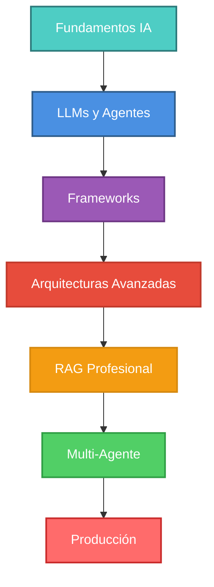

# Professional AI Agent Developer


<div align="center">

[](https://www.python.org/)
[](LICENSE)
[](https://github.com/tu-usuario/tu-repo)
[](FRAMEWORK_COMPARISON.md)

**De Cero a Producción Enterprise: Domina la creación de Agentes IA Autónomos**

[Comenzar Curso](module0/README.md) • [Documentación](FRAMEWORK_COMPARISON.md) • [Casos de Estudio](case_studies/01_startup_chatbot.md)

</div>

---

## 🚀 Descripción del Curso

Bienvenido al curso definitivo para convertirte en un **Professional AI Agent Developer**. Este programa transformado te llevará desde los **fundamentos de IA y LLMs** hasta el despliegue de **sistemas multi-agente** complejos en producción, utilizando las herramientas más modernas del ecosistema.

> [!NOTE]
> Este curso está diseñado para ser **práctico y profesional**. Cada módulo incluye código ejecutable, diagramas de arquitectura, comparativas de frameworks y ejemplos del mundo real con referencias a papers académicos actualizados (2023-2025).

---

## 🏗️ Arquitectura del Curso



El curso está estructurado en **3 niveles de maestría**, cubriendo desde fundamentos de IA hasta orquestación compleja en la nube.

---
 
 ## 🗺️ Ruta de Maestría en IA Agéntica
 
 Este curso está diseñado siguiendo las **10 Fases para Dominar la IA Agéntica**, asegurando una progresión lógica desde los fundamentos hasta el ecosistema builder.
 
 | Fase | Objetivo | Módulo Correspondiente |
 | :--- | :--- | :--- |
 | **1. Understand** | Entender qué significa IA Agéntica | [Módulo 1](module1/README.md) |
 | **2. Core Components** | Aprender componentes (LLM, Prompts, Tools) | [Módulo 1](module1/README.md) & [Módulo 4](module4/README.md) |
 | **3. Prompting for Agents** | System Prompts, Roles, Constraints | [Módulo 1.2](module1.2/README.md) |
 | **4. Basic Agent** | Construir tu primer agente simple | [Módulo 1.5](module1.5/README.md) |
 | **5. Agent Memory** | Añadir memoria (Short/Long term) | [Módulo 5](module5/README.md) |
 | **6. Tools & APIs** | Function Calling y APIs externas | [Módulo 4](module4/README.md) |
 | **7. Single-Agent Workflow** | Orquestación y Debugging | [Módulo 2](module2/README.md) |
 | **8. Multi-Agent Systems** | Roles, Protocolos y Colaboración | [Módulo 8](module8/README.md) |
 | **9. Deploy & Monitor** | Cloud, Logging, Rate Limits | [Módulo 11](module11/README.md) & [Módulo 14](module14/README.md) |
 | **10. Builder Ecosystem** | Contribuir a LangChain, MCP, Benchmarks | [Módulo 12](module12/README.md) & [Módulo 13](module13/README.md) |
 
 ---
## 📚 Estructura del Contenido

### 🟢 Nivel 1: Fundamentos & Frameworks

| Módulo | Tema | Descripción | Proyectos |
| :--- | :--- | :--- | :--- |
| **[Módulo 0](module0/README.md)** | **Introducción a IA y LLMs** | Historia, redes neuronales, transformers, BERT vs GPT | 🧠 Neural Network desde cero |
| **[Módulo 0.5](module0.5/README.md)** | **Fundamentos Matemáticos** | Álgebra Lineal, Cálculo, Entropía, Backpropagation, Attention | 📐 Teoría Profunda |
| **[Módulo 0.6](module0.6/README.md)** | **Applied Data Science** | Numpy, Pandas, Matplotlib, Visualización de Tensores | 💻 Taller Científico |
| **[Módulo 1](module1/README.md)** | **LLMs y Mentalidad Agéntica** | Panorama de LLMs (GPT-4o, Claude, Gemini, etc.), LLM vs Agent vs Multi-agent | 🤖 Comparativa de 10 modelos |
| **[Módulo 1.2](module1.2/README.md)** | **Advanced Prompt Engineering** | Frameworks (RACE, RISE), CoT, ReAct, System Prompts Avanzados | 🧪 Laboratorio de Prompts |
| **[Módulo 1.5](module1.5/README.md)** | **Ecosistemas Open Source** | HuggingFace Hub, Inference API, Ollama, Local LLMs | 🦙 Chatbot Local & Híbrido |
| **[Módulo 2](module2/README.md)** | **Panorama de Frameworks** | Deep dive en 9 frameworks (LangChain, Google ADK, CrewAI, AutoGen, etc.) | 🛠️ Framework Comparison |
| **[Módulo 3](module3/README.md)** | **Arquitecturas Cognitivas** | 15 arquitecturas (ReAct, Reflexion, LATS, ToT, Agentic RAG, etc.) | 🔄 Loop de Razonamiento |
| **[Módulo 4](module4/README.md)** | **Tool Use & Function Calling** | Structured Outputs, MCP Protocol, multi-framework tool integration | 🔌 Multi-Framework Tools |

### 🟡 Nivel 2: Arquitecturas Avanzadas

| Módulo | Tema | Descripción | Proyectos |
| :--- | :--- | :--- | :--- |
| **[Módulo 5](module5/README.md)** | **RAG Avanzado** | 7 partes: Loaders, Splitters, Embeddings, Vector DBs, HyDE, Memory, HITL | 📚 Sistema RAG Profesional |
| **[Módulo 6](module6/README.md)** | **IA Confiable** | Evaluación, Guardrails, Red Teaming, Bias/Fairness | 🛡️ Auditor de Seguridad |
| **[Módulo 7](module7/README.md)** | **Planificación con LangGraph** | Tree-of-Thoughts, Planner Agents, State machines | 🗺️ Planificador Complejo |
| **[Módulo 8](module8/README.md)** | **Sistemas Multi-Agente** | Orquestación, Debate, Jerarquías (CrewAI, AutoGen) | 👥 Equipo Colaborativo |

### 🔴 Nivel 3: Producción & Enterprise

| Módulo | Tema | Descripción | Proyectos |
| :--- | :--- | :--- | :--- |
| **[Módulo 9](module9/README.md)** | **Metacognición** | Self-learning, Skill Libraries, Memoria a largo plazo | 🧠 Agente Evolutivo |
| **[Módulo 10](module10/README.md)** | **Full Stack Agents** | FastAPI, Streamlit, Async Queues, SSE | 🚀 App Completa |
| **[Módulo 11](module11/README.md)** | **LLMOps & Observability** | Tracing (LangSmith), Eval (Ragas), Monitoring | 📊 Dashboard Ops |
| **[Módulo 12](module12/README.md)** | **Agent Protocols (MCP)** | Model Context Protocol, Interoperabilidad, Tools | 🔌 USB para IA |
| **[Módulo 13](module13/README.md)** | **Capstone Project** | The Autonomous Software House (End-to-End) | 🏆 **Software House** |
| **[Módulo 14](module14/README.md)** | **Bonus: Deployment** | Docker, Kubernetes, Cloud Run | ☁️ Despliegue Cloud |

---

## 🎯 Lo Que Hace Único a este Curso

### Diferenciadores Clave

**1. Profundidad Profesional**
- 📊 15+ arquitecturas cognitivas implementadas
- 🔬 Referencias a 30+ papers académicos (2023-2025)
- 💻 Código production-ready, no toy examples

**2. Multi-Framework**
- 🦜 LangChain
- 🕸️ LangGraph  
- 👥 CrewAI
- 🤖 AutoGen
- 🏢 Semantic Kernel
- 🦙 LlamaIndex
- 🐍 Pydantic AI
- 🤏 Smolagents

**3. Actualizado 2024-2025**
- ✅ Structured Outputs (OpenAI, Ago 2024)
- ✅ Model Context Protocol (Anthropic, Nov 2024)
- ✅ Reasoning models (o1, o3, QwQ, DeepSeek-R1)
- ✅ Claude 3.5 Sonnet, Gemini 1.5 Pro
- ✅ Llama 3.1, Qwen 2.5

**4. Educativo y Comprehensivo**
- 🎓 Desde fundamentos de redes neuronales
- 📈 Hasta despliegue en Kubernetes
- 🔄 Progresión lógica y estructurada

---

## 📖 Documentación de Referencia

Recursos esenciales para tu día a día como desarrollador:

- 🎨 **[Design Guide](docs/DESIGN_GUIDE.md)**: Estándares de UI/UX para agentes (NUEVO)
- 🆚 **[Comparativa de Frameworks](docs/FRAMEWORK_COMPARISON.md)**: 8 frameworks comparados en detalle
- ✅ **[Mejores Prácticas](docs/BEST_PRACTICES.md)**: Guía consolidada de diseño y código
- 🔧 **[Troubleshooting](docs/TROUBLESHOOTING.md)**: Soluciones a problemas comunes
- 🏛️ **[Patrones de Arquitectura](docs/ARCHITECTURE_PATTERNS.md)**: Catálogo de diseños probados
- 💰 **[Optimización de Costos](docs/COST_OPTIMIZATION.md)**: Estrategias para reducir factura LLM

---

## 🛠️ Setup Inicial

```bash
# 1. Clonar el repositorio
git clone https://github.com/tu-usuario/professional-ai-agent-developer.git
cd professional-ai-agent-developer

# 2. Crear entorno virtual
python -m venv venv
source venv/bin/activate  # Windows: venv\Scripts\activate

# 3. Instalar dependencias
pip install -r requirements.txt

# 4. Configurar variables de entorno
cp .env.example .env
# Edita .env con tus API Keys:
# - OPENAI_API_KEY
# - ANTHROPIC_API_KEY
# - GOOGLE_API_KEY
# etc.

# 5. Verificar instalación
python -c "import langchain; print('✅ LangChain OK')"
```

### Dependencias Principales

```txt
# Core frameworks
langchain>=0.1.0
langchain-openai>=0.0.5
langchain-anthropic>=0.1.0
langgraph>=0.0.20
crewai>=0.1.0
autogen>=0.2.0
semantic-kernel>=0.4.0
llama-index>=0.9.0

# RAG y Vector DBs
chromadb>=0.4.0
pinecone-client>=3.0.0
weaviate-client>=3.25.0
faiss-cpu>=1.7.4

# Utilities
openai>=1.0.0
anthropic>=0.18.0
tiktoken>=0.5.0
pydantic>=2.0.0
```

---

## 🌟 ¿Por qué este Curso?

> "La mayoría de los tutoriales se detienen en el 'Hola Mundo'. Este curso empieza donde ellos terminan."

### Comparación con Otros Cursos

| Característica | Cursos Típicos | Este Curso |
|----------------|----------------|------------|
| **Profundidad** | Superficial | Nivel profesional |
| **Frameworks** | 1-2 | 8+ comparados |
| **Arquitecturas** | 2-3 básicas | 15+ implementadas |
| **Código** | Toy examples | Production-ready |
| **Actualización** | 2022-2023 | 2024-2025 |
| **Papers** | 0-5 | 30+ referencias |
| **Ejemplos** | ~10 | 50+ completos |

### Lo Que Aprenderás

- ✅ Fundamentos sólidos (desde redes neuronales hasta transformers)
- ✅ Panorama completo de LLMs modernos
- ✅ Dominio de múltiples frameworks
- ✅ 15 arquitecturas cognitivas implementadas
- ✅ RAG profesional (7 partes detalladas)
- ✅ Sistemas multi-agente complejos
- ✅ Deployment y LLMOps

### Enfoque del Curso

- **Práctico**: 50+ ejemplos de código listos para producción
- **Agnóstico**: Aprende principios, no solo una herramienta
- **Enterprise-Grade**: Seguridad, testing y escalabilidad desde día 1
- **Actualizado**: Tecnologías de 2024-2025
- **Comprehensivo**: 14 módulos desde fundamentos hasta deployment

---

## 📊 Estadísticas del Curso

- 📄 **~12,000 líneas** de contenido profesional
- 💻 **50+ ejemplos** de código funcional
- 📊 **40+ diagramas** Mermaid con paleta consistente
- 📚 **30+ referencias** a papers y documentación oficial
- 🏗️ **15 arquitecturas** cognitivas implementadas
- 🦾 **8 frameworks** comparados en detalle
- 🤖 **10 LLMs** líderes del mercado analizados

---

## 🎓 Para Quién es Este Curso

### ✅ Ideal Para:
- Developers Python con experiencia básica
- ML Engineers que quieren entrar en IA Generativa
- Software Engineers construyendo aplicaciones con LLMs
- Data Scientists explorando agentes autónomos
- Tech Leads diseñando arquitecturas de IA

### Prerequisitos:
- Python intermedio (clases, decoradores, async)
- Familiaridad con APIs REST
- Git básico
- Opcional: Conocimiento de ML/DL (se explica en Módulo 0)

---

## 🗺️ Ruta de Aprendizaje Sugerida

### Track 1: Principiante Completo (Full Course)
```
Módulo 0 → 1 → 2 → 3 → 4 → 5 → 6 → 7 → 8 → 9 → 10 → 11 → 12
Tiempo estimado: 60-80 horas
```

### Track 2: Developer con Experiencia en ML
```
Módulo 1 → 2 → 3 → 4 → 5 → 8 → 10 → 12
Tiempo estimado: 30-40 horas
```

### Track 3: Focus en Producción
```
Módulo 2 → 4 → 5 → 6 → 10 → 13 → 14
Tiempo estimado: 25-35 horas
```

---

## 💡 Contribuciones

¡Las contribuciones son bienvenidas! Si encuentras errores o quieres añadir contenido:

1. Fork el repositorio
2. Crea una branch (`git checkout -b feature/nueva-funcionalidad`)
3. Commit tus cambios (`git commit -am 'Add nueva funcionalidad'`)
4. Push a la branch (`git push origin feature/nueva-funcionalidad`)
5. Abre un Pull Request

---

## 📜 Licencia

MIT License - Ver [LICENSE](LICENSE) para detalles.

---

<div align="center">

**¿Listo para empezar tu journey?**

### [➡️ Ir al Módulo 0: Introducción a IA y LLMs](module0/README.md)

*De fundamentos de redes neuronales a agentes autónomos en producción* 🚀

---

**Hecho con** ❤️ **para la comunidad de desarrolladores de IA**

[](https://github.com/tu-usuario/professional-ai-agent-developer)

</div>