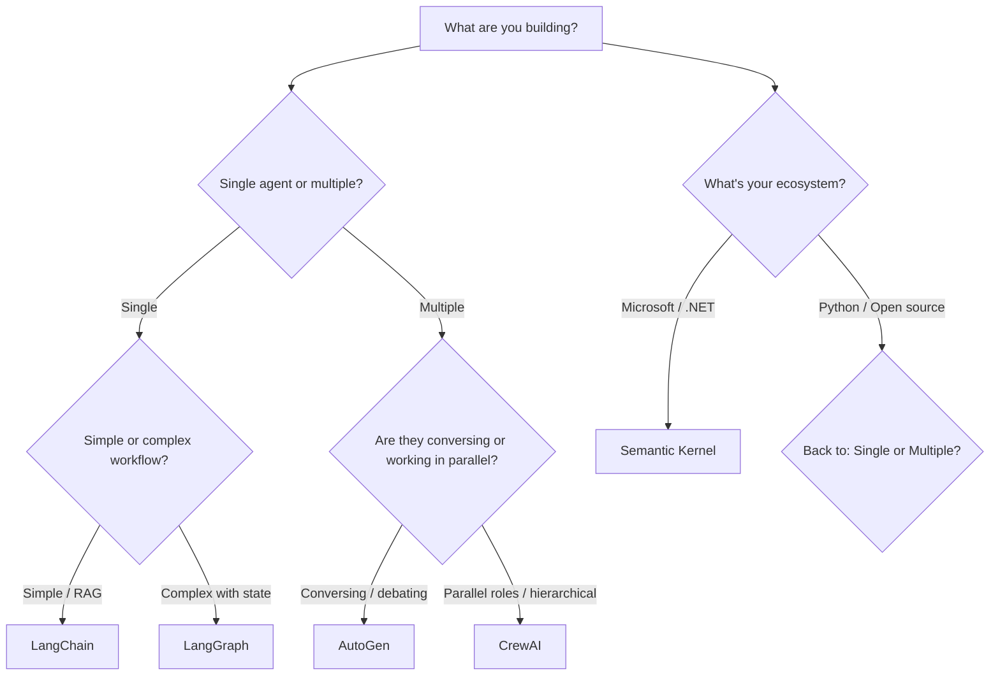

# Framework Comparison - AI Agent Development

## 🎯 Executive Summary

Esta guía compara los 5 frameworks principales para desarrollo de AI Agents, ayudándote a elegir la herramienta correcta para tu proyecto.

| Framework | Best For | Complexity | Community | Learning Curve |
|-----------|----------|------------|-----------|----------------|
| **LangChain** | General purpose, RAG | Medium | ⭐⭐⭐⭐⭐ | Medium |
| **LangGraph** | Complex workflows, state machines | High | ⭐⭐⭐⭐ | High |
| **CrewAI** | Multi-agent teams, role-based | Low-Medium | ⭐⭐⭐ | Low |
| **AutoGen** | Conversational agents, debates | Medium | ⭐⭐⭐⭐ | Medium |
| **Semantic Kernel** | Microsoft ecosystem, .NET | Medium | ⭐⭐⭐ | Medium |

---

## 📊 Detailed Comparison

### LangChain

**Overview:** The Swiss Army knife of AI agent frameworks. Most comprehensive library with extensive tools.

**Pros:**
- ✅ Massive ecosystem (1000+ integrations)
- ✅ Excellent documentation
- ✅ RAG capabilities out of the box
- ✅ Active community
- ✅ Production-ready
- ✅ Multiple abstraction levels (simple → complex)

**Cons:**
- ❌ Can be overwhelming (too many options)
- ❌ API changes frequently
- ❌ Performance overhead for simple tasks
- ❌ Steep learning curve for advanced features

**When to Use:**
- Building RAG applications
- Need extensive tool integrations
- Prototype to production pipeline
- General-purpose agents

**Code Example:**
```python
from langchain.agents import create_openai_functions_agent
from langchain_openai import ChatOpenAI
from langchain.tools import Tool

llm = ChatOpenAI(model="gpt-4o-mini")
tools = [Tool(name="search", func=search_func, description="...")]
agent = create_openai_functions_agent(llm, tools, prompt)
```

**Pricing Impact:** Medium (flexible model choices)

---

### LangGraph

**Overview:** Specialized for complex, stateful agent workflows with graph-based execution.

**Pros:**
- ✅ Perfect for complex state machines
- ✅ Explicit control flow (no black boxes)
- ✅ Built-in persistence
- ✅ Conditional branching
- ✅ Human-in-the-loop support
- ✅ Debugging is easier (visual graphs)

**Cons:**
- ❌ Steeper learning curve
- ❌ More verbose than alternatives
- ❌ Overkill for simple agents
- ❌ Smaller community than LangChain

**When to Use:**
- Complex multi-step workflows
- Need explicit state management
- Conditional logic and loops
- Production systems requiring reliability

**Code Example:**
```python
from langgraph.graph import StateGraph, END

workflow = StateGraph(State)
workflow.add_node("analyze", analyze_fn)
workflow.add_node("decide", decide_fn)
workflow.add_conditional_edges("decide", route_fn, {...})
app = workflow.compile()
```

**Pricing Impact:** Medium-High (often needs better models for complex reasoning)

---

### CrewAI

**Overview:** Specialized in multi-agent orchestration with role-based design.

**Pros:**
- ✅ Simplest multi-agent setup
- ✅ Role-based design is intuitive
- ✅ Hierarchical processes built-in
- ✅ Great for teams of specialists
- ✅ Low code overhead
- ✅ Fast to prototype

**Cons:**
- ❌ Less flexible than competitors
- ❌ Smaller ecosystem
- ❌ Limited to specific patterns
- ❌ Documentation could be better

**When to Use:**
- Multi-agent systems with clear roles
- Team-based problem solving
- Hierarchical workflows (manager → workers)
- Rapid prototyping of agent teams

**Code Example:**
```python
from crewai import Agent, Task, Crew

researcher = Agent(role='Researcher', goal='...', backstory='...')
writer = Agent(role='Writer', goal='...', backstory='...')

task1 = Task(description='Research...', agent=researcher)
task2 = Task(description='Write...', agent=writer)

crew = Crew(agents=[researcher, writer], tasks=[task1, task2])
result = crew.kickoff()
```

**Pricing Impact:** Medium (multiple agents = multiple LLM calls)

---

### AutoGen

**Overview:** Microsoft's framework focused on conversational multi-agent systems.

**Pros:**
- ✅ Excellent for agent conversations
- ✅ Built-in code execution
- ✅ Group chat patterns
- ✅ Human-in-the-loop by design
- ✅ Clear agent communication protocols
- ✅ Good for debates/consensus

**Cons:**
- ❌ Conversational paradigm not always ideal
- ❌ Can be chatty (high token usage)
- ❌ Less control over execution flow
- ❌ Debugging conversations is hard

**When to Use:**
- Agent debates and deliberations
- Conversational workflows
- Code generation tasks
- Collaborative problem solving

**Code Example:**
```python
from autogen import AssistantAgent, UserProxyAgent

assistant = AssistantAgent("assistant", llm_config={...})
user_proxy = UserProxyAgent("user", human_input_mode="NEVER")

user_proxy.initiate_chat(assistant, message="Solve this problem...")
```

**Pricing Impact:** High (conversational = many back-and-forth calls)

---

### Semantic Kernel

**Overview:** Microsoft's enterprise-focused framework with C# and Python support.

**Pros:**
- ✅ Enterprise-ready (.NET integration)
- ✅ Clean plugin architecture
- ✅ Good Azure integration
- ✅ Memory and planning built-in
- ✅ Type-safe (in C#)

**Cons:**
- ❌ Smaller Python community
- ❌ Best with Microsoft stack
- ❌ Less examples than LangChain
- ❌ Documentation gaps

**When to Use:**
- Enterprise/Microsoft environments
- .NET projects
- Azure ecosystem
- Need strong typing

**Code Example:**
```python
import semantic_kernel as sk

kernel = sk.Kernel()
kernel.add_text_completion_service("gpt-4", OpenAIChatCompletion(...))
kernel.import_skill(MySkill(), "my_skill")

result = await kernel.run_async(
    kernel.skills.get_function("my_skill", "solve")
)
```

**Pricing Impact:** Medium (flexible, but often Azure-based)

---

## 🎯 Decision Tree



## 🔍 Feature Comparison Matrix

| Feature | LangChain | LangGraph | CrewAI | AutoGen | Semantic Kernel |
|---------|-----------|-----------|--------|---------|-----------------|
| **RAG Support** | ⭐⭐⭐⭐⭐ | ⭐⭐⭐ | ⭐⭐⭐ | ⭐⭐ | ⭐⭐⭐ |
| **Multi-Agent** | ⭐⭐⭐ | ⭐⭐⭐⭐ | ⭐⭐⭐⭐⭐ | ⭐⭐⭐⭐⭐ | ⭐⭐⭐ |
| **State Management** | ⭐⭐ | ⭐⭐⭐⭐⭐ | ⭐⭐ | ⭐⭐⭐ | ⭐⭐⭐ |
| **Tool Integration** | ⭐⭐⭐⭐⭐ | ⭐⭐⭐⭐ | ⭐⭐⭐ | ⭐⭐⭐⭐ | ⭐⭐⭐ |
| **Ease of Use** | ⭐⭐⭐ | ⭐⭐ | ⭐⭐⭐⭐⭐ | ⭐⭐⭐ | ⭐⭐⭐ |
| **Documentation** | ⭐⭐⭐⭐⭐ | ⭐⭐⭐⭐ | ⭐⭐⭐ | ⭐⭐⭐⭐ | ⭐⭐⭐ |
| **Community Size** | ⭐⭐⭐⭐⭐ | ⭐⭐⭐⭐ | ⭐⭐⭐ | ⭐⭐⭐⭐ | ⭐⭐⭐ |
| **Production Ready** | ⭐⭐⭐⭐⭐ | ⭐⭐⭐⭐ | ⭐⭐⭐ | ⭐⭐⭐⭐ | ⭐⭐⭐⭐ |
| **Performance** | ⭐⭐⭐ | ⭐⭐⭐⭐ | ⭐⭐⭐ | ⭐⭐ | ⭐⭐⭐⭐ |

---

## 💰 Cost Considerations

### LangChain
- **Token Efficiency:** Medium
- **Overhead:** Some framework overhead
- **Cost Optimization:** Built-in caching, model routing
- **Typical Monthly Cost (1K users):** $500-2000

### LangGraph
- **Token Efficiency:** High (explicit control)
- **Overhead:** Minimal
- **Cost Optimization:** Manual but powerful
- **Typical Monthly Cost (1K users):** $400-1500

### CrewAI
- **Token Efficiency:** Medium-Low (multiple agents)
- **Overhead:** Agent coordination overhead
- **Cost Optimization:** Limited
- **Typical Monthly Cost (1K users):** $800-3000

### AutoGen
- **Token Efficiency:** Low (conversational)
- **Overhead:** High (back-and-forth messages)
- **Cost Optimization:** Minimal
- **Typical Monthly Cost (1K users):** $1000-4000

### Semantic Kernel
- **Token Efficiency:** Medium
- **Overhead:** Minimal
- **Cost Optimization:** Good
- **Typical Monthly Cost (1K users):** $500-2000

---

## 🚀 Quick Start Recommendations

### For Beginners
**Start with:** CrewAI

**Why:** Simplest API, clear mental model, fast results

### For RAG Applications
**Start with:** LangChain

**Why:** Best RAG support, comprehensive docs

### For Complex Workflows
**Start with:** LangGraph

**Why:** Best control, explicit state management

### For Multi-Agent Teams
**Start with:** CrewAI or AutoGen

**Why:** Built for this use case

### For Enterprise/.NET
**Start with:** Semantic Kernel

**Why:** Microsoft ecosystem integration

---

## 🔄 Migration Paths

### From LangChain to LangGraph
**When:** Need more control over complex workflows  
**Difficulty:** Medium  
**Benefit:** Better state management, debugging

### From CrewAI to LangGraph
**When:** Outgrow simple patterns  
**Difficulty:** Medium-High  
**Benefit:** More flexibility

### From AutoGen to LangGraph
**When:** Need non-conversational patterns  
**Difficulty:** Medium  
**Benefit:** Broader patterns

---

## 📚 Learning Resources

### LangChain
- Official Docs: https://python.langchain.com
- GitHub: 85K+ stars
- Discord: Active community

### LangGraph
- Official Docs: https://langchain-ai.github.io/langgraph/
- GitHub: Part of LangChain ecosystem
- Examples: Extensive tutorials

### CrewAI
- Official Docs: https://docs.crewai.com
- GitHub: Growing community
- Examples: Good starter templates

### AutoGen
- Official Docs: https://microsoft.github.io/autogen/
- GitHub: Microsoft-backed
- Notebooks: Many Jupyter examples

### Semantic Kernel
- Official Docs: https://learn.microsoft.com/semantic-kernel
- GitHub: Microsoft official
- Samples: C# and Python

---

## ✅ Final Recommendations

**Choose LangChain if:** You need a Swiss Army knife, building RAG, want maximum flexibility

**Choose LangGraph if:** Building production systems, need explicit control, complex state management

**Choose CrewAI if:** Building multi-agent teams, want simplicity, rapid prototyping

**Choose AutoGen if:** Agents need to converse, debate patterns, collaborative solving

**Choose Semantic Kernel if:** Enterprise/.NET environment, Azure integration, type safety

**Mix frameworks if:** Different parts of your system have different needs (perfectly valid!)

---

**Pro Tip:** Start simple (CrewAI/LangChain), migrate to LangGraph as complexity grows. Many production systems use multiple frameworks for different components.
