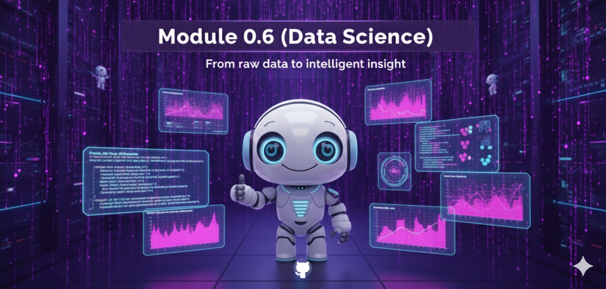

# Módulo 0.6: Applied Data Science for AI

> "La teoría sin práctica es estéril. La práctica sin teoría es ciega."

## 📌 Introducción

En este módulo, traduciremos las ecuaciones del Módulo 0.5 a código Python real. Usaremos el stack científico estándar (**Numpy, Pandas, Matplotlib**) para visualizar cómo "piensa" una red neuronal y manipular los datos que alimentan a nuestros agentes.

---

## 🛠️ Herramientas del Científico de Datos

### 1. Numpy: El Motor Numérico
La base de todo. Maneja arrays multidimensionales (tensores) con eficiencia de C.
- **Uso en IA**: Operaciones de matrices, cálculo de embeddings, producto punto.

### 2. Pandas: Excel con Esteroides
Manipulación de datos tabulares y series temporales.
- **Uso en IA**: Limpieza de datasets para fine-tuning, análisis de logs de agentes, evaluación de resultados.

### 3. Matplotlib / Seaborn: Visualización
Si no puedes verlo, no puedes entenderlo.
- **Uso en IA**: Graficar curvas de aprendizaje (Loss), visualizar matrices de atención, distribución de tokens.

---

## 💻 Ejercicios Prácticos

### [01_tensor_operations.py](./examples/01_tensor_operations.py)
**Simulación de Self-Attention con Numpy**.
Implementaremos manualmente la fórmula de atención: $Attention(Q, K, V)$ para entender cómo el modelo asigna importancia a diferentes palabras.

### [02_visualizing_attention.py](./examples/02_visualizing_attention.py)
**Visualización de Pesos de Atención**.
Generaremos un mapa de calor (Heatmap) que muestra cómo las palabras se relacionan entre sí en una oración, revelando la estructura gramatical y semántica que el modelo ha aprendido.

---

## 🚀 Preparación para el Desarrollo de Agentes

Dominar estas librerías te da "superpoderes" al desarrollar agentes:
- **Análisis de Costos**: Usar Pandas para analizar tus gastos de tokens por modelo/día.
- **Evaluación**: Crear gráficos comparativos de la precisión de tu agente con diferentes prompts.
- **RAG Avanzado**: Manipular vectores de embeddings directamente con Numpy para búsquedas personalizadas.

---

**Siguiente Paso:** Con los fundamentos firmes, estamos listos para entrar al mundo de los LLMs en el **[Módulo 1: LLMs y Mentalidad Agéntica](../module1/README.md)**.
