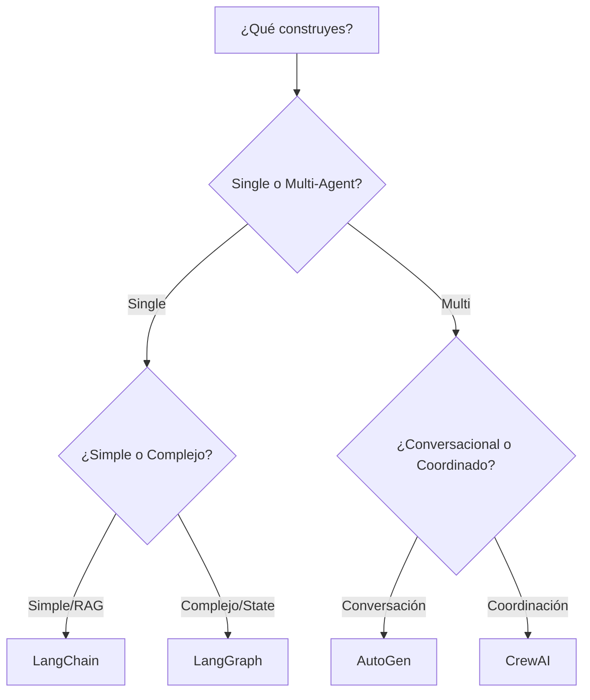

# Módulo 0: Fundamentos y Comparación de Frameworks


<div align="center">

[]()
[]()
[]()

</div>

---

## 🎯 Objetivos del Módulo

Este módulo proporciona una introducción práctica a los diferentes frameworks de AI Agents, permitiéndote comparar directamente sus enfoques y decidir cuál usar para tu proyecto.

> [!TIP]
> No te cases con un solo framework. La mejor herramienta depende del problema que intentas resolver.

---

## 📚 Conceptos Clave

### ¿Por qué existen múltiples frameworks?

Cada framework tiene un "sweet spot":

- 🦜 **LangChain**: Swiss Army knife, máxima flexibilidad.
- 🕸️ **LangGraph**: Control explícito, máquinas de estado.
- 👥 **CrewAI**: Simplicidad en orquestación multi-agente.
- 💬 **AutoGen**: Conversaciones complejas y debates.
- 🏢 **Semantic Kernel**: Integración Enterprise/.NET.

### Framework Decision Matrix



---

## 🛠️ Proyectos Prácticos

### 🟢 Nivel Básico: El Mismo Problema, 4 Frameworks
- **Archivo:** `01_same_problem_all_frameworks.py`
- **Concepto:** Implementar el mismo chatbot en LangChain, LangGraph, CrewAI y AutoGen.
- **Objetivo:** Comparar sintaxis, verbosidad y approaches.
- **Caso de uso:** Research assistant que busca y sintetiza información.

### 🟡 Nivel Intermedio: Decision Tree Inteligente
- **Archivo:** `02_framework_decision_tree.py`
- **Concepto:** Selector automatizado que recomienda framework.
- **Inputs:** Tipo de proyecto, complejidad, requisitos.
- **Output:** Recomendación con justificación generada por LLM.

### 🔴 Nivel Avanzado: Performance Benchmark
- **Archivo:** `03_performance_benchmark.py`
- **Concepto:** Benchmark objetivo comparando frameworks.
- **Métricas:** Latencia, memoria, tokens, costo.
- **Output:** Tablas y gráficos comparativos.

---

## 🚀 Quick Start

```bash
# 1. Instalar todos los frameworks necesarios
pip install langchain langchain-openai langgraph crewai pyautogen

# 2. Ejecutar la comparación
python 01_same_problem_all_frameworks.py

# 3. Usar el asistente de decisión
python 02_framework_decision_tree.py
```

---

## 📖 Recursos Adicionales

- 🆚 **[Comparativa Detallada](../FRAMEWORK_COMPARISON.md)**
- ✅ **[Mejores Prácticas](../BEST_PRACTICES.md)**
- 📄 **Documentación Oficial:**
    - [LangChain](https://python.langchain.com)
    - [CrewAI](https://docs.crewai.com)
    - [AutoGen](https://microsoft.github.io/autogen/)

---

<div align="center">
<a href="../module1/README.md">Siguiente Módulo: Intro a Agentes ➡️</a>
</div>
