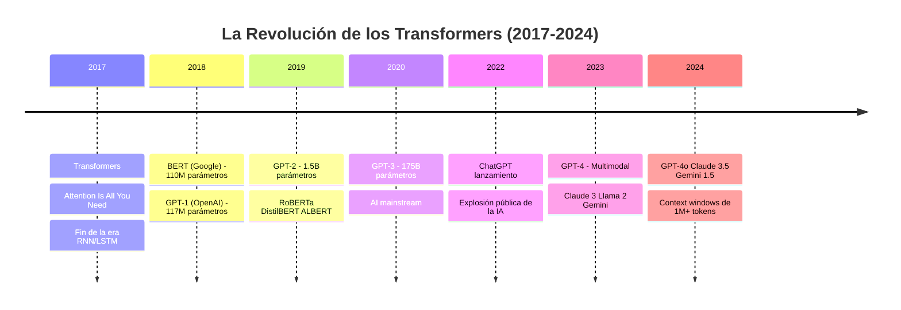
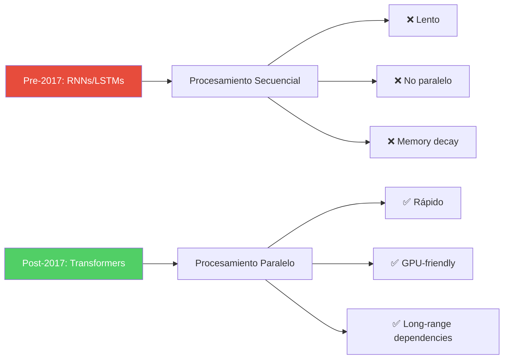
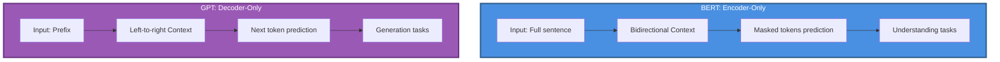
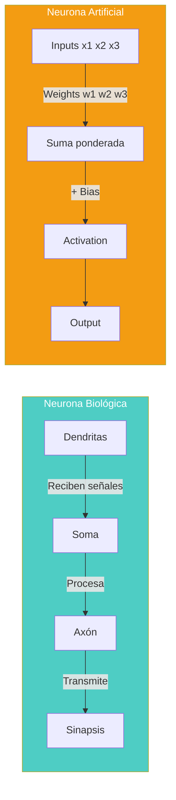
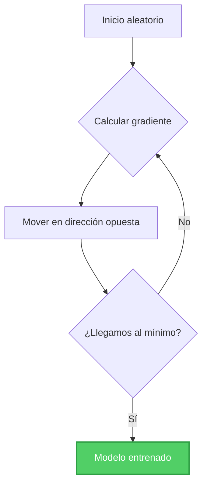
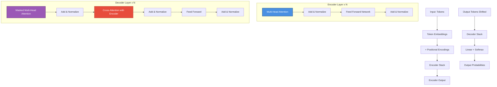
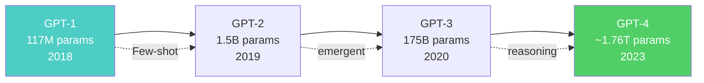
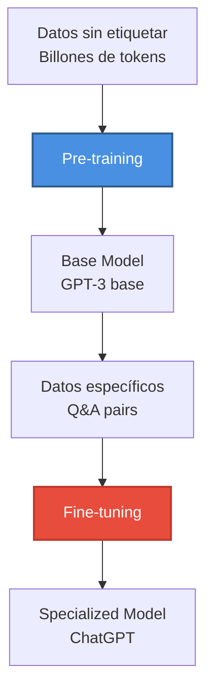
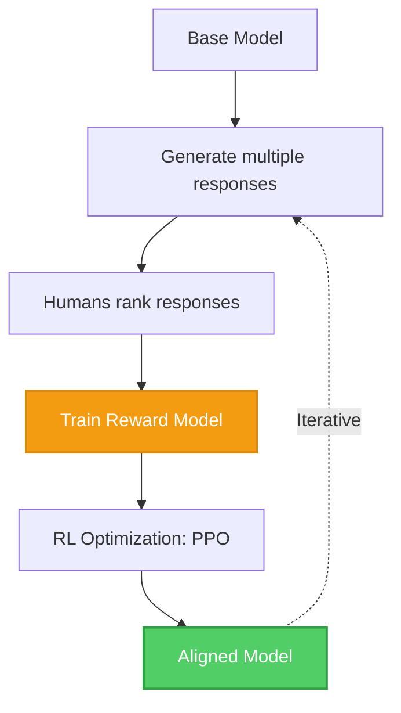

# Módulo 0: Introducción a la IA y Fundamentos de los LLMs


> *"Para entender cómo funcionan los agentes de IA, primero debemos entender cómo nacieron los Large Language Models."*

---

## 🎯 Objetivos del Módulo

Este módulo proporciona los fundamentos necesarios para comprender cómo funcionan los Large Language Models y, por extensión, los agentes de IA. Aprenderás:

- 📜 La evolución de la IA desde 2017 hasta hoy
- 🧠 Cómo funcionan las redes neuronales desde cero
- ⚡ El mecanismo de atención que revolucionó el campo
- 🚀 Cómo se construyen los LLMs modernos
- 🏗️ Las arquitecturas fundamentales (BERT, GPT, T5)

---

## 📚 Índice

### Parte I: Historia y Evolución
1. [Timeline de la IA Moderna (2017-2024)](#timeline-de-la-ia-moderna)
2. [La Revolución del NLP](#la-revolución-del-nlp)
3. [BERT vs GPT: Dos Filosofías](#bert-vs-gpt)

### Parte II: Fundamentos de Redes Neuronales
4. [¿Qué es una Red Neuronal?](#qué-es-una-red-neuronal)
5. [Weights, Bias y Activations](#componentes-fundamentales)
6. [Softmax Explicado](#softmax-función-de-salida)
7. [Gradient Descent](#gradient-descent)

### Parte III: Transformers
8. [El Mecanismo de Atención](#mecanismo-de-atención)
9. [Arquitectura Transformer](#arquitectura-transformer)

### Parte IV: De Transformers a LLMs
10. [Scaling Laws](#scaling-laws)
11. [Pre-training y Fine-tuning](#pre-training-y-fine-tuning)
12. [RLHF](#rlhf-alignment)

---

# Parte I: Historia y Evolución

## 📅 Timeline de la IA Moderna

La historia reciente de la IA puede dividirse en un antes y un después de **2017**, el año que cambió todo.



### El Momento Transformador (2017)

En junio de 2017, un paper de Google cambió para siempre el campo del NLP:

**"Attention Is All You Need"** - Vaswani et al.

**Innovación clave:** Eliminar recurrencia (RNNs/LSTMs) y usar únicamente **self-attention**.

**Por qué fue revolucionario:**
- ✅ **Paralelización**: Procesa toda la secuencia a la vez
- ✅ **Dependencias largas**: Atención directa entre cualquier par de tokens
- ✅ **Escalabilidad**: Permite entrenar modelos masivos



---

## 🌐 La Revolución del NLP

### Pre-Transformers: El Camino Hacia la Modernidad

**2013: Word2Vec (Google)**
- Primera representación vectorial semántica efectiva
- "king - man + woman = queen"
- Limitación: Embeddings estáticos (mismo vector siempre)

**2014-2016: RNNs y LSTMs**
- Procesamiento secuencial de texto
- Contextual, pero lento y limitado

**Problema fundamental:**
```python
# Con Word2Vec
"bank" siempre tiene el mismo vector
# Ya sea "bank of the river" o "bank account"

# Con Transformers
"bank" tiene vector diferente según contexto
```

### Post-Transformers: La Nueva Era

**2018: El Año Dorado**

Dos papers que definieron el futuro:

#### BERT (Google, Octubre 2018)
**Filosofía:** "Entender lenguaje mirando en ambas direcciones"

```python
# BERT usa MASKED LANGUAGE MODEL
Input:  "The [MASK] sat on the mat"
Output: "cat" (predice palabra enmascarada)

# Bidirectional: Ve contexto antes Y después
```

**Características:**
- Encoder-only architecture
- 110M (base) o 340M (large) parámetros
- Best for: Classification, Q&A, NER

#### GPT-1 (OpenAI, Junio 2018)
**Filosofía:** "Predecir la siguiente palabra"

```python
# GPT usa CAUSAL LANGUAGE MODEL
Input:  "The cat sat on"
Output: "the" (predice siguiente palabra)

# Unidirectional: Solo ve contexto anterior
```

**Características:**
- Decoder-only architecture
- 117M parámetros
- Best for: Text generation

---

## 🔄 BERT vs GPT

### Comparación Arquitectónica



### Tabla Comparativa

| Aspecto | BERT | GPT |
|---------|------|-----|
| **Arquitectura** | Encoder | Decoder |
| **Direccionalidad** | Bidirectional | Unidirectional (left-to-right) |
| **Objetivo de entrenamiento** | Masked LM | Causal LM |
| **Mejor para** | Entendimiento | Generación |
| **Casos de uso** | Classification, NER, Q&A | Chat, Code gen, Summarization |
| **Modelo más conocido** | BERT, RoBERTa | GPT-3, GPT-4, ChatGPT |

---

# Parte II: Fundamentos de Redes Neuronales

## 🧠 ¿Qué es una Red Neuronal?

### Analogía Biológica



### Estructura Básica

Una red neuronal consta de **capas**:

1. **Input Layer**: Recibe los datos
2. **Hidden Layers**: Procesan información (1 o más)
3. **Output Layer**: Produce el resultado

```python
# Ejemplo conceptual
import numpy as np

class SimpleNeuron:
    def __init__(self, num_inputs):
        # Inicializar weights aleatoriamente
        self.weights = np.random.randn(num_inputs)
        self.bias = 0
    
    def forward(self, inputs):
        # Suma ponderada
        z = np.dot(inputs, self.weights) + self.bias
        
        # Activation (ReLU)
        output = max(0, z)
        
        return output

# Uso
neuron = SimpleNeuron(num_inputs=3)
inputs = [0.5, 0.3, 0.8]
output = neuron.forward(inputs)
print(f"Output: {output}")
```

---

## ⚙️ Componentes Fundamentales

### 1. Weights (Pesos)

Los **weights** determinan la importancia de cada input.

```python
# Ejemplo visual
input_signal = 0.7
weight = 2.0  # Alta importancia
contribution = input_signal * weight  # 1.4

input_signal_2 = 0.7
weight_2 = 0.1  # Baja importancia  
contribution_2 = input_signal_2 * weight_2  # 0.07
```

Durante el entrenamiento, los weights se **ajustan** para minimizar el error.

### 2. Bias

El **bias** permite que la neurona se active incluso sin inputs fuertes.

```python
def neuron_without_bias(x, w):
    return x * w
    # Si x = 0, output siempre es 0

def neuron_with_bias(x, w, b):
    return x * w + b
    # Si x = 0, output = b (puede ser != 0)
```

**Visualización:**
```
Sin bias: y = wx    (línea que pasa por origen)
Con bias: y = wx + b (línea desplazada)
```

El bias proporciona **flexibilidad** para ajustar el threshold de activación.

### 3. Activation Functions

Las **funciones de activación** introducen no-linealidad.

```python
import numpy as np

# Sigmoid: Rango (0, 1)
def sigmoid(x):
    return 1 / (1 + np.exp(-x))

# ReLU: Rango [0, ∞)
def relu(x):
    return np.maximum(0, x)

# Tanh: Rango (-1, 1)
def tanh(x):
    return np.tanh(x)

# Leaky ReLU: Permite gradientes negativos pequeños
def leaky_relu(x, alpha=0.01):
    return np.where(x > 0, x, alpha * x)
```

**¿Por qué necesitamos activations?**

Sin ellas, múltiples capas lineales = una sola capa lineal:
```python
# Sin activations
layer1 = W1 @ x + b1
layer2 = W2 @ layer1 + b2
# = W2 @ (W1 @ x + b1) + b2
# = (W2 @ W1) @ x + (W2 @ b1 + b2)
# = W_combined @ x + b_combined  ← Una sola capa!

# CON activations
layer1 = relu(W1 @ x + b1)
layer2 = relu(W2 @ layer1 + b2)
# ← No se puede simplificar, verdaderas capas profundas
```

---

## 🎲 Softmax: Función de Salida

**Softmax** convierte scores (logits) en **probabilidades**.

### ¿Por qué Softmax?

```python
# Problema: Output layer sin normalizar
logits = [2.0, 1.0, 0.1]  # ¿Qué significan estos números?

# Solución: Softmax
probabilities = softmax(logits)  # [0.66, 0.24, 0.10]
# ✅ Suman 1.0
# ✅ Cada uno entre 0 y 1
# ✅ Interpretable como probabilidad
```

### Implementación

```python
import numpy as np

def softmax(logits):
    """
    Convierte logits en distribución de probabilidad
    
    Args:
        logits: Vector de scores [s1, s2, ..., sn]
    
    Returns:
        probs: Vector de probabilidades [p1, p2, ..., pn], sum=1.0
    """
    # Numerical stability: restar el máximo
    exp_logits = np.exp(logits - np.max(logits))
    
    # Normalizar
    probs = exp_logits / np.sum(exp_logits)
    
    return probs


# Ejemplo 1: Clasificación de 3 clases
scores = np.array([2.0, 1.0, 0.1])
probs = softmax(scores)

print("Scores:", scores)
print("Probabilities:", probs)
print("Sum:", np.sum(probs))

# Output:
# Scores: [2.0, 1.0, 0.1]
# Probabilities: [0.66, 0.24, 0.10]
# Sum: 1.0


# Ejemplo 2: Diferentes scores
scores_close = np.array([2.0, 1.9, 1.8])
scores_far = np.array([10.0, 1.0, 0.1])

print("Close scores:", softmax(scores_close))  # [0.37, 0.33, 0.30] - similar
print("Far scores:", softmax(scores_far))     # [0.99, 0.01, 0.00] - dominante
```

**Comportamiento clave:**
- Scores similares → Probabilidades similares
- Un score muy alto → Probabilidad dominante (cerca de 1)
- Siempre suma 1.0

---

## 📉 Gradient Descent

**Gradient Descent** es el algoritmo de optimización que permite a las redes neuronales **aprender**.

### Concepto Visual



### Matemática Simplificada

```
Loss
 ↑
 │      /\
 │     /  \
 │    /    \___
 │   / ●→●→●___●  (descenso hacia mínimo)
 │  /
 └────────────→ Weight
```

**Fórmula:**
```
weight_new = weight_old - learning_rate * gradient

gradient = ∂Loss/∂weight (derivada parcial)
```

### Implementación

```python
def gradient_descent_step(weights, gradients, learning_rate=0.01):
    """
    Un paso de gradient descent
    
    Args:
        weights: Parámetros actuales
        gradients: Dirección de máximo incremento de loss
        learning_rate: Tamaño del paso (hyperparámetro)
    
    Returns:
        updated_weights: Nuevos parámetros
    """
    # Mover en dirección OPUESTA al gradiente
    updated_weights = weights - learning_rate * gradients
    
    return updated_weights


# Ejemplo: minimizar f(x) = x^2
def loss_function(x):
    return x ** 2

def gradient_of_loss(x):
    return 2 * x  # Derivada de x^2

# Inicializar en x=5
x = 5.0
learning_rate = 0.1
iterations = 10

print(f"Inicial: x={x:.4f}, loss={loss_function(x):.4f")

for i in range(iterations):
    grad = gradient_of_loss(x)
    x = x - learning_rate * grad
    
    if i % 2 == 0:
        print(f"Iter {i}: x={x:.4f}, loss={loss_function(x):.4f}")

# Output:
# Inicial: x=5.0000, loss=25.0000
# Iter 0: x=4.0000, loss=16.0000
# Iter 2: x=2.5600, loss=6.5536
# Iter 4: x=1.6384, loss=2.6844
# ...converge hacia x=0, loss=0
```

### Learning Rate: El Hiperparámetro Crítico

```python
# Learning rate muy alto: Se pasa el mínimo
lr_high = 2.0
# x: 5 → -5 → 5 → -5 (oscila, no converge)

# Learning rate muy bajo: Converge lento
lr_low = 0.001
# x: 5 → 4.99 → 4.98 → ... (muchas iteraciones)

# Learning rate óptimo: Balance
lr_optimal = 0.1
# x: 5 → 4 → 3.2 → 2.56 → ... (converge suave)
```

---

## 🔄 Forward Propagation + Backpropagation

### Red Neuronal Completa

```python
import numpy as np

class SimpleNeuralNetwork:
    """
    Red neuronal de 2 capas para clasificación
    Input → Hidden → Output
    """
    
    def __init__(self, input_size, hidden_size, output_size):
        # Inicializar weights aleatoriamente
        self.W1 = np.random.randn(input_size, hidden_size) * 0.01
        self.b1 = np.zeros((1, hidden_size))
        
        self.W2 = np.random.randn(hidden_size, output_size) * 0.01
        self.b2 = np.zeros((1, output_size))
    
    def relu(self, x):
        return np.maximum(0, x)
    
    def relu_derivative(self, x):
        return (x > 0).astype(float)
    
    def softmax(self, x):
        exp_x = np.exp(x - np.max(x, axis=1, keepdims=True))
        return exp_x / np.sum(exp_x, axis=1, keepdims=True)
    
    def forward(self, X):
        """
        Forward propagation
        
        Args:
            X: Input data (batch_size, input_size)
        
        Returns:
            output: Predicted probabilities (batch_size, output_size)
        """
        # Hidden layer
        self.z1 = np.dot(X, self.W1) + self.b1  # Linear
        self.a1 = self.relu(self.z1)             # Activation
        
        # Output layer
        self.z2 = np.dot(self.a1, self.W2) + self.b2  # Linear
        self.a2 = self.softmax(self.z2)                # Activation
        
        return self.a2
    
    def compute_loss(self, y_true, y_pred):
        """Cross-entropy loss"""
        m = y_true.shape[0]
        loss = -np.sum(y_true * np.log(y_pred + 1e-8)) / m
        return loss
    
    def backward(self, X, y_true, y_pred, learning_rate=0.01):
        """
        Backpropagation + Gradient descent
        
        Args:
            X: Input data
            y_true: True labels (one-hot encoded)
            y_pred: Predicted probabilities
            learning_rate: Step size
        """
        m = X.shape[0]
        
        # Output layer gradients
        dz2 = y_pred - y_true
        dW2 = np.dot(self.a1.T, dz2) / m
        db2 = np.sum(dz2, axis=0, keepdims=True) / m
        
        # Hidden layer gradients
        da1 = np.dot(dz2, self.W2.T)
        dz1 = da1 * self.relu_derivative(self.z1)
        dW1 = np.dot(X.T, dz1) / m
        db1 = np.sum(dz1, axis=0, keepdims=True) / m
        
        # Update weights
        self.W2 -= learning_rate * dW2
        self.b2 -= learning_rate * db2
        self.W1 -= learning_rate * dW1
        self.b1 -= learning_rate * db1
    
    def train(self, X, y, epochs=100, learning_rate=0.01):
        """Training loop"""
        losses = []
        
        for epoch in range(epochs):
            # Forward pass
            y_pred = self.forward(X)
            
            # Compute loss
            loss = self.compute_loss(y, y_pred)
            losses.append(loss)
            
            # Backward pass
            self.backward(X, y, y_pred, learning_rate)
            
            if epoch % 20 == 0:
                accuracy = np.mean(np.argmax(y_pred, axis=1) == np.argmax(y, axis=1))
                print(f"Epoch {epoch}: Loss={loss:.4f}, Accuracy={accuracy:.4f}")
        
        return losses


# Ejemplo de uso: XOR problem
if __name__ == "__main__":
    # Datos
    X = np.array([[0, 0], [0, 1], [1, 0], [1, 1]])
    y = np.array([[1, 0], [0, 1], [0, 1], [1, 0]])  # XOR (one-hot)
    
    # Crear y entrenar red
    nn = SimpleNeuralNetwork(input_size=2, hidden_size=4, output_size=2)
    losses = nn.train(X, y, epochs=200, learning_rate=0.5)
    
    # Predicciones finales
    predictions = nn.forward(X)
    print("\nPredic

ciones finales:")
    for i, pred in enumerate(predictions):
        print(f"Input: {X[i]} → Predicted: {pred} → Class: {np.argmax(pred)}")
```

---

# Parte III: Transformers

## ⚡ Mecanismo de Atención

El **attention mechanism** es la innovación clave que hizo posibles los LLMs modernos.

### Motivación: Limitaciones de RNNs

```python
# Problema con RNNs: Procesamiento secuencial
sentence = "The cat sat on the mat"

# RNN procesa:
# Step 1: "The"
# Step 2: "The cat"
# Step 3: "The cat sat"
# ...
# ❌ No puede procesar "The" y "mat" en paralelo
# ❌ Información de "The" puede perderse al llegar a "mat"
```

### Solución: Self-Attention

```mermaid
graph LR
    A[The] -.attn: 0.1.-> B[cat]
    A -.attn: 0.05.-> C[sat]
    A -.attn: 0.02.-> D[on]
    A -.attn: 0.02.-> E[the]
    A -.attn: 0.01.-> F[mat]
    
    B -.attn: 0.3.-> A
    B -.attn: 0.4.-> C
    B -.attn: 0.1.-> F
    
    style B fill:#4A90E2,color:#fff
    style C fill:#9B59B6,color:#fff
```

**Idea clave:** Cada palabra puede "atender" a cualquier otra palabra.

### Implementación Simplificada

```python
import numpy as np

def scaled_dot_product_attention(Q, K, V):
    """
    Self-attention mechanism
    
    Args:
        Q: Query matrix (what we're looking for)
        K: Key matrix (what each position represents)
        V: Value matrix (actual content)
    
    Returns:
        output: Attention-weighted values
        attention_weights: Attention scores
    """
    # 1. Compute attention scores
    d_k = K.shape[-1]
    scores = np.dot(Q, K.T) / np.sqrt(d_k)  # Scaled dot product
    
    # 2. Convert to probabilities
    attention_weights = softmax(scores)
    
    # 3. Weight the values
    output = np.dot(attention_weights, V)
    
    return output, attention_weights


# Ejemplo conceptual
def softmax(x):
    exp_x = np.exp(x - np.max(x, axis=-1, keepdims=True))
    return exp_x / np.sum(exp_x, axis=-1, keepdims=True)

# Supongamos embeddings de dimensión 4
sentence_embeddings = np.array([
    [1.0, 0.0, 0.5, 0.2],  # "The"
    [0.8, 0.9, 0.1, 0.3],  # "cat"
    [0.2, 0.7, 0.8, 0.1],  # "sat"
    [0.5, 0.3, 0.2, 0.9],  # "mat"
])

# En self-attention, Q = K = V = sentence_embeddings
Q = K = V = sentence_embeddings

output, attn_weights = scaled_dot_product_attention(Q, K, V)

print("Attention weights:")
print(attn_weights)
print("\nOutput (context-aware embeddings):")
print(output)
```

---

## 🏗️ Arquitectura Transformer

### Vista Completa



### Componentes Clave

**1. Multi-Head Attention**
```python
# En lugar de 1 atención, usar 8-12 "heads" en paralelo
# Cada head aprende diferentes relaciones:

head_1: Subject-verb agreement
head_2: Object relationships
head_3: Semantic similarity
head_4: Syntactic structure
# ...

# Luego se concatenan y proyectan
```

**2. Positional Encodings**
```python
# Transformers no tienen noción de orden
# Positional encodings añaden información de posición

def positional_encoding(position, d_model):
    """
    PE(pos, 2i) = sin(pos / 10000^(2i/d_model))
    PE(pos, 2i+1) = cos(pos / 10000^(2i/d_model))
    """
    pos_enc = np.zeros(d_model)
    for i in range(0, d_model, 2):
        div_term = np.power(10000, 2 * i / d_model)
        pos_enc[i] = np.sin(position / div_term)
        if i + 1 < d_model:
            pos_enc[i + 1] = np.cos(position / div_term)
    return pos_enc
```

**3. Feed Forward Networks**
```python
# Dos capas lineales con ReLU en medio
def feed_forward(x, W1, b1, W2, b2):
    hidden = relu(np.dot(x, W1) + b1)
    output = np.dot(hidden, W2) + b2
    return output
```

---

# Parte IV: De Transformers a LLMs

## 📈 Scaling Laws

**Descubrimiento clave (2020):** Performance mejora predeciblemente con escala.



### Emergent Abilities

**Habilidades que aparecen solo después de cierto tamaño:**

| Parámetros | Habilidades |
|------------|-------------|
| < 1B | Completar texto básico |
| 1B - 10B | Few-shot learning básico |
| 10B - 100B | Analogías, traducción simple |
| 100B+ | Chain of thought, code generation |
| 1T+ | Razonamiento complejo, multimodal |

---

## 🎓 Pre-training y Fine-tuning



### Pre-training Objectives

**Causal Language Modeling (GPT):**
```python
# Input:  "The cat sat on"
# Target: "the mat"
# Predict next token
```

**Masked Language Modeling (BERT):**
```python
# Input:  "The cat [MASK] on the mat"
# Target: "sat"
# Predict masked token
```

---

## 🤝 RLHF (Alignment)



**Objetivo:** Alinear el modelo con preferencias humanas.

---

# Parte V: Arquitecturas Modernas

## 📊 Comparación de Arquitecturas

| Arquitectura | Encoder | Decoder | Mejor para | Ejemplos |
|--------------|---------|---------|------------|----------|
| **Encoder-only** | ✅ | ❌ | Understanding | BERT, RoBERTa |
| **Decoder-only** | ❌ | ✅ | Generation | GPT, Llama, Claude |
| **Encoder-Decoder** | ✅ | ✅ | Translation, Summarization | T5, BART |
| **Multimodal** | ✅ | ✅ | Text + Image/Audio | GPT-4V, Gemini |

---

## 📚 Recursos y Referencias

### Papers Fundamentales
1. **Attention Is All You Need** (Vaswani et al., 2017)
2. **BERT** (Devlin et al., 2018)
3. **GPT-1** (Radford et al., 2018)
4. **GPT-3** (Brown et al., 2020)
5. **GPT-4** (OpenAI, 2023)

### Cursos Recomendados
- Stanford CS224N: NLP with Deep Learning
- Fast.ai: Practical Deep Learning
- Hugging Face Course
- DeepLearning.AI: Generative AI with LLMs

---

## 🚀 Próximos Pasos

Ahora que comprendes los fundamentos, estás listo para aprender sobre **agentes de IA**:

➡️ **[Módulo 1: Introducción a Agentes de IA](../module1/README.md)**

---

<div align="center">

**[🏠 Inicio](../README.md)** | **[Siguiente Módulo ➡️](../module1/README.md)**

</div>

---

**Última actualización:** Noviembre 2024  
**Temas cubiertos:** Historia de la IA, Redes Neuronales, Transformers, LLMs  
**Prerequisitos:** Python básico, matemáticas de bachillerato
