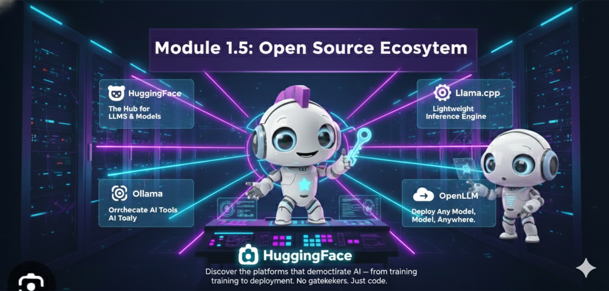

# 🌐 Módulo 1.5: Ecosistemas Open Source (HuggingFace & Ollama)




> *"El verdadero poder de la IA no está solo en los modelos más grandes, sino en la accesibilidad y la comunidad. Open Source es el motor de la innovación."*

---

## 🎯 Visión General

Antes de sumergirnos en los frameworks de agentes (Módulo 2), es crucial entender dónde viven los modelos y cómo ejecutarlos. No siempre dependeremos de APIs cerradas como OpenAI o Anthropic.

En este módulo puente, dominaremos los dos pilares del ecosistema Open Source:
1.  **HuggingFace**: El "GitHub" de la Inteligencia Artificial.
2.  **Ollama**: La forma más sencilla de ejecutar LLMs localmente.

> [!NOTE]
> **Objetivo del Módulo**: Aprender a encontrar, evaluar y ejecutar modelos Open Source (Llama 3, Mistral, Gemma) tanto en la nube (Inference API) como en tu propia máquina (Ollama/Transformers).

---

## 🧠 Parte I: HuggingFace Hub

### ¿Qué es HuggingFace?
HuggingFace es la plataforma central de la comunidad de IA. Aloja más de 500,000 modelos, datasets y demos. Es el estándar de facto para compartir ML.

### Componentes Clave

1.  **The Hub**: Repositorio central.
    *   **Model Cards**: Documentación técnica del modelo (uso, limitaciones, entrenamiento).
    *   **Files**: Los pesos del modelo (`.safetensors`, `.bin`).
    *   **Community**: Discusiones y Pull Requests sobre modelos.

2.  **Transformers Library**: La librería de Python más popular para descargar y usar estos modelos.
    ```python
    from transformers import pipeline
    pipe = pipeline("text-generation", model="gpt2")
    ```

3.  **Inference API (Serverless)**: Permite probar modelos vía API HTTP sin GPU local. Ideal para prototipos rápidos y gratuitos (con rate limits).

### 🔍 Cómo leer una Model Card
Cuando entras a un modelo (ej. `meta-llama/Meta-Llama-3-8B`), busca:
*   **Model Description**: ¿Qué hace? ¿Es base o instruct/chat?
*   **Intended Use**: ¿Para qué fue entrenado?
*   **Prompt Template**: ¿Cómo debo formatear el texto? (e.g., `<|user|>...`)
*   **License**: ¿Puedo usarlo comercialmente? (Apache 2.0, MIT, Community License).

---

## 🦙 Parte II: Ollama (Local Runtime)

### ¿Qué es Ollama?
Ollama es una herramienta que empaqueta modelos LLM en contenedores ligeros (similar a Docker) para ejecutarlos localmente de forma extremadamente sencilla.

### ¿Por qué Ollama?
*   **Privacidad Total**: Los datos nunca salen de tu máquina.
*   **Costo Cero**: Usas tu propio hardware (CPU/GPU).
*   **Latencia Cero**: Sin llamadas de red a internet.
*   **Simplicidad**: `ollama run llama3` y listo.

### Arquitectura
*   **Ollama Server**: Un proceso en background que gestiona la carga del modelo en RAM/VRAM.
*   **Modelfile**: Archivo de configuración (como Dockerfile) que define el modelo base, parámetros y system prompt.
*   **API**: Expone una API REST compatible con OpenAI.

### Comandos Esenciales
```bash
ollama pull llama3       # Descargar modelo
ollama run llama3        # Ejecutar chat interactivo
ollama list              # Ver modelos instalados
ollama rm llama3         # Eliminar modelo
```

---

## ⚔️ Comparativa: Cloud vs Local vs Híbrido

| Característica | API Comercial (OpenAI/Anthropic) | HuggingFace Inference API | Local (Ollama/Transformers) |
| :--- | :--- | :--- | :--- |
| **Costo** | $$$ (por token) | Gratis (limitado) / $$ (Pro) | Gratis (hardware propio) |
| **Privacidad** | Datos viajan a terceros | Datos viajan a HF | **Privacidad Total** 🔒 |
| **Calidad** | SOTA (GPT-4, Claude 3.5) | Variable (depende del modelo) | Depende del hardware (7B-70B) |
| **Latencia** | Media (red) | Media (red + cola) | **Baja** (local) ⚡ |
| **Setup** | Instantáneo (API Key) | Instantáneo (Token) | Requiere instalación + RAM |
| **Uso Ideal** | Producción compleja, razonamiento alto | Prototipos, demos | Desarrollo, datos sensibles, offline |

---

## 🛠️ Proyectos Prácticos

### 🟢 Proyecto 1: HuggingFace Inference API
Usaremos la API gratuita de HF para tareas de clasificación y generación sin descargar nada.
📄 [01_huggingface_inference.py](./examples/01_huggingface_inference.py)

### 🟡 Proyecto 2: Transformers Pipeline Local
Descargaremos un modelo pequeño (GPT-2 o TinyLlama) usando la librería `transformers` para entender cómo funciona "bajo el capó".
📄 [02_transformers_pipeline.py](./examples/02_transformers_pipeline.py)

### 🟡 Proyecto 3: Chatbot Local con Ollama
Interactuaremos con un modelo Llama 3 corriendo en tu máquina a través de Python.
📄 [03_ollama_setup.py](./examples/03_ollama_setup.py)

### 🔴 Proyecto 4: Agente Híbrido
Un agente que usa un modelo local (Ollama) para resumir textos privados y un modelo en la nube (HF/OpenAI) para tareas de conocimiento general.
📄 [04_hybrid_agent.py](./examples/04_hybrid_agent.py)

---

## 📚 Recursos Adicionales

- [HuggingFace Hub](https://huggingface.co/models)
- [Ollama Website](https://ollama.com/)
- [Curso de NLP de HuggingFace](https://huggingface.co/learn/nlp-course/chapter1/1)
- [LangChain + Ollama](https://python.langchain.com/docs/integrations/llms/ollama/)

---

<div align="center">

**[⬅️ Módulo 1: Panorama LLMs](../module1/README.md)** | **[🏠 Inicio](../README.md)** | **[Siguiente Módulo 2: Frameworks ➡️](../module2/README.md)**

</div>
