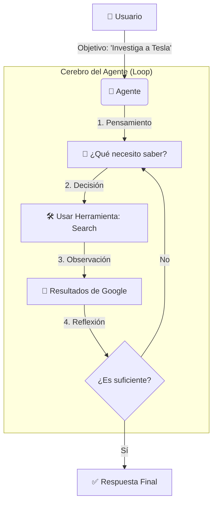

# 🧠 Módulo 1: Fundamentos y Mentalidad Agéntica


> *"Un agente no es solo un script que llama a una API. Es un sistema cognitivo capaz de razonar, planificar y actuar para cumplir un objetivo ambiguo."*

---

## 🌸 Introducción: El Cambio de Paradigma

Bienvenido al primer paso de tu viaje para convertirte en un **Professional AI Agent Developer**. En este módulo, no solo escribiremos código; redefiniremos cómo piensas sobre el software.

### De Imperativo a Agéntico
En la programación tradicional (**Imperativa**), tú eres el "Jefe" que micro-gestiona cada paso.
*   *Tú:* "Abre el archivo."
*   *Tú:* "Lee la línea 1."
*   *Tú:* "Si dice 'Error', imprime una alerta."

En la programación **Agéntica**, tú eres el "Gerente" que define objetivos.
*   *Tú:* "Aquí tienes acceso al sistema de archivos y al email. Monitoriza los logs y avísame si hay algo crítico."
*   *Agente:* (Decide cuándo leer, qué es crítico y cómo avisarte).

### La Analogía del Pasante (The Intern)
Imagina que contratas a un pasante muy inteligente pero que no conoce tu empresa.
*   **Un Script** es como un brazo robótico en una fábrica: hace exactamente lo mismo mil veces. Si la caja está 1cm a la izquierda, falla.
*   **Un Agente** es como el pasante: Si la caja está movida, la busca. Si no encuentra la caja, pregunta. Si se rompe, intenta arreglarla.

---

## 📚 Conceptos Fundamentales

### 1. Arquitectura Cognitiva (The Brain) 🧠
El Gran Modelo de Lenguaje (LLM) actúa como el núcleo de procesamiento. Pero un LLM por sí solo es solo un predictor de texto. Para que sea un agente, necesita una **Arquitectura Cognitiva**.

La arquitectura más fundamental es el bucle **Percepción-Acción**.



### 2. Herramientas (The Tools) 🛠️
Si el LLM es el cerebro, las herramientas son sus **brazos y piernas**. Sin ellas, la IA vive en una caja negra aislada (solo sabe lo que aprendió durante su entrenamiento).

*   **Read Tools:** Buscadores web (`DuckDuckGo`), lectores de PDF, APIs de datos (`Yahoo Finance`).
*   **Write Tools:** Enviar emails (`Gmail API`), escribir en bases de datos, crear archivos.

---

## 💻 Del Código a la Realidad

Veamos cómo se ve esto en código real. Analizaremos la diferencia entre una **Cadena (Chain)** y un **Agente**.

### La Cadena (The Chain)
Una cadena es una secuencia predefinida de pasos. Es robusta pero rígida.

*Archivo: `01_basic_news_summarizer.py`*

```python
# Flujo Rígido: Input -> Scrape -> Prompt -> LLM -> Output
chain = (
    {"text": scrape_website}  # Paso 1: Siempre scrapea
    | summary_prompt          # Paso 2: Siempre formatea
    | llm                     # Paso 3: Siempre resume
    | StrOutputParser()
)
```
> **Análisis:** Si `scrape_website` falla, toda la cadena falla. El LLM no tiene oportunidad de decir "Hey, la URL está rota, intentaré buscarla en Google".

### El Agente (The Agent)
Un agente tiene acceso a herramientas y un bucle de razonamiento.

*Archivo: `02_intermediate_investment_analyst.py`*

```python
# Definimos las herramientas disponibles
tools = [yahoo_finance, google_search, calculator]

# El LLM decide qué usar
agent = create_openai_functions_agent(llm, tools, prompt)

# El Executor maneja el bucle (Pensar -> Actuar -> Observar)
agent_executor = AgentExecutor(agent=agent, tools=tools, verbose=True)

agent_executor.invoke({"input": "¿Debería invertir en Apple hoy?"})
```

**¿Qué pasa internamente?**
1.  **Pensamiento:** "El usuario pregunta por Apple. Necesito el precio actual." -> *Decide usar `yahoo_finance`*.
2.  **Acción:** Ejecuta `yahoo_finance("AAPL")`.
3.  **Observación:** "El precio es $150, bajó un 2%."
4.  **Pensamiento:** "Ya tengo el precio, pero ¿por qué bajó? Necesito noticias." -> *Decide usar `google_search`*.
5.  **Acción:** Ejecuta `google_search("Apple stock news today")`.
6.  **Observación:** "Reporte de ganancias mixto."
7.  **Respuesta Final:** "Aunque el precio bajó a $150 debido al reporte, los analistas sugieren mantener..."

---

## 🧪 Proyectos Prácticos

### 🟢 Nivel Básico: Resumidor de Noticias (The Chain)
**Archivo:** [01_basic_news_summarizer.py](01_basic_news_summarizer.py)

En este nivel, construimos una **Cadena Secuencial**.
*   **Objetivo:** Entender la sintaxis LCEL (`|`) y cómo pasar datos de una función al LLM.
*   **Reto:** Intenta cambiar la URL por una que no exista. ¿Qué pasa? (Spoiler: Crash).

### 🟡 Nivel Intermedio: Analista de Inversiones (The Agent)
**Archivo:** [02_intermediate_investment_analyst.py](02_intermediate_investment_analyst.py)

Aquí introducimos la **incertidumbre**.
*   **Objetivo:** Ver al agente tomar decisiones.
*   **Experimento:** Pregúntale "¿Cuánto es 2+2?". Verás que *no* usa Yahoo Finance, sino su propio conocimiento o la calculadora. ¡Eso es razonamiento!

### 🔴 Nivel Avanzado: Asistente Ejecutivo (The System)
**Archivo:** [03_advanced_executive_assistant.py](03_advanced_executive_assistant.py)

Un sistema que combina **autenticación** y **acciones de escritura**.
*   **Objetivo:** Entender el riesgo y la seguridad.
*   **Concepto Clave:** **Human-in-the-loop**. Antes de enviar un email, el agente debería pedir confirmación.

---

## 🚀 Siguientes Pasos

1.  Abre `01_basic_news_summarizer.py` y ejecútalo.
2.  Lee los comentarios en el código, explican cada línea de LCEL.
3.  Intenta modificar el prompt para que el resumen sea en tono "sarcástico".

---

<div align="center">
<a href="../module2/README.md">➡️ Siguiente Módulo: Frameworks Modernos</a>
</div>
