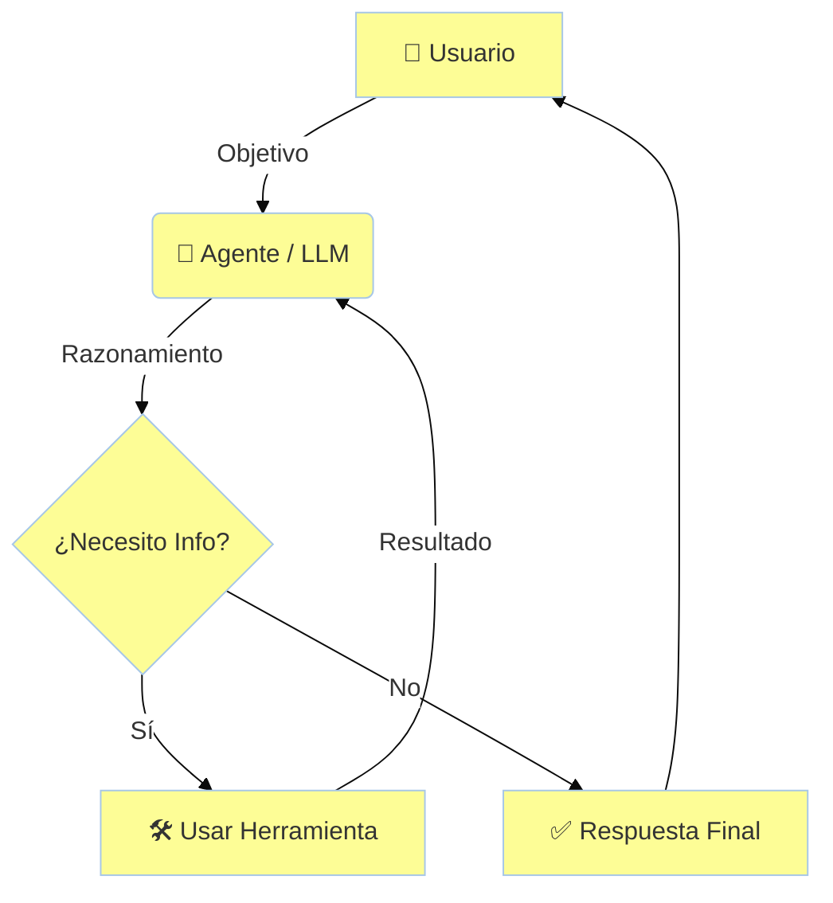

# 🧠 Módulo 1: Fundamentos y Mentalidad Agéntica

> *"Un agente no es solo un script que llama a una API. Es un sistema cognitivo capaz de razonar, planificar y actuar para cumplir un objetivo ambiguo."*

---

## 🌸 Introducción

Bienvenido al primer paso de tu viaje para convertirte en un **Professional AI Agent Developer**. En este módulo, no solo escribiremos código; redefiniremos cómo piensas sobre el software. Pasaremos del paradigma **imperativo** (escribir cada paso exacto) al paradigma **declarativo-agéntico** (definir el objetivo y dejar que la IA decida los pasos).

### ¿Qué aprenderás?
1.  **La Diferencia Crucial:** Por qué una "Chain" (Cadena) no es un Agente.
2.  **Arquitectura Cognitiva:** Cómo estructurar el "cerebro" de tu IA.
3.  **El Ecosistema:** Cuándo usar LangChain, cuándo AutoGen y cuándo CrewAI.

---

## 📚 Conceptos Fundamentales

### 1. El Cerebro (The LLM) 🧠
El Gran Modelo de Lenguaje (LLM) actúa como el núcleo de procesamiento. No es una base de datos de conocimiento; es un **motor de razonamiento**.
*   **Input:** Contexto + Objetivo.
*   **Proceso:** Razonamiento probabilístico.
*   **Output:** Plan de acción o respuesta final.

### 2. Herramientas (The Tools) 🛠️
Si el LLM es el cerebro, las herramientas son sus **brazos y piernas**. Sin ellas, la IA vive en una caja negra aislada.
*   **Read Tools:** Buscadores web, lectores de PDF, APIs de datos (Stock prices).
*   **Write Tools:** Enviar emails, escribir en bases de datos, crear archivos.

### 3. El Bucle Agéntico (The Loop) 🔄
A diferencia de un script tradicional que corre de A -> B -> C, un agente opera en un bucle continuo de **Percepción -> Razonamiento -> Acción**.

---

## 🧪 Proyectos Prácticos

Para este módulo, hemos diseñado 3 niveles de implementación para que experimentes la evolución desde un script simple hasta un asistente capaz.

### 🟢 Nivel Básico: Resumidor de Noticias (The Chain)
**Archivo:** [01_basic_news_summarizer.py](01_basic_news_summarizer.py)

En este nivel, no construimos un agente real, sino una **Cadena Secuencial**. Es determinista: siempre hace lo mismo.
1.  **Entrada:** Una URL.
2.  **Paso 1:** Scrapear el texto.
3.  **Paso 2:** Resumir el texto.
4.  **Salida:** Resumen.

> **Lección:** Útil para tareas repetitivas donde no se requiere toma de decisiones.

---

### 🟡 Nivel Intermedio: Analista de Inversiones (The Agent)
**Archivo:** [02_intermediate_investment_analyst.py](02_intermediate_investment_analyst.py)

Aquí introducimos la **incertidumbre**. El usuario puede preguntar "¿Cómo está Apple?" o "¿Debería vender Tesla?". El agente debe decidir qué herramientas usar.
*   **Herramienta A:** `Yahoo Finance` (Datos numéricos).
*   **Herramienta B:** `DuckDuckGo` (Noticias recientes).
*   **Cerebro:** Decide si necesita una, ambas o ninguna.

> **Lección:** El poder de elegir herramientas dinámicamente.

---

### 🔴 Nivel Avanzado: Asistente Ejecutivo (The System)
**Archivo:** [03_advanced_executive_assistant.py](03_advanced_executive_assistant.py)

Un sistema que combina **autenticación** y **acciones de escritura**. Este agente no solo lee; actúa en el mundo real.
*   **Capacidad:** Leer tu calendario real.
*   **Capacidad:** Redactar borradores de respuesta en tu Gmail.
*   **Seguridad:** Requiere manejo de tokens OAuth y permisos explícitos.

> **Lección:** La responsabilidad de dar "permiso de escritura" a una IA.

---

## 🚀 Siguientes Pasos
Abre el archivo [01_basic_news_summarizer.py](01_basic_news_summarizer.py) y comienza tu viaje.

---

<a href="../module2/README.md">➡️ Siguiente Módulo: Frameworks Modernos</a>

