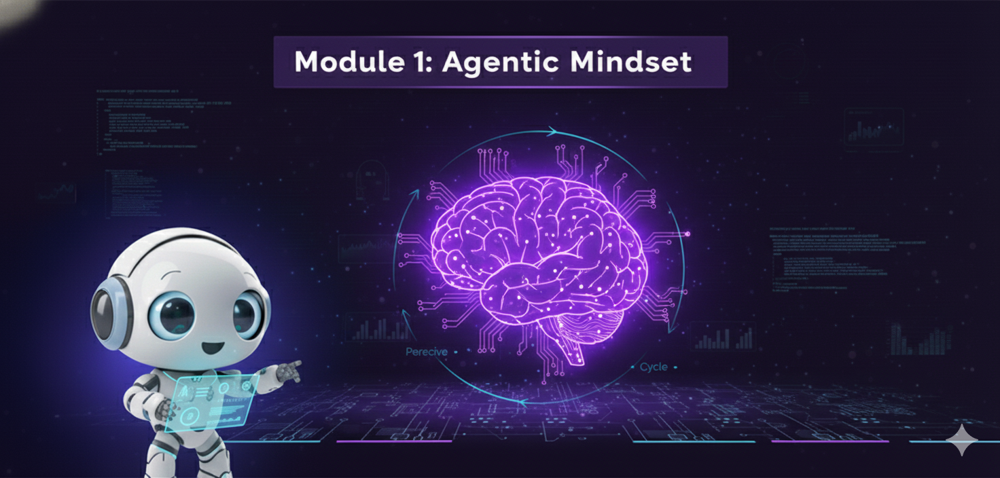
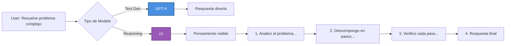
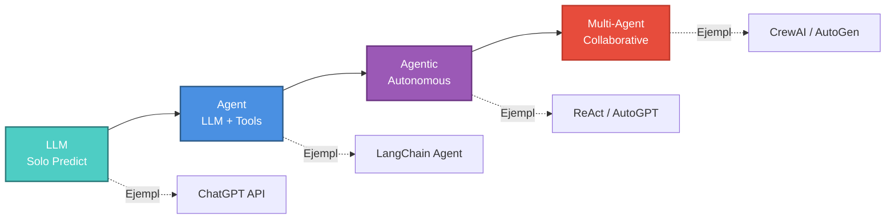
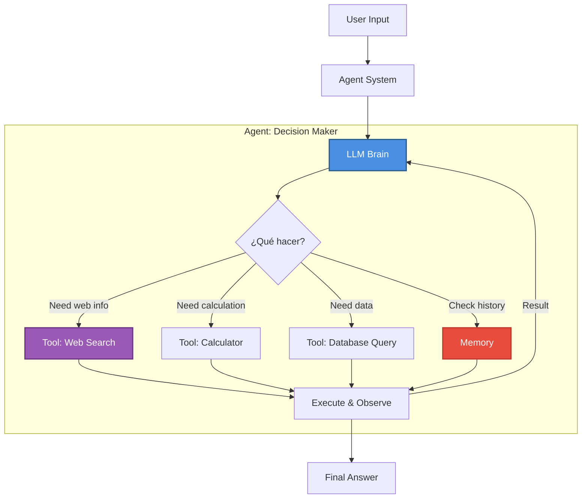
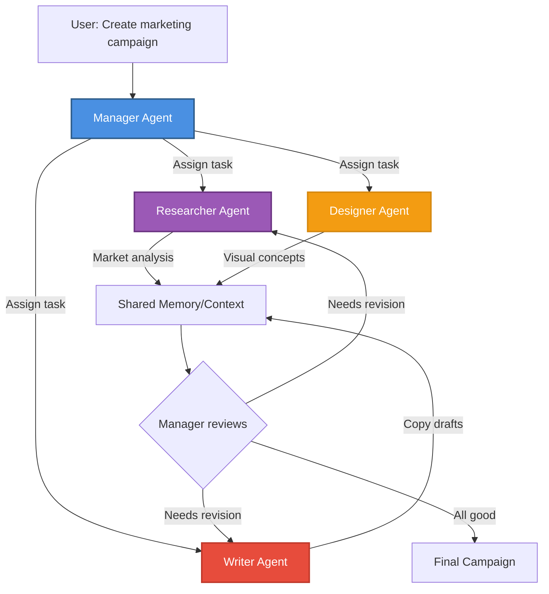
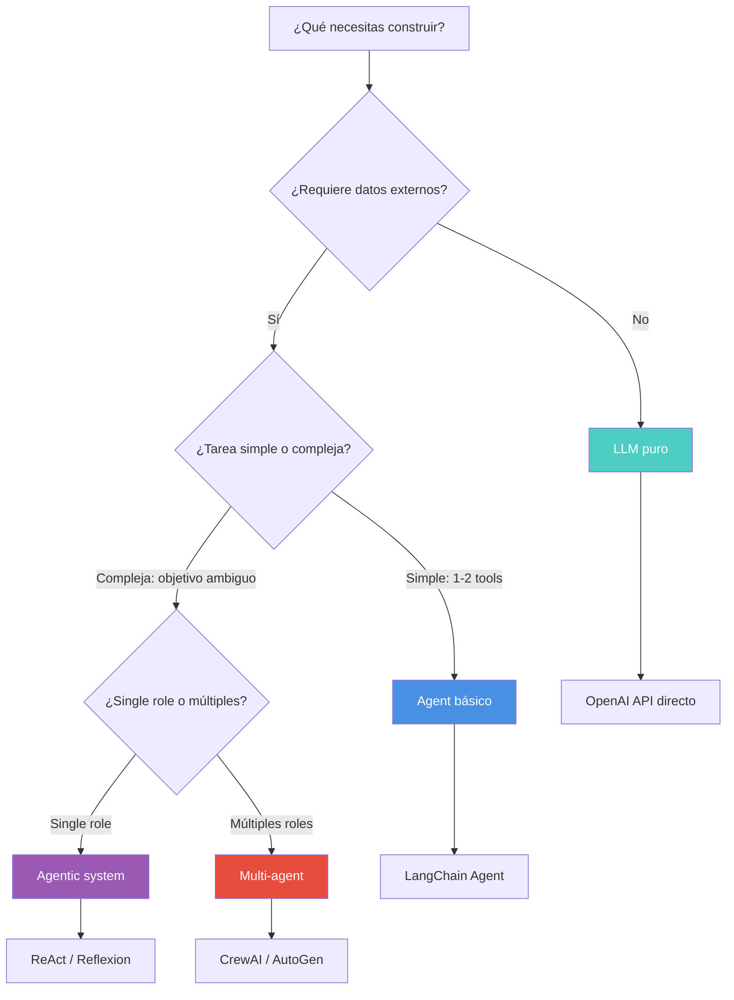

# Módulo 1: LLMs, Agentes y Mentalidad Agéntica




> *"Un LLM predice texto. Un agente razona, decide y actúa. La diferencia lo cambia todo."*

---

## 🎯 Objetivos del Módulo

En el Módulo 0 aprendiste **cómo funcionan los LLMs** (transformers, attention, entrenamiento). Ahora aprenderás:

- 🌐 Qué LLMs existen en el mercado (2024-2025)
- 🏆 Comparación de modelos líderes (ChatGPT, Claude, Gemini, Llama, etc.)
- 🧠 Tipos de LLMs (reasoning, multimodal, code-specialized)
- 🤖 **Diferencia clave**: LLM → Agent → Agentic → Multi-agent
- 🎯 Cuándo usar cada uno

---

## 📚 Índice

### Parte I: Panorama de LLMs Modernos
1. [Tipos de LLMs por Capacidad](#tipos-de-llms-por-capacidad)
2. [Líderes del Mercado](#líderes-del-mercado-2024-2025)
3. [Comparación Detallada](#comparación-detallada)

### Parte II: De LLMs a Agentes
4. [LLM Puro](#1-llm-puro)
5. [Agent (LLM + Tools)](#2-agent-llm--tools--memory)
6. [Agentic (Comportamiento Autónomo)](#3-agentic-comportamiento-autónomo)
7. [Multi-Agent (Sistemas Colaborativos)](#4-multi-agent-sistemas-colaborativos)

### Parte III: Guía de Decisión
8. [Decision Matrix](#decision-matrix)
9. [Ejemplos Prácticos](#ejemplos-prácticos)

---

# Parte I: Panorama de LLMs Modernos

## 🔍 Tipos de LLMs por Capacidad

Los LLMs se han especializado en diferentes tareas. Aquí están los 5 tipos principales:

### 1. Text Generation Models (Generadores de Texto)

**Propósito:** Chat, escritura, resúmenes, Q&A general

**Ejemplos (Noviembre 2025):**
- **GPT-5.1 Instant/Thinking**, GPT-5.1-Codex-Max (OpenAI)
- **Claude 4.5 Sonnet**, Claude 4.1 Opus, Claude 4.5 Haiku (Anthropic)
- **Gemini 3.0 Pro**, Gemini 3 Deep Think (Google)
- **Llama 4** (Meta - Open Source)
- **Qwen 3 / Qwen3-Max / Qwen3-Omni** (Alibaba Cloud)
- Kimi (Moonshot AI)

**Características:**
- Veloces y eficientes
- Propósito general
- Balance costo/performance

---

### 2. Reasoning Models (Modelos de Razonamiento)

**Propósito:** Matemáticas complejas, código difícil, lógica multi-paso

**Innovación clave:** Muestran su "pensamiento" interno (chain-of-thought)



**Ejemplos:**
- **o1, o1-mini, o3, o3-mini** (OpenAI) - Líder en razonamiento
- **QwQ-32B** (Alibaba) - Open source reasoning
- **DeepSeek-R1** (DeepSeek) - Competidor de o1
- **Claude 3.7 Sonnet** (Anthropic) - Extended thinking mode

**Cuándo usarlos:**
- ✅ Problemas matemáticos (IMO level)
- ✅ Competencias de código (Codeforces)
- ✅ Debugging complejo
- ✅ Research científico
- ❌ Chat casual (overkill + caro)

---

### 3. Multimodal Models (Texto + Imagen/Video/Audio)

**Propósito:** Analizar imágenes, videos, audio junto con texto

**Ejemplos:**
- **GPT-4V, GPT-4o** (OpenAI) - Text + Image
- **Gemini 1.5 Pro** (Google) - Text + Image + Video + Audio
- **Claude 3 Opus** (Anthropic) - Text + Image
- **Llama 3.2 Vision** (Meta) - Open source multimodal

**Casos de uso:**
- Análisis de gráficos y documentos visuales
- Descripción de imágenes para accesibilidad
- OCR avanzado (extraer texto de imágenes)
- Content moderation visual

---

### 4. Code-Specialized Models

**Propósito:** Generación y análisis de código

**Ejemplos:**
- **GitHub Copilot** (Powered by Codex - OpenAI)
- **Claude 3.5 Sonnet** (Líder en benchmarks de código)
- **DeepSeek-Coder-V2** (Open source)

**Benchmark líder (SWE-bench):**
1. Claude 3.5 Sonnet - 49%
2. GPT-4o - 41%
3. o1-preview - 38%

---

### 5. Image Generation Models

**Nota:** No son LLMs tradicionales, pero parte del ecosistema de IA generativa.

**Ejemplos:**
- DALL-E 3 (OpenAI)
- Midjourney
- Stable Diffusion (Open source)
- Imagen 2 (Google)

---

## 🏆 Líderes del Mercado (Noviembre 2025)

> **Última actualización**: Noviembre 23, 2025

### Tabla Comparativa Principal

| Modelo | Empresa | Tipo | Context | Fortalezas | Precio | Open Source |
|--------|---------|------|---------|------------|--------|-------------|
| **GPT-5.1 Instant** | OpenAI | Text + Multimodal | 128K-400K | Adaptive reasoning, velocidad | $$$ | ❌ |
| **GPT-5.1 Thinking** | OpenAI | Reasoning | 128K-400K | Deep reasoning, math | $$$$ | ❌ |
| **GPT-5.1-Codex-Max** | OpenAI | Code | 128K | 76.3% SWE-bench, agentic coding | $$$$ | ❌ |
| **Claude 4.5 Sonnet** | Anthropic | Text + Image | 200K | Coding, safety | $$$ | ❌ |
| **Claude 4.1 Opus** | Anthropic | Text + Image | 200K | Premium quality | $$$$ | ❌ |
| **Gemini 3.0 Pro** | Google | Multimodal | **1M** 🏆 | PhD-level reasoning, multimodal | $$$ | ❌ |
| **Gemini 3 Deep Think** | Google | Reasoning | 1M | Complex problem solving | $$$$ | ❌ |
| **Llama 4** | Meta | Multimodal + MoE | 128K | Open source líder, MoE | FREE | ✅ |
| **Qwen 3 (235B)** | Alibaba | Text + MoE | 128K-256K | 119 languages, hybrid reasoning | $$ | ✅ |
| **Qwen3-Max** | Alibaba | Text | 128K | 1T+ params, líder global #3 | $$ | ❌ |
| **Qwen3-Omni** | Alibaba | Multimodal | 128K | Text+image+audio+video | $$ | ✅ |
| **DeepSeek-R1** | DeepSeek | Reasoning | 128K | Compite con o1 | $ | ✅ |

---

## 📊 Comparación Detallada

### GPT-5.1 (OpenAI) - Noviembre 2025

```yaml
Release: Noviembre 12, 2025
Variantes: GPT-5.1 Instant, GPT-5.1 Thinking, GPT-5.1-Codex-Max
Context Window: 
  - Estándar: 128K tokens
  - Extendido: 400K tokens (272K input, 128K output)

Capacidades GPT-5.1 Instant:
  - Adaptive reasoning (ajusta profundidad de pensamiento)
  - 8 personality presets (Professional, Candid, Quirky, etc.)
  - Conversación más natural y cálida
  - Mejor seguimiento de instrucciones
  - "No reasoning" mode para baja latencia

Capacidades GPT-5.1 Thinking:
  - Deep reasoning para problemas complejos
  - Explicaciones más claras, menos jerga
  - Razonamiento adaptativo dinámico

Capacidades GPT-5.1-Codex-Max:
  - Workflows de coding multi-hora
  - 76.3% en SWE-bench Verified
  - "Compaction" para millones de tokens
  - Nuevas herramientas: apply_patch, shell

Velocidad:
  - Instant: Más rápido que GPT-4o
  - Thinking: Variable según complejidad

Costo (estimado):
  - Instant: Similar a GPT-4o
  - Thinking: Premium pricing
  - Codex-Max: Premium pricing

Best for:
  - Instant: Chatbots, customer support
  - Thinking: Research, math, ciencia
  - Codex-Max: Agentic coding, desarrollo
```

**Ejemplo de uso:**
```python
from openai import OpenAI

client = OpenAI()

# GPT-5.1 Instant (rápido, conversacional)
response = client.chat.completions.create(
    model="gpt-5.1-chat-latest",  # Instant variant
    messages=[
        {"role": "system", "content": "You are a helpful assistant"},
        {"role": "user", "content": "Explain quantum computing simply"}
    ]
)

print(response.choices[0].message.content)

# GPT-5.1 Thinking (deep reasoning)
response_thinking = client.chat.completions.create(
    model="gpt-5.1",  # Thinking variant
    messages=[
        {"role": "user", "content": "Solve this complex math problem..."}
    ]
)

# GPT-5.1 con "no reasoning" mode (ultra baja latencia)
response_fast = client.chat.completions.create(
    model="gpt-5.1",
    messages=[{"role": "user", "content": "Quick answer needed"}],
    reasoning_effort="none"  # Noviembre 2025 feature
)
```

---

### o1 / o3 (OpenAI - Reasoning Models)

```yaml
Release: o1 (Sept 2024), o3 (Dec 2024)
Context Window: 128K tokens

Características únicas:
  - Chain-of-thought interno visible
  - Self-verification
  - Muestra razonamiento paso a paso

Benchmarks:
  - AIME 2024 (Math): 83% (vs 13% GPT-4)
  - Codeforces: 89th percentile
  - GPQA Diamond (Science): 78%

Costo:
  - o1: $15/$60 por 1M tokens (input/output)
  - o3-mini: Más económico

Best for:
  - Problemas matemáticos complejos
  - Debugging de código difícil
  - Análisis científico
  - Research
```

**Cuándo NO usar:**
- ❌ Chat casual
- ❌ Generación de contenido simple
- ❌ Cuando velocidad > accuracy

---

### Claude 4.5 Sonnet (Anthropic) - Noviembre 2025

```yaml
Release: Septiembre 29, 2025
Nota: Claude 3.5 Sonnet fue retirado el 28 de octubre de 2025
Otras variantes: Claude 4 Sonnet (Mayo 2025), Claude 4.1 Opus (Ago 2025), Claude 4.5 Haiku (Oct 2025)
Context Window: 200K tokens

Fortalezas clave:
  - Enhanced reasoning capabilities
  - Improved coding abilities
  - Better instruction following
  - Superior safety and alignment
  - Extended thinking mode

Capacidades:
  - Text + Image analysis
  - Advanced code generation
  - Long document analysis  - Agentic workflows
  - Computer use (beta)

Costo (estimado):
  - Similar a Claude 3.5
  - Premium tier para Opus

Best for:
  - Code assistants (top-tier)
  - Document analysis
  - Research tasks
  - Aplicaciones que requieren safety
  - Enterprise applications
```

**Ejemplo:**
```python
import anthropic

client = anthropic.Anthropic()

# Claude 4.5 Sonnet
response = client.messages.create(
    model="claude-4-5-sonnet",  # Noviembre 2025
    max_tokens=1024,
    messages=[
        {"role": "user", "content": "Explain quantum entanglement"}
    ]
)

print(response.content[0].text)

client = anthropic.Anthropic()
response = client.messages.create(
    model="claude-3-7-sonnet",
    max_tokens=16000,
    thinking={
        "type": "enabled",
        "budget_tokens": 10000  # Cuánto pensar
    },
    messages=[{
        "role": "user",
        "content": "Debug this complex algorithm..."
    }]
)

# Response incluye bloques de "thinking"
for block in response.content:
    if block.type == "thinking":
        print("Claude's thoughts:", block.thinking)
    elif block.type == "text":
        print("Claude's answer:", block.text)
```

---

### Gemini 3.0 Pro (Google) - Noviembre 2025

```yaml
Release: Noviembre 18, 2025
Context Window: 1 MILLION tokens 🏆 (standard)
Arquitectura: Mixture-of-Experts (MoE) Transformer

Capacidades:
  - State-of-the-art multimodal (text, image, audio, video)
  - PhD-level reasoning
  - Gemini 3 Deep Think mode (enhanced reasoning)
  - Native agentic capabilities
  - Google Antigravity platform integration

Performance:
  - Líder en multimodal benchmarks vs GPT-5.1 y Claude
  - Outperforms en Humanity's Last Exam, GPQA Diamond
  - Leading scores en LMArena

Use cases únicos:
  - Analizar películas completas + transcripciones
  - Procesar codebases enteros con contexto
  - 1M+ token documents
  - Multimodal reasoning avanzado

Costo (estimado):
  - Free tier: Limitado
  - Pro tier: Similar a Gemini 1.5

Best for:
  - Long document analysis
  - Multimodal complex tasks
  - Research con contexto masivo
  - Agentic development
```

**Ejemplo:**
```python
import google.generativeai as genai

genai.configure(api_key="YOUR_API_KEY")

# Gemini 3.0 Pro
model = genai.GenerativeModel('gemini-3-pro')  # o 'gemini-3-pro-preview'

# Text generation
response = model.generate_content("Explain multimodal AI")
print(response.text)

# Gemini 3 Deep Think mode (enhanced reasoning)
model_thinking = genai.GenerativeModel('gemini-3-deep-think')
response = model_thinking.generate_content(
    "Solve this complex problem requiring deep reasoning..."
)
print(response.text)

---

### Llama 4 (Meta) - 2025

```yaml
Release: Abril 2025
Arquitectura: Mixture-of-Experts (MoE)
Context Window: 128K tokens
Licencia: Apache 2.0 (Open Source)

Modelos disponibles:
  - Llama 4 (multimodal flagship)
  - Llama 3.3 70B (Dic 2024 - text-only, efficient)
  - Llama 3.2 Vision (multimodal)

Nuevas capacidades (Llama 4):
  - Multimodal: Text + Images
  - Mixture-of-Experts para eficiencia
  - Improved reasoning
  - Better multilingual support

Fortalezas:
  - OPEN SOURCE completo
  - Competitive con modelos closed
  - Can fine-tune completamente
  - On-premise deployment
  - No vendor lock-in

Performance:
  - Competitive con GPT-5.1 y Claude 4
  - Strong coding capabilities
  - Multilingual

Best for:
  - On-premise / air-gapped environments
  - Fine-tuning para casos específicos
  - Research académico
  - Reducir vendor lock-in
  - Privacy-critical applications
```

**Deploy local:**
```bash
# Con Ollama
ollama run llama3.1:70b

# Con HuggingFace
from transformers import AutoModelForCausalLM, AutoTokenizer

model = AutoModelForCausalLM.from_pretrained("meta-llama/Llama-3.1-70B-Instruct")
tokenizer = AutoTokenizer.from_pretrained("meta-llama/Llama-3.1-70B-Instruct")
```

---

### Otros Modelos Notables

#### Grok-2 (xAI - Elon Musk)
- Real-time web access
- Menos censura
- Personality/humor
- Integración con X (Twitter)

#### Qwen 2.5 + QwQ (Alibaba Cloud)
- Open source
- Excelente en chino
- QwQ compite con o1 en reasoning
- Cost-effective

#### DeepSeek-V2 / R1 (DeepSeek)
- Extremadamente económico
- R1 open source reasoning model
- Innovación en arquitectura (MoE)

#### Kimi (Moonshot AI)
- Líder en mercado chino
- 200K context window
- Enterprise focus

---

# Parte II: De LLMs a Agentes

## 🔄 La Evolución



---

## 1. LLM Puro

### Definición

Un **Large Language Model** sin ninguna capacidad adicional. Solo predice el siguiente token.

### Características

- ❌ No puede usar herramientas
- ❌ No tiene memoria entre conversaciones
- ❌ No puede acceder a internet
- ❌ No puede ejecutar código
- ✅ Solo genera texto basado en su entrenamiento

### Código Ejemplo

```python
"""
LLM Puro: Sin tools, sin memory, sin context
"""
from openai import OpenAI

client = OpenAI()

# Request completamente aislado
response = client.chat.completions.create(
    model="gpt-4o",
    messages=[
        {"role": "user", "content": "What's 2+2?"}
    ]
)

print(response.choices[0].message.content)
# Output: "4"

# ❌ No puede:
# - Buscar precio actual de una acción
# - Recordar conversación anterior  
# - Ejecutar código Python
# - Acceder a base de datos
```

### Limitaciones

```python
# Pregunta que requiere datos actuales
response = client.chat.completions.create(
    model="gpt-4o",
    messages=[{
        "role": "user",
        "content": "What's the current weather in London?"
    }]
)

print(response.choices[0].message.content)
# Output: "I don't have access to real-time data..."
# ❌ No puede hacer API call a weather service
```

---

## 2. Agent (LLM + Tools + Memory)

### Definición

Un **sistema** que usa un LLM como "cerebro" combinado con:
- 🛠️ **Tools**: Funciones que el LLM puede llamar
- 💾 **Memory**: Historial de conversaciones
- 🔄 **Loop**: Reason → Act → Observe → Repeat

### Arquitectura



### Código Ejemplo

```python
"""
Agent: LLM + Tools + Memory
"""
from langchain.agents import create_openai_functions_agent, AgentExecutor
from langchain_openai import ChatOpenAI
from langchain.tools import Tool
from langchain.memory import ConversationBufferMemory
import requests

# 1. Definir Tools
def search_web(query: str) -> str:
    """Busca en la web información actual"""
    # Simulado - en producción usar API real
    return f"Results for '{query}': Latest news found..."

def get_weather(city: str) -> str:
    """Obtiene clima actual"""
    # API call real
    response = requests.get(f"https://wttr.in/{city}?format=j1")
    data = response.json()
    return f"Weather in {city}: {data['current_condition'][0]['temp_C']}°C"

# Convertir a LangChain Tools
tools = [
    Tool(
        name="web_search",
        func=search_web,
        description="Search web for current information"
    ),
    Tool(
        name="weather",
        func=get_weather,
        description="Get current weather for a city"
    )
]

# 2. Memory
memory = ConversationBufferMemory(
    memory_key="chat_history",
    return_messages=True
)

# 3. LLM
llm = ChatOpenAI(model="gpt-4o", temperature=0)

# 4. Create Agent
agent = create_openai_functions_agent(llm, tools, prompt)
executor = AgentExecutor(
    agent=agent,
    tools=tools,
    memory=memory,
    verbose=True  # Ver razonamiento
)

# 5. Usage
response = executor.invoke({
    "input": "What's the weather in Paris and search for Paris tourism"
})

print(response['output'])

# El agent:
# 1. Razona: "Necesito 2 cosas: clima y tourismo"
# 2. Llama weather("Paris") 
# 3. Observa: "15°C"
# 4. Llama web_search("Paris tourism")
# 5. Observa: "Top attractions..."
# 6. Genera respuesta combinando ambos resultados
```

### Output Example

```
> Entering new AgentExecutor chain...

Thought: El usuario pregunta por clima Y turismo en París. Necesito 2 tools.

Action: weather
Action Input: Paris
Observation: Weather in Paris: 15°C

Action: web_search  
Action Input: Paris tourism
Observation: Results for 'Paris tourism': Eiffel Tower, Louvre...

Thought: Ya tengo ambas informaciones. Puedo responder.

Final Answer: The weather in Paris is currently 15°C. For tourism, top 
attractions include the Eiffel Tower and the Louvre Museum...
```

---

## 3. Agentic (Comportamiento Autónomo)

### Definición

Un **agent** que toma **decisiones autónomas** para lograr un objetivo ambiguo.

### Diferencia clave

| Agent (Traditional) | Agentic (Autonomous) |
|---------------------|----------------------|
| Usa tools cuando se le pide | Decide por sí mismo qué hacer |
| Sigue instrucciones directas | Interpreta objetivo de alto nivel |
| Ejecuta y termina | Loop hasta completar objetivo |
| "Busca clima en París" | "Investiga París para viaje" |

### Características Agentic

- 🎯 **Goal-oriented**: Objetivo ambiguo → Plan específico
- 🧠 **Self-prompting**: Se genera sub-tareas
- 🔄 **Iterative**: Loop hasta completar
- 🤔 **Reasoning**: Reflexiona sobre progreso
- ✅ **Self-verification**: Verifica si logró objetivo

### Ejemplo Comparativo

```python
# USER: "Investiga Tesla y dame un reporte"

# AGENT TRADICIONAL:
# 1. Search "Tesla"
# 2. Summarize
# 3. Done
# ❌ Superficial

# AGENT AGENTIC (ReAct):
# 1. Thought: "Para research completo necesito: finanzas, producto, competencia"
# 2. Action: Search "Tesla Q3 2024 earnings"
# 3. Observation: "Revenue $25B..."
# 4. Thought: "Ahora necesito info de productos"
# 5. Action: Search "Tesla Model Y specs 2024"
# 6. Observation: "Range 330 miles..."
# 7. Thought: "Falta competencia"
# 8. Action: Search "Tesla vs BYD comparison"
# 9. Observation: "BYD sold 500K..."
# 10. Thought: "Tengo suficiente info"
# 11. Action: Generate comprehensive report
# ✅ Profundo y autónomo
```

### Patrones Agentic Populares

**ReAct (Reason + Act)**
```python
while not goal_achieved:
    thought = llm.think(current_state)
    action = llm.decide_action(thought)
    observation = execute(action)
    current_state = update_state(observation)
```

**Reflexion (Self-Correction)**
```python
output = llm.generate(task)
critique = llm.critique(output)
if critique.has_issues():
    output = llm.improve(output, critique)
```

**Plan-and-Solve**
```python
plan = llm.create_plan(goal)
for step in plan:
    result = execute(step)
    if failed(result):
        plan = llm.replan(plan, result)
```

---

## 4. Multi-Agent (Sistemas Colaborativos)

### Definición

**Múltiples agentes** trabajando juntos, cada uno con rol especializado.

### Arquitectura



### Frameworks Multi-Agent

**CrewAI** - Role-based
```python
from crewai import Agent, Task, Crew

# Agentes especializados
researcher = Agent(
    role="Market Researcher",
    goal="Find latest AI trends",
    backstory="Expert analyst with 10 years experience",
    tools=[search_tool, scrape_tool],
    verbose=True
)

writer = Agent(
    role="Content Writer",
    goal="Write engaging blog posts",
    backstory="Award-winning tech writer",
    tools=[],
    verbose=True
)

critic = Agent(
    role="Content Critic",
    goal="Review and improve content",
    backstory="Editor-in-chief",
    tools=[],
    verbose=True
)

# Tasks
research_task = Task(
    description="Research AI agent market trends 2024",
    agent=researcher,
    expected_output="Comprehensive market analysis"
)

write_task = Task(
    description="Write 1000-word blog post based on research",
    agent=writer,
    expected_output="Polished blog post"
)

review_task = Task(
    description="Review blog post and suggest improvements",
    agent=critic,
    expected_output="Feedback and final version"
)

# Crew (orchestrator)
crew = Crew(
    agents=[researcher, writer, critic],
    tasks=[research_task, write_task, review_task],
    verbose=True,
    process="sequential"  # o "hierarchical"
)

# Execute
result = crew.kickoff()
```

**AutoGen** - Conversational
```python
from autogen import ConversableAgent, GroupChat, GroupChatManager

# Agentes conversacionales
researcher_agent = ConversableAgent(
    name="Researcher",
    system_message="You are a researcher...",
    llm_config={"model": "gpt-4"}
)

coder_agent = ConversableAgent(
    name="Coder",
    system_message="You are a Python expert...",
    llm_config={"model": "gpt-4"}
)

critic_agent = ConversableAgent(
    name="Critic",
    system_message="You review code...",
    llm_config={"model": "gpt-4"}
)

# Group chat (debate)
group_chat = GroupChat(
    agents=[researcher_agent, coder_agent, critic_agent],
    messages=[],
    max_round=10
)

manager = GroupChatManager(groupchat=group_chat)

# Start conversation
researcher_agent.initiate_chat(
    manager,
    message="Let's build a web scraper for news articles"
)

# Los agentes debaten entre sí hasta llegar a solución
```

### Cuándo usar Multi-Agent

✅ **Cuando:**
- Workflow tiene múltiples roles distintos
- Beneficio de "debate" entre perspectivas
- Tasks independientes paralelizables
- Emular equipo humano

❌ **Cuando NO:**
- Task simple (single-agent suficiente)
- Budget limitado (más agentes = más cost)
- Latencia crítica (coordinación añade tiempo)

---

# Parte III: Guía de Decisión

## 🎯 Decision Matrix

### Árbol de Decisión



### Tabla de Decisión

| Necesito... | Usa | Framework | Ejemplo |
|-------------|-----|-----------|---------|
| Responder Q&A simple | **LLM** | OpenAI API | "What is photosynthesis?" |
| Buscar en web + responder | **Agent** | LangChain | "Latest news on Tesla stock" |
| Research profundo | **Agentic** | ReAct loop | "Full market analysis of EV industry" |
| Workflow multi-rol | **Multi-agent** | CrewAI | "Create marketing campaign: research + write + design" |
| Code generation + review | **Multi-agent** | AutoGen | "Build app with debate between coder + reviewer" |

---

## 💻 Ejemplos Prácticos

### Costo Comparison

| Tipo | Tokens promedio | Costo (GPT-4o) | Velocidad |
|------|-----------------|----------------|-----------|
| LLM | 500 | $0.0075 | 1x |
| Agent | 2000 | $0.03 | 3x |
| Agentic | 5000 | $0.075 | 5-10x |
| Multi-agent (3 agents) | 8000 | $0.12 | 8-15x |

**Conclusión:** Más autonomía = más cost + tiempo. Usa la herramienta correcta para el trabajo.

---

## 🚀 Próximos Pasos

Ahora que entiendes el panorama de LLMs y la diferencia entre LLM/Agent/Agentic/Multi-agent, estás listo para explorar los frameworks específicos:

➡️ **[Módulo 2: Panorama de Frameworks](../module2/README.md)**

---

<div align="center">

**[⬅️ Módulo 0.6: Data Science](../module0.6/README.md)** | **[🏠 Inicio](../README.md)** | **[Siguiente: Módulo 1.2 ➡️](../module1.2/README.md)**
    
    style B fill:#4A90E2,color:#fff,stroke:#2E5C8A,stroke-width:2px
    style C fill:#9B59B6,color:#fff,stroke:#6C3483,stroke-width:2px
    style D fill:#E74C3C,color:#fff,stroke:#C0392B,stroke-width:2px
    style E fill:#F39C12,color:#fff,stroke:#D68910,stroke-width:2px
```

### Frameworks Multi-Agent

**CrewAI** - Role-based
```python
from crewai import Agent, Task, Crew

# Agentes especializados
researcher = Agent(
    role="Market Researcher",
    goal="Find latest AI trends",
    backstory="Expert analyst with 10 years experience",
    tools=[search_tool, scrape_tool],
    verbose=True
)

writer = Agent(
    role="Content Writer",
    goal="Write engaging blog posts",
    backstory="Award-winning tech writer",
    tools=[],
    verbose=True
)

critic = Agent(
    role="Content Critic",
    goal="Review and improve content",
    backstory="Editor-in-chief",
    tools=[],
    verbose=True
)

# Tasks
research_task = Task(
    description="Research AI agent market trends 2024",
    agent=researcher,
    expected_output="Comprehensive market analysis"
)

write_task = Task(
    description="Write 1000-word blog post based on research",
    agent=writer,
    expected_output="Polished blog post"
)

review_task = Task(
    description="Review blog post and suggest improvements",
    agent=critic,
    expected_output="Feedback and final version"
)

# Crew (orchestrator)
crew = Crew(
    agents=[researcher, writer, critic],
    tasks=[research_task, write_task, review_task],
    verbose=True,
    process="sequential"  # o "hierarchical"
)

# Execute
result = crew.kickoff()
```

**AutoGen** - Conversational
```python
from autogen import ConversableAgent, GroupChat, GroupChatManager

# Agentes conversacionales
researcher_agent = ConversableAgent(
    name="Researcher",
    system_message="You are a researcher...",
    llm_config={"model": "gpt-4"}
)

coder_agent = ConversableAgent(
    name="Coder",
    system_message="You are a Python expert...",
    llm_config={"model": "gpt-4"}
)

critic_agent = ConversableAgent(
    name="Critic",
    system_message="You review code...",
    llm_config={"model": "gpt-4"}
)

# Group chat (debate)
group_chat = GroupChat(
    agents=[researcher_agent, coder_agent, critic_agent],
    messages=[],
    max_round=10
)

manager = GroupChatManager(groupchat=group_chat)

# Start conversation
researcher_agent.initiate_chat(
    manager,
    message="Let's build a web scraper for news articles"
)

# Los agentes debaten entre sí hasta llegar a solución
```

### Cuándo usar Multi-Agent

✅ **Cuando:**
- Workflow tiene múltiples roles distintos
- Beneficio de "debate" entre perspectivas
- Tasks independientes paralelizables
- Emular equipo humano

❌ **Cuando NO:**
- Task simple (single-agent suficiente)
- Budget limitado (más agentes = más cost)
- Latencia crítica (coordinación añade tiempo)

---

# Parte III: Guía de Decisión

## 🎯 Decision Matrix

### Árbol de Decisión


### Tabla de Decisión

| Necesito... | Usa | Framework | Ejemplo |
|-------------|-----|-----------|---------|
| Responder Q&A simple | **LLM** | OpenAI API | "What is photosynthesis?" |
| Buscar en web + responder | **Agent** | LangChain | "Latest news on Tesla stock" |
| Research profundo | **Agentic** | ReAct loop | "Full market analysis of EV industry" |
| Workflow multi-rol | **Multi-agent** | CrewAI | "Create marketing campaign: research + write + design" |
| Code generation + review | **Multi-agent** | AutoGen | "Build app with debate between coder + reviewer" |

---

## 💻 Ejemplos Prácticos

### Costo Comparison

| Tipo | Tokens promedio | Costo (GPT-4o) | Velocidad |
|------|-----------------|----------------|-----------|
| LLM | 500 | $0.0075 | 1x |
| Agent | 2000 | $0.03 | 3x |
| Agentic | 5000 | $0.075 | 5-10x |
| Multi-agent (3 agents) | 8000 | $0.12 | 8-15x |

**Conclusión:** Más autonomía = más cost + tiempo. Usa la herramienta correcta para el trabajo.

---

## 🚀 Próximos Pasos

Ahora que entiendes el panorama de LLMs y la diferencia entre LLM/Agent/Agentic/Multi-agent, estás listo para explorar los frameworks específicos:

➡️ **[Módulo 2: Panorama de Frameworks](../module2/README.md)**

---

<div align="center">

**[⬅️ Módulo 0.6: Data Science](../module0.6/README.md)** | **[🏠 Inicio](../README.md)** | **[Siguiente: Módulo 1.2 ➡️](../module1.2/README.md)**

</div>

---

**Última actualización:** Noviembre 2025  
**Modelos cubiertos:** GPT-5.1 (Nov 2025), Gemini 3.0 Pro (Nov 2025), Claude 4.5 Sonnet (Sept 2025), Llama 4 (Abril 2025), Qwen 3 (2025), DeepSeek-R1Kimi  
**Frameworks mencionados:** LangChain, CrewAI, AutoGen, ReAct
