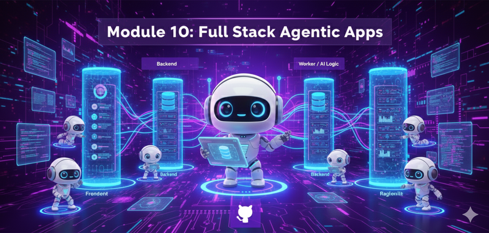
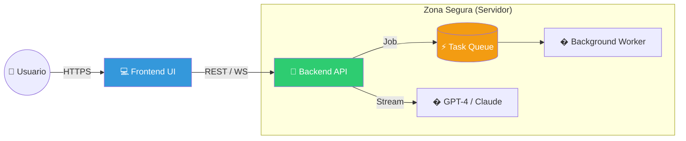

# Módulo 10: Full Stack Agentic Apps




> *"Un script de Python en tu laptop es un experimento. Una API asíncrona en Kubernetes es un producto."*

---

## 🎯 Objetivos del Módulo

Hemos pasado 9 módulos construyendo cerebros. Ahora vamos a construir el cuerpo.
En este módulo, transformaremos tu agente en una **Aplicación Full Stack** capaz de escalar a miles de usuarios.

**Lo que vas a dominar:**
1.  🏗️ **Arquitectura Enterprise:** Diseño de sistemas desacoplados (Frontend, Backend, Worker).
2.  ⚡ **Concurrencia Real:** Por qué `async def` no es opcional en IA.
3.  �️ **Producción:** Inyección de dependencias, manejo de errores y configuración robusta.

---

## 📚 1. La Arquitectura "Agentic Stack"

Para salir de `localhost`, necesitamos dividir responsabilidades.

### El Problema del "Script Único"
Si pones tu UI (Streamlit) y tu lógica (LangChain) en el mismo archivo:
-   ❌ **No escala:** Un usuario pesado bloquea la UI para todos.
-   ❌ **No es seguro:** Tus API Keys viven en el navegador del cliente.
-   ❌ **No es mantenible:** Mezclas HTML con lógica de grafos.

### La Solución: Arquitectura de 3 Capas



---

## ⚡ 2. Masterclass de Concurrencia: Async vs Sync

En el desarrollo de Agentes, la **latencia** es el enemigo.
GPT-4 tarda ~10 segundos en responder. Si tu servidor es síncrono (como Flask estándar), durante esos 10 segundos **tu servidor está muerto** para otros usuarios.

### La Analogía de la Pizzería 🍕

#### 🐢 Enfoque Síncrono (Bloqueante)
1.  Cliente A pide pizza.
2.  Cajero va a la cocina, **se queda mirando el horno 10 minutos**.
3.  Entrega pizza A.
4.  Recién atiende al Cliente B.
*Resultado:* El Cliente B espera 10 minutos solo para pedir.

#### 🐇 Enfoque Asíncrono (Non-blocking)
1.  Cliente A pide pizza.
2.  Cajero pasa la nota a la cocina y le da un "Beeper" al Cliente A.
3.  **Inmediatamente** atiende al Cliente B.
4.  Cuando la pizza A está lista, el Beeper suena.
*Resultado:* El cajero (CPU) nunca está ocioso.

### Implementación en Python

```python
# ❌ MAL: Bloquea el servidor
import time
def chat_sync(message):
    response = call_gpt4(message) # Tarda 5s
    return response

# ✅ BIEN: Libera el servidor
import asyncio
async def chat_async(message):
    response = await call_gpt4_async(message) # Libera el control mientras espera
    return response
```

---

## 🏗️ 3. Construyendo el Backend (Paso a Paso)

Vamos a usar **FastAPI**, el estándar de oro para APIs de IA.

### Paso 1: Definir el Modelo de Datos
Usamos **Pydantic** para validar que lo que entra es correcto. Si el usuario no envía `query`, la API rechaza la petición automáticamente.

```python
from pydantic import BaseModel

class AgentRequest(BaseModel):
    query: str
    user_id: str = "guest_user"
    temperature: float = 0.7
```

### Paso 2: Streaming de Respuesta (SSE)
Los usuarios odian esperar. Usamos **Server-Sent Events (SSE)** para enviar la respuesta palabra por palabra, igual que ChatGPT.

```python
from fastapi.responses import StreamingResponse

@app.post("/chat")
async def chat_endpoint(req: AgentRequest):
    return StreamingResponse(
        agent_generator(req.query), # Generador asíncrono
        media_type="text/event-stream"
    )
```

---

## 🛠️ Proyectos Prácticos (Nivel Enterprise)

### 🚀 Proyecto 1: Backend API Robusto
**Archivo:** [`01_agent_api.py`](01_agent_api.py)
Este no es un "Hello World". Es una base sólida para producción:
-   ✅ **Inyección de Dependencias:** Para gestionar la configuración y servicios.
-   ✅ **Middleware:** CORS y Logging de tiempo de respuesta.
-   ✅ **Manejo de Errores Global:** Captura excepciones y devuelve JSONs limpios.
-   ✅ **Streaming Real:** Conexión asíncrona con LangChain.

### 🎨 Proyecto 2: Frontend Profesional
**Archivo:** [`02_agent_ui.py`](02_agent_ui.py)
Una interfaz en Streamlit que se siente como una App nativa:
-   ✅ **Gestión de Sesión:** Recuerda el historial.
-   ✅ **Configuración en Sidebar:** Ajusta temperatura y modelo.
-   ✅ **Feedback Visual:** Indicadores de carga y streaming fluido.

---

## 📊 El Stack Ganador 2025

Si vas a construir esto para una empresa, este es el stack recomendado:

| Capa | Tecnología | Por qué |
| :--- | :--- | :--- |
| **Lenguaje** | **Python 3.11+** | Tipado fuerte, rápido, ecosistema IA. |
| **API Framework** | **FastAPI** | Async nativo, validación automática, docs (Swagger). |
| **Frontend** | **Next.js (React)** | Para apps complejas. Usa **Streamlit** solo para demos. |
| **Orquestación** | **LangGraph** | Control de estado superior a cadenas simples. |
| **Cola de Tareas** | **Celery + Redis** | Para tareas que duran >30s (investigación profunda). |
| **Contenedores** | **Docker** | "Funciona en mi máquina" -> Funciona en la nube. |

---

<div align="center">

**[⬅️ Módulo Anterior](../module9/README.md)** | **[🏠 Inicio](../README.md)** | **[Siguiente Módulo ➡️](../module11/README.md)**

</div>
