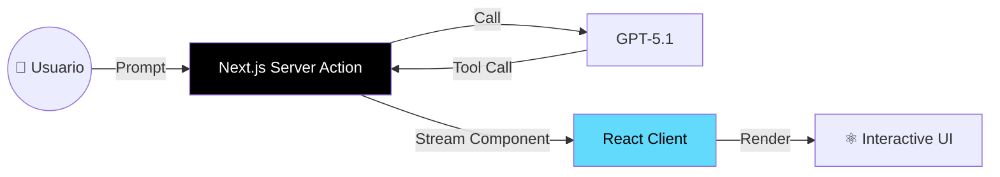

# Módulo 10: Full Stack Agentic Apps (Generative UI)


> "En 2025, los agentes no solo chatean. Generan interfaces de usuario (UI) completas en tiempo real."

## 🎯 Objetivos del Módulo

Olvida el chatbot de texto plano. En este módulo, aprenderás a construir **Full Stack Agents** que pueden renderizar componentes interactivos (gráficos, formularios, mapas) usando **Generative UI**.

**Lo que vas a dominar:**
1.  ⚛️ **Vercel AI SDK 6:** El framework estándar para agentes en Next.js (Nov 2025).
2.  🎨 **Generative UI:** Streaming de componentes React desde el servidor.
3.  ⚡ **React Server Components (RSC):** Arquitectura "Agent-first" para máxima velocidad.

---

## 📚 Conceptos Clave (Nov 2025)

### 1. Generative UI (GenUI)
En lugar de que el LLM responda con texto ("Aquí tienes el clima"), responde con un **Componente React** (`<WeatherCard temp={25} />`).

Esto permite experiencias ricas donde el agente "construye" la aplicación mientras la usas.

### 2. Vercel AI SDK 6 (Agent-First Architecture)
Lanzado en Octubre 2025, introduce una abstracción unificada para definir agentes que funcionan en el servidor y transmiten UI al cliente.



---

## 🌍 High Impact Social/Professional Example (Nov 2025)

> **Proyecto: "AccessUI" - Asistente de Accesibilidad Generativa**
>
> Este ejemplo utiliza **Generative UI** para adaptar la interfaz de una web en tiempo real según las necesidades de discapacidad del usuario.

### El Problema
Las webs estáticas son "talla única". Un usuario con daltonismo necesita colores distintos a uno con dislexia.

### La Solución
Un agente que detecta la necesidad y **regenera la UI** instantáneamente usando componentes React adaptados.

```tsx
/**
 * Project: AccessUI
 * Stack: Next.js 15, Vercel AI SDK 6, React Server Components
 */

import { createAI, getMutableAIState, streamUI } from 'ai/rsc';
import { z } from 'zod';

// 1. Definir Componentes Adaptativos
import { HighContrastCard } from '@/components/access/high-contrast';
import { DyslexicFriendlyText } from '@/components/access/dyslexic';
import { ScreenReaderSummary } from '@/components/access/screen-reader';

// 2. Server Action del Agente
export async function submitUserQuery(input: string) {
  'use server';

  const history = getMutableAIState();

  // 3. Generative UI Streaming
  const result = await streamUI({
    model: 'gpt-5.1-instant',
    messages: [...history.get(), { role: 'user', content: input }],
    text: ({ content, done }) => {
      if (done) history.done((messages: any[]) => [...messages, { role: 'assistant', content }]);
      return <div>{content}</div>;
    },
    tools: {
      adapt_interface: {
        description: 'Adapt UI for specific accessibility needs',
        parameters: z.object({
          need: z.enum(['visual_impairment', 'dyslexia', 'motor_control']),
          content: z.string()
        }),
        generate: async ({ need, content }) => {
          // El Agente decide QUÉ componente renderizar
          switch(need) {
            case 'visual_impairment':
              return <HighContrastCard content={content} zoom={1.5} />;
            case 'dyslexia':
              return <DyslexicFriendlyText content={content} font="OpenDyslexic" />;
            default:
              return <ScreenReaderSummary content={content} />;
          }
        }
      }
    }
  });

  return result.value;
}
```

**Impacto Social:**
- **Inclusión Real**: No es un "plugin" superpuesto, es la web reescribiéndose a sí misma para el usuario.
- **Dignidad Digital**: Permite a personas con discapacidades severas navegar con autonomía.

---

## 🛠️ Proyectos Prácticos

### 🚀 Proyecto 1: Chatbot Financiero con Gráficos
Un agente que no solo te dice el precio de las acciones, sino que renderiza gráficos interactivos de TradingView (`<StockChart />`) en el chat.

### 🎨 Proyecto 2: Generador de Formularios Dinámicos
Un agente para encuestas que genera inputs (`<Slider />`, `<DatePicker />`) sobre la marcha según las respuestas anteriores del usuario.

### ⚛️ Proyecto 3: AccessUI (Implementación Completa)
El asistente de accesibilidad descrito arriba, desplegado en Vercel Edge Functions.

---

## 📊 El Stack Ganador 2025 (Full Stack)

| Capa | Tecnología | Por qué |
| :--- | :--- | :--- |
| **Framework** | **Next.js 15 (App Router)** | Soporte nativo para RSC y Streaming. |
| **AI SDK** | **Vercel AI SDK 6** | La mejor abstracción para Generative UI. |
| **UI Library** | **shadcn/ui** | Componentes accesibles y fáciles de adaptar. |
| **Modelos** | **GPT-5.1 / Claude 3.5** | Rápidos y precisos para tool calling. |
| **Deploy** | **Vercel / Cloudflare** | Edge computing para menor latencia. |

---

## 🚀 Próximos Pasos

➡️ **[Módulo 11: LLMOps y Observabilidad](../module11/README.md)**

<div align="center">

**[⬅️ Módulo Anterior](../module9/README.md)** | **[🏠 Inicio](../README.md)**

</div>

---

**Última actualización:** Noviembre 2025
**Stack:** Next.js 15, Vercel AI SDK 6
**Conceptos:** Generative UI, Agent-First Architecture
