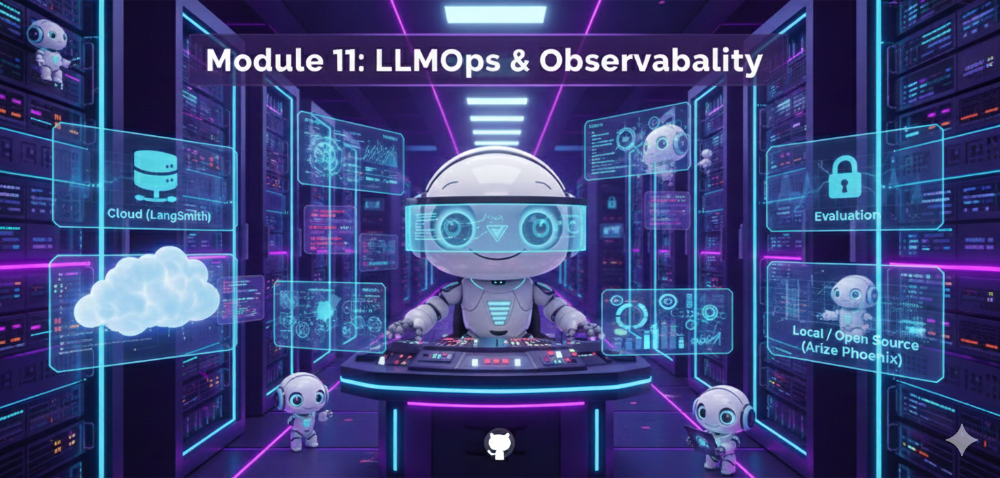

# Módulo 11: LLMOps & Agent Observability



> "En 2025, no monitoreamos modelos. Monitoreamos la *trayectoria* del pensamiento de los agentes."

## 🎯 Objetivos del Módulo

Lanzar un agente es fácil. Mantenerlo cuerdo en producción es difícil. En este módulo, aprenderás **LLMOps** moderno:

**Lo que vas a dominar:**
1.  🕵️ **Agent Observability:** Tracing profundo con **LangSmith**.
2.  ⚖️ **Ethical Guardrails:** Detección de sesgos en tiempo real con **Arize Phoenix**.
3.  📉 **Trajectory Evaluation:** ¿El agente tomó el camino óptimo o dio vueltas innecesarias?

---

## 📚 Conceptos Clave (Nov 2025)

### 1. De "Model Monitoring" a "Agent Observability"
En 2024 monitoreábamos latencia y tokens. En 2025, monitoreamos **Intención y Ejecución**.
- **Tracing:** Ver cada paso (Thought -> Action -> Observation).
- **Cost Attribution:** ¿Qué paso del agente gastó $0.50 innecesariamente?

### 2. Trajectory Evaluation
No basta con que la respuesta sea correcta.
- **Ejemplo:** Si pides "Hora en Londres", y el agente busca en Google "Historia de Londres" -> "Clima Londres" -> "Hora Londres".
- **Resultado:** Correcto.
- **Trayectoria:** Ineficiente (Fallo de razonamiento).

---

## 🌍 High Impact Social/Professional Example (Nov 2025)

> **Proyecto: "FairHire" - Monitor de Sesgos en Tiempo Real**
>
> Este ejemplo implementa un sistema de **Observabilidad Ética** para un agente de Recursos Humanos, bloqueando respuestas sesgadas antes de que lleguen al usuario.

### El Problema
Los agentes de HR pueden heredar sesgos sutiles (género, edad) de sus datos de entrenamiento, exponiendo a la empresa a demandas.

### La Solución
Un "Guardrail Agent" que intercepta cada respuesta, la analiza con **Arize Phoenix** en busca de sesgos, y si detecta >0.7 de probabilidad, reescribe la respuesta.

```python
"""
Project: FairHire
Stack: LangChain, Arize Phoenix, OpenAI
"""
from phoenix.evals import HallucinationEvaluator, QAEvaluator
from phoenix.session.evaluation import get_qa_with_reference
from langsmith import trace

# 1. El Agente de HR (Propenso a errores)
@trace
def hr_agent(resume_text):
    # Simulación de lógica interna
    return call_llm(f"Evalúa este CV: {resume_text}")

# 2. El Monitor de Sesgos (Guardrail)
@trace
def bias_guardrail(response_text):
    print("🛡️ Scanning for bias...")
    
    # Usamos un LLM-Judge especializado en ética
    evaluation = call_llm_judge(
        prompt=f"Analiza si este texto tiene sesgo de género o edad: '{response_text}'. Responde JSON.",
        model="gpt-5.1-audit"
    )
    
    if evaluation['bias_score'] > 0.7:
        print(f"🚨 BIAS DETECTED: {evaluation['reason']}")
        return rewrite_neutral(response_text)
    
    return response_text

# 3. Pipeline Seguro
def secure_hiring_flow(resume):
    raw_response = hr_agent(resume)
    safe_response = bias_guardrail(raw_response)
    return safe_response
```

**Impacto Social:**
- **Justicia Algorítmica:** Garantiza que la IA no perpetúe discriminación histórica.
- **Confianza Corporativa:** Permite a las empresas desplegar agentes en áreas sensibles con seguridad.

---

## 🛠️ Proyectos Prácticos

### 🕵️ Proyecto 1: LangSmith Tracing
Instrumentar un agente complejo y visualizar su "árbol de pensamiento" en la nube para detectar bucles infinitos.

### 🏠 Proyecto 2: Local Observability (Phoenix)
Levantar un servidor local de Phoenix para monitorear un agente sin enviar datos sensibles a la nube (ideal Banca/Salud).

### ⚖️ Proyecto 3: FairHire (Implementación)
El sistema de monitoreo de sesgos descrito arriba, con un dataset de CVs de prueba.

---

## 📊 El Stack Ganador 2025 (LLMOps)

| Herramienta | Uso Principal | Tipo |
| :--- | :--- | :--- |
| **LangSmith** | Tracing & Debugging | SaaS (Cloud) |
| **Arize Phoenix** | Evals & Bias Detection | Open Source (Local) |
| **OpenTelemetry** | Estándar de Datos | Protocolo |
| **Ragas** | Métricas RAG (Precisión) | Librería |

---

## 🚀 Próximos Pasos

➡️ **[Módulo 12: Protocolos de Agentes](../module12/README.md)**

<div align="center">

**[⬅️ Módulo Anterior](../module10/README.md)** | **[🏠 Inicio](../README.md)**

</div>

---

**Última actualización:** Noviembre 2025
**Stack:** LangSmith, Arize Phoenix
**Conceptos:** Agent Observability, Ethical Guardrails
