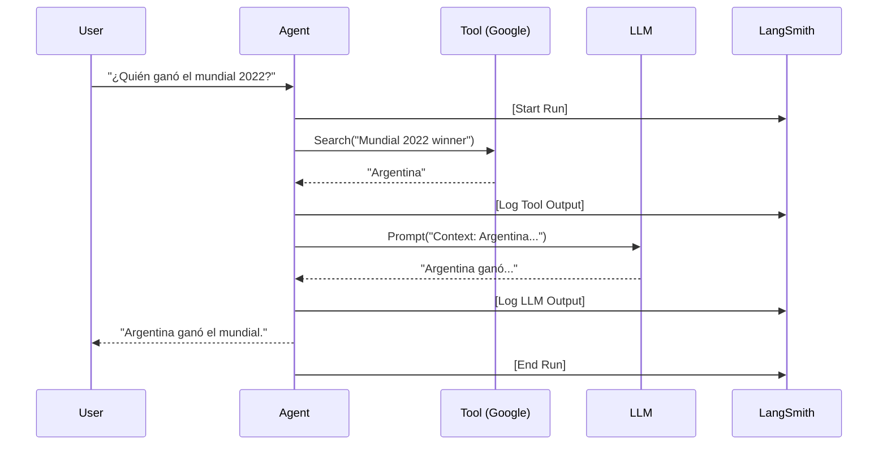

# Módulo 11: LLMOps & Observabilidad


> *"Si no puedes medirlo, no puedes mejorarlo."* — Peter Drucker (y cualquier ingeniero de IA serio)

---

## 🎯 Objetivos del Módulo

Tu agente funciona en tu laptop. ¡Felicidades! 🎉
Pero cuando lo lanzas a producción y 100 usuarios empiezan a quejarse de que "dice cosas raras", ¿cómo sabes qué pasó?

**Lo que vas a dominar:**
1.  🕵️ **Tracing:** Ver la radiografía exacta de cada pensamiento del agente.
2.  🧪 **Evaluación (Eval):** Unit tests para IA. ¿Cómo saber si tu bot es más tonto hoy que ayer?
3.  📊 **Observabilidad:** Dashboards de latencia, costo y errores.

---

## 🕵️ 1. El Problema de la "Caja Negra"

Sin observabilidad, un agente es una caja negra.
-   **Usuario:** "¿Por qué el bot me recomendó veneno?"
-   **Tú:** "No sé, el LLM alucinó." (Respuesta inaceptable en Enterprise).

### La Solución: Tracing Distribuido

Necesitamos ver la cadena de ejecución completa:
`User Input` -> `Router` -> `Retriever` -> `LLM` -> `Parser` -> `Output`



---

## 🛠️ 2. Herramientas del Oficio (The Stack)

En 2025, hay dos grandes caminos:

### A. La Nube (LangSmith)
La solución de los creadores de LangChain.
-   ✅ **Pros:** Setup de 1 línea, UI increíble, datasets integrados.
-   ❌ **Contras:** Envías datos a la nube (cuidado con GDPR/HIPAA).

### B. Local / Open Source (Arize Phoenix)
La opción para bancos y empresas paranoicas.
-   ✅ **Pros:** Todo corre en tu Docker, compatible con OpenTelemetry.
-   ❌ **Contras:** Tienes que mantener la infraestructura.

---

## 🧪 3. Evaluación Automática (Ragas)

¿Cómo sabes si tu RAG está recuperando buenos documentos?
Usamos **Ragas** (Retrieval Augmented Generation Assessment) para calcular métricas matemáticamente:

1.  **Faithfulness:** ¿La respuesta se inventó datos que no estaban en el contexto?
2.  **Answer Relevance:** ¿Respondió lo que el usuario preguntó?
3.  **Context Precision:** ¿La basura (ruido) está filtrada?

```python
# Ejemplo conceptual de Test
def test_agent_faithfulness():
    response = agent.ask("¿Capital de Francia?")
    score = ragas.evaluate(response, metric="faithfulness")
    assert score > 0.9 # Si baja de 0.9, el build falla 🚨
```

---

## 🛠️ Proyectos Prácticos

### 🕵️ Proyecto 1: Instrumentación con LangSmith
**Archivo:** [`01_instrumentation_basics.py`](01_instrumentation_basics.py)
Aprende a conectar tu agente a LangSmith con 3 variables de entorno y visualiza tu primer trace.

### 🏠 Proyecto 2: Observabilidad Local (Phoenix)
**Archivo:** [`02_local_observability_phoenix.py`](02_local_observability_phoenix.py)
Levanta un servidor de observabilidad local y envía trazas sin tocar internet.

### 🧪 Proyecto 3: Pipeline de Evaluación (CI/CD)
**Archivo:** [`03_agent_evaluation_pipeline.py`](03_agent_evaluation_pipeline.py)
Un script que corre un set de preguntas "Golden", evalúa las respuestas del agente y genera un reporte de calidad.

---

<div align="center">

**[⬅️ Módulo Anterior](../module10/README.md)** | **[🏠 Inicio](../README.md)** | **[Siguiente Módulo ➡️](../module12/README.md)**

</div>
