# 🌐 Módulo 11: Protocolos de Agentes (MCP, A2A)


> *"El futuro no es un solo agente gigante, sino millones de agentes pequeños hablando entre sí. MCP es el USB-C de la IA: un estándar universal para conectar modelos a herramientas."* — Anthropic, 2024

---

## 🌸 Introducción: El Problema de la Fragmentación

Imagina que cada vez que quieres conectar tu teléfono a un cargador, necesitas un cable diferente según la marca del cargador. Eso es exactamente lo que pasaba con los agentes de IA antes de MCP.

### El Mundo Antes de MCP
Cada framework de agentes (LangChain, CrewAI, AutoGen) tenía su propia forma de conectarse a herramientas externas:
*   **LangChain:** Usa `@tool` decorators y `BaseTool`.
*   **CrewAI:** Define `tools` como funciones Python.
*   **AutoGen:** Registra funciones con `register_function`.

**Resultado:** Si construías una herramienta para LangChain, no funcionaba en CrewAI. Código duplicado, mantenimiento imposible.

### El Mundo Después de MCP
**Model Context Protocol (MCP)** es un estándar abierto creado por Anthropic en noviembre de 2024 que define un "lenguaje común" para que los LLMs se comuniquen con herramientas, bases de datos y servicios externos.[1][2]

**Analogía:** Si HTTP es el protocolo para servidores web, **MCP es el protocolo para servidores de agentes**.

---

## 📚 Conceptos Fundamentales

### 1. Arquitectura Cliente-Servidor 🏗️

MCP sigue una arquitectura de tres capas:

```mermaid
%%{init: {'theme': 'base', 'themeVariables': { 'primaryColor': '#C3B1E1', 'edgeLabelBackground':'#ffffff', 'tertiaryColor': '#FDFD96', 'mainBkg': '#E6E6FA', 'nodeBorder': '#A7C7E7'}}}%%
graph TB
    subgraph "MCP Host (AI Application)"
        User[👤 Usuario] --> Claude[🤖 Claude/GPT-4]
        Claude --> MCPClient[MCP Client]
    end
    
    subgraph "Transport Layer (JSON-RPC 2.0)"
        MCPClient <-->|WebSocket/stdio| Protocol[📡 Protocolo MCP]
    end
    
    subgraph "MCP Server (External Tools)"
        Protocol <--> MCPServer[MCP Server]
        MCPServer --> Tools[🛠️ Tools]
        MCPServer --> Resources[📄 Resources]
        MCPServer --> Prompts[💬 Prompts]
    end
    
    subgraph "Data Sources"
        Tools --> DB[(Database)]
        Tools --> API[External APIs]
        Resources --> Files[File System]
    end
```



**Componentes:**
1.  **MCP Host:** La aplicación donde vive el LLM (Claude Desktop, tu agente custom).
2.  **MCP Client:** Conector que traduce las peticiones del LLM al protocolo MCP.
3.  **MCP Server:** Programa ligero que expone herramientas y datos.
4.  **Transport Layer:** Comunicación vía JSON-RPC 2.0 sobre WebSocket o stdio.

### 2. Tipos de Primitivas en MCP

Un servidor MCP puede exponer tres tipos de primitivas:

#### **Tools (Herramientas)**
Funciones que el LLM puede invocar para realizar acciones.

```python
from mcp.server import Server

server = Server("company-tools")

@server.tool()
async def get_customer_data(customer_id: str) -> str:
    """
    Obtiene datos de un cliente desde el CRM.
    
    Args:
        customer_id: ID único del cliente
    
    Returns:
        Datos del cliente en formato JSON
    """
    # Consulta a base de datos real
    return json.dumps({
        "id": customer_id,
        "name": "Acme Corp",
        "status": "active",
        "revenue": 150000
    })
```

#### **Resources (Recursos)**
Documentos o datos que el LLM puede leer (políticas, manuales, logs).

```python
@server.resource("company://policies/refund")
async def get_refund_policy():
    """Política de reembolsos de la empresa."""
    return TextContent(
        uri="company://policies/refund",
        mimeType="text/markdown",
        text="""
# Política de Reembolsos
1. Productos físicos: 30 días
2. Software: 14 días sin uso
3. Servicios: No aplican reembolsos
        """
    )
```

#### **Prompts (Plantillas)**
Prompts reutilizables que el LLM puede invocar.

```python
@server.prompt()
async def customer_support_prompt(customer_name: str):
    """Prompt para atención al cliente."""
    return f"""
Eres un agente de soporte para {customer_name}.
Sé empático, profesional y resuelve el problema en máximo 3 pasos.
    """
```

### 3. Flujo de Comunicación (The Dance)

Veamos qué pasa cuando un usuario pregunta: *"¿Cuál es el estado del cliente CUST-123?"*

```mermaid
sequenceDiagram
    participant U as Usuario
    participant LLM as Claude (Host)
    participant Client as MCP Client
    participant Server as MCP Server
    participant DB as CRM Database

    U->>LLM: "Estado del cliente CUST-123?"
    LLM->>Client: Necesito tool: get_customer_data
    Client->>Server: JSON-RPC: call_tool("get_customer_data", {"customer_id": "CUST-123"})
    Server->>DB: SELECT * FROM customers WHERE id='CUST-123'
    DB-->>Server: {"name": "Acme", "status": "active"}
    Server-->>Client: JSON Response
    Client-->>LLM: Structured Data
    LLM-->>U: "El cliente Acme Corp está activo con $150k en revenue."
```



---

## 💻 Código Real: Implementación Paso a Paso

### Ejemplo 1: Servidor MCP Básico

*Archivo: `01_mcp_server_implementation.py`*

```python
from mcp.server import Server
from mcp.types import TextContent
import json

# Crear servidor
server = Server("demo-tools")

# Definir herramienta
@server.tool()
async def calculate(expression: str) -> float:
    """
    Calculadora segura para expresiones matemáticas.
    
    Args:
        expression: Expresión matemática (ej. "2 + 2")
    
    Returns:
        Resultado numérico
    """
    # En producción, usar ast.literal_eval para seguridad
    return eval(expression)

# Ejecutar servidor (stdio transport)
if __name__ == "__main__":
    import mcp.server.stdio
    mcp.server.stdio.run_server(server)
```

**Ejecutar:**
```bash
python 01_mcp_server_implementation.py
```

### Ejemplo 2: Cliente MCP (Conectar desde un Agente)

*Archivo: `02_intermediate_mcp_client.py`*

```python
from mcp.client import Client
import asyncio

async def main():
    # Conectar a servidor MCP
    client = Client()
    await client.connect("stdio://demo-tools")
    
    # Listar herramientas disponibles
    tools = await client.list_tools()
    print(f"Herramientas: {[t.name for t in tools]}")
    
    # Invocar herramienta
    result = await client.call_tool(
        "calculate",
        arguments={"expression": "15 * 3"}
    )
    print(f"Resultado: {result}")  # 45.0
    
    await client.disconnect()

asyncio.run(main())
```

---

## 🔄 Comparación: Function Calling vs MCP

| Aspecto | Function Calling Tradicional | MCP |
|---------|------------------------------|-----|
| **Definición** | Cada agente define sus funciones | Servidor centralizado |
| **Reutilización** | Código duplicado por agente | Una vez, múltiples clientes |
| **Actualización** | Modificar cada agente | Actualizar solo el servidor |
| **Interoperabilidad** | Específico del framework | Funciona con cualquier cliente MCP |
| **Ejemplo** | `@tool` en LangChain | `@server.tool()` en MCP |

---

## 🌍 Agent-to-Agent Communication (A2A)

Mientras MCP conecta agentes a **herramientas**, A2A permite que **agentes hablen entre sí**.

### Protocolo FIPA ACL (Legacy)
El estándar clásico de comunicación multi-agente, basado en performativas explícitas:

```json
{
  "sender": "agent_sales_01",
  "receiver": "agent_inventory_05",
  "performative": "REQUEST",
  "content": {
    "action": "check_stock",
    "item_id": "SKU-12345"
  },
  "protocol": "fipa-request",
  "language": "json"
}
```

**Performativas comunes:** `REQUEST`, `INFORM`, `AGREE`, `REFUSE`, `CFP` (Call for Proposal).

### Protocolos Modernos (JSON-RPC)
Los agentes modernos usan JSON sobre HTTP/WebSocket por simplicidad:

```json
{
  "jsonrpc": "2.0",
  "method": "negotiate_price",
  "params": {
    "item": "SKU-12345",
    "max_price": 500
  },
  "id": 1
}
```

---

## 🧪 Proyectos Prácticos

### 🟢 Nivel Básico: Servidor MCP Personalizado
**Archivo:** [01_mcp_server_implementation.py](01_mcp_server_implementation.py)

Implementa un servidor MCP que expone herramientas de tu empresa (CRM, tickets, políticas).

### 🟡 Nivel Intermedio: Cliente MCP Integrado
**Archivo:** [02_intermediate_mcp_client.py](02_intermediate_mcp_client.py)

Conecta un agente LangChain a tu servidor MCP y observa la interoperabilidad.

### 🔴 Nivel Avanzado: Mercado de Agentes (A2A)
**Archivo:** [03_advanced_agent_marketplace.py](03_advanced_agent_marketplace.py)

Simula un mercado donde agentes negocian precios usando un protocolo A2A.

---

## 🎓 Mejores Prácticas

1.  **Seguridad:** Nunca uses `eval()` en producción. Valida inputs con schemas.
2.  **Versionado:** Versiona tus servidores MCP (`v1`, `v2`) para evitar breaking changes.
3.  **Documentación:** Usa docstrings detallados en cada `@server.tool()`.
4.  **Monitoreo:** Loggea todas las llamadas a herramientas para auditoría.
5.  **Fallbacks:** Implementa timeouts y manejo de errores en el servidor.

---

## 📚 Referencias y Recursos

*   **[MCP Official Docs](https://modelcontextprotocol.io/)** — Especificación completa del protocolo
*   **[Anthropic MCP GitHub](https://github.com/anthropics/mcp)** — Implementaciones de referencia
*   **[FastMCP Tutorial](https://github.com/jlowin/fastmcp)** — SDK simplificado para Python
*   **FIPA ACL Specification** — Estándar clásico de comunicación de agentes

---

<div align="center">
<a href="../module12/README.md">➡️ Siguiente Módulo: Proyecto Capstone</a>
</div>
