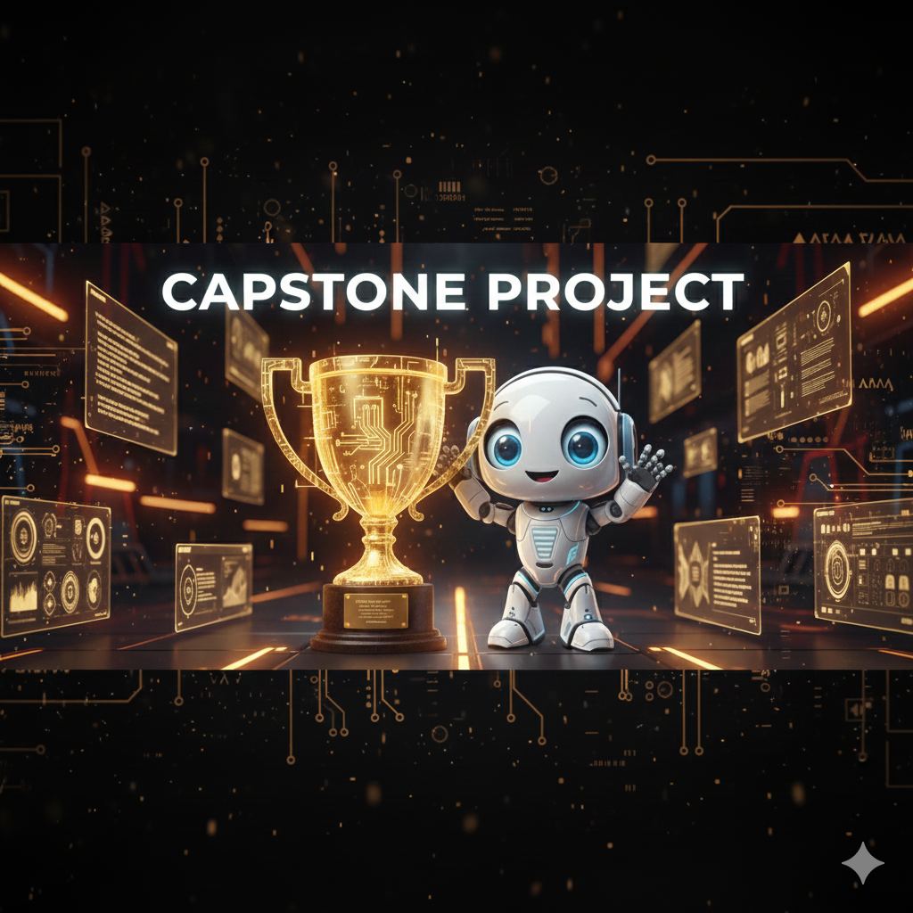
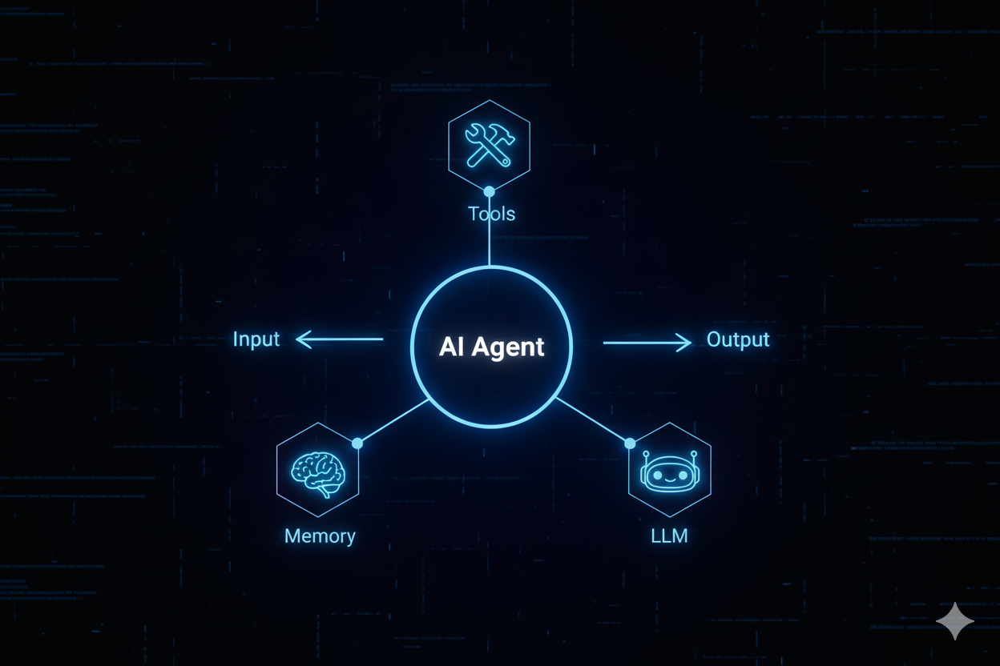

# Módulo 12: Proyecto Capstone - GitHub AI Agent Team



<div align="center">

[]()
[]()
[]()

</div>

---

## 🏆 Misión del Proyecto

Construir un **Equipo de Desarrollo de Software Autónomo** capaz de gestionar un repositorio de GitHub real. El sistema debe monitorear issues, analizar código, proponer soluciones, escribir tests y generar Pull Requests de calidad profesional sin intervención humana directa.

> [!IMPORTANT]
> Este es el proyecto final del curso. Integra conceptos de RAG, Tool Use, Planificación, Multi-Agente y LLMOps.

---

## 🏗️ Arquitectura del Sistema



El sistema utiliza una arquitectura **Jerárquica con Manager** implementada en CrewAI/LangGraph:

1.  **🕵️ Manager Agent (Coordinador):**
    - Monitorea el repositorio.
    - Triaje de issues (Bug vs Feature).
    - Asigna tareas a especialistas.
2.  **🧠 Analysis Agent (Analista):**
    - Lee el código existente.
    - Identifica la causa raíz de bugs.
    - Detecta code smells usando AST.
3.  **👨‍💻 Coding Agent (Desarrollador):**
    - Escribe la solución.
    - Genera tests unitarios.
    - Crea el PR con descripción semántica.

---

## 🛠️ Implementación Paso a Paso

### 1. Configuración del Entorno
Necesitarás un token de GitHub con permisos de repo.

```bash
export GITHUB_TOKEN="ghp_..."
export GITHUB_REPO="usuario/repo-destino"
```

### 2. Agentes Especializados

#### **[01_github_agent_manager.py](01_github_agent_manager.py)**
El cerebro de la operación. Usa la API de GitHub para buscar trabajo.

#### **[02_code_analysis_agent.py](02_code_analysis_agent.py)**
El experto técnico. No escribe código, solo piensa y diagnostica.

#### **[03_code_writer_agent.py](03_code_writer_agent.py)**
El ejecutor. Produce código limpio, documentado y testeado.

---

## 🚀 Ejecución del Capstone

```bash
# Ejecutar el sistema completo
python 01_github_agent_manager.py
```

**Flujo Esperado:**
1.  Manager detecta Issue #42: "Fix login bug".
2.  Analyst lee `auth.py` y encuentra el error lógico.
3.  Writer crea branch `fix/login-bug`, parchea el código y sube PR.
4.  Manager notifica en el issue original.

---

## 🎓 Criterios de Evaluación

Para considerar este módulo completado, tu sistema debe:

- [ ] Conectarse exitosamente a GitHub.
- [ ] Diferenciar entre un bug y una feature request.
- [ ] Generar código sintácticamente correcto (Python).
- [ ] Crear un PR real con cambios válidos.
- [ ] Manejar errores de API gracefully.

---

## 🌟 Extensiones Sugeridas

¿Quieres ir más allá? Intenta esto:

- **Code Reviewer Agent:** Un cuarto agente que revise el PR antes de abrirlo.
- **CI/CD Integration:** Que el agente espere a que pasen los tests de GitHub Actions.
- **Documentation Bot:** Que actualice el README automáticamente si cambia la funcionalidad.

---

<div align="center">
<a href="../module13/README.md">➡️ Siguiente Módulo: Testing de Agentes</a>
</div>
