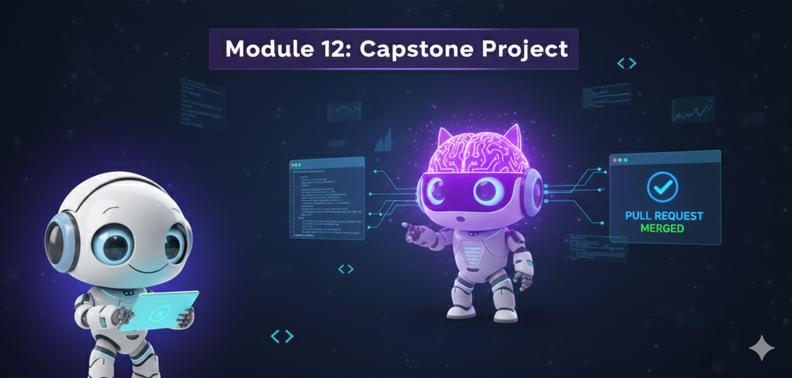
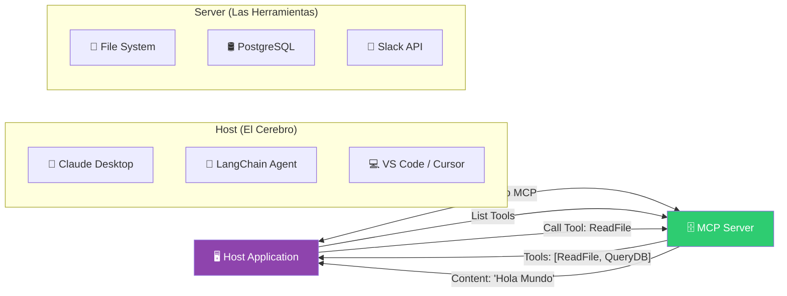

# Módulo 12: Protocolos de Agentes (MCP)

> *"El problema de la IA no es la inteligencia, es la conectividad. MCP es el USB de los Agentes."*

---

## 🎯 Objetivos del Módulo

Hasta ahora, cada vez que querías conectar un agente a una base de datos, escribías una "Tool" específica.
Si tenías 10 agentes y 5 bases de datos, escribías 50 integraciones. **Esto no escala.**

**Lo que vas a dominar:**
1.  🔌 **MCP (Model Context Protocol):** El estándar abierto para conectar IAs a sistemas.
2.  🖥️ **MCP Server:** Cómo crear un servidor que exponga tus datos (archivos, DBs) universalmente.
3.  🧠 **MCP Client:** Cómo conectar cualquier LLM (Claude, GPT-4) a tus herramientas sin reescribir código.

---

## 🔌 1. ¿Qué es MCP? (La Analogía del USB)

Antes del USB, tenías un puerto para el ratón, otro para la impresora, otro para el teclado. Un caos.
El USB estandarizó todo: **Cualquier dispositivo funciona en cualquier PC.**

**MCP hace lo mismo para la IA:**
-   **Antes:** Escribías una integración específica de "Google Drive para LangChain", otra de "Google Drive para AutoGen", etc.
-   **Con MCP:** Escribes un **Servidor MCP de Google Drive** una vez. LangChain, AutoGen, Claude y ChatGPT pueden usarlo instantáneamente.

### Arquitectura MCP

---

## 🛠️ 2. Componentes Clave

### 1. Resources (Recursos)
Son datos pasivos que el agente puede leer. Como archivos o logs.
*   Ejemplo: `file:///logs/error.txt`

### 2. Prompts (Plantillas)
Instrucciones predefinidas que viven en el servidor.
*   Ejemplo: Un prompt de "Code Review" que ya conoce las reglas de estilo de tu empresa.

### 3. Tools (Herramientas)
Funciones ejecutables que toman argumentos y devuelven resultados.
*   Ejemplo: `query_database(sql: str)`

---

## 🚀 Proyectos Prácticos

### 🔌 Proyecto 1: Tu Primer Servidor MCP
**Archivo:** [`01_mcp_server_simple.py`](01_mcp_server_simple.py)
Crearemos un servidor que expone una "Base de Datos de Productos" (simulada).
Este servidor puede ser consumido por Claude Desktop o tu propio agente.

### 🧠 Proyecto 2: Cliente MCP con LangChain
**Archivo:** [`02_mcp_client_agent.py`](02_mcp_client_agent.py)
Un agente que se conecta a tu servidor MCP, descubre las herramientas automáticamente y las usa para responder preguntas.

---

**[⬅️ Módulo Anterior](../module11/README.md)** | **[🏠 Inicio](../README.md)** | **[Siguiente Módulo (Capstone) ➡️](../module13/README.md)**

