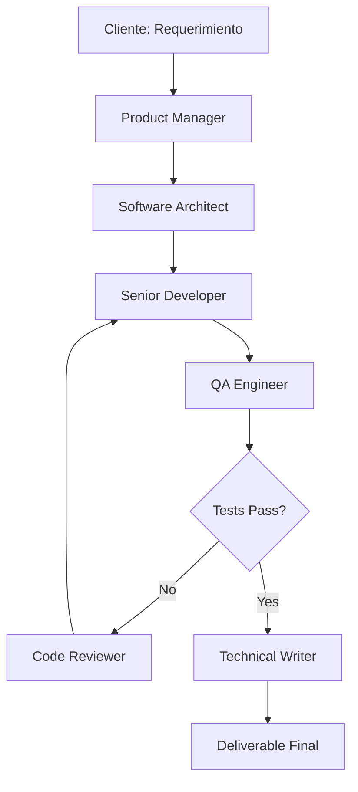

# Módulo 12: Capstone Project - AI Software Agency

## 🎯 Objetivo del Proyecto Capstone

Crear una **"AI Software Agency"** completa que recibe un requerimiento de software y genera código funcional, tests, y documentación.

---

## 📋 Descripción del Proyecto

### Concepto
Un sistema multi-agente que simula una agencia de desarrollo de software, con roles especializados trabajando en conjunto para entregar un producto completo.

### Agentes del Sistema

1. **🎯 Product Manager (PM)**
   - Analiza requerimientos del cliente
   - Genera especificaciones técnicas
   - Define criterios de aceptación

2. **🏗️ Software Architect**
   - Diseña arquitectura del sistema
   - Selecciona tecnologías apropiadas
   - Define estructura de archivos y módulos

3. **👨‍💻 Senior Developer**
   - Implementa código según arquitectura
   - Sigue mejores prácticas
   - Escribe código limpio y documentado

4. **🧪 QA Engineer**
   - Escribe tests unitarios y de integración
   - Valida contra criterios de aceptación
   - Reporta bugs encontrados

5. **📝 Technical Writer**
   - Genera documentación (README, API docs)
   - Escribe guías de instalación y uso
   - Documenta decisiones de diseño

6. **🔍 Code Reviewer**
   - Revisa calidad del código
   - Sugiere mejoras
   - Aprueba o solicita cambios

---

## 🛠️ Stack Tecnológico

- **Orquestación**: LangGraph (para workflow complejo) o CrewAI (para colaboración)
- **LLMs**: 
  - GPT-4o para PM, Architect, Reviewer
  - GPT-4o-mini para Developer, QA, Writer (costo-optimizado)
- **Tools**:
  - File I/O (escribir código)
  - Code execution (pytest, linters)
  - Web search (investigar librerías)

---

## 📐 Arquitectura del Sistema



---

## 🚀 Flujo de Trabajo (Workflow)

### Fase 1: Análisis (Planning)
1. PM recibe requerimiento
2. PM genera PRD (Product Requirements Document)
3. Architect diseña solución técnica

### Fase 2: Implementación (Execution)
4. Developer escribe código según diseño
5. QA escribe y ejecuta tests
6. Loop hasta que tests pasen

### Fase 3: Revisión (Verification)
7. Code Reviewer analiza código
8. Si hay feedback, volver a Developer
9. Si aprobado, pasar a documentación

### Fase 4: Documentación (Delivery)
10. Technical Writer genera README y docs
11. Sistema entrega paquete completo

---

## 💼 Ejemplo de Input/Output

### INPUT (Cliente):
```
Necesito una API REST en Python que:
- Gestione usuarios (CRUD)
- Autenticación JWT
- Rate limiting (100 req/min)
- SQLite como base de datos
- Tests de cobertura >80%
```

### OUTPUT (Sistema):
```
my-api/
├── README.md                    # Generado por Technical Writer
├── requirements.txt             # Dependencias detectadas
├── app/
│   ├── __init__.py
│   ├── main.py                 # FastAPI app (por Developer)
│   ├── models.py               # SQLAlchemy models
│   ├── auth.py                 # JWT authentication
│   └── rate_limiter.py         # Custom rate limiting
├── tests/
│   ├── test_users.py           # Por QA Engineer
│   ├── test_auth.py
│   └── test_rate_limit.py
└── docs/
    ├── API.md                  # API documentation
    └── ARCHITECTURE.md         # Decisiones de diseño
```

---

## 🎯 Métricas de Éxito

1. **✅ Tests Passing**: 100% de tests unitarios pasando
2. **📊 Code Coverage**: Mínimo 80%
3. **⚡ Performance**: API responde <100ms
4. **📝 Documentation**: README completo y claro
5. **🔒 Security**: No vulnerabilidades obvias (SQL injection, XSS)

---

## 🧪 Implementación Sugerida

### Opción A: LangGraph (Flujo Complejo)
- **Ventaja**: Control total del workflow, manejo de estados, loops condicionales
- **Complejidad**: Alta
- **Mejor para**: Proyectos grandes y complejos

### Opción B: CrewAI (Simplicidad)
- **Ventaja**: Configuración rápida, colaboración natural entre agentes
- **Complejidad**: Baja
- **Mejor para**: MVPs y demos

### Opción C: Híbrido
- LangGraph para workflow principal
- CrewAI para sub-equipos (ej: Developer + QA)

---

## 📚 Extensiones Avanzadas

1. **Human-in-the-Loop**: Aprobar diseño antes de codificar
2. **Multi-lenguaje**: Soportar TypeScript, Go, Rust
3. **Deployment**: Generar Dockerfile y GitHub Actions
4. **Cost Tracking**: Reportar costo total del proyecto
5. **A/B Testing**: Generar 2 soluciones y comparar

---

## 🏆 Desafíos Bonus

- **Self-Healing Code**: Si tests fallan, agentre auto-corrige
- **Incremental Updates**: Modificar código existente sin reescribir todo
- **Code Migration**: Convertir Flask app a FastAPI automáticamente
- **Performance Optimization**: Agente que detecta y optimiza bottlenecks

---

## 📖 Recursos

- Example implementation: `capstone_example_implementation.py`
- LangGraph docs: https://langchain-ai.github.io/langgraph/
- CrewAI docs: https://docs.crewai.com/
- AutoGen patterns: https://microsoft.github.io/autogen/

---

## ⚠️ Consideraciones de Producción

1. **Cost Control**: Limitar tokens máximos por agente
2. **Timeouts**: Evitar loops infinitos
3. **Sandboxing**: Ejecutar código generado en entorno aislado
4. **Version Control**: Guardar cada iteración como commit
5. **Error Handling**: Plan B si un agente falla

---

**¡Este es el proyecto culminante que demuestra dominio completo del desarrollo de agentes de IA!**
