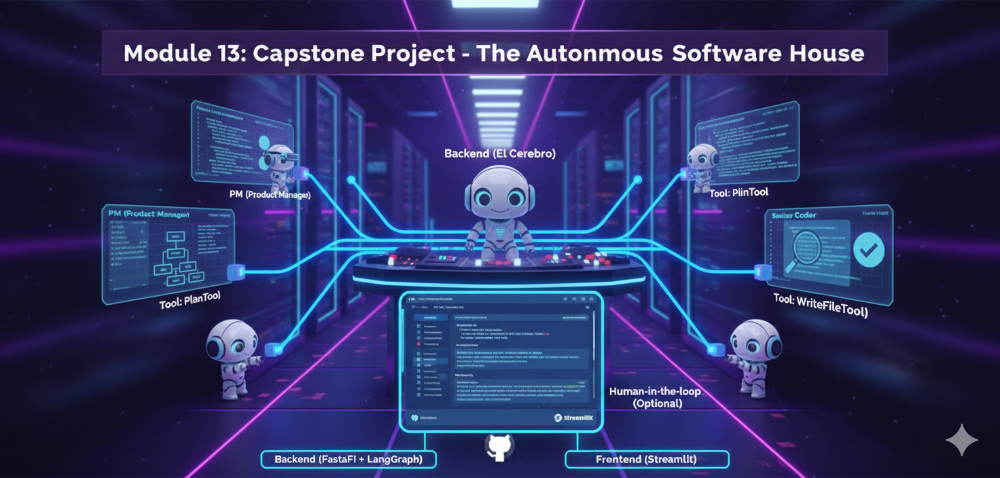
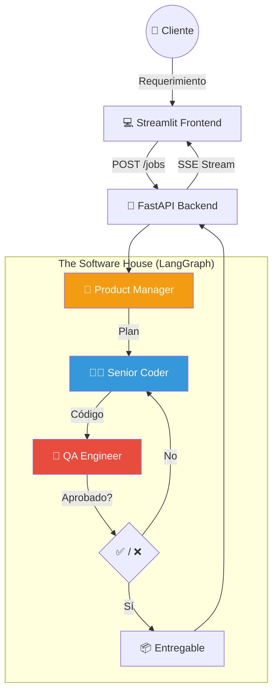

# Módulo 13: Capstone Project - The Autonomous Software House 🏗️




> *"Cualquiera puede escribir código. Solo un Ingeniero de IA construye sistemas que escriben código."*

---

## 🏆 El Desafío Final

Bienvenido al final del camino. Has aprendido sobre RAG, Agentes, Memoria, Herramientas, MCP y Observabilidad.
Ahora, vamos a ponerlo todo junto.

**Tu Misión:** Construir una **"Casa de Software Autónoma"**.
Un sistema donde el usuario (el Cliente) entrega un requerimiento en lenguaje natural, y un equipo de agentes (el Personal) entrega el software funcionando.

---

## 🏗️ Arquitectura del Sistema

Usaremos una arquitectura de **Microservicios Agénticos**.



---

## 🤖 El Equipo (Los Agentes)

1.  **👔 Product Manager (PM):**
    *   **Rol:** Analiza el requerimiento del usuario.
    *   **Salida:** Un plan paso a paso y especificaciones técnicas.
    *   **Herramienta:** `PlanTool`.

2.  **👨‍💻 Senior Coder:**
    *   **Rol:** Escribe el código Python basado en el plan del PM.
    *   **Salida:** Archivos de código `.py`.
    *   **Herramienta:** `WriteFileTool`.

3.  **🧐 QA Engineer (Reviewer):**
    *   **Rol:** Revisa el código buscando bugs, seguridad y estilo.
    *   **Salida:** Aprobación o lista de correcciones.
    *   **Herramienta:** `LintTool`.

---

## 🚀 Instrucciones de Ejecución

### 1. Backend (El Cerebro)
El backend corre en FastAPI y orquesta a los agentes usando LangGraph.

```bash
cd module13/backend
pip install -r requirements.txt
uvicorn main:app --reload
```

### 2. Frontend (La Cara)
Una interfaz moderna en Streamlit para interactuar con tu equipo de software.

```bash
cd module13/frontend
streamlit run app.py
```

---

## 🌟 Características "Wow"

*   **Streaming en Tiempo Real:** Verás a cada agente "pensando" y trabajando en vivo en la UI.
*   **Sistema de Archivos Real:** Los agentes realmente crean archivos en tu disco duro (en una carpeta `workspace`).
*   **Human-in-the-loop:** (Opcional) El PM puede pedirte confirmación antes de empezar a codificar.

---

<div align="center">

**[⬅️ Módulo Anterior](../module12/README.md)** | **[🏠 Inicio](../README.md)** | **[Siguiente Módulo (Deployment) ➡️](../module14/README.md)**

</div>
