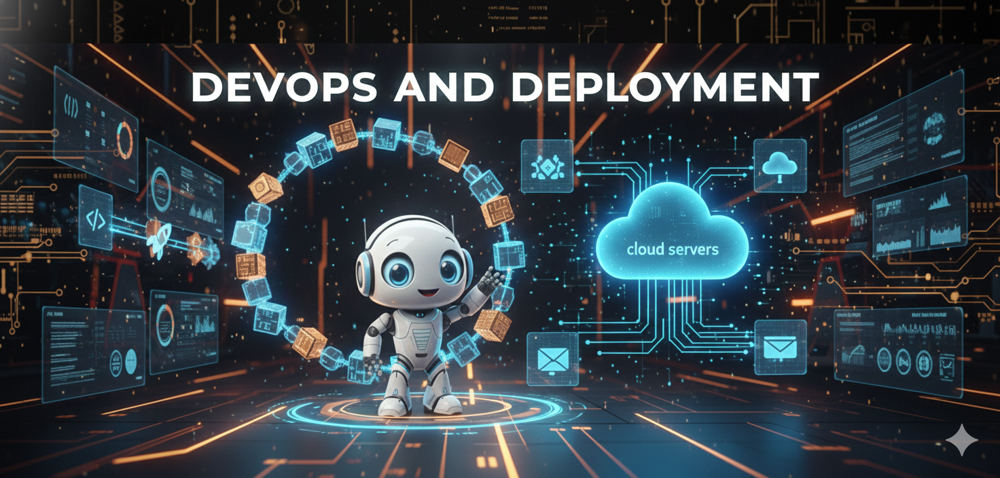

# Módulo 14: Deployment y DevOps




## 🎯 Objetivos del Módulo

Llevar agentes de desarrollo a producción con prácticas de DevOps modernas.

## 📚 Conceptos Clave

### 1. Containerization

**Docker Benefits:**
- Consistency cross-platform
- Isolation de dependencias
- Fácil scaling
- Version control de environment

**Multi-stage builds:**
- Reduce image size
- Separate build vs runtime
- Better security

### 2. Cloud Deployment

**Opciones principales:**
- **AWS Lambda:** Serverless, pay-per-use
- **Google Cloud Run:** Containers autoscaling
- **Azure Container Apps:** Enterprise-ready
- **Railway/Render:** Simple deployment

**Consideraciones:**
- Cold starts (Lambda)
- Costs (always-on vs serverless)
- Network policies
- Secrets management

### 3. Scaling

**Horizontal vs Vertical:**
- Horizontal: Más instancias (preferido)
- Vertical: Más recursos por instancia

**Auto-scaling triggers:**
- CPU/Memory usage
- Request queue length
- Custom metrics (tokens/minute)

### 4. Monitoring

**Métricas clave:**
- Latency (p50, p95, p99)
- Error rate
- Throughput (requests/sec)
- Cost per request
- LLM-specific: tokens, quality scores

**Tools:**
- Prometheus + Grafana
- Datadog
- New Relic
- LangSmith (LLM-specific)

## 🛠️ Proyectos Prácticos

### 🟢 Nivel Básico: Docker Containerization
**Archivo:** `01_docker_containerization.py`
- **Concepto:** Dockerizar agent application
- **Incluye:** Dockerfile, docker-compose, health checks
- **Caso de uso:** RAG chatbot production-ready

### 🟡 Nivel Intermedio: AWS Lambda Deployment
**Archivo:** `02_cloud_deployment_aws.py`
- **Concepto:** Deploy to serverless
- **Incluye:** Lambda function, API Gateway, Secrets Manager
- **Caso de uso:** API endpoint para agent

### 🔴 Nivel Avanzado: Kubernetes Scaling
**Archivo:** `03_kubernetes_scaling.py`
- **Concepto:** K8s deployment con auto-scaling
- **Incluye:** Manifests, HPA, load balancing
- **Caso de uso:** High-traffic agent system

## 🎓 Best Practices

### Dockerfile Best Practices

```dockerfile
# Multi-stage build
FROM python:3.11-slim as builder
WORKDIR /app
COPY requirements.txt .
RUN pip install --no-cache-dir -r requirements.txt

# Runtime
FROM python:3.11-slim
COPY --from=builder /usr/local/lib/python3.11/site-packages /usr/local/lib/python3.11/site-packages
COPY . /app
WORKDIR /app
CMD ["python", "main.py"]
```

### Secrets Management

```python
# ❌ NEVER
API_KEY = "sk-abc123..."

# ✅ ALWAYS
import os
API_KEY = os.getenv("OPENAI_API_KEY")
if not API_KEY:
    raise ValueError("Missing API_KEY")
```

### Health Checks

```python
@app.get("/health")
def health_check():
    return {
        "status": "healthy",
        "timestamp": datetime.now().isoformat(),
        "version": VERSION
    }
```

## 📊 Deployment Checklist

### Pre-Deployment
- [ ] Environment variables externalized
- [ ] Secrets in vault (not code)
- [ ] Health check endpoint
- [ ] Logging configured
- [ ] Error handling complete
- [ ] Tests passing
- [ ] Docker image built & tested

### Post-Deployment  
- [ ] Monitoring dashboard
- [ ] Alerts configured
- [ ] Backup/rollback plan
- [ ] Load testing done
- [ ] Documentation updated

## 🚀 Quick Start

```bash
# Build Docker image
docker build -t my-agent:latest .

# Run locally
docker run -p 8000:8000 --env-file .env my-agent:latest

# Push to registry
docker tag my-agent:latest gcr.io/project/my-agent:latest
docker push gcr.io/project/my-agent:latest

# Deploy to Cloud Run
gcloud run deploy my-agent --image gcr.io/project/my-agent:latest
```

## 📚 Recursos

- [Docker Best Practices](https://docs.docker.com/develop/develop-images/dockerfile_best-practices/)
- [AWS Lambda Documentation](https://docs.aws.amazon.com/lambda/)
- [Kubernetes Documentation](https://kubernetes.io/docs/)
- [Cloud Run Quickstart](https://cloud.google.com/run/docs/quickstarts)

---

<div align="center">
<a href="../README.md">🎓 Volver al Inicio del Curso</a>
</div>
