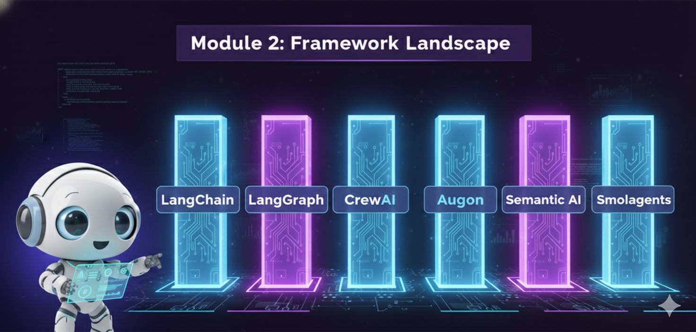
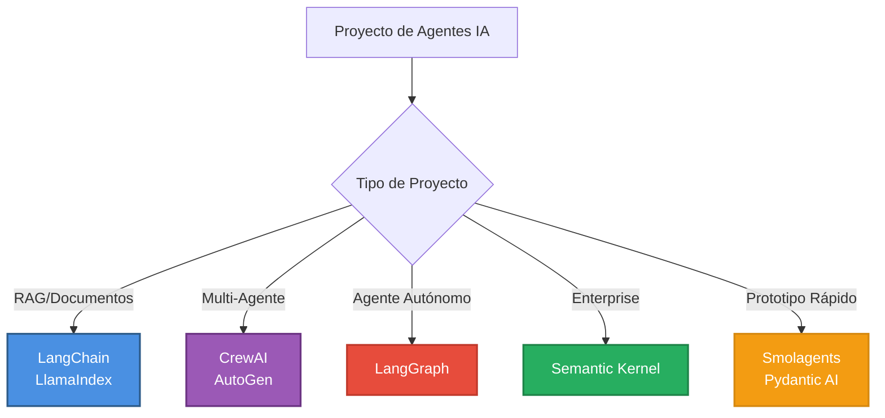
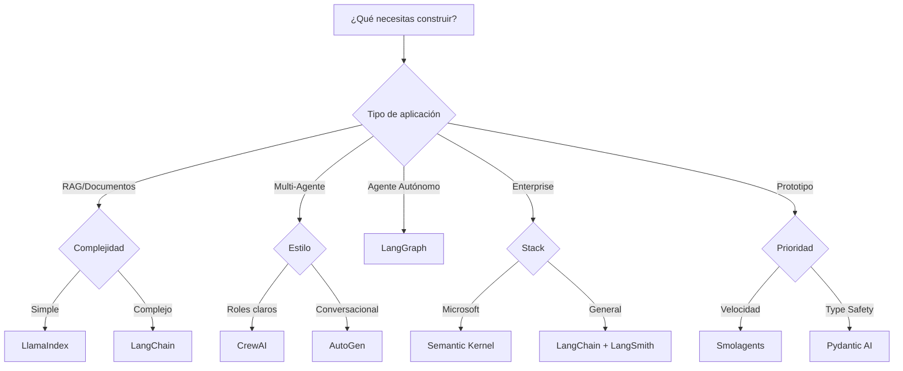

# 🛠️ Módulo 2: El Panorama de Frameworks para Agentes de IA




> *"No te cases con una herramienta. Un Ingeniero de IA profesional elige el framework adecuado para el problema adecuado."*

---

## 🎯 Visión General

En el Módulo 1 construimos agentes desde cero. En este módulo, exploraremos el **ecosistema de frameworks** que simplifican y potencian el desarrollo de agentes de IA. Cubriremos 8 frameworks principales con comparativas detalladas, casos de uso y ejemplos de código.

> [!NOTE]
> **Objetivo del Módulo**: Dominar la selección del framework correcto según el tipo de proyecto, entender las ventajas/desventajas de cada uno, y saber cuándo usar qué herramienta.

---

## 📊 Los 8 Frameworks Principales



---

## 📚 Tabla Comparativa de Alto Nivel

| Framework | Complejidad | Flexibilidad | Comunidad | Mejor Para | GitHub Stars |
|-----------|-------------|--------------|-----------|------------|--------------|
| **[LangChain](#1-langchain)** | Alta | ⭐⭐⭐⭐⭐ | ⭐⭐⭐⭐⭐ | RAG, Pipelines complejos | 106k+ |
| **[LangGraph](#2-langgraph)** | Alta | ⭐⭐⭐⭐⭐ | ⭐⭐⭐⭐ | Agentes autónomos, State machines | Parte de LangChain |
| **[CrewAI](#3-crewai)** | Media | ⭐⭐⭐ | ⭐⭐⭐ | Multi-agente, Roles claros | 25k+ |
| **[AutoGen](#4-autogen)** | Media | ⭐⭐⭐⭐ | ⭐⭐⭐⭐ | Conversaciones, Code execution | 43k+ |
| **[Semantic Kernel](#5-semantic-kernel)** | Media | ⭐⭐⭐⭐ | ⭐⭐⭐ | Enterprise, Microsoft stack | 22k+ |
| **[Smolagents](#6-smolagents)** | Baja | ⭐⭐ | ⭐⭐ | Prototipos, Simplicidad | Parte de HuggingFace |
| **[LlamaIndex](#7-llamaindex)** | Media | ⭐⭐⭐ | ⭐⭐⭐⭐ | RAG, Document Q&A | 38k+ |
| **[Pydantic AI](#8-pydantic-ai)** | Baja | ⭐⭐⭐ | ⭐⭐ | Type safety, Structured outputs | Nuevo (2024) |

---

## 1. LangChain

### 🎯 Filosofía
**"Swiss Army Knife"** - Toolkit modular y flexible para aplicaciones LLM

### 📖 Descripción
LangChain es el framework más maduro y establecido para construir aplicaciones con LLMs. Ofrece un ecosistema completo con componentes modulares, integraciones masivas (100+) y herramientas de producción.

### ✅ Ventajas
- **Ecosistema completo**: LangChain, LangGraph, LangSmith, LangServe
- **Integraciones masivas**: Más de 100 integraciones con modelos, vectorstores, APIs
- **Documentación extensa**: Miles de ejemplos y tutoriales
- **Comunidad activa**: 106k+ estrellas en GitHub
- **Production-ready**: Herramientas para deployment, monitoring, evaluación

### ❌ Desventajas
- **Curva de aprendizaje empinada**: Muchos conceptos y abstracciones
- **Boilerplate**: Más código para casos simples
- **API cambiante**: Actualizaciones frecuentes pueden romper código
- **Overkill para proyectos simples**: Puede ser demasiado para casos básicos

### 💻 Ejemplo de Código

```python
"""
Ejemplo: Pipeline RAG básico con LangChain
Framework: LangChain 0.1+
Objetivo: Sistema de Q&A sobre documentos
"""

from langchain_openai import ChatOpenAI, OpenAIEmbeddings
from langchain_chroma import Chroma
from langchain_core.prompts import ChatPromptTemplate
from langchain_core.output_parsers import StrOutputParser
from langchain_core.runnables import RunnablePassthrough

# 1. Setup componentes
llm = ChatOpenAI(model="gpt-4o-mini")
embeddings = OpenAIEmbeddings()

# 2. Crear vectorstore
documents = ["LangChain simplifica el desarrollo de aplicaciones LLM"]
vectorstore = Chroma.from_texts(documents, embeddings)
retriever = vectorstore.as_retriever()

# 3. Crear prompt template
template = """Responde la pregunta basándote en el contexto:

Contexto: {context}

Pregunta: {question}

Respuesta:"""

prompt = ChatPromptTemplate.from_template(template)

# 4. LCEL Chain (LangChain Expression Language)
chain = (
    {"context": retriever, "question": RunnablePassthrough()}
    | prompt
    | llm
    | StrOutputParser()
)

# 5. Ejecutar
result = chain.invoke("¿Qué es LangChain?")
print(result)
```

### 🎯 Casos de Uso Ideales
- **RAG systems complejos** con múltiples fuentes de datos
- **Pipelines de procesamiento** de documentos
- **Aplicaciones que necesitan muchas integraciones**
- **Proyectos que requieren observabilidad** (LangSmith)

### 📚 Referencias
- **Documentación oficial**: https://python.langchain.com/docs/
- **GitHub**: https://github.com/langchain-ai/langchain
- **Actualizaciones 2024**: Nuevo `create_agent`, middlewares prebuilt, LangGraph Cloud

---

## 2. LangGraph

### 🎯 Filosofía
**"State Machines for LLMs"** - Grafos de estado para flujos complejos

### 📖 Descripción
LangGraph extiende LangChain para crear agentes con flujos de control complejos usando grafos de estado. Ideal para agentes autónomos que necesitan loops, condicionales y state management robusto.

### ✅ Ventajas
- **Control total sobre flujo**: Loops, condicionales, branches
- **State management robusto**: Checkpointing y persistencia
- **Human-in-the-loop nativo**: Breakpoints y aprobaciones
- **Debugging visual**: Visualización de grafos
- **Streaming**: Soporte para streaming de estado y tokens

### ❌ Desventajas
- **Más complejo que chains**: Requiere pensar en grafos
- **Curva de aprendizaje**: Conceptos adicionales sobre LangChain
- **Documentación en evolución**: Menos ejemplos que LangChain base

### 💻 Ejemplo de Código

```python
"""
Ejemplo: Agente con ReAct pattern usando LangGraph
Framework: LangGraph
Objetivo: Agente que razona y actúa en loops
"""

from langgraph.graph import StateGraph, END
from langgraph.prebuilt import create_react_agent
from langchain_openai import ChatOpenAI
from langchain_core.tools import tool
from typing import TypedDict, Annotated
import operator

# 1. Definir herramientas
@tool
def search_web(query: str) -> str:
    """Busca información en la web"""
    return f"Resultados para: {query}"

@tool
def calculate(expression: str) -> float:
    """Calcula expresiones matemáticas"""
    return eval(expression)

# 2. Definir estado
class AgentState(TypedDict):
    messages: Annotated[list, operator.add]
    next_action: str

# 3. Crear agente ReAct con LangGraph
llm = ChatOpenAI(model="gpt-4o-mini")
tools = [search_web, calculate]

# Usar agente prebuilt de LangGraph
agent = create_react_agent(llm, tools)

# 4. Ejecutar
inputs = {"messages": [("user", "¿Cuál es 25 * 4 y busca información sobre Python?")]}
result = agent.invoke(inputs)

for message in result["messages"]:
    print(f"{message.type}: {message.content}")
```

### 🎯 Casos de Uso Ideales
- **Agentes autónomos** con múltiples pasos de razonamiento
- **Workflows con decisiones condicionales**
- **Sistemas que necesitan retry logic**
- **Aplicaciones con human-in-the-loop**

### 📚 Referencias
- **Documentación oficial**: https://langchain-ai.github.io/langgraph/
- **GitHub**: Parte de LangChain
- **Actualizaciones 2024**: LangGraph Cloud (beta), ReAct agent prebuilt, streaming mejorado

---

## 3. CrewAI

### 🎯 Filosofía
**"Role-Based Multi-Agent"** - Equipos de agentes especializados

### 📖 Descripción
CrewAI simplifica la creación de sistemas multi-agente donde cada agente tiene un rol, objetivo y backstory específicos. Ideal para workflows colaborativos tipo "equipo de trabajo".

### ✅ Ventajas
- **Muy intuitivo**: Abstracción de alto nivel
- **Menos código**: Para casos multi-agente comunes
- **Roles claros**: Fácil de conceptualizar (Investigador, Escritor, etc.)
- **Procesos flexibles**: Sequential, Hierarchical, Hybrid
- **Memoria compartida**: Los agentes comparten contexto

### ❌ Desventajas
- **Menos flexible que LangChain**: Opinado (opinionated)
- **Menos integraciones**: Ecosistema más pequeño
- **Comunidad más pequeña**: Menos recursos y ejemplos
- **Limitado para non-multi-agent**: No ideal para agentes individuales

### 💻 Ejemplo de Código

```python
"""
Ejemplo: Equipo de investigación y escritura con CrewAI
Framework: CrewAI
Objetivo: Sistema multi-agente colaborativo
"""

from crewai import Agent, Task, Crew, Process

# 1. Definir agentes con roles
investigador = Agent(
    role='Investigador Senior',
    goal='Descubrir información relevante y precisa',
    backstory="""Eres un investigador experto con años de experiencia
    en búsqueda y análisis de información. Tu especialidad es encontrar
    fuentes confiables y extraer insights valiosos.""",
    verbose=True,
    allow_delegation=False
)

escritor = Agent(
    role='Escritor Técnico',
    goal='Crear contenido claro y enganchante',
    backstory="""Eres un escritor profesional especializado en
    transformar información compleja en contenido accesible y
    atractivo para audiencias diversas.""",
    verbose=True,
    allow_delegation=False
)

# 2. Definir tareas
tarea_investigacion = Task(
    description="""Investiga sobre los frameworks de agentes de IA más
    populares en 2024. Enfócate en LangChain, CrewAI y AutoGen.""",
    agent=investigador,
    expected_output="Reporte detallado con hallazgos clave"
)

tarea_escritura = Task(
    description="""Usando la investigación, escribe un artículo de blog
    de 500 palabras comparando los frameworks. Debe ser técnico pero
    accesible.""",
    agent=escritor,
    expected_output="Artículo de blog completo"
)

# 3. Formar el equipo (Crew)
crew = Crew(
    agents=[investigador, escritor],
    tasks=[tarea_investigacion, tarea_escritura],
    process=Process.sequential,  # Tareas en secuencia
    verbose=True
)

# 4. Ejecutar
resultado = crew.kickoff()
print(resultado)
```

### 🎯 Casos de Uso Ideales
- **Equipos de agentes colaborativos**
- **Workflows de investigación + escritura**
- **Proyectos con roles bien definidos**
- **Automatización de procesos empresariales**

### 📚 Referencias
- **Documentación oficial**: https://docs.crewai.com/
- **GitHub**: https://github.com/joaomdmoura/crewAI
- **Actualizaciones 2024**: Flows para orquestación avanzada, integración con LangGraph

---

## 4. AutoGen

### 🎯 Filosofía
**"Conversational Agents"** - Agentes que conversan entre sí

### 📖 Descripción
AutoGen (Microsoft) facilita la creación de sistemas multi-agente basados en conversaciones. Destaca por su soporte para code execution y el patrón UserProxy.

### ✅ Ventajas
- **Respaldado por Microsoft**: Soporte enterprise
- **Code execution nativo**: Ejecuta código Python automáticamente
- **Conversaciones complejas**: Group chat, multi-agente
- **AutoGen Studio**: GUI sin código para prototipos
- **Soporte multi-lenguaje**: Python y .NET

### ❌ Desventajas
- **Documentación menos extensa**: Comparado con LangChain
- **Puede ser verboso**: Configuración detallada requerida
- **Menos integraciones**: Ecosistema más limitado

### 💻 Ejemplo de Código

```python
"""
Ejemplo: Agente conversacional con code execution
Framework: AutoGen v0.4
Objetivo: Agente que genera y ejecuta código
"""

from autogen import AssistantAgent, UserProxyAgent, config_list_from_json

# 1. Configurar modelos
config_list = [
    {
        "model": "gpt-4o-mini",
        "api_key": "your-api-key"
    }
]

llm_config = {
    "config_list": config_list,
    "temperature": 0
}

# 2. Crear agente asistente
assistant = AssistantAgent(
    name="assistant",
    llm_config=llm_config,
    system_message="""Eres un asistente de programación Python.
    Ayudas a escribir código limpio y eficiente."""
)

# 3. Crear user proxy (ejecuta código)
user_proxy = UserProxyAgent(
    name="user_proxy",
    human_input_mode="NEVER",  # Automático
    max_consecutive_auto_reply=10,
    code_execution_config={
        "work_dir": "coding",
        "use_docker": False  # Cambiar a True en producción
    }
)

# 4. Iniciar conversación
user_proxy.initiate_chat(
    assistant,
    message="""Escribe una función Python que calcule los primeros
    N números de Fibonacci y pruébala con N=10"""
)
```

### 🎯 Casos de Uso Ideales
- **Agentes que necesitan conversar**
- **Code generation y execution**
- **Debugging asistido por IA**
- **Aplicaciones enterprise con Microsoft stack**

### 📚 Referencias
- **Documentación oficial**: https://microsoft.github.io/autogen/
- **GitHub**: https://github.com/microsoft/autogen
- **Actualizaciones 2024**: AutoGen v0.4 (rediseño completo), arquitectura asíncrona

---

## 5. Semantic Kernel

### 🎯 Filosofía
**"Enterprise-Ready AI"** - Framework de Microsoft para producción

### 📖 Descripción
Semantic Kernel es el framework enterprise de Microsoft para integrar capacidades de IA en aplicaciones. Diseñado para escalabilidad, seguridad y compatibilidad con el ecosistema Microsoft.

### ✅ Ventajas
- **Respaldo de Microsoft**: Soporte enterprise
- **Multi-lenguaje**: C#, Python, Java
- **Integraciones enterprise**: Azure, Microsoft Graph
- **Patterns bien documentados**: Plugins, Planners, Memory
- **Seguridad**: Built-in security features

### ❌ Desventajas
- **Más verboso**: Comparado con frameworks Python-first
- **Comunidad Python más pequeña**: Orientado a .NET
- **Curva de aprendizaje**: Conceptos enterprise

### 💻 Ejemplo de Código

```python
"""
Ejemplo: Plugin básico con Semantic Kernel
Framework: Semantic Kernel (Python)
Objetivo: Crear un plugin reutilizable
"""

import semantic_kernel as sk
from semantic_kernel.connectors.ai.open_ai import OpenAIChatCompletion

# 1. Crear kernel
kernel = sk.Kernel()

# 2. Agregar servicio de IA
kernel.add_service(
    OpenAIChatCompletion(
        service_id="default",
        ai_model_id="gpt-4o-mini",
        api_key="your-api-key"
    )
)

# 3. Definir plugin como función
@kernel.function(
    name="get_weather",
    description="Obtiene el clima de una ciudad"
)
def get_weather(city: str) -> str:
    """Simula obtener el clima"""
    return f"El clima en {city} es soleado, 25°C"

# 4. Registrar plugin
kernel.add_plugin(
    plugin_name="WeatherPlugin",
    functions=[get_weather]
)

# 5. Usar el plugin
result = kernel.invoke(
    function_name="get_weather",
    plugin_name="WeatherPlugin",
    city="Madrid"
)

print(result)
```

### 🎯 Casos de Uso Ideales
- **Aplicaciones enterprise**
- **Integración con Microsoft ecosystem** (Azure, Office 365)
- **Proyectos multi-lenguaje**
- **Aplicaciones que requieren compliance**

### 📚 Referencias
- **Documentación oficial**: https://learn.microsoft.com/en-us/semantic-kernel/
- **GitHub**: https://github.com/microsoft/semantic-kernel
- **Actualizaciones 2024**: Documentación renovada, nuevos conceptos, Agents page

---

## 6. Smolagents

### 🎯 Filosofía
**"Lightweight & Fast"** - Agentes minimalistas de HuggingFace

### 📖 Descripción
Smolagents es un framework ligero de HuggingFace enfocado en simplicidad y eficiencia. Usa "Code Agents" donde los agentes escriben y ejecutan código Python.

### ✅ Ventajas
- **Muy ligero**: ~1000 líneas de código core
- **Rápido de aprender**: API simple
- **Code agents**: Agentes escriben Python directamente
- **Model agnostic**: Funciona con cualquier LLM
- **Integración HuggingFace**: Acceso al Hub

### ❌ Desventajas
- **Menos features**: Comparado con frameworks completos
- **Comunidad pequeña**: Menos recursos
- **Documentación limitada**: Framework nuevo
- **No ideal para producción compleja**: Mejor para prototipos

### 💻 Ejemplo de Código

```python
"""
Ejemplo: Code Agent con Smolagents
Framework: Smolagents (HuggingFace)
Objetivo: Agente que escribe y ejecuta código
"""

from smolagents import CodeAgent, HfApiModel, DuckDuckGoSearchTool

# 1. Configurar modelo
model = HfApiModel(model_id="Qwen/Qwen2.5-Coder-32B-Instruct")

# 2. Configurar herramientas
tools = [DuckDuckGoSearchTool()]

# 3. Crear agente
agent = CodeAgent(
    tools=tools,
    model=model,
    max_steps=10
)

# 4. Ejecutar tarea
result = agent.run(
    "Busca información sobre los frameworks de agentes de IA más populares"
)

print(result)
```

### 🎯 Casos de Uso Ideales
- **Prototipos rápidos**
- **Agentes simples**
- **Proyectos con restricciones de recursos**
- **Experimentación con code agents**

### 📚 Referencias
- **Documentación oficial**: https://huggingface.co/docs/smolagents
- **GitHub**: Parte de HuggingFace
- **Características**: Code agents, sandboxed execution, model agnostic

---

## 7. LlamaIndex

### 🎯 Filosofía
**"Data Framework for LLMs"** - Especializado en RAG y datos

### 📖 Descripción
LlamaIndex (antes GPT Index) es el framework líder para construir aplicaciones RAG. Ofrece data connectors, indices y query engines optimizados para búsqueda semántica.

### ✅ Ventajas
- **Mejor para RAG**: Diseñado específicamente para RAG
- **Data connectors**: 100+ conectores (APIs, DBs, PDFs)
- **Optimizado para búsqueda**: Indices y retrievers avanzados
- **Documentación clara**: Excelentes tutoriales RAG
- **Composable retrievers**: Técnicas RAG avanzadas

### ❌ Desventajas
- **Menos flexible para non-RAG**: Enfocado en RAG
- **Overlap con LangChain**: Funcionalidad similar
- **Comunidad más pequeña**: Comparado con LangChain

### 💻 Ejemplo de Código

```python
"""
Ejemplo: RAG system con LlamaIndex
Framework: LlamaIndex
Objetivo: Sistema de Q&A sobre documentos
"""

from llama_index.core import VectorStoreIndex, SimpleDirectoryReader
from llama_index.core import Settings
from llama_index.llms.openai import OpenAI
from llama_index.embeddings.openai import OpenAIEmbedding

# 1. Configurar settings globales
Settings.llm = OpenAI(model="gpt-4o-mini")
Settings.embed_model = OpenAIEmbedding(model="text-embedding-3-small")

# 2. Cargar documentos
documents = SimpleDirectoryReader("./data").load_data()

# 3. Crear índice
index = VectorStoreIndex.from_documents(documents)

# 4. Crear query engine
query_engine = index.as_query_engine(
    similarity_top_k=3,
    response_mode="compact"
)

# 5. Hacer queries
response = query_engine.query("¿Qué frameworks de IA existen?")
print(response)

# Ver fuentes
for node in response.source_nodes:
    print(f"Score: {node.score:.2f}")
    print(f"Text: {node.text[:100]}...")
```

### 🎯 Casos de Uso Ideales
- **RAG systems**
- **Document Q&A**
- **Knowledge bases**
- **Semantic search applications**

### 📚 Referencias
- **Documentación oficial**: https://docs.llamaindex.ai/
- **GitHub**: https://github.com/run-llama/llama_index
- **Actualizaciones 2024**: RankGPT, Composable Retrievers, mejoras en RAG

---

## 8. Pydantic AI

### 🎯 Filosofía
**"Type-Safe Agents"** - Agentes con validación de tipos

### 📖 Descripción
Pydantic AI (2024) es un framework nuevo del equipo de Pydantic enfocado en type safety y structured outputs. Usa Pydantic models para validación robusta.

### ✅ Ventajas
- **Type safety**: Validación estática con mypy/pyright
- **Structured outputs**: Pydantic models garantizan estructura
- **API limpia**: Pythonic y moderna
- **Dependency injection**: Type-safe DI system
- **Menos errores**: Catch errors antes de runtime

### ❌ Desventajas
- **Muy nuevo**: Lanzado en 2024
- **Comunidad pequeña**: Pocos recursos aún
- **Features limitados**: Comparado con frameworks maduros
- **Documentación en crecimiento**: Aún en desarrollo

### 💻 Ejemplo de Código

```python
"""
Ejemplo: Agente type-safe con Pydantic AI
Framework: Pydantic AI
Objetivo: Structured output con validación
"""

from pydantic import BaseModel, Field
from pydantic_ai import Agent
from pydantic_ai.models.openai import OpenAIModel

# 1. Definir modelo de salida con Pydantic
class FrameworkComparison(BaseModel):
    """Comparación estructurada de frameworks"""
    framework_name: str = Field(description="Nombre del framework")
    best_for: str = Field(description="Para qué es mejor")
    complexity: int = Field(ge=1, le=5, description="Complejidad 1-5")
    github_stars: int = Field(description="Estrellas en GitHub")

# 2. Crear agente con output type
model = OpenAIModel("gpt-4o-mini")

agent = Agent(
    model=model,
    result_type=FrameworkComparison,
    system_prompt="""Eres un experto en frameworks de agentes de IA.
    Proporciona comparaciones precisas y estructuradas."""
)

# 3. Ejecutar con type safety
result = agent.run_sync("Compara LangChain")

# 4. Result es type-safe (FrameworkComparison)
print(f"Framework: {result.data.framework_name}")
print(f"Mejor para: {result.data.best_for}")
print(f"Complejidad: {result.data.complexity}/5")
print(f"Stars: {result.data.github_stars:,}")

# mypy/pyright validarán los tipos!
```

### 🎯 Casos de Uso Ideales
- **Aplicaciones que requieren type safety**
- **Structured data extraction**
- **Proyectos con validación estricta**
- **Teams que usan mypy/pyright**

### 📚 Referencias
- **Documentación oficial**: https://ai.pydantic.dev/
- **GitHub**: https://github.com/pydantic/pydantic-ai
- **Lanzamiento**: 2024 (muy nuevo)

---

## 🎯 Matriz de Decisión

### ¿Cuándo usar cada framework?



### Tabla de Decisión Detallada

| Si necesitas... | Usa... | Por qué... |
|-----------------|--------|------------|
| **RAG sobre documentos** | LlamaIndex o LangChain | Optimizados para retrieval semántico |
| **Equipo de agentes colaborando** | CrewAI | Abstracción role-based intuitiva |
| **Agentes conversando** | AutoGen | Soporte nativo para multi-agent chat |
| **Flujos complejos con loops** | LangGraph | State machines y control de flujo |
| **Integración Microsoft** | Semantic Kernel | Diseñado para Azure y .NET |
| **Prototipo rápido** | Smolagents | Mínimo boilerplate |
| **Type safety estricto** | Pydantic AI | Validación de tipos en compile-time |
| **Máxima flexibilidad** | LangChain | Más componentes y opciones |

---

## 💻 Proyectos Prácticos

### 🟢 Nivel Básico: "Hello World" en 4 Frameworks
**Archivo:** `examples/basic/01_framework_comparison.py`

Implementar la misma funcionalidad (generador de texto estructurado) en LangChain, CrewAI, AutoGen y Pydantic AI para comparar sintaxis.

### 🟡 Nivel Intermedio: Benchmark de Performance
**Archivo:** `examples/intermediate/02_framework_benchmark.py`

Medir latencia, costo y complejidad de código para una tarea estándar (RAG Q&A) en múltiples frameworks.

### 🔴 Nivel Avanzado: Meta-Router Inteligente
**Archivo:** `examples/advanced/03_smart_framework_router.py`

Sistema que analiza la query del usuario y automáticamente selecciona el framework más apropiado para ejecutarla.

---

## 📊 Comparación de Características

| Característica | LangChain | LangGraph | CrewAI | AutoGen | Semantic Kernel | Smolagents | LlamaIndex | Pydantic AI |
|----------------|-----------|-----------|--------|---------|-----------------|------------|------------|-------------|
| **RAG** | ⭐⭐⭐⭐⭐ | ⭐⭐⭐⭐ | ⭐⭐⭐ | ⭐⭐⭐ | ⭐⭐⭐ | ⭐⭐ | ⭐⭐⭐⭐⭐ | ⭐⭐⭐ |
| **Multi-Agent** | ⭐⭐⭐ | ⭐⭐⭐⭐ | ⭐⭐⭐⭐⭐ | ⭐⭐⭐⭐⭐ | ⭐⭐⭐ | ⭐⭐ | ⭐⭐ | ⭐⭐ |
| **State Management** | ⭐⭐⭐ | ⭐⭐⭐⭐⭐ | ⭐⭐⭐ | ⭐⭐⭐⭐ | ⭐⭐⭐⭐ | ⭐⭐ | ⭐⭐⭐ | ⭐⭐⭐ |
| **Code Execution** | ⭐⭐ | ⭐⭐ | ⭐⭐ | ⭐⭐⭐⭐⭐ | ⭐⭐⭐ | ⭐⭐⭐⭐⭐ | ⭐⭐ | ⭐⭐ |
| **Type Safety** | ⭐⭐ | ⭐⭐ | ⭐⭐ | ⭐⭐ | ⭐⭐⭐ | ⭐⭐ | ⭐⭐ | ⭐⭐⭐⭐⭐ |
| **Documentación** | ⭐⭐⭐⭐⭐ | ⭐⭐⭐⭐ | ⭐⭐⭐⭐ | ⭐⭐⭐⭐ | ⭐⭐⭐⭐ | ⭐⭐⭐ | ⭐⭐⭐⭐⭐ | ⭐⭐⭐ |
| **Comunidad** | ⭐⭐⭐⭐⭐ | ⭐⭐⭐⭐ | ⭐⭐⭐ | ⭐⭐⭐⭐ | ⭐⭐⭐ | ⭐⭐ | ⭐⭐⭐⭐ | ⭐⭐ |
| **Curva Aprendizaje** | Alta | Alta | Media | Media | Media | Baja | Media | Baja |

---

## 🎓 Mejores Prácticas

### 1. **No uses un framework para todo**
- Combina frameworks según necesidades
- Ejemplo: LangChain para RAG + CrewAI para multi-agente

### 2. **Empieza simple**
- Prototipar con Smolagents o Pydantic AI
- Migrar a LangChain/LangGraph cuando necesites más features

### 3. **Considera el ecosistema**
- LangChain tiene LangSmith (observabilidad)
- AutoGen tiene AutoGen Studio (GUI)
- Semantic Kernel tiene integración Azure

### 4. **Evalúa el costo de mantenimiento**
- Frameworks nuevos cambian rápido
- LangChain tiene breaking changes frecuentes
- Semantic Kernel es más estable (enterprise)

### 5. **Mide antes de optimizar**
- Usa benchmarks para decisiones
- No asumas que un framework es "más rápido"

---

## 📚 Recursos Adicionales

### Artículos Comparativos
- [Bright Data: 12 Frameworks de Agentes IA 2025](https://brightdata.es/blog/ai/best-ai-agent-frameworks)
- [Analytics Vidhya: Top 7 Frameworks 2025](https://www.analyticsvidhya.com/blog/2024/07/ai-agent-frameworks/)

### Documentación Oficial
- **LangChain**: https://python.langchain.com/docs/
- **LangGraph**: https://langchain-ai.github.io/langgraph/
- **CrewAI**: https://docs.crewai.com/
- **AutoGen**: https://microsoft.github.io/autogen/
- **Semantic Kernel**: https://learn.microsoft.com/semantic-kernel/
- **Smolagents**: https://huggingface.co/docs/smolagents
- **LlamaIndex**: https://docs.llamaindex.ai/
- **Pydantic AI**: https://ai.pydantic.dev/

---

## 🚀 Próximos Pasos

Una vez que domines la selección de frameworks, estarás listo para:

1. ✅ Elegir el framework correcto para cada proyecto
2. ✅ Combinar frameworks para soluciones híbridas
3. ✅ Optimizar costos usando el framework apropiado
4. ✅ Construir sistemas de producción robustos

### Continúa tu Aprendizaje

➡️ **[Módulo 3: Patrones Cognitivos](../module3/README.md)** - Aprende patrones avanzados como ReAct, Reflexion y Chain-of-Thought

---

<div align="center">

**[⬅️ Módulo Anterior](../module1/README.md)** | **[🏠 Inicio](../README.md)** | **[Siguiente Módulo ➡️](../module3/README.md)**

</div>

---

## 📝 Referencias Bibliográficas

1. **LangChain Official Documentation** (2024). "LangChain: Building applications with LLMs". https://python.langchain.com/docs/
2. **Microsoft Research** (2024). "AutoGen: Enabling Next-Gen LLM Applications". https://microsoft.com/en-us/research/project/autogen/
3. **CrewAI Documentation** (2024). "CrewAI: Multi-Agent Framework". https://docs.crewai.com/
4. **HuggingFace** (2024). "Smolagents: Lightweight AI Agents". https://huggingface.co/docs/smolagents
5. **Pydantic** (2024). "Pydantic AI: Type-safe Agent Framework". https://ai.pydantic.dev/
6. **Bright Data** (2025). "Los 12 principales marcos de agentes de IA en 2025". https://brightdata.es/blog/ai/best-ai-agent-frameworks
7. **Analytics Vidhya** (2024). "Top 7 Frameworks for Building AI Agents in 2025". https://www.analyticsvidhya.com/blog/2024/07/ai-agent-frameworks/

**Última actualización:** Noviembre 2024  
**Frameworks cubiertos:** LangChain 0.1+, AutoGen v0.4, CrewAI, LangGraph, Semantic Kernel, Smolagents, LlamaIndex, Pydantic AI
