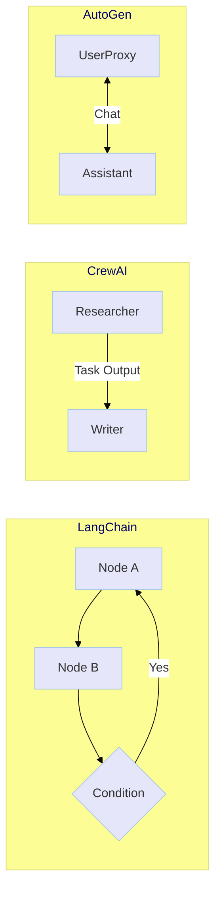

# 🛠️ Módulo 2: El Panorama de Frameworks (The Landscape)

> *"No te cases con una herramienta. Un Ingeniero de IA profesional elige el framework adecuado para el problema adecuado. LangChain para control, CrewAI para roles, AutoGen para conversación."*

---

## 🌸 Introducción

En el Módulo 1 construimos agentes desde cero. En el Módulo 2, exploraremos los **Gigantes del Ecosistema**. No todos los frameworks son iguales. Algunos son "cajas de herramientas" flexibles (LangChain) y otros son "fábricas de agentes" opinadas (CrewAI).

### ¿Qué aprenderás?
1.  **Orquestación:** Cómo coordinar múltiples LLMs y herramientas.
2.  **Gestión de Estado:** La diferencia entre un script stateless y un grafo con memoria.
3.  **DX (Developer Experience):** Comparativa práctica de sintaxis y boilerplate.

---

## 📚 Conceptos Fundamentales

### 1. Orquestación (The Conductor) 🎼
Es el arte de manejar el flujo de información entre el usuario, el LLM y las herramientas.
*   **Cadenas (Chains):** Secuencias lineales (A -> B -> C).
*   **Grafos (Graphs):** Flujos cíclicos y condicionales (LangGraph).
*   **Chats (Conversations):** Múltiples agentes hablando entre sí (AutoGen).

### 2. Estado (State) 💾
La memoria de corto plazo de tu aplicación.
*   **Stateless:** Cada llamada es nueva (API REST estándar).
*   **Stateful:** El sistema recuerda pasos previos, errores y resultados intermedios para tomar decisiones futuras.

### 3. Prompts as Code 📝
Tratar los prompts no como strings mágicos, sino como objetos versionables, testables y modulares.

---

## 🧪 Proyectos Prácticos

### 🟢 Nivel Básico: Comparativa de Sintaxis (The Rosetta Stone)
**Archivo:** [01_basic_syntax_comparison.py](01_basic_syntax_comparison.py)

Implementaremos la **misma funcionalidad** (un generador de datos estructurados) usando dos paradigmas opuestos:
1.  **LangChain (LCEL):** Explícito, modular, basado en pipes `|`.
2.  **Google GenAI SDK:** Nativo, directo, "pythonic".

> **Objetivo:** Entender qué abstracción prefieres para tareas simples.

---

### 🟡 Nivel Intermedio: Benchmark Paralelo (The Arena)
**Archivo:** [02_intermediate_parallel_benchmark.py](02_intermediate_parallel_benchmark.py)

¿Qué modelo es más rápido? ¿Cuál es más barato?
Crearemos un script que lanza **peticiones asíncronas** a múltiples proveedores (OpenAI vs Google Gemini) simultáneamente.
*   Mediremos **Latencia** (Time to First Token).
*   Mediremos **Coste** estimado.
*   Usaremos `asyncio` para concurrencia real.

> **Objetivo:** Ingeniería de producción básica. No basta con que funcione, tiene que ser eficiente.

---

### 🔴 Nivel Avanzado: El Enrutador Inteligente (The Smart Router)
**Archivo:** [03_advanced_smart_router.py](03_advanced_smart_router.py)

Un **Meta-Agente** que decide qué framework/modelo usar según la complejidad de la tarea.
*   Si el usuario pide "Resume esto" -> **Ruta Rápida** (GPT-4o-mini directo).
*   Si el usuario pide "Investiga y escribe un blog" -> **Ruta Compleja** (CrewAI con GPT-4o).
*   Implementaremos un clasificador de intención usando `Pydantic`.

> **Objetivo:** Optimización de costes y recursos en sistemas grandes.

---

## 🚀 Siguientes Pasos
Ejecuta [01_basic_syntax_comparison.py](01_basic_syntax_comparison.py) y observa las diferencias de estilo.

---

<a href="../module3/README.md">➡️ Siguiente Módulo: Patrones Cognitivos</a>

