```mermaid
graph LR
    A[Problema Complex] --> B[PHASE 1: Planning]
    B --> C[Plan Completo:\n1. Paso A\n2. Paso B\n3. Paso C]
    C --> D[PHASE 2: Solving]
    D --> E[Ejecutar Paso 1]
    E --> F[Ejecutar Paso 2]
    F --> G[Ejecutar Paso 3]
    G --> H[Solución Final]
    
    style B fill:#4ECDC4
    style D fill:#FF6B6B
```

```mermaid
graph TD
    A[Query Usuario] --> B[Router Agent]
    B --> C{¿Qué fuente?}
    C -->|Docs técnicos| D[Vector DB]
    C -->|Datos tiempo real| E[Web Search]
    C -->|Conocimiento general| F[LLM Directo]
    
    A --> G[Query Planning Agent]
    G --> H[Sub-query 1]
    G --> I[Sub-query 2]
    G --> J[Sub-query 3]
    
    D --> K[Synthesis Agent]
    E --> K
    H --> K
    I --> K
    J --> K
    
    K --> L[Respuesta Final]
```

# Módulo 3: Arquitecturas Cognitivas y Patrones de Diseño


> *"Un LLM por sí solo es solo un predictor de texto. Una arquitectura cognitiva es la estructura que le permite razonar, planificar y autocorregirse."*

---

## 🎯 Visión General

Las arquitecturas cognitivas y patrones de diseño son las **decisiones fundamentales** que determinan cómo tu agente piensa, actúa y se corrige. En este módulo, cubriremos 15 arquitecturas profesionales divididas en tres categorías:

- **Parte I**: Arquitecturas Cognitivas Generales (7 patrones)
- **Parte II**: Arquitecturas RAG Avanzadas (6 patrones)  
- **Parte III**: Patrones Autónomos (2 patrones)

> [!IMPORTANT]
> **Objetivo**: Dominar la selección de la arquitectura correcta según el tipo de problema. Una mala elección arquitectónica puede multiplicar costos 10x o reducir accuracy 50%.

---

## 📊 Mapa de Arquitecturas


---

## 📚 Tabla Comparativa de Alto Nivel

| Arquitectura | Complejidad | Accuracy | Costo | Latencia | Mejor Para |
|--------------|-------------|----------|-------|----------|------------|
| **[ReAct](#1-react-reason--act)** | Media | ⭐⭐⭐ | Media | Media | Multi-step tasks con herramientas |
| **[Reflexion](#2-reflexion-self-correction)** | Alta | ⭐⭐⭐⭐ | Alta | Alta | Code gen, mejora iterativa |
| **[LATS](#3-lats-language-agent-tree-search)** | Muy Alta | ⭐⭐⭐⭐⭐ | Muy Alta | Alta | Planning complejo, búsqueda |
| **[Tree of Thoughts](#4-tree-of-thoughts-tot)** | Alta | ⭐⭐⭐⭐ | Alta | Alta | Creative problem solving |
| **[Plan-and-Solve](#5-plan-and-solve)** | Media | ⭐⭐⭐⭐ | Media | Media | Workflows largos |
| **[Self-Consistency](#6-self-consistency)** | Baja | ⭐⭐⭐⭐ | Alta | Alta | High accuracy critical |
| **[Chain of Thought](#7-chain-of-thought-cot)** | Baja | ⭐⭐⭐ | Baja | Baja | Reasoning básico |
| **[Agentic RAG](#8-agentic-rag)** | Alta | ⭐⭐⭐⭐ | Alta | Media | Q&A complejo multi-fuente |
| **[Adaptive RAG](#9-adaptive-rag)** | Media | ⭐⭐⭐⭐ | Variable | Variable | Queries de complejidad mixta |
| **[Self-RAG](#10-self-reflective-rag-self-rag)** | Alta | ⭐⭐⭐⭐⭐ | Alta | Alta | High reliability needed |
| **[Corrective RAG](#11-corrective-rag-crag)** | Alta | ⭐⭐⭐⭐⭐ | Med-Alta | Media | Hallucination-sensitive |
| **[Speculative RAG](#12-speculative-rag)** | Alta | ⭐⭐⭐⭐ | Media | Baja | Speed + accuracy balance |
| **[Query Planning RAG](#13-query-planning-rag)** | Media | ⭐⭐⭐⭐ | Alta | Media | Complex multi-hop queries |
| **[AutoGPT](#14-autogpt-pattern)** | Alta | ⭐⭐⭐ | Alta | Media | Autonomous goal completion |
| **[BabyAGI](#15-babyagi-pattern)** | Media | ⭐⭐⭐ | Media | Media | Task management loops |

---

# Parte I: Arquitecturas Cognitivas Generales

---

## 1. ReAct (Reason + Act)

### 🎯 Filosofía
**"Pensamiento + Acción en Loop"** - El patrón fundacional que alterna entre razonamiento y ejecución.

### 📖 Descripción

ReAct (Reasoning and Acting) es la arquitectura base que combina pensamiento explícito con ejecución de acciones en un loop iterativo. Fue introducida en el paper "ReAct: Synergizing Reasoning and Acting in Language Models" (Yao et al., 2023).

**Concepto Clave**: En lugar de que el LLM genere una respuesta directamente, ReAct lo obliga a:
1. **Pensar** explícitamente sobre qué hacer
2. **Actuar** ejecutando herramientas
3. **Observar** los resultados
4. **Repetir** hasta resolver el problema

### 🔧 Componentes



```mermaid
graph LR
    A[Query Usuario] --> B[Thought: ¿Qué necesito hacer?]
    B --> C[Action: Ejecutar herramienta]
    C --> D[Observation: Ver resultado]
    D --> E{¿Objetivo logrado?}
    E -->|No| B
    E -->|Sí| F[Respuesta Final]
```

**Componentes:**
1. **Thought (Pensamiento)**: El LLM verbaliza su razonamiento
2. **Action (Acción)**: Ejecuta una herramienta específica con parámetros
3. **Observation (Observación)**: Resultado de la ejecución
4. **Loop Control**: Decide cuándo terminar

### ✅ Ventajas

- **Trazabilidad completa**: Cada paso es explicable
- **Recuperación de errores**: Puede corregir acciones fallidas
- **Tool integration natural**: Diseñado para usar herramientas
- **Debugging fácil**: Ver exactamente dónde falló

### ❌ Desventajas

- **Muchos LLM calls**: Uno por cada ciclo
- **Latencia acumulativa**: N iterations = N calls
- **Puede loops infinitos**: Necesita max_iterations
- **No explora alternativas**: Sigue un solo camino

### 💻 Ejemplo de Código

```python
"""
Ejemplo: ReAct Agent Básico
Framework: Custom (concepto aplicable a cualquier framework)
Objetivo: Resolver query con múltiples pasos
"""

from typing import List, Dict, Tuple
import re

class ReActAgent:
    def __init__(self, llm, tools: Dict):
        self.llm = llm
        self.tools = tools  # {"search": search_func, "calculate": calc_func}
        self.max_iterations = 5
    
    def run(self, query: str) -> str:
        """Ejecuta el loop ReAct"""
        history = [f"Question: {query}"]
        
        for iteration in range(self.max_iterations):
            # THOUGHT: El LLM genera pensamiento y posible acción
            prompt = self._build_prompt(history)
            response = self.llm.generate(prompt)
            
            # Verificar si es respuesta final
            if "FINAL ANSWER:" in response:
                return self._extract_answer(response)
            
            # Verificar si hay acción
            if "ACTION:" in response:
                thought, action, action_input = self._parse_response(response)
                
                # Registrar pensamiento
                history.append(f"Thought {iteration + 1}: {thought}")
                
                # OBSERVATION: Ejecutar acción y obtener resultado
                try:
                    observation = self._execute_action(action, action_input)
                    history.append(f"Action: {action}[{action_input}]")
                    history.append(f"Observation: {observation}")
                except Exception as e:
                    history.append(f"Observation: ERROR - {str(e)}")
            
            else:
                # Sin acción clara, forzar finalización
                history.append("Thought: No clear action, finalizing")
                break
        
        # Si alcanzamos max iterations
        final_prompt = f"{prompt}\n\nGenerate final answer based on observations"
        return self.llm.generate(final_prompt)
    
    def _build_prompt(self, history: List[str]) -> str:
        """Construye prompt con historial completo"""
        tools_desc = "\n".join([f"- {name}: {func.__doc__}" 
                                for name, func in self.tools.items()])
        
        return f"""You are a ReAct agent. Solve the question using this format:

Thought: [your reasoning about what to do next]
Action: [tool name]
Action Input: [input for the tool]
Observation: [result from tool]
... (repeat as needed)
Final Answer: [your final answer]

Available tools:
{tools_desc}

History:
{chr(10).join(history)}

What should you do next?"""
    
    def _parse_response(self, response: str) -> Tuple[str, str, str]:
        """Extrae pensamiento, acción e input"""
        # Extraer Thought
        thought_match = re.search(r'Thought: (.+?)(?=Action:|$)', response, re.DOTALL)
        thought = thought_match.group(1).strip() if thought_match else ""
        
        # Extraer Action
        action_match = re.search(r'Action: (.+?)(?=\n|$)', response)
        action = action_match.group(1).strip() if action_match else ""
        
        # Extraer Action Input
        input_match = re.search(r'Action Input: (.+?)(?=\n|$)', response)
        action_input = input_match.group(1).strip() if input_match else ""
        
        return thought, action, action_input
    
    def _execute_action(self, action: str, action_input: str) -> str:
        """Ejecuta la acción en la herramienta correspondiente"""
        if action not in self.tools:
            raise ValueError(f"Unknown tool: {action}")
        
        return self.tools[action](action_input)
    
    def _extract_answer(self, response: str) -> str:
        """Extrae respuesta final"""
        match = re.search(r'FINAL ANSWER: (.+)', response, re.DOTALL)
        return match.group(1).strip() if match else response


# ============================================================================
# Uso del Agente ReAct
# ============================================================================

# Definir herramientas
def search(query: str) -> str:
    """Search the web for information"""
    # Simulated
    knowledge = {
        "Python creator": "Guido van Rossum",
        "Python year": "1991"
    }
    for key, value in knowledge.items():
        if key.lower() in query.lower():
            return f"Found: {value}"
    return "No results"

def calculate(expression: str) -> str:
    """Evaluate mathematical expressions"""
    try:
        result = eval(expression)  # NOTA: No usar en producción sin sanitización
        return str(result)
    except:
        return "Invalid expression"

# Crear agente
tools = {"search": search, "calculate": calculate}
agent = ReActAgent(llm=your_llm, tools=tools)

# Ejecutar
result = agent.run("Who created Python and in what year? Also calculate 1991 + 33")
print(result)

# Output esperado:
# Thought 1: I need to find who created Python
# Action: search
# Action Input: Python creator
# Observation: Found: Guido van Rossum
# Thought 2: Now I need the year
# Action: search
# Action Input: Python year
# Observation: Found: 1991
# Thought 3: Finally, calculate 1991 + 33
# Action: calculate
# Action Input: 1991 + 33
# Observation: 2024
# FINAL ANSWER: Python was created by Guido van Rossum in 1991. 1991 + 33 = 2024.
```

### 🎯 Casos de Uso Ideales

1. **Investigación multi-paso**
   - Búsqueda web → Análisis → Síntesis
   - Ejemplo: "Research competitive landscape for product X"

2. **Tareas con herramientas**
   - Calculadora + búsqueda + API calls
   - Ejemplo: "Calculate ROI and find market data"

3. **Debugging y troubleshooting**
   - Diagnóstico iterativo
   - Ejemplo: "Debug why deployment failed"

4. **Data gathering workflows**
   - Múltiples fuentes → Consolidación
   - Ejemplo: "Gather pricing from 5 competitors"

### 🔄 Comparación con Alternativas

| vs Alternative | Ventaja ReAct | Desventaja ReAct |
|----------------|---------------|------------------|
| **vs Direct LLM** | Puede usar tools, trazable | Más lento, más costoso |
| **vs Reflexion** | Más simple, menos iterations | No self-corrects |
| **vs Plan-and-Solve** | Más flexible, adapta plan | Menos structured |
| **vs LATS** | Más simple, menos compute | No explora alternativas |

### 📚 Referencias

- **Paper Original**: "ReAct: Synergizing Reasoning and Acting in Language Models" (Yao et al., ICLR 2023)
- **ArXiv**: https://arxiv.org/abs/2210.03629
- **Frameworks con ReAct**: LangChain, LlamaIndex, CrewAI (built-in support)
- **Implementación LangChain**: `create_react_agent()`

---

## 2. Reflexion (Self-Correction)

### 🎯 Filosofía
**"Generar → Evaluar → Reflexionar → Mejorar"** - Agentes que aprenden de sus errores sin reentrenamiento.

### 📖 Descripción

Reflexion introduce un loop de auto-corrección donde el agente no solo genera una respuesta, sino que la evalúa críticamente, identifica fallos, y la mejora iterativamente. Inspirado en cómo los humanos aprenden de errores.

**Paper**: "Reflexion: Language Agents with Verbal Reinforcement Learning" (Shinn et al., NeurIPS 2023)

**Innovación Clave**: En lugar de reiniciar desde cero en cada intento, Reflexion **acumula reflexiones en memoria episódica** que guían intentos futuros.

### 🔧 Componentes


**Componentes Principales:**

1. **Actor (Generator)**: LLM que genera la solución
2. **Evaluator**: Evalúa la solución (puede ser:
   - Test cases (código)
   - Human feedback
   - LLM-as-Judge
   - External API)
3. **Self-Reflection**: LLM genera feedback verbal sobre el fallo
4. **Episodic Memory**: Almacena reflexiones pasadas
5. **Revisor**: Mejora el intento basándose en reflexiones

### ✅ Ventajas

- **Mejora sin fine-tuning**: Aprende en inference time
- **Memoria persistente**: Recordar errores pasados
- **Explicabilidad**: Reflexiones verbales claras
- **Sample efficiency**: Menos intentos que trial-and-error

### ❌ Desventajas

-  **Muy costoso**: 3-5x más LLM calls que simple generation
- **No garantiza convergencia**: Puede repetir errores
- **Requiere buen evaluator**: Garbage in, garbage out
- **Latencia alta**: Multiple iterations

### 💻 Ejemplo de Código

```python
"""
Ejemplo: Reflexion para Code Generation
Framework: Reflexion Architecture
Objetivo: Generar código Python que pase tests, mejorando iterativamente
"""

from typing import List, Tuple
import subprocess
import traceback

class ReflexionCodeAgent:
    def __init__(self, llm):
        self.llm = llm
        self.episodic_memory: List[str] = []
        self.max_attempts = 3
    
    def solve(self, task: str, tests: List[Tuple[str, str]]) -> str:
        """
        Genera código que pase tests usando reflexion
        
        Args:
            task: Descripción de la tarea
            tests: Lista de (input, expected_output)
        
        Returns:
            Código final (puede no ser 100% correcto)
        """
        for attempt in range(self.max_attempts):
            print(f"\n{'='*60}")
            print(f"Attempt {attempt + 1}/{self.max_attempts}")
            print(f"{'='*60}")
            
            # ACTOR: Generar código
            code = self._generate_code(task, attempt)
            print(f"Generated Code:\n{code}\n")
            
            # EVALUATOR: Ejecutar tests
            is_correct, feedback = self._evaluate_code(code, tests)
            
            if is_correct:
                print("✅ All tests passed!")
                return code
            
            # SELF-REFLECTION: Analizar por qué falló
            print(f"❌ Tests failed: {feedback}\n")
            reflection = self._reflect(task, code, feedback, attempt)
            print(f"Reflection:\n{reflection}\n")
            
            # Guardar en memoria episódica
            self.episodic_memory.append(
                f"Attempt {attempt + 1} failed because: {reflection}"
            )
        
        print(f"⚠️  Max attempts reached. Returning best effort.")
        return code
    
    def _generate_code(self, task: str, attempt_num: int) -> str:
        """ACTOR: Genera código usando contexto de intentos previos"""
        # Construir prompt con memoria episódica
        memory_context = ""
        if self.episodic_memory:
            memory_context = "\n\nPrevious attempts and learnings:\n" + \
                           "\n".join(self.episodic_memory)
        
        prompt = f"""You are an expert Python programmer.

Task: {task}

{memory_context}

Generate Python code that solves the task. Include only the code, no explanations.
If this is attempt {attempt_num + 1}, use the learnings above to avoid past mistakes.

Code:"""
        
        code = self.llm.generate(prompt)
        
        # Limpiar código (remover markdown, etc.)
        code = code.replace("```python", "").replace("```", "").strip()
        return code
    
    def _evaluate_code(self, code: str, tests: List[Tuple]) -> Tuple[bool, str]:
        """EVALUATOR: Ejecuta tests y retorna resultado"""
        passed = 0
        failed = 0
        error_messages = []
        
        for test_input, expected_output in tests:
            try:
                # Crear entorno de ejecución
                local_scope = {}
                exec(code, local_scope)
                
                # Asumir que hay una función main o similar
                if 'solution' in local_scope:
                    result = local_scope['solution'](test_input)
                else:
                    # Ejecutar código directamente
                    exec(f"result = {test_input}", local_scope)
                    result = local_scope.get('result')
                
                # Comparar resultado
                if str(result) == str(expected_output):
                    passed += 1
                else:
                    failed += 1
                    error_messages.append(
                        f"Input: {test_input}, Expected: {expected_output}, Got: {result}"
                    )
            
            except Exception as e:
                failed += 1
                error_messages.append(
                    f"Input: {test_input}, Error: {str(e)}\n{traceback.format_exc()}"
                )
        
        is_correct = (failed == 0)
        feedback = f"Passed: {passed}/{len(tests)}. Failures:\n" + "\n".join(error_messages)
        
        return is_correct, feedback
    
    def _reflect(self, task: str, code: str, feedback: str, attempt: int) -> str:
        """SELF-REFLECTION: Analiza por qué falló el código"""
        prompt = f"""You are analyzing why a code solution failed.

Task: {task}

Generated Code:
{code}

Test Results:
{feedback}

Attempt number: {attempt + 1}

Reflect deeply on WHY this code failed. Consider:
1. Logic errors
2. Edge cases missed
3. Incorrect assumptions
4. Syntax or runtime errors

Provide a concise reflection (2-3 sentences) that will help improve the next attempt:"""
        
        reflection = self.llm.generate(prompt)
        return reflection.strip()


# ============================================================================
# Uso del Agente Reflexion
# ============================================================================

# Definir tarea y tests
task = "Write a function that calculates fibonacci numbers"

tests = [
    ("0", "0"),
    ("1", "1"),
    ("5", "5"),
    ("10", "55"),
]

# Modificar código para test
task_with_func = """Write a function called 'solution(n)' that returns the nth Fibonacci number.
n is 0-indexed (fib(0) = 0, fib(1) = 1, fib(2) = 1, fib(3) = 2, ...)"""

tests = [
    (0, 0),
    (1, 1),
    (5, 5),
    (10, 55),
]

# Crear agente
agent = ReflexionCodeAgent(llm=your_llm)

# Resolver
final_code = agent.solve(task_with_func, tests)

print("\n" + "="*60)
print("FINAL CODE:")
print("="*60)
print(final_code)
```

### 🎯 Casos de Uso Ideales

1. **Code Generation**
   - Tests automáticos como evaluator
   - Ejemplo: Generar función que pase unit tests

2. **Creative Writing**
   - Feedback cualitativo del usuario
   - Ejemplo: Escribir email persuasivo

3. **Mathematical Reasoning**
   - Checker automático de solución
   - Ejemplo: Resolver ecuaciones complejas

4. **Data Processing**
   - Validar output contra schema
   - Ejemplo: ETL que produzca formato correcto

### 🔄 Comparación con Alternativas

| Aspecto | Reflexion | ReAct | LATS |
|---------|-----------|-------|------|
| **Auto-corrección** | ✅ Sí (core feature) | ❌ No | ✅ Sí (via tree search) |
| **Memoria episódica** | ✅ Explícita | ❌ Solo en contexto | ⚠️ Implícita en nodos |
| **Costo** | Alto (3-5x base) | Medio (2-3x base) | Muy alto (10x+ base) |
| **Best for** | Iterative improvement | Multi-step reasoning | Complex planning |

### 📚 Referencias

- **Paper**: "Reflexion: Language Agents with Verbal Reinforcement Learning" (Shinn et al., NeurIPS 2023)
- **ArXiv**: https://arxiv.org/abs/2303.11366
- **GitHub**: https://github.com/noahshinn024/reflexion
- **Implementaciones**: LangChain (custom), LlamaIndex (experimental)

---

## 3. LATS (Language Agent Tree Search)

### 🎯 Filosofía
**"Monte Carlo Tree Search para LLMs"** - Búsqueda sistemática del mejor camino de razonamiento.

### 📖 Descripción

LATS (Language Agent Tree Search) combina LLMs con Monte Carlo Tree Search (MCTS) para explorar múltiples caminos de razonamiento y seleccionar el óptimo. Inspirado en AlphaGo, aplica búsqueda en árbol al razonamiento lingüístico.

**Paper**: "Language Agent Tree Search Unifies Reasoning Acting and Planning in Language Models" (Zhou et al., 2024)

**Innovación**: En lugar de seguir un solo camino (ReAct) o evaluar post-hoc (Reflexion), LATS **explora activamente** múltiples ramas **durante** la generación.

### 🔧 Componentes



```mermaid
graph TD
    A[Root: Problema inicial] --> B[Selection: UCB]
    B --> C[Expansion: LLM genera acciones]
    C --> D[Simulation: Evalúa promesa]
    D --> E[Backpropagation: Actualiza valores]
    E --> F{¿Continuar búsqueda?}
    F -->|Sí| B
    F -->|No| G[Best Path]
```

**MCTS Fases:**

1. **Selection**: Selecciona nodo prometedor usando UCB (Upper Confidence Bound)
2. **Expansion**: LLM genera posibles próximas acciones
3. **Simulation (Rollout)**: Evalúa qué tan prometedor es el camino
4. **Backpropagation**: Actualiza valores de todos los nodos ancestros

### ✅ Ventajas

- **Explora alternativas**: No se queda atascado en primer camino
- **Teóricamente óptimo**: MCTS tiene garantías de convergencia
- **Self-improvement**: Aprende qué caminos son mejores
- **Debugging potente**: Ver todo el árbol de decisiones

### ❌ Desventajas

- **Extremadamente costoso**: 10-50x LLM calls vs ReAct
- **Latencia muy alta**: Minutos para problemas complejos
- **Complejidad de implementación**: Requiere expertise en MCTS
- **Overkill para tareas simples**: Solo vale la pena si accuracy crítica

### 💻 Ejemplo Conceptual

```python
"""
Ejemplo Conceptual: LATS Simplificado
NOTA: Implementación real requiere miles de líneas
Este es un esquema para entender el flujo
"""

import math
from dataclasses import dataclass
from typing import List, Optional

@dataclass
class TreeNode:
    """Nodo en el árbol de búsqueda"""
    state: str  # Estado actual (ej. "Thought: I should...")
    parent: Optional['TreeNode']
    children: List['TreeNode']
    visits: int = 0
    value: float = 0.0  # Valor acumulado
    action: str = ""  # Acción que llevó a este nodo
    
    def ucb_score(self, exploration_constant=1.41) -> float:
        """Upper Confidence Bound para selección"""
        if self.visits == 0:
            return float('inf')  # Explorar nodos no visitados primero
        
        exploitation = self.value / self.visits
        exploration = exploration_constant * math.sqrt(
            math.log(self.parent.visits) / self.visits
        )
        return exploitation + exploration


class LATSAgent:
    def __init__(self, llm, evaluator, tools, max_iterations=100):
        self.llm = llm
        self.evaluator = evaluator  # Función que evalúa qué tan bueno es un estado
        self.tools = tools
        self.max_iterations = max_iterations
    
    def search(self, problem: str) -> str:
        """Ejecuta MCTS para encontrar mejor solución"""
        # Inicializar árbol
        root = TreeNode(
            state=f"Problem: {problem}",
            parent=None,
            children=[]
        )
        
        for iteration in range(self.max_iterations):
            # 1. SELECTION: Seleccionar nodo prometedor
            node = self._select(root)
            
            # 2. EXPANSION: Generar nuevas acciones posibles
            if not self._is_terminal(node):
                node = self._expand(node)
            
            # 3. SIMULATION: Evaluar promesa del nodo
            value = self._simulate(node)
            
            # 4. BACKPROPAGATION: Actualizar valores
            self._backpropagate(node, value)
        
        # Retornar mejor camino encontrado
        best_path = self._get_best_path(root)
        return best_path
    
    def _select(self, node: TreeNode) -> TreeNode:
        """Selecciona nodo usando UCB"""
        while node.children:
            # Seleccionar hijo con mayor UCB score
            node = max(node.children, key=lambda n: n.ucb_score())
        return node
    
    def _expand(self, node: TreeNode) -> TreeNode:
        """LLM genera posibles próximas acciones"""
        prompt = f"""Given current state:
{self._get_path_to_node(node)}

Generate 3 possible next actions (thoughts or tool uses):"""
        
        # LLM genera múltiples opciones
        actions = self.llm.generate_multiple(prompt, n=3)
        
        # Crear nodos hijos
        for action in actions:
            child = TreeNode(
                state=node.state + "\n" + action,
                parent=node,
                children=[],
                action=action
            )
            node.children.append(child)
        
        # Retornar primer hijo para simular
        return node.children[0] if node.children else node
    
    def _simulate(self, node: TreeNode) -> float:
        """Evalúa qué tan prometedor es este nodo"""
        # Opción 1: LLM auto-evaluación
        prompt = f"""How promising is this reasoning path (0-1)?
{self._get_path_to_node(node)}"""
        
        score = self.llm.evaluate(prompt)
        
        # Opción 2: Si hay herramientas, ejecutar y ver resultado
        # score = self._execute_and_evaluate(node)
        
        return score
    
    def _backpropagate(self, node: TreeNode, value: float):
        """Actualiza valores de nodos ancestros"""
        while node:
            node.visits += 1
            node.value += value
            node = node.parent
    
    def _is_terminal(self, node: TreeNode) -> bool:
        """Verifica si llegamos a un estado final"""
        return "FINAL ANSWER:" in node.state
    
    def _get_best_path(self, root: TreeNode) -> str:
        """Reconstruye mejor camino desde la raíz"""
        path = []
        node = root
        
        while node.children:
            # Seguir hijo más visitado (más confiable)
            node = max(node.children, key=lambda n: n.visits)
            path.append(node.action)
        
        return "\n".join(path)
    
    def _get_path_to_node(self, node: TreeNode) -> str:
        """Reconstruye camino completo a nodo"""
        path = []
        current = node
        while current.parent:
            path.append(current.action)
            current = current.parent
        return "\n".join(reversed(path))


# Uso (conceptual)
agent = LATSAgent(
    llm=your_llm,
    evaluator=your_evaluator,
    tools=your_tools,
    max_iterations=100
)

result = agent.search("Solve complex planning problem")
```

### 🎯 Casos de Uso Ideales

1. **Planning Estratégico**
   - Múltiples caminos posibles
   - Ejemplo: "Plan marketing campaign con budget constraints"

2. **Código Complejo**
   - Muchas formas de implementar
   - Ejemplo: "Optimize algorithm performance"

3. **Creative Problem Solving**
   - Explorar soluciones no obvias
   - Ejemplo: "Design innovative product feature"

4. **Game Playing**
   - Decisiones con árbol de posibilidades
   - Ejemplo: "Tic-tac-toe, Chess (simple positions)"

### 🔄 Comparación con ToT

| Aspecto | LATS | Tree of Thoughts |
|---------|------|------------------|
| **Algoritmo de búsqueda** | MCTS (adaptivo) | BFS/DFS (exhaustivo) |
| **Exploración** | UCB-guided (smart) | Sistemático |
| **Eficiencia** | Mejor (converge más rápido) | Peor (explora todo) |
| **Implementación** | Más compleja | Más simple |
| **Best for** | When compute limited | When need exhaustive search |

### 📚 Referencias

- **Paper**: "Language Agent Tree Search Unifies Reasoning Acting and Planning" (Zhou et al., 2024)
- **ArXiv**: https://arxiv.org/abs/2310.04406
- **Comparación con baselines**: Supera ReAct, Reflexion, ToT en benchmarks

---

---

## 4. Tree of Thoughts (ToT)

### 🎯 Filosofía
**"Exploración Ramificada de Razonamiento"** - No seguir un solo camino, explorar múltiples ramas en paralelo.

### 📖 Descripción

Tree of Thoughts permite al LLM explorar múltiples caminos de razonamiento simultáneamente, como un humano considerando varias opciones antes de decidir. A diferencia de Chain-of-Thought (lineal), ToT crea un árbol donde cada nodo es un "pensamiento" intermedio.

**Paper**: "Tree of Thoughts: Deliberate Problem Solving with Large Language Models" (Yao et al., NeurIPS 2023)

### 🔧 Componentes



```mermaid
graph TD
    A[Problema] --> B[Thought 1.1]
    A --> C[Thought 1.2]
    A --> D[Thought 1.3]
    
    B --> E[Thought 2.1]
    B --> F[Thought 2.2]
    
    C --> G[Thought 2.3]
    C --> H[Thought 2.4]
    
    D --> I[❌ Dead end]
    
    E --> J[Solución A]
    F --> K[Solución B]
    G --> L[Solución C]
    
    style I fill:#FF6B6B
    style J fill:#51CF66
    style K fill:#51CF66
    style L fill:#51CF66
```

**Fases:**
1. **Thought Decomposition**: Dividir problema en pasos
2. **Thought Generation**: Generar múltiples pensamientos por paso
3. **State Evaluation**: Evaluar promisingness de cada thought
4. **Search Algorithm**: BFS o DFS para explorar árbol
5. **Backtracking**: Si rama falla, volver y probar otra

### ✅ Ventajas

- **Explora alternativas**: No se queda en primer camino subóptimo
- **Backtracking**: Puede deshacer decisiones malas
- **Mejor para problemas creativos**: Genera soluciones no obvias
- **Transparente**: Ver todo el árbol de razonamiento

### ❌ Desventajas

- **Muy costoso**: k^d LLM calls (k thoughts x d depth)
- **Explosión combinatoria**: Árbol crece exponencialmente
- **BFS/DFS no óptimo**: Menos eficiente que MCTS (LATS)
- **Requiere buen evaluator**: Para podar ramas malas

### 💻 Ejemplo de Código

```python
"""
Ejemplo: Tree of Thoughts para Game of 24
Objetivo: Usar 4 números y operaciones para obtener 24
"""

from typing import List, Tuple
from collections import deque

class TreeOfThoughts:
    def __init__(self, llm, k_thoughts=3, max_depth=4):
        self.llm = llm
        self.k_thoughts = k_thoughts  # Pensamientos por nivel
        self.max_depth = max_depth
    
    def solve(self, problem: str, search_method='bfs') -> str:
        """Resuelve problema usando ToT con BFS o DFS"""
        if search_method == 'bfs':
            return self._bfs_search(problem)
        else:
            return self._dfs_search(problem)
    
    def _bfs_search(self, problem: str) -> str:
        """Breadth-First Search en árbol de pensamientos"""
        # Cola de estados: (pensamiento_actual, profundidad, camino)
        queue = deque([(problem, 0, [problem])])
        best_solution = None
        best_score = -float('inf')
        
        while queue:
            current_thought, depth, path = queue.popleft()
            
            # Verificar si es solución
            is_solution, score = self._evaluate_thought(current_thought, depth)
            if is_solution and score > best_score:
                best_solution = current_thought
                best_score = score
                if score >= 0.9:  # Good enough
                    return "\n".join(path + [current_thought])
            
            # Si no hemos llegado a profundidad máxima, expandir
            if depth < self.max_depth:
                next_thoughts = self._generate_thoughts(current_thought, problem, self.k_thoughts)
                
                for thought in next_thoughts:
                    # Evaluar promesa del pensamiento
                    _, promise_score = self._evaluate_thought(thought, depth + 1)
                    
                    # Solo continuar con pensamientos prometedores
                    if promise_score > 0.3:  # Threshold
                        queue.append((thought, depth + 1, path + [thought]))
        
        # Retornar mejor solución encontrada
        return best_solution if best_solution else "No solution found"
    
    def _generate_thoughts(self, current: str, problem: str, k: int) -> List[str]:
        """Genera k pensamientos alternativos desde estado actual"""
        prompt = f"""Given the problem: {problem}

Current reasoning:
{current}

Generate {k} different next reasoning steps. Be creative and explore different approaches.
Format: One thought per line."""

        response = self.llm.generate(prompt)
        thoughts = [t.strip() for t in response.split('\n') if t.strip()]
        return thoughts[:k]  # Asegurar k pensamientos
    
    def _evaluate_thought(self, thought: str, depth: int) -> Tuple[bool, float]:
        """
        Evalúa si es solución y qué tan prometedor es
        Returns: (is_solution, score)
        """
        prompt = f"""Evaluate this reasoning step (0-1 score):
{thought}

Is this a complete solution? (yes/no)
How promising is this reasoning path? (0.0-1.0)

Format:
Complete: yes/no
Score: 0.X"""

        response = self.llm.generate(prompt)
        
        # Parse response
        is_complete = 'yes' in response.lower()
        try:
            score_line = [l for l in response.split('\n') if 'score' in l.lower()][0]
            score = float(score_line.split(':')[1].strip())
        except:
            score = 0.5  # Default
        
        return is_complete, score


# Ejemplo específico: Game of 24
class GameOf24ToT(TreeOfThoughts):
    def _evaluate_thought(self, thought: str, depth: int) -> Tuple[bool, float]:
        """Evaluator específico para Game of 24"""
        # Verificar si contiene "= 24"
        if "= 24" in thought or "equals 24" in thought.lower():
            # Verificar si es válido matemáticamente
            try:
                # Extraer expresión
                if "=" in thought:
                    expr = thought.split("=")[0].strip()
                    result = eval(expr)  # UNSAFE: Solo para demo
                    if abs(result - 24) < 0.001:
                        return True, 1.0
            except:
                pass
        
        # Si no es solución, evaluar promesa basándose en profundidad
        # Más profundo = más prometedor si se acerca a 24
        score = 0.5 + (depth * 0.1)  # Simplificado
        return False, min(score, 0.9)


# Uso
problem = "Use numbers 4, 6, 8, 8 with +,-,*,/ to make 24"
tot_solver = GameOf24ToT(llm=your_llm, k_thoughts=3, max_depth=4)
solution = tot_solver.solve(problem)
print(f"Solution:\n{solution}")

# Ejemplo de output:
# Thought: Let's try (8 / 8) first to get 1
# Thought: Then 1 + 4 = 5
# Thought: Now 5 * 6 = 30 (too high, backtrack)
# [backtrack]
# Thought: Alternative: 6 - 4 = 2
# Thought: 2 * 8 = 16
# Thought: 16 + 8 = 24 ✓
```

### 🎯 Casos de Uso

1. **Creative Writing**: Explorar tramas alternativas
2. **Math Problems**: Probar diferentes enfoques
3. **Game Playing**: Considerar movidas alternativas
4. **Planning**: Evaluar planes alternativos

### 📚 Referencias

- **Paper**: Yao et al. "Tree of Thoughts" NeurIPS 2023
- **ArXiv**: https://arxiv.org/abs/2305.10601

---

## 5. Plan-and-Solve

### 🎯 Filosofía
**"Primero Planifica, Luego Ejecuta"** - Separación explícita de estrategia y táctica.

### 📖 Descripción

Plan-and-Solve divide el problema en DOS fases distintas:
1. **Planning**: Generar plan completo ANTES de ejecutar
2. **Solving**: Ejecutar cada paso del plan secuencialmente

Esto evita el problema de "missing steps" común en CoT donde el LLM se olvida de pasos intermedios.

**Paper**: "Plan-and-Solve Prompting: Improving Zero-Shot Chain-of-Thought Reasoning" (Wang et al., ACL 2023)

### 🔧 Componentes



### ✅ Ventajas

- **Menos missing steps**: Plan completo reduce olvidos
- **Debugging más fácil**: Separar plan de ejecución
- **Reutilización de planes**: Mismo plan, diferentes datos
- **Better for complex workflows**: Estructura clara

### ❌ Desventajas

- **Rigidez**: Hard to adapt plan mid-execution
- **Planning overhead**: Tiempo extra en generar plan
- **No siempre posible**: Algunos problemas requieren adaptación

### 💻 Ejemplo de Código

```python
"""
Ejemplo: Plan-and-Solve para Análisis de Datos
"""

class PlanAndSolveAgent:
    def __init__(self, llm, tools):
        self.llm = llm
        self.tools = tools
    
    def solve(self, task: str) -> str:
        """Resuelve tarea usando Plan-and-Solve"""
        # PHASE 1: PLANNING
        plan = self._create_plan(task)
        print("=== PLAN ===")
        print(plan)
        print()
        
        # PHASE 2: SOLVING
        print("=== EXECUTION ===")
        results = []
        for i, step in enumerate(plan['steps'], 1):
            print(f"Step {i}: {step['description']}")
            result = self._execute_step(step, results)
            results.append(result)
            print(f"Result: {result}\n")
        
        # SYNTHESIS
        final_answer = self._synthesize(task, plan, results)
        return final_answer
    
    def _create_plan(self, task: str) -> dict:
        """PLANNING PHASE: Genera plan completo"""
        prompt = f"""Create a detailed plan to solve this task:
{task}

Generate a step-by-step plan. For each step, specify:
- Description of what to do
- Tool needed (if any)
- Expected output

Format as JSON:
{{
    "steps": [
        {{"description": "...", "tool": "...", "expected": "..."}},
        ...
    ]
}}
"""
        response = self.llm.generate(prompt)
        # Parse JSON (simplificado)
        import json
        plan = json.loads(response)
        return plan
    
    def _execute_step(self, step: dict, previous_results: List) -> str:
        """SOLVING PHASE: Ejecuta un paso del plan"""
        tool_name = step.get('tool')
        
        if tool_name and tool_name in self.tools:
            # Ejecutar herramienta
            result = self.tools[tool_name](step, previous_results)
        else:
            # Generar respuesta con LLM
            context = "\n".join(previous_results)
            prompt = f"""Based on previous results:
{context}

Execute this step: {step['description']}

Provide the result:"""
            result = self.llm.generate(prompt)
        
        return result
    
    def _synthesize(self, task: str, plan: dict, results: List[str]) -> str:
        """Sintetiza respuesta final"""
        prompt = f"""Task: {task}

Plan executed:
{self._format_plan(plan)}

Results:
{self._format_results(results)}

Provide final answer to the original task:"""
        
        return self.llm.generate(prompt)
```

### 📚 Referencias

- **Paper**: Wang et al. "Plan-and-Solve Prompting" ACL 2023

---

## 6. Self-Consistency

### 🎯 Filosofía
**"Sabiduría de las Multitudes"** - Generar muchas respuestas y votar.

### 📖 Descripción

Self-Consistency genera múltiples soluciones **independientes** para el mismo problema (usando temperature > 0) y luego agrupa las respuestas finales por majority voting.

**Intuición**: Si diferentes caminos de razonamiento llegan a la misma respuesta, probablemente es correcta.

**Paper**: "Self-Consistency Improves Chain-of-Thought Reasoning in Language Models" (Wang et al., ICLR 2023)

### 🔧 Flujo


### ✅ Ventajas

- **Mejora accuracy significativamente**: +10-20% en math/reasoning
- **Reduce errores aleatorios**: Averaging effect
- **Simple de implementar**: Solo sampling + voting
- **Works with any base method**: CoT, ReAct, etc.

### ❌ Desventajas

- **Muy costoso**: N veces el costo (típicamente N=5-40)
- **Latencia alta**: O(N) si secuencial, mejor si paralelo
- **Solo para respuestas discretas**: No funciona bien con texto libre
- **No explora activamente**: Solo samples, no búsqueda

### 💻 Ejemplo

```python
"""
Self-Consistency para Math Reasoning
"""

from collections import Counter
from typing import List

class SelfConsistencyAgent:
    def __init__(self, llm, n_samples=5):
        self.llm = llm
        self.n_samples = n_samples
    
    def solve(self, problem: str) -> str:
        """Genera múltiples soluciones y vota"""
        # Generar N soluciones independientes
        solutions = []
        for i in range(self.n_samples):
            solution = self._generate_solution(problem)
            answer = self._extract_final_answer(solution)
            solutions.append((solution, answer))
            print(f"Sample {i+1} answer: {answer}")
        
        # Majority voting
        answers = [ans for _, ans in solutions]
        most_common = Counter(answers).most_common(1)[0]
        final_answer = most_common[0]
        votes = most_common[1]
        
        print(f"\nFinal answer: {final_answer} ({votes}/{self.n_samples} votes)")
        return final_answer
    
    def _generate_solution(self, problem: str) -> str:
        """Genera UNA solución con CoT"""
        prompt = f"""{problem}

Let's solve this step by step."""
        
        # IMPORTANTE: temperature > 0 para diversidad
        return self.llm.generate(prompt, temperature=0.7)
    
    def _extract_final_answer(self, solution: str) -> str:
        """Extrae respuesta final"""
        # Buscar "The answer is X" o similar
        import re
        patterns = [
            r'answer is (\d+)',
            r'= (\d+)',
            r'result: (\d+)'
        ]
        for pattern in patterns:
            match = re.search(pattern, solution, re.IGNORECASE)
            if match:
                return match.group(1)
        return solution.split()[-1]  # Last token as fallback


# Uso
problem = "If a shirt costs $45 after a 25% discount, what was the original price?"
agent = SelfConsistencyAgent(llm=your_llm, n_samples=5)
answer = agent.solve(problem)

# Output:
# Sample 1 answer: 60
# Sample 2 answer: 60
# Sample 3 answer: 56  # Error
# Sample 4 answer: 60
# Sample 5 answer: 60
# Final answer: 60 (4/5 votes)
```

### 📚 Referencias

- **Paper**: Wang et al. "Self-Consistency" ICLR 2023
- **ArXiv**: https://arxiv.org/abs/2203.11171

---

## 7. Chain of Thought (CoT)

### 🎯 Filosofía  
**"Piensa Paso a Paso"** - El método base de razonamiento explícito.

### 📖 Descripción

Chain-of-Thought es el patrón más básico: forzar al LLM a explicar su razonamiento paso a paso antes de dar la respuesta final. Base de casi todas las arquitecturas avanzadas.

**Variantes**:
- **Zero-shot CoT**: "Let's think step by step"
- **Few-shot CoT**: Ejemplos con razonamiento
- **Auto-CoT**: Generar ejemplos automáticamente

### ✅ Ventajas

- **Muy simple**: Un prompt change
- **Mejora significativa**: +20-50% en reasoning tasks
- **Explicable**: Ver el razonamiento
- **Base para todo lo demás**: CoT + X = arquitectura avanzada

### ❌ Desventajas

- **Solo un camino**: No explora alternativas
- **Puede ser verbose**: Tokens adicionales
- **No auto-corrige**: Errores se propagan

### 💻 Ejemplo

```python
# Zero-Shot CoT
prompt = f"""{problem}

Let's think step by step:"""

# Few-Shot CoT
prompt = f"""Q: Roger has 5 balls. He buys 2 more cans of 3 balls each. How many does he have?
A: Roger started with 5 balls. He bought 2 cans of 3 balls each, so 2 * 3 = 6 balls. 5 + 6 = 11. The answer is 11.

Q: {your_problem}
A: Let's solve step by step:"""
```

---

# Parte II: Arquitecturas RAG Avanzadas

---

---

## 8. Agentic RAG

### 🎯 Filosofía
**"RAG con Agentes Autónomos"** - El sistema decide qué, cuándo y cómo recuperar información.

### 📖 Descripción

Agentic RAG introduce agentes de IA que toman decisiones autónomas sobre el proceso de retrieval. En lugar de un pipeline fijo (query → embed → retrieve → generate), los agentes pueden:
- Decidir si necesitan hacer retrieval
- Elegir qué fuente de datos usar
- Descomponer queries complejas
- Ejecutar múltiples retrievals en paralelo

### 🔧 Componentes



### ✅ Ventajas

- **Routing inteligente**: No siempre busca en los mismos lugares
- **Query decomposition**: Divide preguntas complejas
- **Multi-fuente**: Combina docs, web, APIs
- **Adaptable**: Se ajusta según el contexto

### ❌ Desventajas

- **Complejidad alta**: Múltiples agentes coordinados
- **Costoso**: Más LLM calls para decisiones
- **Debugging difícil**: Muchas partes móviles

### 💻 Ejemplo de Código

```python
"""
Agentic RAG con Router y Query Planning
"""

from typing import List, Dict
from enum import Enum

class DataSource(Enum):
    VECTOR_DB = "vector_db"
    WEB_SEARCH = "web_search"
    DIRECT_LLM = "direct_llm"
    SQL_DATABASE = "sql"

class AgenticRAG:
    def __init__(self, llm, vector_db, web_search, sql_db):
        self.llm = llm
        self.sources = {
            DataSource.VECTOR_DB: vector_db,
            DataSource.WEB_SEARCH: web_search,
            DataSource.SQL_DATABASE: sql_db
        }
    
    def query(self, question: str) -> str:
        """Pipeline agentic completo"""
        # AGENT 1: Router - Decidir fuentes
        sources = self._route_query(question)
        print(f"Router decidió usar: {[s.value for s in sources]}")
        
        # AGENT 2: Query Planner - Descomponer si es complejo
        sub_queries = self._plan_queries(question)
        print(f"Sub-queries: {sub_queries}")
        
        # AGENT 3: Retrieval - Ejecutar búsquedas
        all_contexts = []
        for sub_q in sub_queries:
            for source in sources:
                if source == DataSource.DIRECT_LLM:
                    continue  # No retrieval needed
                context = self._retrieve(sub_q, source)
                all_contexts.append(context)
        
        # AGENT 4: Synthesis - Combinar resultados
        answer = self._synthesize(question, all_contexts, sources)
        return answer
    
    def _route_query(self, question: str) -> List[DataSource]:
        """ROUTER AGENT: Decide qué fuentes usar"""
        prompt = f"""Analyze this query and decide which data sources to use:
Query: {question}

Available sources:
- vector_db: Company documentation, past reports
- web_search: Current events, recent information
- direct_llm: General knowledge, no search needed
- sql: Structured data, analytics

Return JSON list of sources to use: ["source1", "source2"]
"""
        response = self.llm.generate(prompt)
        
        # Parse (simplificado)
        import json
        try:
            sources_str = json.loads(response)
            return [DataSource(s) for s in sources_str]
        except:
            return [DataSource.VECTOR_DB]  # Default fallback
    
    def _plan_queries(self, question: str) -> List[str]:
        """QUERY PLANNING AGENT: Descompone query compleja"""
        prompt = f"""Is this query complex enough to break down?
Query: {question}

If simple, return: ["<original query>"]
If complex, break into sub-queries: ["sub1", "sub2", ...]

Return JSON list:"""
        
        response = self.llm.generate(prompt)
        import json
        try:
            return json.loads(response)
        except:
            return [question]
    
    def _retrieve(self, query: str, source: DataSource) -> str:
        """Ejecuta retrieval en fuente específica"""
        if source in self.sources:
            return self.sources[source].search(query)
        return ""
    
    def _synthesize(self, question: str, contexts: List[str], 
                   sources: List[DataSource]) -> str:
        """SYNTHESIS AGENT: Combina todos los contextos"""
        context_text = "\n\n---\n\n".join(contexts)
        
        prompt = f"""Answer the question using the provided contexts from multiple sources.

Question: {question}

Sources used: {[s.value for s in sources]}

Contexts:
{context_text}

Provide a comprehensive answer:"""
        
        return self.llm.generate(prompt)

# Uso
rag = AgenticRAG(
    llm=your_llm,
    vector_db=your_vector_db,
    web_search=your_web_search,
    sql_db=your_sql_db
)

answer = rag.query("What were our Q3 sales and how do they compare to industry trends?")
# Router: Usa SQL (para ventas) + Web Search (para tendencias)
# Planner: ["Q3 sales data", "industry Q3 trends"]
# Retrieval: Ejecuta ambas búsquedas
# Synthesis: Combina ambos contextos
```

### 🎯 Casos de Uso

- **Enterprise Q&A**: Múltiples fuentes de datos
- **Research assistants**: Docs + Web + APIs
- **Customer support**: KB + CRM + Web

### 📚 Referencias

- IBM Research "Agentic RAG" 2024
- Gartner "The Rise of Agentic AI" 2024

---

## 9. Adaptive RAG

### 🎯 Filosofía
**"Adapta la Complejidad al Problema"** - No todas las queries necesitan el mismo proceso.

### 📖 Descripción

Adaptive RAG clasifica la complejidad de cada query y adapta la estrategia de retrieval:
- **Simple**: RAG básico o sin retrieval
- **Medium**: Single-step RAG
- **Complex**: Multi-hop RAG iterativo

### 🔧 Flujo


### 💻 Ejemplo

```python
class AdaptiveRAG:
    def query(self, question: str) -> str:
        # Clasificar complejidad
        complexity = self._classify_complexity(question)
        
        if complexity == "simple":
            return self.llm.generate(question)
        elif complexity == "medium":
            return self._single_step_rag(question)
        else:  # complex
            return self._multi_hop_rag(question)
    
    def _classify_complexity(self, question: str) -> str:
        """Clasifica: simple, medium, complex"""
        prompt = f"""Classify query complexity:
{question}

Respond with one word: simple, medium, or complex"""
        
        response = self.llm.generate(prompt).strip().lower()
        return response if response in ["simple", "medium", "complex"] else "medium"
    
    def _multi_hop_rag(self, question: str, max_hops=3) -> str:
        """RAG iterativo para queries complejas"""
        context = ""
        for hop in range(max_hops):
            # Generar query de retrieval
            retrieval_query = self._generate_retrieval_query(question, context)
            
            # Retrieve
            new_context = self.vector_db.search(retrieval_query)
            context += "\n" + new_context
            
            # Verificar si tenemos suficiente información
            if self._is_sufficient(question, context):
                break
        
        # Generate final answer
        return self.llm.generate(f"Q: {question}\nContext: {context}\nA:")
```

### 📚 Referencias

- "Adaptive RAG: Learning to Adapt Retrieval-Augmented Large Language Models" (2024)

---

## 10. Self-Reflective RAG (Self-RAG)

### 🎯 Filosofía
**"Crítica Continua de Calidad"** - El modelo evalúa su propio proceso.

### 📖 Descripción

Self-RAG introduce **reflection tokens** que el LLM genera para criticar:
1. Relevancia de documentos retrievados
2. Soporte de la respuesta en los docs
3. Utilidad de la respuesta final

### 🔧 Reflection Tokens

```
[Retrieve]: ¿Necesito buscar información?
[Relevant]: ¿El documento es relevante?
[Supported]: ¿Mi respuesta está soportada por los docs?
[Useful]: ¿La respuesta es útil?
```

### 💻 Ejemplo

```python
class SelfRAG:
    def query(self, question: str) -> str:
        """RAG con self-reflection"""
        output = ""
        context = ""
        
        # Decisión: ¿Retrieve?
        should_retrieve = self._reflect_retrieve_need(question)
        output += f"[Retrieve: {should_retrieve}]\n"
        
        if should_retrieve:
            # Retrieve documents
            docs = self.vector_db.search(question, top_k=3)
            
            # Reflexión: ¿Relevantes?
            relevant_docs = []
            for doc in docs:
                is_relevant = self._reflect_relevance(question, doc)
                output += f"[Relevant: {is_relevant}] {doc[:50]}...\n"
                if is_relevant:
                    relevant_docs.append(doc)
                    context += doc + "\n"
        
        # Generate answer
        answer = self._generate_with_context(question, context)
        
        # Reflexión: ¿Soportada?
        is_supported = self._reflect_support(answer, context)
        output += f"[Supported: {is_supported}]\n"
        
        # Reflexión: ¿Útil?
        is_useful = self._reflect_utility(answer, question)
        output += f"[Useful: {is_useful}]\n"
        
        output += f"\nAnswer: {answer}"
        
        # Si no está soportada o no es útil, reintentar
        if not is_supported or not is_useful:
            return self._retry_generation(question, context, output)
        
        return output
    
    def _reflect_retrieve_need(self, question: str) -> bool:
        """¿Necesito retrieval?"""
        prompt = f"Does this question require external knowledge? {question}\nYes/No:"
        response = self.llm.generate(prompt)
        return "yes" in response.lower()
    
    def _reflect_relevance(self, question: str, doc: str) -> bool:
        """¿El doc es relevante?"""
        prompt = f"Q: {question}\nDoc: {doc}\nIs this relevant? Yes/No:"
        response = self.llm.generate(prompt)
        return "yes" in response.lower()
```

### 📚 Referencias

- Asai et al. "Self-RAG: Learning to Retrieve, Generate and Critique" 2023

---

## 11. Corrective RAG (CRAG)

### 🎯 Filosofía
**"Iterar Hasta Corregir"** - Si los docs son malos, busca en otro lugar.

### 📖 Descripción

CRAG añade un loop correctivo:
1. Retrieve documents
2. **Grade relevance** (evaluator)
3. Si baja relevancia → **Web search fallback**
4. Generate answer
5. **Self-check for hallucinations**
6. Si hay hallucinations → Retry

### 🔧 Flujo


### 💻 Ejemplo

```python
class CorrectiveRAG:
    def query(self, question: str, max_retries=2) -> str:
        for attempt in range(max_retries):
            # Retrieve
            docs = self.vector_db.search(question)
            
            # Grade relevance
            relevance_score = self._grade_relevance(question, docs)
            print(f"Relevance score: {relevance_score}")
            
            # Corrective action si baja relevancia
            if relevance_score < 0.5:
                print("Low relevance, using web search...")
                docs = self.web_search.search(question)
            
            # Generate
            answer = self._generate(question, docs)
            
            # Check hallucinations
            has_hallucinations = self._detect_hallucinations(answer, docs)
            
            if not has_hallucinations:
                return answer
            else:
                print(f"Hallucinations detected, retry {attempt + 1}")
                question = self._refine_query(question)
        
        return answer  # Best effort after retries
    
    def _grade_relevance(self, question: str, docs: List[str]) -> float:
        """Evalúa relevancia 0-1"""
        prompt = f"Rate relevance (0.0-1.0):\nQ: {question}\nDocs: {docs}\nScore:"
        response = self.llm.generate(prompt)
        try:
            return float(response.strip())
        except:
            return 0.5
    
    def _detect_hallucinations(self, answer: str, docs: List[str]) -> bool:
        """Detecta si la respuesta contiene información no soportada"""
        prompt = f"""Does the answer contain unsupported claims?
Answer: {answer}
Docs: {docs}
Yes/No:"""
        response = self.llm.generate(prompt)
        return "yes" in response.lower()
```

### 📚 Referencias

- Yan et al. "Corrective Retrieval Augmented Generation" 2024

---

## 12. Speculative RAG

### 🎯 Filosofía
**"Genera Múltiples Drafts en Paralelo"** - Speed + accuracy.

### 📖 Descripción

Inspired by speculative decoding, Speculative RAG:
1. **Small LLM** genera múltiples draft answers en paralelo
2. **Large LLM** verifica y selecciona el mejor draft

**Resultado**: 51% menos latencia, 13% más accuracy.

### 🔧 Arquitectura


### 💻 Ejemplo

```python
class SpeculativeRAG:
    def __init__(self, small_llm, large_llm, vector_db):
        self.small_llm = small_llm  # e.g., GPT-3.5, Llama-7B
        self.large_llm = large_llm  # e.g., GPT-4, Llama-70B
        self.vector_db = vector_db
    
   def query(self, question: str, n_drafts=3) -> str:
        # Retrieve (una vez)
        docs = self.vector_db.search(question)
        context = "\n".join(docs)
        
        # Generate multiple drafts con SMALL LLM (rápido)
        drafts = []
        for i in range(n_drafts):
            draft = self.small_llm.generate(
                f"Q: {question}\nContext: {context}\nA:",
                temperature=0.7  # Diversidad
            )
            drafts.append(draft)
        
        # Verify con LARGE LLM (una vez, más lento pero accurate)
        verification_prompt = f"""Question: {question}
Context: {context}

Evaluate these {n_drafts} answers and select the best one:
{chr(10).join([f"{i+1}. {d}" for i, d in enumerate(drafts)])}

Best answer (or provide improved version):"""
        
        best_answer = self.large_llm.generate(verification_prompt)
        return best_answer
```

### ✅ Ventajas

- **51% menos latencia** vs RAG tradicional
- **13% más accuracy** vs single generation
- **Eficiencia de costo**: Small LLM para bulk, Large para critical decision

### 📚 Referencias

- Google Research "Speculative RAG" 2024
- ArXiv: https://arxiv.org/abs/2407.08223

---

## 13. Query Planning RAG

### 🎯 Filosofía
**"DAG de Sub-Queries"** - Descomponer en grafo de dependencias.

### 📖 Descripción

Para queries complejas tipo: "Compare GDP of Spanish-speaking countries", el agente:
1. Crea un **DAG (Directed Acyclic Graph)** de sub-queries
2. Ejecuta queries independientes **en paralelo**
3. Queries dependientes **secuencialmente**
4. Combina resultados

### 🔧 Ejemplo de DAG

```
Query: "Compare GDP of Spanish-speaking countries"

DAG:
[List Spanish-speaking countries] 
    ↓
[Get GDP Spain] [Get GDP Mexico] [Get GDP Argentina] ... (PARALLEL)
    ↓               ↓                ↓
         [Compare GDPs]
```

### 💻 Ejemplo

```python
from typing import List, Dict

class QueryPlanningRAG:
    def query(self, complex_question: str) -> str:
        # Create query plan (DAG)
        plan = self._create_query_plan(complex_question)
        print(f"Query plan:\n{plan}")
        
        # Execute plan
        results = self._execute_plan(plan)
        
        # Synthesize
        final_answer = self._synthesize(complex_question, results)
        return final_answer
    
    def _create_query_plan(self, question: str) -> Dict:
        """Crea DAG de sub-queries"""
        prompt = f"""Create a query execution plan for:
{question}

Format as JSON:
{{
    "steps": [
        {{"id": 1, "query": "...", "depends_on": []}},
        {{"id": 2, "query": "...", "depends_on": [1]}},
        ...
    ]
}}
"""
        response = self.llm.generate(prompt)
        import json
        return json.loads(response)
    
    def _execute_plan(self, plan: Dict) -> Dict:
        """Ejecuta DAG con paralelización"""
        results = {}
        completed = set()
        
        while len(completed) < len(plan['steps']):
            # Find steps ready to execute (dependencies satisfied)
            ready_steps = [
                step for step in plan['steps']
                if step['id'] not in completed and
                all(dep in completed for dep in step.get('depends_on', []))
            ]
            
            # Execute in parallel (simplified)
            for step in ready_steps:
                result = self.vector_db.search(step['query'])
                results[step['id']] = result
                completed.add(step['id'])
        
        return results
```

### 📚 Referencias

- LlamaIndex "Query Planning" documentation
- LangChain "Multi-Query Retriever"

---

# Parte III: Patrones Autónomos

---

## 14. AutoGPT Pattern

### 🎯 Filosofía
**"Agente Completamente Autónomo"** - Dale un objetivo, déjalo trabajar.

### 📖 Descripción

AutoGPT es un patrón para agentes que:
1. Reciben un **objetivo de alto nivel**
2. **Auto-generan** subtareas
3. **Auto-ejecutan** con herramientas
4. **Auto-critican** y mejoran
5. **Loop hasta** completar el objetivo

### 🔧 Componentes


### 💻 Ejemplo

```python
class AutoGPTAgent:
    def __init__(self, llm, tools, vector_memory):
        self.llm = llm
        self.tools = tools
        self.memory = vector_memory  # Long-term memory
        self.short_term_memory = []  # Current session
    
    def run(self, goal: str, max_iterations=10) -> str:
        """Ejecuta loop autónomo hasta lograr goal"""
        self.short_term_memory = [f"Goal: {goal}"]
        
        for iteration in range(max_iterations):
            print(f"\n=== Iteration {iteration + 1} ===")
            
            # Generate next action
            action = self._generate_action(goal)
            print(f"Action: {action}")
            
            # Execute action
            result = self._execute_action(action)
            print(f"Result: {result}")
            
            # Store in memory
            self.short_term_memory.append(f"{action} -> {result}")
            self.memory.store(f"{action}: {result}")
            
            # Self-critique: ¿Logramos el goal?
            is_complete = self._evaluate_progress(goal)
            
            if is_complete:
                return self._generate_final_output(goal)
        
        return "Max iterations reached. Partial completion."
    
    def _generate_action(self, goal: str) -> str:
        """Auto-genera próxima acción"""
        # Retrieve relevant past experiences
        relevant_memories = self.memory.search(goal, top_k=3)
        
        prompt = f"""Goal: {goal}

Past relevant experiences:
{relevant_memories}

Current progress:
{chr(10).join(self.short_term_memory[-5:])}

What should be the next action? Be specific about:
1. What to do
2. Which tool to use
3. Expected outcome

Next action:"""
        
        return self.llm.generate(prompt)
    
    def _execute_action(self, action: str) -> str:
        """Ejecuta acción con tools"""
        # Parse action to extract tool and params (simplificado)
        if "search" in action.lower():
            return self.tools['search'](action)
        elif "write" in action.lower():
            return self.tools['write'](action)
        else:
            return self.llm.generate(f"Execute: {action}")
    
    def _evaluate_progress(self, goal: str) -> bool:
        """Self-critique: ¿Logramos el goal?"""
        prompt = f"""Goal: {goal}

Progress so far:
{chr(10).join(self.short_term_memory)}

Is the goal achieved? Yes/No:"""
        
        response = self.llm.generate(prompt)
        return "yes" in response.lower()
```

### 📚 Referencias

- AutoGPT GitHub: https://github.com/Significant-Gravitas/AutoGPT
- IBM Research "Autonomous Agents" 2024

---

## 15. BabyAGI Pattern

### 🎯 Filosofía
**"Task Management Loop"** - Crear, priorizar, ejecutar tareas continuamente.

### 📖 Descripción

BabyAGI es un loop simple pero poderoso:
1. **Task Creation Agent**: Crea nuevas tareas
2. **Task Prioritization Agent**: Ordena por importancia
3. **Task Execution Agent**: Ejecuta la más prioritaria
4. **Repeat** con contexto de tareas completadas

### 🔧 Loop


### 💻 Ejemplo

```python
class BabyAGI:
    def __init__(self, llm, vector_db):
        self.llm = llm
        self.memory = vector_db
        self.task_queue = []
        self.task_id_counter = 1
    
    def run(self, objective: str, first_task: str ="Develop task list"):
        # Initialize
        self.task_queue = [{"id": 1, "task": first_task}]
        
        while True:
            # 1. Get next task
            if not self.task_queue:
                print(" All tasks completed!")
                break
            
            task = self.task_queue.pop(0)
            print(f"\n=== Executing Task {task['id']}: {task['task']} ===")
            
            # 2. Execute task
            result = self._execution_agent(objective, task['task'])
            print(f"Result: {result}")
            
            # 3. Store in memory
            self.memory.store(f"Task: {task['task']}\nResult: {result}")
            
            # 4. Create new tasks based on result
            new_tasks = self._task_creation_agent(objective, result, task['task'])
            for new_task in new_tasks:
                self.task_queue.append({
                    "id": self.task_id_counter,
                    "task": new_task
                })
                self.task_id_counter += 1
            
            # 5. Prioritize task list
            self.task_queue = self._prioritization_agent(objective, self.task_queue)
            
            print(f"\nUpdated task queue ({len(self.task_queue)} tasks):")
            for t in self.task_queue[:3]:
                print(f"  - {t['task']}")
    
    def _execution_agent(self, objective: str, task: str) -> str:
        """Ejecuta una tarea"""
        # Get context from memory
        context = self.memory.search(task, top_k=5)
        
        prompt = f"""Objective: {objective}

Task: {task}

Relevant context from past tasks:
{context}

Execute the task and provide the result:"""
        
        return self.llm.generate(prompt)
    
    def _task_creation_agent(self, objective: str, result: str, 
                            completed_task: str) -> List[str]:
        """Crea nuevas tareas basadas en resultado"""
        prompt = f"""Objective: {objective}

Completed task: {completed_task}
Result: {result}

Based on this result, what new tasks should be created?
Return a numbered list of tasks (or NONE if no new tasks needed):"""
        
        response = self.llm.generate(prompt)
        
        # Parse tasks (simplificado)
        tasks = [line.split('.', 1)[1].strip() 
                for line in response.split('\n') 
                if line.strip() and line[0].isdigit()]
        return tasks
    
    def _prioritization_agent(self, objective: str, 
                             tasks: List[Dict]) -> List[Dict]:
        """Re-prioriza task queue"""
        task_names = [t['task'] for t in tasks]
        
        prompt = f"""Objective: {objective}

Tasks to prioritize:
{chr(10).join([f"{i+1}. {t}" for i, t in enumerate(task_names)])}

Reprioritize these tasks (list by priority, most important first):"""
        
        response = self.llm.generate(prompt)
        
        # Parse and reorder (simplificado - solo retornar original)
        return tasks
```

### 📚 Referencias

- BabyAGI GitHub: https://github.com/yoheinakajima/babyagi
- Original Tweet: https://twitter.com/yoheinakajima/status/1640934493489070080

---

# 🎯 Matriz de Decisión Global

## Árbol de Decisión

```mermaid
graph TD
    A[¿Qué tipo de problema?] --> B{Complejidad}
    
    B -->|Simple, 1-2 pasos| C[Chain ofThought]
    B -->|Medio, 3-5 pasos| D{¿Necesitas herramientas?}
    B -->|Complejo, 5+ pasos| E{¿Qué tipo de complejidad?}
    
    D -->|Sí| F[ReAct]
    D -->|No| G[Plan-and-Solve]
    
    E -->|Planning/Búsqueda| H[LATS o ToT]
    E -->|Necesita auto-corrección| I[Reflexion]
    E -->|RAG-related| J{¿Qué aspecto RAG?}
    
    J -->|Multi-fuente| K[Agentic RAG]
    J -->|Complejidad variable| L[Adaptive RAG]
    J -->|Anti-hallucination| M[Corrective RAG / Self-RAG]
    J -->|Speed crítico| N[Speculative RAG]
```



## Por Caso de Uso

| Si necesitas... | Usa... | Por qué |
|-----------------|--------|---------|
| **Multi-step task con herramientas** | ReAct | Diseñado para eso, comprobado |
| **Code generation de alta calidad** | Reflexion | Auto-corrección con tests |
| **Planning estratégico complejo** | LATS | Explora alternativas sistemáticamente |
| **Q&A sobre documentos (básico)** | Simple RAG | No over-engineer |
| **Q&A multi-fuente complejo** | Agentic RAG | Routing inteligente |
| **Queries de complejidad desconocida** | Adaptive RAG | Se adapta automáticamente |
| **Anti-hallucination crítico** | Self-RAG + CRAG | Doble verificación |
| **Latencia crítica + accuracy** | Speculative RAG | Best speed/accuracy trade off |
| **Máxima accuracy, costo no importa** | LATS + Self-Consistency | Explora + ensemble |
| **Prototipo rápido** | CoT | Más simple posible |

---

## 📚 Referencias Bibliográficas Completas

1. **ReAct**: Yao et al. "ReAct: Synergizing Reasoning and Acting in Language Models" ICLR 2023
2. **Reflexion**: Shinn et al. "Reflexion: Language Agents with Verbal Reinforcement Learning" NeurIPS 2023
3. **LATS**: Zhou et al. "Language Agent Tree Search Unifies Reasoning Acting and Planning" 2024
4. **Tree of Thoughts**: Yao et al. "Tree of Thoughts: Deliberate Problem Solving with LLMs" NeurIPS 2023
5. **Plan-and-Solve**: Wang et al. "Plan-and-Solve Prompting" ACL 2023
6. **Self-Consistency**: Wang et al. "Self-Consistency Improves Chain of Thought Reasoning" ICLR 2023
7. **Self-RAG**: Asai et al. "Self-RAG: Learning to Retrieve, Generate and Critique" 2023
8. **Corrective RAG**: Yan et al. "Corrective Retrieval Augmented Generation" 2024
9. **Speculative RAG**: Google Research "Speculative RAG: Enhancing Retrieval Augmented Generation" 2024
10. **Agentic RAG**: IBM Research & Gartner "The Rise of Agentic AI" 2024

---

## 🚀 Próximos Pasos

➡️ **[Módulo 4: Tool Use & Function Calling](../module4/README.md)** - Aprende a integrar herramientas externas en tus agentes

---

<div align="center">

**[⬅️ Módulo Anterior](../module2/README.md)** | **[🏠 Inicio](../README.md)** | **[Siguiente Módulo ➡️](../module4/README.md)**

</div>

---

**Última actualización:** Noviembre 2025  
**Arquitecturas cubiertas:** 15 (7 Cognitivas + 6 RAG + 2 Autónomas)  
**Papers referenciados:** 10+ de 2023-2025
