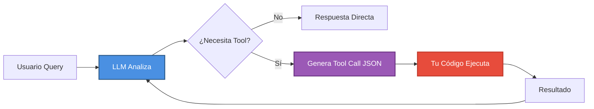
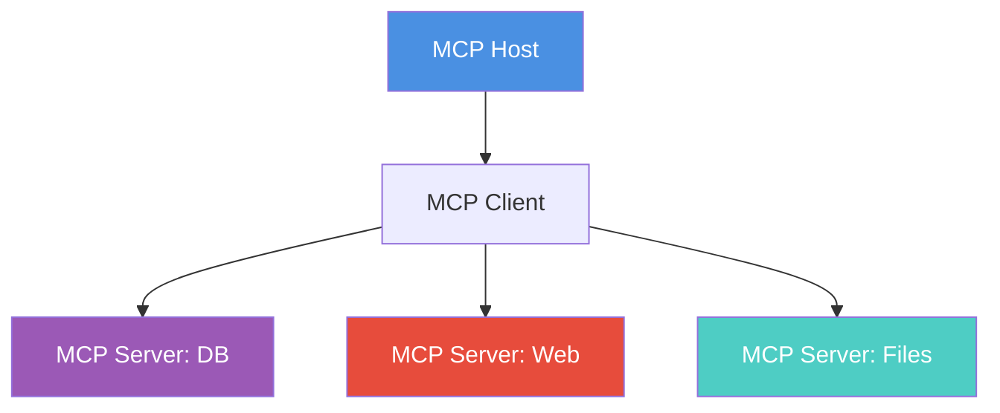

# Módulo 4: Uso de Herramientas y Function Calling (The Hands)


> *"Un LLM sin herramientas es solo un chatbot. Con herramientas, se convierte en un agente capaz de actuar en el mundo real."*

---

## 🎯 Objetivos del Módulo

Un agente sin herramientas es solo un chatbot. En este módulo, le daremos "manos" a tus agentes para que puedan:

- 🔍 Buscar información en la web
- 💾 Consultar bases de datos
- 📧 Enviar emails y notificaciones
- 📊 Procesar y analizar datos
- 🌐 Llamar APIs externas
- 📁 Manipular archivos y sistemas

Aprenderás cómo los LLMs estructuran llamadas a funciones y cómo conectar tus agentes al mundo real a través de **6 frameworks principales**.

---

## 📚 Conceptos Clave

### 1. Function Calling (Tool Calling)

La capacidad de modelos como GPT-4, Claude y Gemini para:
- Detectar cuándo necesitan usar una herramienta
- Devolver JSON estructurado en lugar de texto libre
- Pausar la generación y retornar control al código
- Continuar después de recibir resultados



### 2. Structured Outputs

**Novedad 2024**: OpenAI introdujo **Structured Outputs** que garantizan 100% de adherencia al JSON Schema mediante `strict: true`.

**Diferencia clave:**
- **JSON Mode (viejo)**: Garantiza JSON válido, pero no schema specific
- **Structured Outputs (nuevo)**: Garantiza JSON que adhiere **exactamente** a tu schema

### 3. Model Context Protocol (MCP)

Estándar universal (Anthropic, Nov 2024) para conectar LLMs con herramientas y datos. El "USB-C para AI".



---

## 💻 Ejemplo Básico: OpenAI Function Calling

```python
from openai import OpenAI
import json

client = OpenAI()

# 1. Definir herramienta
tools = [{
    "type": "function",
    "function": {
        "name": "get_weather",
        "description": "Get current weather for a city",
        "parameters": {
            "type": "object",
            "properties": {
                "city": {"type": "string", "description": "City name"},
                "units": {"type": "string", "enum": ["celsius", "fahrenheit"]}
            },
            "required": ["city"],
            "additionalProperties": False  # Para strict mode
        },
        "strict": True  # ⭐ Structured Outputs
    }
}]

# 2. Implementar función
def get_weather(city: str, units: str = "celsius") -> str:
    # En producción: llamar API real
    return json.dumps({"city": city, "temp": 22, "units": units, "condition": "sunny"})

# 3. Agent loop
messages = [{"role": "user", "content": "What's the weather in Madrid?"}]

response = client.chat.completions.create(
    model="gpt-4o",
    messages=messages,
    tools=tools
)

# 4. Ejecutar tool si es necesario
if response.choices[0].finish_reason == "tool_calls":
    tool_call = response.choices[0].message.tool_calls[0]
    function_args = json.loads(tool_call.function.arguments)
    
    # Ejecutar
    result = get_weather(**function_args)
    
    # Agregar resultado y continuar
    messages.append(response.choices[0].message)
    messages.append({
        "role": "tool",
        "tool_call_id": tool_call.id,
        "name": "get_weather",
        "content": result
    })
    
    # Respuesta final
    final_response = client.chat.completions.create(
        model="gpt-4o",
        messages=messages
    )
    
    print(final_response.choices[0].message.content)
```

---

## 🔧 Esquemas de Herramientas con Pydantic

```python
from pydantic import BaseModel, Field
from typing import Optional

class SearchInput(BaseModel):
    """Schema para herramienta de búsqueda"""
    query: str = Field(description="La consulta de búsqueda")
    max_results: int = Field(default=5, description="Número máximo de resultados")
    language: Optional[str] = Field(default="es", description="Idioma de resultados")

# Convertir a JSON Schema
schema = SearchInput.model_json_schema()

# Usar en tool definition
tool = {
    "type": "function",
    "function": {
        "name": "search_web",
       "description": "Busca información en la web",
        "parameters": schema,
        "strict": True
    }
}
```

---

## 🌐 Multi-Framework: Mismo Tool, Diferente Sintaxis

### LangChain

```python
from langchain.tools import tool

@tool
def search(query: str) -> str:
    """Busca información en la web"""
    return f"Resultados para: {query}"
```

### LlamaIndex

```python
from llama_index.core.tools import FunctionTool

def search(query: str) -> str:
    """Busca información"""
    return f"Resultados: {query}"

tool = FunctionTool.from_defaults(fn=search)
```

### CrewAI

```python
from crewai.tools import BaseTool

class SearchTool(BaseTool):
    name: str = "Web Search"
    description: str = "Busca en la web"
    
    def _run(self, query: str) -> str:
        return f"Resultados: {query}"
```

---

## 🎯 Best Practices

### 1. Schema Design

✅ **Bueno:**
```python
{
    "name": "search_database",
    "description": "Search customer database by name or email. Returns customer ID, name, email, and purchase history.",
    "parameters": {
        "type": "object",
        "properties": {
            "search_term": {
                "type": "string",
                "description": "Customer name or email to search for"
            }
        },
        "required": ["search_term"],
        "additionalProperties": False
    }
}
```

❌ **Malo:**
```python
{
    "name": "search",  # Nombre vago
    "description": "Search",  # Descripción inútil
    "parameters": {
        "type": "object",
        "properties": {
            "q": {"type": "string"}  # Sin descripción
        }
        # Falta: required, additionalProperties
    }
}
```

### 2. Error Handling

```python
def safe_tool_execution(tool_name: str, args: dict) -> str:
    """Ejecuta tool con manejo robusto de errores"""
    try:
        result = tools[tool_name](**args)
        return json.dumps({"success": True, "result": result})
    except KeyError:
        return json.dumps({"success": False, "error": f"Tool {tool_name} not found"})
    except Exception as e:
        return json.dumps({"success": False, "error": str(e)})
```

### 3. Tool Limits

- 📌 **Límite recomendado**: ~20 tools por agente
- 🎯 **Razón**: Más tools = más tokens en prompt = peor performance
- ✅ **Solución**: Usar routing agents para seleccionar subset de tools

---

## 📚 Recursos Adicionales

### Documentación Oficial

- **OpenAI Function Calling**: https://platform.openai.com/docs/guides/function-calling
- **Structured Outputs**: https://platform.openai.com/docs/guides/structured-outputs
- **LangChain Tools**: https://python.langchain.com/docs/modules/tools/
- **MCP Protocol**: https://modelcontextprotocol.io
- **CrewAI Tools**: https://docs.crewai.com/core-concepts/Tools/
- **LlamaIndex Tools**: https://docs.llamaindex.ai/en/stable/module_guides/deploying/agents/tools/

### Papers y Referencias

1. **Toolformer** (Meta AI, 2023): "Teaching Language Models to Use Tools"
2. **Gorilla** (Berkeley, 2023): "Large Language Model Connected with Massive APIs"
3. **ToolLLM** (2023): "Facilitating Large Language Models to Master 16000+ Real-world APIs"

---

## 🚀 Próximos Pasos

➡️ **[Módulo 5: RAG Avanzado](../module5/README.md)** - Aprende a conectar tus agentes con bases de conocimiento mediante Retrieval-Augmented Generation

---

<div align="center">

**[⬅️ Módulo Anterior](../module3/README.md)** | **[🏠 Inicio](../README.md)** | **[Siguiente Módulo ➡️](../module5/README.md)**

</div>

---

**Última actualización:** Noviembre 2024  
**Stack cubierto:** OpenAI, LangChain, LlamaIndex, CrewAI, Semantic Kernel, AutoGen  
**Protocolos:** Function Calling, Structured Outputs, MCP
