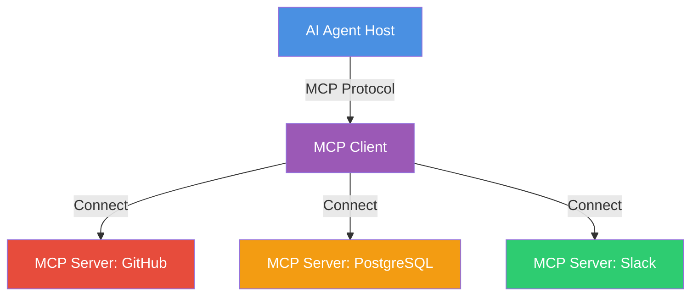

# Módulo 4: Uso de Herramientas y MCP (The Hands)


> "En 2025, ya no conectamos herramientas una por una. Usamos el Model Context Protocol (MCP) como el USB-C de la Inteligencia Artificial."

## 🎯 Objetivos del Módulo

Un agente sin herramientas es solo un chatbot. En este módulo, aprenderás el estándar de la industria para conectar tus agentes con el mundo real:

- 🔌 **Model Context Protocol (MCP)**: El estándar universal para conectar datos y herramientas.
- ⚡ **Function Calling**: La base técnica de cómo los LLMs invocan código.
- 🏗️ **Structured Outputs**: Garantizar JSON válido 100% del tiempo.
- 🌐 **Asynchronous Tools**: Manejar tareas de larga duración (Novedad Nov 2025).

---

## 📚 Conceptos Clave (Nov 2025)

### 1. Model Context Protocol (MCP) - El Estándar

Lanzado por Anthropic y adoptado por la industria, MCP estandariza cómo los agentes descubren y usan herramientas.

**Novedades Noviembre 2025:**
- **Async Operations**: Iniciar tareas largas (ej. renderizar video) y recibir notificación al terminar.
- **Agent Graphs**: Definir jerarquías de agentes dentro del protocolo.
- **MCP Registry**: Un "App Store" de herramientas listas para usar.



### 2. Structured Outputs (Strict Mode)

Con modelos como **GPT-5.1** y **Claude 4.5**, el uso de `strict: true` es obligatorio para producción. Garantiza que el modelo siga tu esquema JSON byte por byte.

---

## 💻 Ejemplo: MCP Server en Python

Cómo crear un servidor MCP que expone herramientas a cualquier agente (Claude Desktop, Cursor, tu propia app).

```python
"""
MCP Server Example
Standard: Nov 2025
"""
from mcp.server import FastMCP

# 1. Crear servidor MCP
mcp = FastMCP("WeatherService")

# 2. Definir herramienta (automáticamente expuesta)
@mcp.tool()
async def get_weather(city: str) -> str:
    """Get current weather for a city."""
    # Simulación de API call
    return f"Weather in {city}: Sunny, 25°C"

# 3. Definir recurso (datos de solo lectura)
@mcp.resource("weather://alerts")
async def get_alerts() -> str:
    """Get active weather alerts."""
    return "No active alerts."

# 4. Ejecutar
if __name__ == "__main__":
    mcp.run()
```

---

## 🌍 High Impact Social/Professional Example (Nov 2025)

> **Proyecto: "Universal City Services Integrator"**
>
> Este ejemplo demuestra cómo MCP permite unificar sistemas municipales dispares (transporte, energía, emergencias) sin reescribir código legado.

### El Problema
Una ciudad inteligente tiene datos en silos: el tráfico en SQL, la energía en una API REST antigua y las emergencias en un sistema de radio.

### La Solución
Un enjambre de **Servidores MCP** que exponen estos datos de forma estandarizada, permitiendo a un "Agente Coordinador" tener visión global.

```python
"""
Project: CityOS Integrator
Architecture: MCP Federation
"""
from mcp.server import FastMCP
import asyncio

# --- Server 1: Traffic System ---
traffic_mcp = FastMCP("TrafficSystem")

@traffic_mcp.tool()
async def get_congestion_level(sector: str) -> float:
    """Get traffic congestion (0.0 to 1.0) for a sector."""
    return 0.85  # Simulated high traffic

# --- Server 2: Energy Grid ---
energy_mcp = FastMCP("EnergyGrid")

@energy_mcp.tool()
async def optimize_grid(sector: str, mode: str) -> str:
    """Adjust street lights based on mode (eco/bright)."""
    return f"Sector {sector} set to {mode} mode."

# --- Coordinator Agent (Client) ---
# En producción, esto sería un LLM conectado a los servidores MCP
async def city_coordinator():
    print("🏙️ CityOS Coordinator Started")
    
    # 1. Detectar problema (Traffic)
    congestion = await get_congestion_level("Downtown")
    
    if congestion > 0.8:
        print(f"🚨 High congestion detected ({congestion}). Optimizing infrastructure...")
        
        # 2. Actuar en otro sistema (Energy)
        # Aumentar iluminación en intersecciones para seguridad
        result = await optimize_grid("Downtown", "bright")
        print(f"✅ Action taken: {result}")

if __name__ == "__main__":
    asyncio.run(city_coordinator())
```

**Impacto Social:**
- **Interoperabilidad**: Conecta sistemas de 1990 con IA de 2025.
- **Eficiencia**: Optimización cruzada (tráfico afecta luces, clima afecta energía).
- **Resiliencia**: Si un servidor MCP cae, el resto sigue funcionando.

---

## 🚀 Próximos Pasos

➡️ **[Módulo 5: RAG Avanzado](../module5/README.md)**

<div align="center">

**[⬅️ Módulo Anterior](../module3/README.md)** | **[🏠 Inicio](../README.md)**

</div>

---

**Última actualización:** Noviembre 2025
**Estándar Principal:** Model Context Protocol (MCP) v1.0
**Modelos:** GPT-5.1, Claude 4.5
