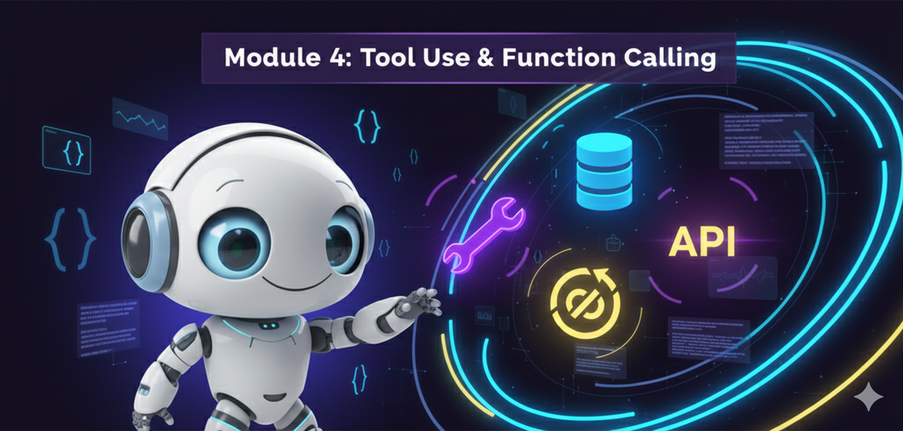

# Módulo 4: Uso de Herramientas y Function Calling (The Hands)



## 🎯 Objetivos del Módulo
Un agente sin herramientas es solo un chatbot. En este módulo, le daremos "manos" a tus agentes. Aprenderás cómo los LLMs estructuran llamadas a funciones y cómo conectar tus agentes a bases de datos, APIs y la web.

## 📚 Conceptos Clave

### 1. Function Calling (Tool Calling)
-   La capacidad de modelos como GPT-4 y Gemini para devolver JSON estructurado en lugar de texto libre cuando detectan que necesitan usar una herramienta.
-   **Esquemas:** Definición de herramientas usando Pydantic o JSON Schema.

### 2. Model Context Protocol (MCP)
    query: str = Field(description="La consulta de búsqueda")

@tool("search-tool", args_schema=SearchInput)
def search(query: str):
    """Útil para buscar información actual en internet."""
    return f"Resultados simulados para: {query}"

# El LLM ahora sabe que esta función existe y qué parámetros necesita
print(search.args) 
```

---

<div align="center">

**[⬅️ Módulo Anterior](../module3/README.md)** | **[🏠 Inicio](../README.md)** | **[Siguiente Módulo ➡️](../module5/README.md)**

</div>

