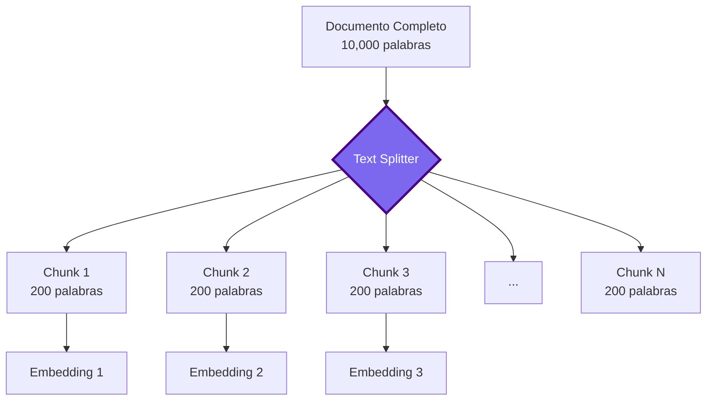

# Parte 2: Text Splitters - El Arte del Chunking Inteligente


## 📖 Índice
1. [Fundamentos Conceptuales](#fundamentos-conceptuales)
2. [El Dilema del Chunking](#el-dilema-del-chunking)
3. [Estrategias de Chunking](#estrategias-de-chunking)
4. [Implementación con Múltiples Frameworks](#implementación-con-múltiples-frameworks)
5. [Técnicas Avanzadas](#técnicas-avanzadas)
6. [Mejores Prácticas](#mejores-prácticas)

---

## 🎯 Fundamentos Conceptuales

### ¿Por Qué Necesitamos Text Splitters?

Los modelos de lenguaje tienen **límites de contexto**. No podemos enviar un documento completo de 100 páginas como contexto. Además, documentos grandes contienen información irrelevante que **diluye la precisión** del retrieval.



### El Problema Fundamental

> [!IMPORTANT]
> **El chunking es el factor más crítico en la calidad de un sistema RAG**. Un chunking mal diseñado puede:
> - **Fragmentar contexto**: Dividir información relacionada
> - **Perder coherencia**: Chunks sin sentido completo
> - **Degradar retrieval**: Embeddings de baja calidad
> - **Aumentar costos**: Más chunks = más embeddings = más dinero

---

## ⚖️ El Dilema del Chunking

### El Trade-off Fundamental

| Aspecto | Chunks Pequeños (100-200 tokens) | Chunks Grandes (800-1000 tokens) |
|---------|----------------------------------|----------------------------------|
| **Precisión** | ✅ Alta - información específica | ❌ Baja - información diluida |
| **Contexto** | ❌ Bajo - puede perder relaciones | ✅ Alto - contexto completo |
| **Costo** | ❌ Alto - más embeddings | ✅ Bajo - menos embeddings |
| **Velocidad** | ❌ Lenta - más búsquedas | ✅ Rápida - menos búsquedas |
| **Relevancia** | ✅ Alta - matches exactos | ❌ Baja - matches genéricos |

### Visualización del Impacto

```python
# Ejemplo: Documento sobre Python

# ❌ Chunk demasiado pequeño (pierde contexto)
chunk_1 = "Las listas en Python son mutables"
# Pregunta: "¿Cómo modificar una lista?"
# Problema: No hay ejemplos de código

# ❌ Chunk demasiado grande (información diluida)
chunk_2 = """
Python es un lenguaje de programación interpretado...
Las listas son estructuras de datos mutables...
Los diccionarios almacenan pares clave-valor...
Las funciones se definen con def...
[500 palabras más sobre diversos temas]
"""
# Problema: Demasiados temas, embedding poco específico

# ✅ Chunk óptimo (balance perfecto)
chunk_3 = """
Las listas en Python son mutables, lo que significa que puedes 
modificar sus elementos después de crearlas.

Ejemplos de modificación:
- Cambiar un elemento: lista[0] = 'nuevo_valor'
- Añadir elementos: lista.append('item')
- Eliminar elementos: lista.remove('item')

Esto las diferencia de las tuplas, que son inmutables.
"""
# ✅ Contexto completo + ejemplos + información relacionada
```

---

## 🔧 Estrategias de Chunking

### 1. **Character-Based Splitting** (Básico)

División simple por número de caracteres.

```python
from langchain.text_splitter import CharacterTextSplitter

# Configuración básica
text_splitter = CharacterTextSplitter(
    separator="\n\n",        # Dividir por párrafos
    chunk_size=1000,         # Máximo 1000 caracteres
    chunk_overlap=200,       # 200 caracteres de overlap
    length_function=len,     # Función para medir longitud
)

# Uso
text = """
Párrafo 1: Introducción a RAG...

Párrafo 2: Document Loaders...

Párrafo 3: Text Splitters...
"""

chunks = text_splitter.split_text(text)
print(f"Chunks creados: {len(chunks)}")
```

**Ventajas**: Simple, rápido  
**Desventajas**: No respeta límites semánticos

### 2. **Recursive Character Splitting** (Recomendado)

División inteligente que respeta jerarquía de separadores.

```python
from langchain.text_splitter import RecursiveCharacterTextSplitter

# Configuración profesional
text_splitter = RecursiveCharacterTextSplitter(
    chunk_size=800,
    chunk_overlap=200,
    length_function=len,
    separators=[
        "\n\n",    # Primero intenta dividir por párrafos
        "\n",      # Luego por líneas
        ". ",      # Luego por oraciones
        " ",       # Finalmente por palabras
        ""         # Último recurso: caracteres
    ]
)

# Uso con documentos
from langchain.schema import Document

documents = [
    Document(
        page_content="Contenido largo del documento...",
        metadata={"source": "doc1.pdf", "page": 1}
    )
]

# Split preservando metadata
chunks = text_splitter.split_documents(documents)

for i, chunk in enumerate(chunks):
    print(f"Chunk {i}:")
    print(f"  Contenido: {chunk.page_content[:100]}...")
    print(f"  Metadata: {chunk.metadata}")
```

**Ventajas**: Respeta estructura del texto  
**Desventajas**: Aún no considera semántica

### 3. **Token-Based Splitting** (Para LLMs)

División por tokens (unidades que entiende el LLM).

```python
from langchain.text_splitter import TokenTextSplitter

# Usar tiktoken (tokenizer de OpenAI)
text_splitter = TokenTextSplitter(
    encoding_name="cl100k_base",  # Encoding de GPT-4
    chunk_size=400,                # 400 tokens por chunk
    chunk_overlap=50               # 50 tokens de overlap
)

text = "Tu texto largo aquí..."
chunks = text_splitter.split_text(text)

# Verificar tamaño real en tokens
import tiktoken
encoder = tiktoken.get_encoding("cl100k_base")

for i, chunk in enumerate(chunks):
    token_count = len(encoder.encode(chunk))
    print(f"Chunk {i}: {token_count} tokens")
```

**Ventajas**: Precisión exacta para límites de LLM  
**Desventajas**: Más lento que character-based

### 4. **Semantic Chunking** (Avanzado)

División basada en **similitud semántica** entre oraciones.

```python
from langchain_experimental.text_splitter import SemanticChunker
from langchain_openai import OpenAIEmbeddings

# Configurar semantic chunker
embeddings = OpenAIEmbeddings(model="text-embedding-3-small")

text_splitter = SemanticChunker(
    embeddings=embeddings,
    breakpoint_threshold_type="percentile",  # "percentile" | "standard_deviation" | "interquartile"
    breakpoint_threshold_amount=95           # Percentil 95
)

# Uso
text = """
Python es un lenguaje de programación. Es muy popular para ciencia de datos.

Los pandas son animales nativos de China. Comen principalmente bambú.

El framework pandas de Python es excelente para análisis de datos.
"""

chunks = text_splitter.split_text(text)

# Resultado: Agrupa oraciones semánticamente relacionadas
# Chunk 1: Python + ciencia de datos
# Chunk 2: Pandas animales
# Chunk 3: Pandas framework
```

**Cómo funciona**:
1. Calcula embeddings de cada oración
2. Mide similitud coseno entre oraciones consecutivas
3. Divide donde la similitud cae por debajo del threshold

**Ventajas**: Preserva coherencia semántica  
**Desventajas**: Más costoso (requiere embeddings)

---

## 💻 Implementación con Múltiples Frameworks

### Ejemplo 1: LangChain - Chunking Básico a Avanzado

```python
"""
Ejemplo Básico: Comparación de Estrategias de Chunking
Framework: LangChain
Objetivo: Demostrar diferencias entre métodos de splitting
"""

from langchain.text_splitter import (
    CharacterTextSplitter,
    RecursiveCharacterTextSplitter,
    TokenTextSplitter
)
from langchain_openai import OpenAIEmbeddings
from langchain_experimental.text_splitter import SemanticChunker


# Texto de ejemplo
SAMPLE_TEXT = """
Retrieval-Augmented Generation (RAG) es una técnica que combina 
recuperación de información con generación de lenguaje natural.

El proceso RAG consta de varios pasos fundamentales:

1. Document Loading: Cargar documentos de diversas fuentes.
2. Text Splitting: Dividir documentos en chunks manejables.
3. Embedding: Convertir chunks en vectores numéricos.
4. Vector Storage: Almacenar embeddings en una base de datos vectorial.
5. Retrieval: Recuperar chunks relevantes para una consulta.
6. Generation: Generar respuesta usando chunks como contexto.

Cada paso es crítico para el éxito del sistema RAG.
"""


def compare_splitting_strategies():
    """Compara diferentes estrategias de splitting"""
    
    strategies = {
        "Character-Based": CharacterTextSplitter(
            separator="\n\n",
            chunk_size=200,
            chunk_overlap=50
        ),
        "Recursive": RecursiveCharacterTextSplitter(
            chunk_size=200,
            chunk_overlap=50,
            separators=["\n\n", "\n", ". ", " ", ""]
        ),
        "Token-Based": TokenTextSplitter(
            chunk_size=100,
            chunk_overlap=20
        ),
    }
    
    print("=" * 80)
    print("COMPARACIÓN DE ESTRATEGIAS DE CHUNKING")
    print("=" * 80)
    
    for name, splitter in strategies.items():
        chunks = splitter.split_text(SAMPLE_TEXT)
        
        print(f"\n{'─' * 80}")
        print(f"📊 Estrategia: {name}")
        print(f"{'─' * 80}")
        print(f"Total de chunks: {len(chunks)}\n")
        
        for i, chunk in enumerate(chunks, 1):
            print(f"Chunk {i} ({len(chunk)} chars):")
            print(f"  {chunk[:100]}...")
            print()


def semantic_chunking_example():
    """Ejemplo de semantic chunking"""
    
    print("\n" + "=" * 80)
    print("SEMANTIC CHUNKING (Avanzado)")
    print("=" * 80 + "\n")
    
    embeddings = OpenAIEmbeddings(model="text-embedding-3-small")
    
    semantic_splitter = SemanticChunker(
        embeddings=embeddings,
        breakpoint_threshold_type="percentile",
        breakpoint_threshold_amount=90
    )
    
    chunks = semantic_splitter.split_text(SAMPLE_TEXT)
    
    print(f"Total de chunks semánticos: {len(chunks)}\n")
    
    for i, chunk in enumerate(chunks, 1):
        print(f"Chunk Semántico {i}:")
        print(f"  {chunk}")
        print()


if __name__ == "__main__":
    # Comparar estrategias básicas
    compare_splitting_strategies()
    
    # Demostrar semantic chunking
    # semantic_chunking_example()  # Descomentar si tienes API key de OpenAI
```

### Ejemplo 2: LlamaIndex - Chunking con Node Parser

```python
"""
Ejemplo Intermedio: Chunking con LlamaIndex
Framework: LlamaIndex
Objetivo: Usar Node Parsers para chunking avanzado
"""

from llama_index.core import Document
from llama_index.core.node_parser import (
    SentenceSplitter,
    SemanticSplitterNodeParser,
    TokenTextSplitter as LlamaTokenSplitter
)
from llama_index.embeddings.openai import OpenAIEmbedding


def llamaindex_sentence_splitter():
    """Sentence Splitter de LlamaIndex"""
    
    # Crear documento
    doc = Document(
        text="""
        RAG systems require careful chunking strategies. The quality of 
        your chunks directly impacts retrieval accuracy.
        
        Best practices include: maintaining semantic coherence, using 
        appropriate overlap, and considering token limits.
        
        Different use cases require different chunking approaches.
        """,
        metadata={"source": "rag_guide.md", "section": "chunking"}
    )
    
    # Configurar splitter
    splitter = SentenceSplitter(
        chunk_size=1024,
        chunk_overlap=200,
        separator=" "
    )
    
    # Crear nodes (equivalente a chunks en LangChain)
    nodes = splitter.get_nodes_from_documents([doc])
    
    print("=" * 80)
    print("LLAMAINDEX - SENTENCE SPLITTER")
    print("=" * 80 + "\n")
    
    for i, node in enumerate(nodes, 1):
        print(f"Node {i}:")
        print(f"  Text: {node.text[:100]}...")
        print(f"  Metadata: {node.metadata}")
        print(f"  Node ID: {node.node_id}")
        print()


def llamaindex_semantic_splitter():
    """Semantic Splitter de LlamaIndex"""
    
    doc = Document(
        text="""
        Machine learning models require large datasets. Training data 
        quality is crucial for model performance.
        
        Cats are popular pets. They are known for their independence.
        
        Deep learning is a subset of machine learning. It uses neural 
        networks with multiple layers.
        """,
        metadata={"source": "ml_guide.md"}
    )
    
    # Configurar embedding model
    embed_model = OpenAIEmbedding(model="text-embedding-3-small")
    
    # Semantic splitter
    splitter = SemanticSplitterNodeParser(
        buffer_size=1,
        breakpoint_percentile_threshold=95,
        embed_model=embed_model
    )
    
    nodes = splitter.get_nodes_from_documents([doc])
    
    print("=" * 80)
    print("LLAMAINDEX - SEMANTIC SPLITTER")
    print("=" * 80 + "\n")
    
    for i, node in enumerate(nodes, 1):
        print(f"Semantic Node {i}:")
        print(f"  {node.text}")
        print()


if __name__ == "__main__":
    llamaindex_sentence_splitter()
    # llamaindex_semantic_splitter()  # Requiere API key
```

### Ejemplo 3: Chunking Adaptativo Multi-Framework

```python
"""
Ejemplo Avanzado: Sistema de Chunking Adaptativo
Frameworks: LangChain + Custom Logic
Objetivo: Seleccionar estrategia de chunking según tipo de contenido
"""

from langchain.text_splitter import (
    RecursiveCharacterTextSplitter,
    Language,
    MarkdownHeaderTextSplitter
)
from langchain.schema import Document
from typing import List, Literal
import re


class AdaptiveChunker:
    """
    Chunker adaptativo que selecciona la estrategia óptima
    según el tipo de contenido.
    """
    
    def __init__(self):
        # Splitters especializados
        self.code_splitter = RecursiveCharacterTextSplitter.from_language(
            language=Language.PYTHON,
            chunk_size=800,
            chunk_overlap=100
        )
        
        self.markdown_splitter = MarkdownHeaderTextSplitter(
            headers_to_split_on=[
                ("#", "Header 1"),
                ("##", "Header 2"),
                ("###", "Header 3"),
            ]
        )
        
        self.text_splitter = RecursiveCharacterTextSplitter(
            chunk_size=1000,
            chunk_overlap=200,
            separators=["\n\n", "\n", ". ", " ", ""]
        )
    
    def detect_content_type(self, text: str) -> Literal["code", "markdown", "text"]:
        """Detecta el tipo de contenido"""
        
        # Detectar código Python
        code_patterns = [
            r'def\s+\w+\s*\(',
            r'class\s+\w+',
            r'import\s+\w+',
            r'from\s+\w+\s+import'
        ]
        
        if any(re.search(pattern, text) for pattern in code_patterns):
            return "code"
        
        # Detectar Markdown
        if re.search(r'^#{1,6}\s+', text, re.MULTILINE):
            return "markdown"
        
        return "text"
    
    def chunk_document(self, document: Document) -> List[Document]:
        """Aplica chunking adaptativo"""
        
        content_type = self.detect_content_type(document.page_content)
        
        print(f"📝 Tipo detectado: {content_type}")
        
        if content_type == "code":
            chunks = self.code_splitter.split_documents([document])
        elif content_type == "markdown":
            # Markdown splitter retorna docs sin metadata original
            md_chunks = self.markdown_splitter.split_text(document.page_content)
            # Añadir metadata original
            chunks = [
                Document(
                    page_content=chunk.page_content,
                    metadata={**document.metadata, **chunk.metadata}
                )
                for chunk in md_chunks
            ]
        else:
            chunks = self.text_splitter.split_documents([document])
        
        return chunks


# Ejemplos de uso
def test_adaptive_chunker():
    """Prueba el chunker adaptativo con diferentes tipos de contenido"""
    
    # Documento de código
    code_doc = Document(
        page_content="""
def calculate_embeddings(texts: List[str]) -> np.ndarray:
    '''
    Calcula embeddings para una lista de textos.
    
    Args:
        texts: Lista de strings a embedear
        
    Returns:
        Array de embeddings
    '''
    embeddings = []
    for text in texts:
        embedding = model.encode(text)
        embeddings.append(embedding)
    return np.array(embeddings)

class VectorStore:
    def __init__(self, dimension: int):
        self.dimension = dimension
        self.vectors = []
    
    def add(self, vector: np.ndarray):
        if len(vector) != self.dimension:
            raise ValueError("Dimensión incorrecta")
        self.vectors.append(vector)
        """,
        metadata={"source": "embeddings.py", "type": "code"}
    )
    
    # Documento Markdown
    markdown_doc = Document(
        page_content="""
# Guía de RAG

## Introducción

RAG combina recuperación y generación.

## Componentes Principales

### Document Loaders
Cargan documentos de diversas fuentes.

### Text Splitters
Dividen documentos en chunks.

### Embeddings
Convierten texto en vectores.
        """,
        metadata={"source": "rag_guide.md", "type": "markdown"}
    )
    
    # Documento de texto plano
    text_doc = Document(
        page_content="""
        Los sistemas RAG han revolucionado la forma en que los modelos
        de lenguaje acceden a información externa. Al combinar búsqueda
        semántica con generación de lenguaje natural, estos sistemas
        pueden proporcionar respuestas más precisas y actualizadas.
        
        La clave del éxito de un sistema RAG radica en la calidad de
        su pipeline de recuperación. Esto incluye el chunking inteligente,
        embeddings de alta calidad, y estrategias de retrieval optimizadas.
        """,
        metadata={"source": "intro.txt", "type": "text"}
    )
    
    # Probar chunker adaptativo
    chunker = AdaptiveChunker()
    
    for doc in [code_doc, markdown_doc, text_doc]:
        print("\n" + "=" * 80)
        print(f"Procesando: {doc.metadata['source']}")
        print("=" * 80)
        
        chunks = chunker.chunk_document(doc)
        
        print(f"\n✅ Chunks generados: {len(chunks)}\n")
        
        for i, chunk in enumerate(chunks, 1):
            print(f"Chunk {i}:")
            print(f"  Longitud: {len(chunk.page_content)} chars")
            print(f"  Metadata: {chunk.metadata}")
            print(f"  Preview: {chunk.page_content[:100]}...")
            print()


if __name__ == "__main__":
    test_adaptive_chunker()
```

---

## 🚀 Técnicas Avanzadas

### 1. **Propositional Chunking**

Convierte oraciones complejas en proposiciones atómicas.

```python
"""
Propositional Chunking: Descomponer oraciones en proposiciones simples
Basado en: https://github.com/NirDiamant/RAG_Techniques
"""

from langchain_openai import ChatOpenAI
from langchain.prompts import ChatPromptTemplate
from typing import List


class PropositionalChunker:
    """Divide texto en proposiciones atómicas usando un LLM"""
    
    def __init__(self):
        self.llm = ChatOpenAI(model="gpt-4o-mini", temperature=0)
        
        self.prompt = ChatPromptTemplate.from_messages([
            ("system", """Eres un experto en descomponer oraciones complejas 
            en proposiciones simples y atómicas.
            
            Reglas:
            1. Cada proposición debe ser auto-contenida
            2. Mantener el significado original
            3. Usar lenguaje simple y directo
            4. Retornar una proposición por línea
            """),
            ("human", "Descompón este texto en proposiciones:\n\n{text}")
        ])
    
    def chunk(self, text: str) -> List[str]:
        """Convierte texto en proposiciones"""
        
        chain = self.prompt | self.llm
        response = chain.invoke({"text": text})
        
        # Dividir por líneas y limpiar
        propositions = [
            line.strip() 
            for line in response.content.split("\n") 
            if line.strip() and not line.strip().startswith("-")
        ]
        
        return propositions


# Ejemplo de uso
if __name__ == "__main__":
    chunker = PropositionalChunker()
    
    complex_text = """
    RAG systems, which combine retrieval and generation, are particularly 
    effective for question-answering tasks because they can access external 
    knowledge bases, unlike traditional language models that rely solely on 
    their training data.
    """
    
    propositions = chunker.chunk(complex_text)
    
    print("Texto original:")
    print(complex_text)
    print("\nProposiciones:")
    for i, prop in enumerate(propositions, 1):
        print(f"{i}. {prop}")
```

**Resultado esperado**:
1. RAG systems combine retrieval and generation
2. RAG systems are effective for question-answering tasks
3. RAG systems can access external knowledge bases
4. Traditional language models rely solely on training data
5. Traditional language models cannot access external knowledge

### 2. **Context-Aware Chunking con Overlap Inteligente**

```python
"""
Overlap Inteligente: Preservar contexto entre chunks
"""

from langchain.text_splitter import RecursiveCharacterTextSplitter
from langchain.schema import Document


class ContextAwareChunker:
    """Chunker que preserva contexto mediante overlap inteligente"""
    
    def __init__(self, chunk_size: int = 800, overlap_size: int = 200):
        self.chunk_size = chunk_size
        self.overlap_size = overlap_size
        
        self.splitter = RecursiveCharacterTextSplitter(
            chunk_size=chunk_size,
            chunk_overlap=overlap_size,
            separators=["\n\n", "\n", ". ", " ", ""]
        )
    
    def chunk_with_context(self, document: Document) -> List[Document]:
        """Crea chunks con metadata de contexto"""
        
        chunks = self.splitter.split_documents([document])
        
        # Enriquecer con metadata de contexto
        for i, chunk in enumerate(chunks):
            chunk.metadata.update({
                "chunk_index": i,
                "total_chunks": len(chunks),
                "has_previous": i > 0,
                "has_next": i < len(chunks) - 1,
                "previous_chunk_preview": chunks[i-1].page_content[-100:] if i > 0 else None,
                "next_chunk_preview": chunks[i+1].page_content[:100] if i < len(chunks) - 1 else None
            })
        
        return chunks


# Uso
chunker = ContextAwareChunker()
doc = Document(
    page_content="Texto largo...",
    metadata={"source": "doc.pdf"}
)

chunks = chunker.chunk_with_context(doc)

for chunk in chunks:
    print(f"Chunk {chunk.metadata['chunk_index'] + 1}/{chunk.metadata['total_chunks']}")
    if chunk.metadata['has_previous']:
        print(f"  Contexto previo: ...{chunk.metadata['previous_chunk_preview']}")
    print(f"  Contenido: {chunk.page_content[:100]}...")
    if chunk.metadata['has_next']:
        print(f"  Contexto siguiente: {chunk.metadata['next_chunk_preview']}...")
```

---

## ✅ Mejores Prácticas

### 1. **Experimentar con Tamaños de Chunk**

```python
def find_optimal_chunk_size(documents: List[Document], 
                           test_queries: List[str],
                           chunk_sizes: List[int] = [200, 400, 800, 1200]):
    """
    Encuentra el tamaño óptimo de chunk mediante experimentación
    """
    
    results = {}
    
    for size in chunk_sizes:
        splitter = RecursiveCharacterTextSplitter(
            chunk_size=size,
            chunk_overlap=size // 4  # 25% overlap
        )
        
        chunks = splitter.split_documents(documents)
        
        # Aquí irían métricas de evaluación
        # (precision, recall, etc.)
        
        results[size] = {
            "num_chunks": len(chunks),
            "avg_chunk_length": sum(len(c.page_content) for c in chunks) / len(chunks)
        }
    
    return results
```

### 2. **Usar Overlap Apropiado**

```python
# ❌ Sin overlap - pierde contexto
splitter = RecursiveCharacterTextSplitter(
    chunk_size=800,
    chunk_overlap=0  # Malo
)

# ✅ Con overlap - preserva contexto
splitter = RecursiveCharacterTextSplitter(
    chunk_size=800,
    chunk_overlap=200  # 25% overlap - recomendado
)
```

### 3. **Preservar Metadata Rica**

```python
def enrich_chunks_metadata(chunks: List[Document]) -> List[Document]:
    """Enriquece chunks con metadata útil"""
    
    for i, chunk in enumerate(chunks):
        chunk.metadata.update({
            "chunk_id": f"{chunk.metadata.get('source', 'unknown')}_{i}",
            "chunk_index": i,
            "chunk_length": len(chunk.page_content),
            "word_count": len(chunk.page_content.split()),
            "created_at": datetime.now().isoformat()
        })
    
    return chunks
```

---

## 🎯 Resumen

### Lo que Aprendimos

✅ **Chunking es crítico** para la calidad del RAG  
✅ **Trade-off fundamental**: Precisión vs Contexto  
✅ **Múltiples estrategias**: Character, Recursive, Token, Semantic  
✅ **Frameworks diversos**: LangChain, LlamaIndex  
✅ **Técnicas avanzadas**: Propositional, Context-Aware  

### Checklist de Implementación

- [ ] Definir tamaño de chunk según tu caso de uso
- [ ] Implementar overlap (recomendado: 20-25%)
- [ ] Elegir estrategia de splitting apropiada
- [ ] Enriquecer metadata de chunks
- [ ] Experimentar y medir resultados

### Próximo Paso

Con tus chunks creados, el siguiente paso es convertirlos en **embeddings** (vectores numéricos) para búsqueda semántica.

➡️ **[Continuar a Parte 3: Embeddings](03_embeddings.md)**

---

<div align="center">

**[⬅️ Anterior: Document Loaders](01_document_loaders.md)** | **[Volver al Módulo 5](README.md)** | **[Siguiente: Embeddings ➡️](03_embeddings.md)**

</div>
