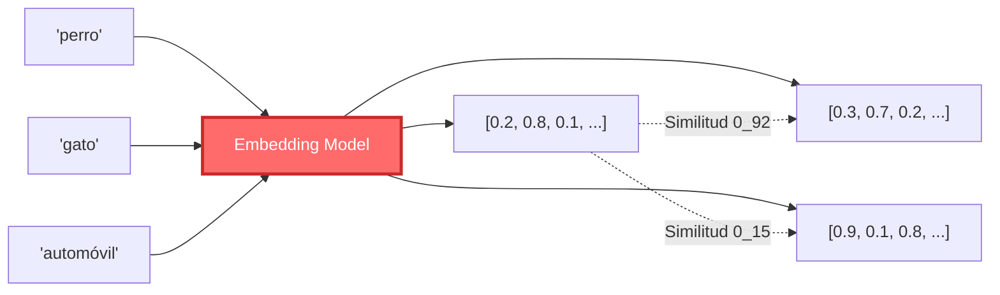
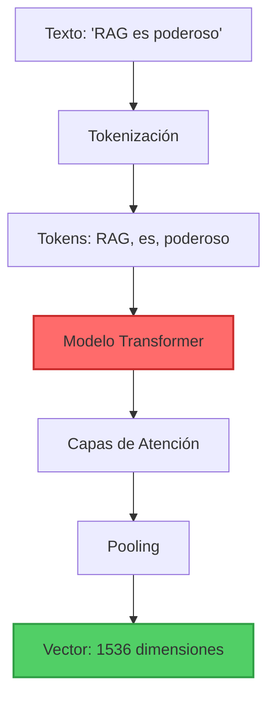

# Parte 3: Embeddings - Convirtiendo Texto en Vectores Semánticos


## 📖 Índice
1. [Fundamentos Conceptuales](#fundamentos-conceptuales)
2. [Cómo Funcionan los Embeddings](#cómo-funcionan-los-embeddings)
3. [Modelos de Embedding](#modelos-de-embedding)
4. [Implementación Multi-Framework](#implementación-multi-framework)
5. [Optimización y Mejores Prácticas](#optimización-y-mejores-prácticas)

---

## 🎯 Fundamentos Conceptuales

### ¿Qué Son los Embeddings?

Los **embeddings** son representaciones vectoriales (numéricas) de texto que capturan su **significado semántico**. Palabras o frases con significados similares tienen embeddings cercanos en el espacio vectorial.



### Visualización Conceptual

```python
# Ejemplo conceptual (simplificado a 2D para visualización)

texto_1 = "El perro juega en el parque"
embedding_1 = [0.8, 0.2]  # Vector 2D

texto_2 = "El cachorro corre afuera"
embedding_2 = [0.75, 0.25]  # Cercano a embedding_1

texto_3 = "La economía global está creciendo"
embedding_3 = [0.1, 0.9]  # Lejano de embedding_1

# Similitud coseno
from numpy import dot
from numpy.linalg import norm

def cosine_similarity(a, b):
    return dot(a, b) / (norm(a) * norm(b))

print(f"Similitud (perro vs cachorro): {cosine_similarity(embedding_1, embedding_2):.2f}")
# Output: 0.99 (muy similar)

print(f"Similitud (perro vs economía): {cosine_similarity(embedding_1, embedding_3):.2f}")
# Output: 0.26 (poco similar)
```

> [!IMPORTANT]
> **Los embeddings son la clave del RAG**. La calidad de tus embeddings determina directamente la calidad de tu retrieval. Un modelo de embedding pobre resultará en recuperación irrelevante, sin importar cuán sofisticado sea el resto de tu pipeline.

---

## 🧠 Cómo Funcionan los Embeddings

### El Proceso de Embedding



### Propiedades Matemáticas

#### 1. **Similitud Coseno**

Mide el ángulo entre dos vectores (rango: -1 a 1).

```python
import numpy as np

def cosine_similarity(vec_a: np.ndarray, vec_b: np.ndarray) -> float:
    """
    Calcula similitud coseno entre dos vectores.
    
    Returns:
        float: Valor entre -1 (opuestos) y 1 (idénticos)
    """
    dot_product = np.dot(vec_a, vec_b)
    norm_a = np.linalg.norm(vec_a)
    norm_b = np.linalg.norm(vec_b)
    
    return dot_product / (norm_a * norm_b)


# Ejemplo
vec_1 = np.array([1, 2, 3])
vec_2 = np.array([2, 4, 6])  # Mismo dirección, diferente magnitud
vec_3 = np.array([-1, -2, -3])  # Dirección opuesta

print(f"Similitud (v1, v2): {cosine_similarity(vec_1, vec_2):.2f}")  # 1.0
print(f"Similitud (v1, v3): {cosine_similarity(vec_1, vec_3):.2f}")  # -1.0
```

#### 2. **Distancia Euclidiana**

Mide la distancia directa entre dos puntos.

```python
def euclidean_distance(vec_a: np.ndarray, vec_b: np.ndarray) -> float:
    """Calcula distancia euclidiana entre dos vectores"""
    return np.linalg.norm(vec_a - vec_b)


# Ejemplo
vec_1 = np.array([0, 0])
vec_2 = np.array([3, 4])

distance = euclidean_distance(vec_1, vec_2)
print(f"Distancia: {distance}")  # 5.0 (teorema de Pitágoras: √(3² + 4²))
```

#### 3. **Producto Punto (Dot Product)**

Más eficiente computacionalmente, usado en muchas bases de datos vectoriales.

```python
def dot_product_similarity(vec_a: np.ndarray, vec_b: np.ndarray) -> float:
    """Calcula producto punto (requiere vectores normalizados)"""
    return np.dot(vec_a, vec_b)
```

### Dimensionalidad de Embeddings

| Modelo | Dimensiones | Trade-off |
|--------|-------------|-----------|
| **text-embedding-3-small** | 1536 | ✅ Rápido, ✅ Barato, ⚠️ Precisión media |
| **text-embedding-3-large** | 3072 | ⚠️ Lento, ❌ Costoso, ✅ Alta precisión |
| **Cohere embed-v3** | 1024 | ✅ Balance, ✅ Multilingüe |
| **sentence-transformers** | 384-768 | ✅ Gratis, ✅ Local, ⚠️ Precisión variable |

---

## 🤖 Modelos de Embedding

### 1. **OpenAI Embeddings** (Recomendado para Producción)

```python
"""
OpenAI Embeddings: Estado del arte en calidad
Costo: $0.00002 / 1K tokens (text-embedding-3-small)
"""

from langchain_openai import OpenAIEmbeddings
import numpy as np


# Inicializar modelo
embeddings_model = OpenAIEmbeddings(
    model="text-embedding-3-small",  # o "text-embedding-3-large"
    dimensions=1536  # Opcional: reducir dimensiones (512, 1024, 1536)
)

# Embedear un solo texto
text = "RAG combina recuperación con generación"
embedding = embeddings_model.embed_query(text)

print(f"Dimensiones: {len(embedding)}")
print(f"Primeros 5 valores: {embedding[:5]}")

# Embedear múltiples textos (batch - más eficiente)
texts = [
    "Los perros son mascotas leales",
    "Los gatos son animales independientes",
    "Python es un lenguaje de programación"
]

embeddings = embeddings_model.embed_documents(texts)

print(f"\nTotal embeddings: {len(embeddings)}")
print(f"Dimensión de cada uno: {len(embeddings[0])}")

# Calcular similitudes
from numpy import dot
from numpy.linalg import norm

def cosine_sim(a, b):
    return dot(a, b) / (norm(a) * norm(b))

sim_perros_gatos = cosine_sim(embeddings[0], embeddings[1])
sim_perros_python = cosine_sim(embeddings[0], embeddings[2])

print(f"\nSimilitud (perros vs gatos): {sim_perros_gatos:.3f}")
print(f"Similitud (perros vs python): {sim_perros_python:.3f}")
```

**Características**:
- ✅ Mejor calidad general
- ✅ Optimizado para búsqueda semántica
- ✅ Soporte multilingüe
- ❌ Requiere API key y pago
- ❌ Envía datos a OpenAI (privacidad)

### 2. **Cohere Embeddings** (Excelente para Multilingüe)

```python
"""
Cohere Embeddings: Excelente para múltiples idiomas
Costo: Gratis hasta 100 requests/min
"""

from langchain_cohere import CohereEmbeddings


# Inicializar
embeddings_model = CohereEmbeddings(
    model="embed-multilingual-v3.0",  # o "embed-english-v3.0"
    cohere_api_key="tu-api-key"
)

# Embedear con especificación de tipo de input
query = "¿Qué es RAG?"
query_embedding = embeddings_model.embed_query(query)

documents = [
    "RAG es Retrieval-Augmented Generation",
    "RAG combina búsqueda y generación",
    "Los sistemas RAG mejoran la precisión de LLMs"
]

doc_embeddings = embeddings_model.embed_documents(documents)

print(f"Query embedding: {len(query_embedding)} dimensiones")
print(f"Document embeddings: {len(doc_embeddings)} documentos")
```

**Características**:
- ✅ Excelente soporte multilingüe
- ✅ Optimizado para retrieval
- ✅ Compresión de embeddings
- ⚠️ Requiere API key
- ✅ Tier gratuito generoso

### 3. **HuggingFace Embeddings** (Open Source, Local)

```python
"""
HuggingFace Embeddings: Modelos open-source ejecutados localmente
Costo: Gratis (requiere GPU para velocidad óptima)
"""

from langchain_huggingface import HuggingFaceEmbeddings


# Modelo recomendado: all-MiniLM-L6-v2
embeddings_model = HuggingFaceEmbeddings(
    model_name="sentence-transformers/all-MiniLM-L6-v2",
    model_kwargs={'device': 'cpu'},  # o 'cuda' si tienes GPU
    encode_kwargs={'normalize_embeddings': True}  # Normalizar para cosine similarity
)

# Uso
text = "Los embeddings locales son privados"
embedding = embeddings_model.embed_query(text)

print(f"Dimensiones: {len(embedding)}")
print(f"Modelo cargado localmente: ✅")
```

**Modelos Recomendados**:

| Modelo | Dimensiones | Uso |
|--------|-------------|-----|
| `all-MiniLM-L6-v2` | 384 | General, rápido |
| `all-mpnet-base-v2` | 768 | Mejor calidad, más lento |
| `paraphrase-multilingual-MiniLM-L12-v2` | 384 | Multilingüe |

**Características**:
- ✅ Completamente gratis
- ✅ Privacidad total (local)
- ✅ No requiere API key
- ❌ Calidad inferior a OpenAI/Cohere
- ⚠️ Requiere recursos locales

### 4. **Google Vertex AI Embeddings**

```python
"""
Google Vertex AI: Embeddings de Google
"""

from langchain_google_vertexai import VertexAIEmbeddings


embeddings_model = VertexAIEmbeddings(
    model_name="textembedding-gecko@003"
)

text = "Google Cloud embeddings"
embedding = embeddings_model.embed_query(text)

print(f"Dimensiones: {len(embedding)}")
```

---

## 💻 Implementación Multi-Framework

### Ejemplo 1: Comparación de Modelos de Embedding

```python
"""
Ejemplo Básico: Comparar Calidad de Diferentes Modelos
Objetivo: Evaluar similitud semántica con diferentes embeddings
"""

from langchain_openai import OpenAIEmbeddings
from langchain_cohere import CohereEmbeddings
from langchain_huggingface import HuggingFaceEmbeddings
import numpy as np
from typing import List, Dict


def cosine_similarity(vec_a: np.ndarray, vec_b: np.ndarray) -> float:
    """Calcula similitud coseno"""
    return np.dot(vec_a, vec_b) / (np.linalg.norm(vec_a) * np.linalg.norm(vec_b))


def compare_embedding_models():
    """Compara diferentes modelos de embedding"""
    
    # Textos de prueba
    query = "¿Cómo funcionan los sistemas RAG?"
    
    documents = [
        "RAG combina recuperación de información con generación de lenguaje",  # Muy relevante
        "Los sistemas de búsqueda semántica usan embeddings vectoriales",      # Relevante
        "Me gusta comer pizza los viernes por la noche"                        # Irrelevante
    ]
    
    # Modelos a comparar
    models = {
        "OpenAI (small)": OpenAIEmbeddings(model="text-embedding-3-small"),
        "HuggingFace (MiniLM)": HuggingFaceEmbeddings(
            model_name="sentence-transformers/all-MiniLM-L6-v2"
        ),
        # "Cohere": CohereEmbeddings(model="embed-multilingual-v3.0"),  # Descomentar si tienes API key
    }
    
    print("=" * 80)
    print("COMPARACIÓN DE MODELOS DE EMBEDDING")
    print("=" * 80)
    print(f"\nQuery: '{query}'\n")
    
    for model_name, embeddings_model in models.items():
        print(f"\n{'─' * 80}")
        print(f"📊 Modelo: {model_name}")
        print(f"{'─' * 80}")
        
        # Embedear query y documentos
        query_emb = np.array(embeddings_model.embed_query(query))
        doc_embs = [np.array(emb) for emb in embeddings_model.embed_documents(documents)]
        
        # Calcular similitudes
        similarities = [cosine_similarity(query_emb, doc_emb) for doc_emb in doc_embs]
        
        # Mostrar resultados
        for i, (doc, sim) in enumerate(zip(documents, similarities), 1):
            relevance = "🟢 Alta" if sim > 0.7 else "🟡 Media" if sim > 0.4 else "🔴 Baja"
            print(f"\nDocumento {i}: {relevance}")
            print(f"  Similitud: {sim:.4f}")
            print(f"  Texto: {doc[:60]}...")


if __name__ == "__main__":
    compare_embedding_models()
```

### Ejemplo 2: Sistema de Caché para Embeddings

```python
"""
Ejemplo Intermedio: Cache de Embeddings para Optimización
Objetivo: Evitar recalcular embeddings costosos
"""

from langchain_openai import OpenAIEmbeddings
from langchain.storage import LocalFileStore
from langchain.embeddings import CacheBackedEmbeddings
from pathlib import Path
import time


class EmbeddingCacheSystem:
    """Sistema de caché para embeddings"""
    
    def __init__(self, cache_dir: str = "./embedding_cache"):
        self.cache_dir = Path(cache_dir)
        self.cache_dir.mkdir(exist_ok=True)
        
        # Crear store de caché
        self.store = LocalFileStore(str(self.cache_dir))
        
        # Embedding model base
        self.underlying_embeddings = OpenAIEmbeddings(
            model="text-embedding-3-small"
        )
        
        # Embeddings con caché
        self.cached_embeddings = CacheBackedEmbeddings.from_bytes_store(
            self.underlying_embeddings,
            self.store,
            namespace="openai_embeddings"
        )
    
    def embed_with_timing(self, texts: List[str], use_cache: bool = True) -> tuple:
        """Embedea textos y mide tiempo"""
        
        embeddings_model = self.cached_embeddings if use_cache else self.underlying_embeddings
        
        start_time = time.time()
        embeddings = embeddings_model.embed_documents(texts)
        elapsed_time = time.time() - start_time
        
        return embeddings, elapsed_time


# Demostración
def demo_embedding_cache():
    """Demuestra el beneficio del caché"""
    
    cache_system = EmbeddingCacheSystem()
    
    # Textos de prueba
    texts = [
        "RAG es una técnica poderosa para LLMs",
        "Los embeddings capturan significado semántico",
        "El caché mejora el rendimiento significativamente",
        "Python es excelente para machine learning"
    ] * 10  # 40 textos total
    
    print("=" * 80)
    print("DEMOSTRACIÓN DE CACHÉ DE EMBEDDINGS")
    print("=" * 80)
    
    # Primera ejecución (sin caché)
    print("\n🔄 Primera ejecución (SIN caché)...")
    _, time_without_cache = cache_system.embed_with_timing(texts, use_cache=False)
    print(f"   Tiempo: {time_without_cache:.2f}s")
    
    # Segunda ejecución (con caché)
    print("\n⚡ Segunda ejecución (CON caché)...")
    _, time_with_cache = cache_system.embed_with_timing(texts, use_cache=True)
    print(f"   Tiempo: {time_with_cache:.2f}s")
    
    # Comparación
    speedup = time_without_cache / time_with_cache
    print(f"\n📊 Mejora de velocidad: {speedup:.1f}x más rápido")
    print(f"💰 Ahorro de costos: {((1 - 1/speedup) * 100):.1f}%")


if __name__ == "__main__":
    demo_embedding_cache()
```

### Ejemplo 3: Embeddings con Matryoshka (Dimensionalidad Adaptativa)

```python
"""
Ejemplo Avanzado: Matryoshka Embeddings
Objetivo: Usar embeddings de dimensionalidad variable según necesidad
Basado en: OpenAI text-embedding-3 models
"""

from langchain_openai import OpenAIEmbeddings
import numpy as np
from typing import List


class MatryoshkaEmbeddings:
    """
    Embeddings con dimensionalidad adaptativa.
    
    Los modelos text-embedding-3 de OpenAI soportan reducción de dimensiones
    sin reentrenamiento, permitiendo trade-off entre precisión y eficiencia.
    """
    
    def __init__(self, model: str = "text-embedding-3-small"):
        self.model = model
        self.max_dimensions = 1536 if "small" in model else 3072
    
    def embed_with_dimensions(
        self, 
        texts: List[str], 
        dimensions: int
    ) -> List[np.ndarray]:
        """Genera embeddings con dimensionalidad específica"""
        
        if dimensions > self.max_dimensions:
            raise ValueError(
                f"Dimensiones {dimensions} exceden máximo {self.max_dimensions}"
            )
        
        embeddings_model = OpenAIEmbeddings(
            model=self.model,
            dimensions=dimensions
        )
        
        embeddings = embeddings_model.embed_documents(texts)
        return [np.array(emb) for emb in embeddings]
    
    def compare_dimensions(self, texts: List[str]):
        """Compara calidad vs dimensionalidad"""
        
        dimension_configs = [256, 512, 1024, 1536]
        
        print("=" * 80)
        print("MATRYOSHKA EMBEDDINGS: Dimensionalidad Adaptativa")
        print("=" * 80)
        
        query = texts[0]
        documents = texts[1:]
        
        for dims in dimension_configs:
            print(f"\n{'─' * 80}")
            print(f"📏 Dimensiones: {dims}")
            print(f"{'─' * 80}")
            
            # Generar embeddings
            all_embs = self.embed_with_dimensions([query] + documents, dims)
            query_emb = all_embs[0]
            doc_embs = all_embs[1:]
            
            # Calcular similitudes
            similarities = [
                np.dot(query_emb, doc_emb) / (np.linalg.norm(query_emb) * np.linalg.norm(doc_emb))
                for doc_emb in doc_embs
            ]
            
            # Mostrar resultados
            print(f"Tamaño en memoria: ~{dims * 4 / 1024:.1f} KB por embedding")
            print(f"\nSimilitudes:")
            for i, sim in enumerate(similarities, 1):
                print(f"  Doc {i}: {sim:.4f}")


# Uso
if __name__ == "__main__":
    matryoshka = MatryoshkaEmbeddings()
    
    texts = [
        "¿Qué es machine learning?",
        "Machine learning es un subcampo de la inteligencia artificial",
        "Me gusta el helado de chocolate",
        "El aprendizaje automático usa algoritmos para aprender de datos"
    ]
    
    matryoshka.compare_dimensions(texts)
```

---

## 🚀 Optimización y Mejores Prácticas

### 1. **Batch Processing para Eficiencia**

```python
# ❌ Embedear uno por uno (lento, costoso)
embeddings = []
for text in texts:
    emb = embeddings_model.embed_query(text)  # API call por texto
    embeddings.append(emb)

# ✅ Batch processing (rápido, eficiente)
embeddings = embeddings_model.embed_documents(texts)  # Una sola API call
```

### 2. **Normalización para Cosine Similarity**

```python
import numpy as np

def normalize_embeddings(embeddings: List[np.ndarray]) -> List[np.ndarray]:
    """Normaliza embeddings para usar dot product en lugar de cosine similarity"""
    return [emb / np.linalg.norm(emb) for emb in embeddings]

# Con embeddings normalizados, dot product = cosine similarity
normalized_embs = normalize_embeddings(embeddings)
similarity = np.dot(normalized_embs[0], normalized_embs[1])  # Más rápido
```

### 3. **Selección de Modelo Según Caso de Uso**

```python
def select_embedding_model(use_case: str):
    """Selecciona modelo óptimo según caso de uso"""
    
    if use_case == "production_high_quality":
        return OpenAIEmbeddings(model="text-embedding-3-large")
    
    elif use_case == "production_balanced":
        return OpenAIEmbeddings(model="text-embedding-3-small")
    
    elif use_case == "multilingual":
        return CohereEmbeddings(model="embed-multilingual-v3.0")
    
    elif use_case == "local_privacy":
        return HuggingFaceEmbeddings(
            model_name="sentence-transformers/all-mpnet-base-v2"
        )
    
    elif use_case == "development_fast":
        return HuggingFaceEmbeddings(
            model_name="sentence-transformers/all-MiniLM-L6-v2"
        )
    
    else:
        raise ValueError(f"Caso de uso desconocido: {use_case}")
```

### 4. **Evaluación de Calidad de Embeddings**

```python
"""
Evaluar calidad de embeddings mediante tareas de similitud
"""

from scipy.stats import spearmanr


def evaluate_embedding_quality(embeddings_model):
    """Evalúa calidad usando pares de similitud conocidos"""
    
    # Pares de textos con similitud esperada (0-1)
    test_pairs = [
        ("perro", "cachorro", 0.9),
        ("perro", "gato", 0.7),
        ("perro", "automóvil", 0.1),
        ("Python programación", "código Python", 0.95),
        ("Python programación", "serpiente pitón", 0.3),
    ]
    
    expected_similarities = [pair[2] for pair in test_pairs]
    computed_similarities = []
    
    for text1, text2, _ in test_pairs:
        emb1 = np.array(embeddings_model.embed_query(text1))
        emb2 = np.array(embeddings_model.embed_query(text2))
        
        sim = np.dot(emb1, emb2) / (np.linalg.norm(emb1) * np.linalg.norm(emb2))
        computed_similarities.append(sim)
    
    # Correlación de Spearman
    correlation, p_value = spearmanr(expected_similarities, computed_similarities)
    
    print(f"Correlación de Spearman: {correlation:.3f}")
    print(f"P-value: {p_value:.4f}")
    
    return correlation
```

---

## 🎯 Resumen

### Lo que Aprendimos

✅ **Embeddings** convierten texto en vectores semánticos  
✅ **Similitud coseno** mide cercanía semántica  
✅ **Múltiples modelos**: OpenAI, Cohere, HuggingFace, Google  
✅ **Trade-offs**: Calidad vs Costo vs Privacidad  
✅ **Optimizaciones**: Caché, batch processing, normalización  

### Comparación de Modelos

| Modelo | Calidad | Costo | Privacidad | Velocidad |
|--------|---------|-------|------------|-----------|
| OpenAI text-embedding-3-large | ⭐⭐⭐⭐⭐ | 💰💰💰 | ❌ | ⚡⚡⚡ |
| OpenAI text-embedding-3-small | ⭐⭐⭐⭐ | 💰💰 | ❌ | ⚡⚡⚡⚡ |
| Cohere embed-v3 | ⭐⭐⭐⭐ | 💰💰 | ❌ | ⚡⚡⚡ |
| HuggingFace (mpnet) | ⭐⭐⭐ | 💰 (gratis) | ✅ | ⚡⚡ |
| HuggingFace (MiniLM) | ⭐⭐ | 💰 (gratis) | ✅ | ⚡⚡⚡⚡ |

### Próximo Paso

Con tus embeddings generados, el siguiente paso es almacenarlos en una **base de datos vectorial** para búsqueda eficiente.

➡️ **[Continuar a Parte 4: Vector Databases](04_vector_databases.md)**

---

<div align="center">

**[⬅️ Anterior: Text Splitters](02_text_splitters.md)** | **[Volver al Módulo 5](README.md)** | **[Siguiente: Vector Databases ➡️](04_vector_databases.md)**

</div>
