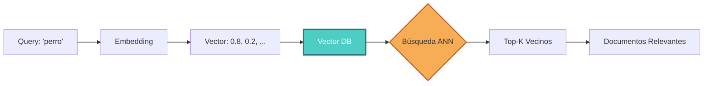
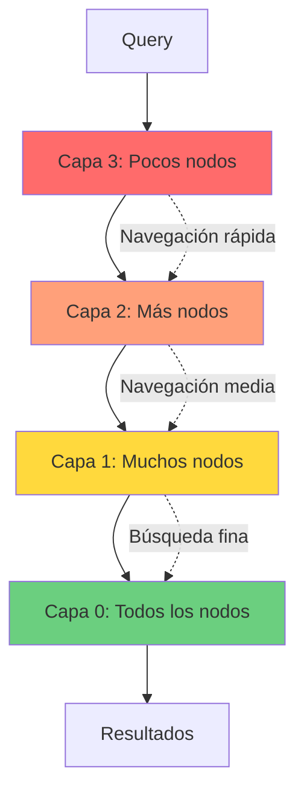

# Parte 4: Vector Databases & Retrievers - Búsqueda Semántica a Escala


## 📖 Índice
1. [Fundamentos Conceptuales](#fundamentos-conceptuales)
2. [Algoritmos de Búsqueda Vectorial](#algoritmos-de-búsqueda-vectorial)
3. [Vector Stores Principales](#vector-stores-principales)
4. [Estrategias de Retrieval](#estrategias-de-retrieval)
5. [Hybrid Search & Reranking](#hybrid-search--reranking)

---

## 🎯 Fundamentos Conceptuales

### ¿Por Qué Bases de Datos Vectoriales?

Las bases de datos tradicionales (SQL, NoSQL) están optimizadas para búsquedas **exactas** o **por rangos**. Las bases de datos vectoriales están optimizadas para búsquedas de **similitud semántica**.



### El Problema de Escala

```python
# ❌ Búsqueda exhaustiva (O(n) - inviable a escala)
def naive_search(query_vector, all_vectors):
    similarities = []
    for vector in all_vectors:  # 1 millón de vectores = 1 millón de comparaciones
        sim = cosine_similarity(query_vector, vector)
        similarities.append(sim)
    return top_k(similarities)

# ✅ Búsqueda ANN con índice (O(log n) - escalable)
def ann_search(query_vector, vector_index):
    return vector_index.search(query_vector, k=10)  # ~1000 comparaciones
```

> [!IMPORTANT]
> **ANN (Approximate Nearest Neighbors)** sacrifica un pequeño porcentaje de precisión (98-99% recall) por una mejora masiva en velocidad (1000x más rápido). Para RAG, este trade-off es casi siempre favorable.

---

## 🔍 Algoritmos de Búsqueda Vectorial

### 1. **HNSW (Hierarchical Navigable Small World)**

El algoritmo más popular para búsqueda vectorial.



**Características**:
- ✅ Muy rápido (log n)
- ✅ Alta precisión (>95% recall)
- ❌ Alto uso de memoria
- ✅ Usado por: ChromaDB, Weaviate, Qdrant

### 2. **IVF (Inverted File Index)**

Divide el espacio vectorial en clusters.

```python
# Conceptualmente:
# 1. Clustering: K-means para crear N clusters
# 2. Indexing: Asignar cada vector a su cluster más cercano
# 3. Search: Buscar solo en los M clusters más cercanos al query

# Parámetros clave:
# - nlist: Número de clusters (ej. 100)
# - nprobe: Clusters a buscar (ej. 10)
```

**Características**:
- ✅ Eficiente en memoria
- ⚠️ Precisión variable (depende de nprobe)
- ✅ Usado por: FAISS, Pinecone

---

## 💾 Vector Stores Principales

### 1. **ChromaDB** (Local, Desarrollo)

```python
"""
ChromaDB: Base de datos vectorial local y ligera
Ideal para: Desarrollo, prototipos, aplicaciones pequeñas
"""

from langchain_chroma import Chroma
from langchain_openai import OpenAIEmbeddings
from langchain.schema import Document


# Inicializar
embeddings = OpenAIEmbeddings(model="text-embedding-3-small")

vectorstore = Chroma(
    collection_name="rag_collection",
    embedding_function=embeddings,
    persist_directory="./chroma_db"  # Persistencia local
)

# Añadir documentos
documents = [
    Document(
        page_content="RAG combina recuperación con generación",
        metadata={"source": "doc1.pdf", "page": 1}
    ),
    Document(
        page_content="Los embeddings capturan significado semántico",
        metadata={"source": "doc2.pdf", "page": 5}
    ),
]

vectorstore.add_documents(documents)

# Búsqueda por similitud
query = "¿Qué es RAG?"
results = vectorstore.similarity_search(query, k=2)

for doc in results:
    print(f"Contenido: {doc.page_content}")
    print(f"Metadata: {doc.metadata}\n")

# Búsqueda con scores
results_with_scores = vectorstore.similarity_search_with_score(query, k=2)

for doc, score in results_with_scores:
    print(f"Score: {score:.4f}")
    print(f"Contenido: {doc.page_content}\n")
```

**Ventajas**:
- ✅ Setup instantáneo
- ✅ Sin servidor externo
- ✅ Perfecto para desarrollo

**Desventajas**:
- ❌ No escalable a millones de vectores
- ❌ No distribuido

### 2. **Pinecone** (Producción, Managed)

```python
"""
Pinecone: Base de datos vectorial managed
Ideal para: Producción, alta escala, sin gestión de infraestructura
"""

from langchain_pinecone import PineconeVectorStore
from langchain_openai import OpenAIEmbeddings
from pinecone import Pinecone, ServerlessSpec


# Inicializar Pinecone
pc = Pinecone(api_key="tu-api-key")

# Crear índice (una sola vez)
index_name = "rag-index"

if index_name not in pc.list_indexes().names():
    pc.create_index(
        name=index_name,
        dimension=1536,  # Dimensión de text-embedding-3-small
        metric="cosine",  # o "euclidean", "dotproduct"
        spec=ServerlessSpec(
            cloud="aws",
            region="us-east-1"
        )
    )

# Crear vectorstore
embeddings = OpenAIEmbeddings(model="text-embedding-3-small")

vectorstore = PineconeVectorStore(
    index_name=index_name,
    embedding=embeddings
)

# Añadir documentos
texts = [
    "RAG es Retrieval-Augmented Generation",
    "Los vectores capturan semántica",
    "Pinecone es una base de datos vectorial"
]

vectorstore.add_texts(
    texts,
    metadatas=[
        {"source": "doc1", "category": "rag"},
        {"source": "doc2", "category": "embeddings"},
        {"source": "doc3", "category": "databases"}
    ]
)

# Búsqueda con filtros de metadata
results = vectorstore.similarity_search(
    "¿Qué es RAG?",
    k=2,
    filter={"category": "rag"}  # Filtrar por metadata
)
```

**Ventajas**:
- ✅ Totalmente managed
- ✅ Escala automática
- ✅ Alta disponibilidad

**Desventajas**:
- ❌ Costo (no gratis)
- ❌ Vendor lock-in

### 3. **Weaviate** (Hybrid Search Nativo)

```python
"""
Weaviate: Base de datos vectorial con hybrid search nativo
Ideal para: Búsqueda híbrida (vectorial + keyword)
"""

import weaviate
from langchain_weaviate import WeaviateVectorStore
from langchain_openai import OpenAIEmbeddings


# Conectar a Weaviate
client = weaviate.Client(
    url="http://localhost:8080",  # o Weaviate Cloud
    additional_headers={
        "X-OpenAI-Api-Key": "tu-openai-key"
    }
)

# Crear vectorstore
embeddings = OpenAIEmbeddings()

vectorstore = WeaviateVectorStore(
    client=client,
    index_name="RAGDocuments",
    text_key="content",
    embedding=embeddings
)

# Hybrid search (vectorial + BM25)
results = vectorstore.similarity_search(
    "machine learning",
    k=5,
    alpha=0.5  # 0 = solo BM25, 1 = solo vectorial, 0.5 = híbrido
)
```

### 4. **FAISS** (Local, Alto Rendimiento)

```python
"""
FAISS: Biblioteca de Facebook para búsqueda vectorial
Ideal para: Alto rendimiento local, investigación
"""

from langchain_community.vectorstores import FAISS
from langchain_openai import OpenAIEmbeddings


embeddings = OpenAIEmbeddings()

# Crear desde documentos
vectorstore = FAISS.from_documents(documents, embeddings)

# Guardar localmente
vectorstore.save_local("faiss_index")

# Cargar
loaded_vectorstore = FAISS.load_local(
    "faiss_index",
    embeddings,
    allow_dangerous_deserialization=True
)

# Búsqueda
results = loaded_vectorstore.similarity_search("query", k=3)
```

---

## 🎯 Estrategias de Retrieval

### 1. **Similarity Search (Básico)**

```python
# Top-K más similares
results = vectorstore.similarity_search(query, k=5)
```

### 2. **MMR (Maximum Marginal Relevance)**

Balancea relevancia con diversidad.

```python
"""
MMR: Evita resultados redundantes
"""

results = vectorstore.max_marginal_relevance_search(
    query="machine learning",
    k=5,
    fetch_k=20,  # Recuperar 20 candidatos
    lambda_mult=0.5  # 0 = máxima diversidad, 1 = máxima relevancia
)

# MMR selecciona 5 documentos de los 20 candidatos
# maximizando relevancia Y diversidad
```

### 3. **Similarity Search with Score Threshold**

```python
"""
Filtrar por score mínimo de relevancia
"""

retriever = vectorstore.as_retriever(
    search_type="similarity_score_threshold",
    search_kwargs={
        "score_threshold": 0.7,  # Solo documentos con score > 0.7
        "k": 10
    }
)

results = retriever.get_relevant_documents("query")
```

---

## 🔥 Hybrid Search & Reranking

### Hybrid Search: Vector + BM25

```python
"""
Hybrid Search: Combina búsqueda semántica con keyword matching
Basado en: https://github.com/NirDiamant/RAG_Techniques
"""

from langchain.retrievers import EnsembleRetriever
from langchain_community.retrievers import BM25Retriever
from langchain_chroma import Chroma
from langchain_openai import OpenAIEmbeddings


# Documentos
documents = [
    Document(page_content="Python es un lenguaje de programación"),
    Document(page_content="Machine learning usa algoritmos"),
    Document(page_content="RAG combina retrieval y generation"),
]

# Retriever vectorial (semántico)
embeddings = OpenAIEmbeddings()
vectorstore = Chroma.from_documents(documents, embeddings)
vector_retriever = vectorstore.as_retriever(search_kwargs={"k": 5})

# Retriever BM25 (keyword-based)
bm25_retriever = BM25Retriever.from_documents(documents)
bm25_retriever.k = 5

# Ensemble (híbrido)
ensemble_retriever = EnsembleRetriever(
    retrievers=[vector_retriever, bm25_retriever],
    weights=[0.5, 0.5]  # 50% cada uno
)

# Búsqueda híbrida
results = ensemble_retriever.get_relevant_documents("Python programming")

print(f"Resultados híbridos: {len(results)}")
for doc in results:
    print(f"- {doc.page_content}")
```

### Reranking con Cohere

```python
"""
Reranking: Reordenar resultados con un modelo cross-encoder
Mejora: Hasta 30% en precisión
"""

from langchain.retrievers import ContextualCompressionRetriever
from langchain.retrievers.document_compressors import CohereRerank
from langchain_chroma import Chroma
from langchain_openai import OpenAIEmbeddings


# Base retriever
embeddings = OpenAIEmbeddings()
vectorstore = Chroma.from_documents(documents, embeddings)
base_retriever = vectorstore.as_retriever(search_kwargs={"k": 20})

# Reranker
compressor = CohereRerank(
    model="rerank-english-v3.0",
    top_n=5  # Rerank top 20, retornar top 5
)

# Compression retriever
compression_retriever = ContextualCompressionRetriever(
    base_compressor=compressor,
    base_retriever=base_retriever
)

# Búsqueda con reranking
query = "How does machine learning work?"
reranked_docs = compression_retriever.get_relevant_documents(query)

print(f"Documentos después de reranking: {len(reranked_docs)}")
for i, doc in enumerate(reranked_docs, 1):
    print(f"{i}. {doc.page_content[:100]}...")
```

### Sistema Completo: Hybrid + Reranking

```python
"""
Ejemplo Avanzado: Pipeline completo de retrieval profesional
Hybrid Search + Reranking + Metadata Filtering
"""

from langchain.retrievers import EnsembleRetriever, ContextualCompressionRetriever
from langchain_community.retrievers import BM25Retriever
from langchain.retrievers.document_compressors import CohereRerank
from langchain_chroma import Chroma
from langchain_openai import OpenAIEmbeddings
from typing import List


class ProfessionalRetriever:
    """Retriever profesional con hybrid search y reranking"""
    
    def __init__(self, documents: List[Document]):
        self.documents = documents
        self.embeddings = OpenAIEmbeddings(model="text-embedding-3-small")
        
        # Setup retrievers
        self._setup_retrievers()
    
    def _setup_retrievers(self):
        """Configura retrievers vectorial y BM25"""
        
        # Vector retriever
        vectorstore = Chroma.from_documents(
            self.documents,
            self.embeddings
        )
        self.vector_retriever = vectorstore.as_retriever(
            search_kwargs={"k": 20}
        )
        
        # BM25 retriever
        self.bm25_retriever = BM25Retriever.from_documents(self.documents)
        self.bm25_retriever.k = 20
        
        # Ensemble
        self.ensemble_retriever = EnsembleRetriever(
            retrievers=[self.vector_retriever, self.bm25_retriever],
            weights=[0.6, 0.4]  # Más peso a vectorial
        )
        
        # Reranker
        compressor = CohereRerank(
            model="rerank-english-v3.0",
            top_n=5
        )
        
        self.final_retriever = ContextualCompressionRetriever(
            base_compressor=compressor,
            base_retriever=self.ensemble_retriever
        )
    
    def retrieve(self, query: str, top_k: int = 5) -> List[Document]:
        """Recupera documentos con pipeline completo"""
        return self.final_retriever.get_relevant_documents(query)


# Uso
if __name__ == "__main__":
    docs = [
        Document(
            page_content="RAG systems combine retrieval with generation for better answers",
            metadata={"source": "rag_paper.pdf", "page": 1}
        ),
        Document(
            page_content="Vector databases enable semantic search at scale",
            metadata={"source": "vector_db_guide.pdf", "page": 3}
        ),
        # ... más documentos
    ]
    
    retriever = ProfessionalRetriever(docs)
    
    results = retriever.retrieve("How do RAG systems work?")
    
    for i, doc in enumerate(results, 1):
        print(f"\n{i}. {doc.page_content}")
        print(f"   Source: {doc.metadata['source']}")
```

---

## 🎯 Resumen

### Lo que Aprendimos

✅ **Vector DBs** permiten búsqueda semántica a escala  
✅ **ANN algorithms** (HNSW, IVF) hacen búsqueda eficiente  
✅ **Múltiples opciones**: ChromaDB, Pinecone, Weaviate, FAISS  
✅ **Hybrid Search** combina vectorial + keyword  
✅ **Reranking** mejora precisión hasta 30%  

### Comparación de Vector Stores

| Vector Store | Escalabilidad | Managed | Hybrid Search | Costo |
|--------------|---------------|---------|---------------|-------|
| **ChromaDB** | ⭐⭐ | ❌ | ❌ | Gratis |
| **Pinecone** | ⭐⭐⭐⭐⭐ | ✅ | ❌ | 💰💰💰 |
| **Weaviate** | ⭐⭐⭐⭐ | ✅/❌ | ✅ | 💰💰 |
| **FAISS** | ⭐⭐⭐ | ❌ | ❌ | Gratis |
| **Qdrant** | ⭐⭐⭐⭐ | ✅/❌ | ✅ | 💰💰 |

### Próximo Paso

Con retrieval optimizado, el siguiente paso es explorar **HyDE** (Hypothetical Document Embeddings) para mejorar aún más la calidad de búsqueda.

➡️ **[Continuar a Parte 5: HyDE](05_hyde.md)**

---

<div align="center">

**[⬅️ Anterior: Embeddings](03_embeddings.md)** | **[Volver al Módulo 5](README.md)** | **[Siguiente: HyDE ➡️](05_hyde.md)**

</div>
