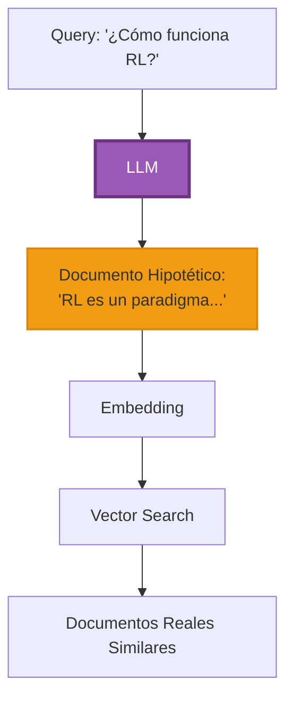

# Parte 5: HyDE - Hypothetical Document Embeddings


## 📖 Índice
1. [Fundamentos Conceptuales](#fundamentos-conceptuales)
2. [Cómo Funciona HyDE](#cómo-funciona-hyde)
3. [Implementación Práctica](#implementación-práctica)
4. [Casos de Uso y Limitaciones](#casos-de-uso-y-limitaciones)

---

## 🎯 Fundamentos Conceptuales

### El Problema que Resuelve HyDE

En RAG tradicional, embedeamos la **pregunta del usuario** y buscamos documentos similares. Pero las preguntas y las respuestas tienen estructuras lingüísticas muy diferentes:

```python
# Problema tradicional
query = "¿Cómo funciona el aprendizaje por refuerzo?"
# Embedding de una pregunta (corta, interrogativa)

document = """
El aprendizaje por refuerzo es un paradigma de machine learning donde
un agente aprende a tomar decisiones mediante interacción con un entorno.
El agente recibe recompensas por acciones correctas y penalizaciones por
acciones incorrectas, optimizando su política a lo largo del tiempo.
"""
# Embedding de una respuesta (larga, declarativa)

# La similitud puede ser subóptima debido a la diferencia estructural
```

### La Solución HyDE

**HyDE** genera un **documento hipotético** que responde la pregunta, luego busca documentos similares a ese documento hipotético.



> [!IMPORTANT]
> **La clave de HyDE**: No importa si el documento hipotético es factualmente correcto. Lo que importa es que tenga la **estructura lingüística** y **vocabulario** similar a los documentos reales que contienen la respuesta.

---

## 🧠 Cómo Funciona HyDE

### Paso a Paso

1. **Usuario hace una pregunta**
   ```
   "¿Cuáles son las mejores prácticas para RAG?"
   ```

2. **LLM genera documento hipotético**
   ```
   "Las mejores prácticas para RAG incluyen: usar chunking semántico,
   implementar hybrid search combinando búsqueda vectorial con BM25,
   aplicar reranking con modelos cross-encoder, y mantener metadata rica..."
   ```

3. **Embedear documento hipotético**
   ```python
   hyp_embedding = embed(hypothetical_document)
   ```

4. **Buscar documentos similares al hipotético**
   ```python
   real_docs = vector_db.search(hyp_embedding, k=5)
   ```

5. **Usar documentos reales como contexto**
   ```python
   answer = llm.generate(query, context=real_docs)
   ```

### Comparación: RAG vs HyDE

| Aspecto | RAG Tradicional | HyDE |
|---------|-----------------|------|
| **Embedding** | Pregunta del usuario | Documento hipotético |
| **Estructura** | Interrogativa, corta | Declarativa, detallada |
| **Vocabulario** | Puede no coincidir | Más similar a docs reales |
| **Precisión** | Buena | Mejor (10-20% mejora) |
| **Latencia** | Baja | Media (requiere LLM call extra) |
| **Costo** | Bajo | Medio (LLM call adicional) |

---

## 💻 Implementación Práctica

### Ejemplo 1: HyDE Básico con LangChain

```python
"""
Ejemplo Básico: HyDE con LangChain
Framework: LangChain
Objetivo: Implementar HyDE para mejorar retrieval
"""

from langchain.chains import HypotheticalDocumentEmbedder
from langchain_openai import OpenAI, OpenAIEmbeddings
from langchain.prompts import PromptTemplate
from langchain_chroma import Chroma


# 1. Setup base embeddings
base_embeddings = OpenAIEmbeddings(model="text-embedding-3-small")

# 2. Setup LLM para generar documentos hipotéticos
llm = OpenAI(model="gpt-3.5-turbo-instruct", temperature=0)

# 3. Prompt para generar documento hipotético
prompt_template = """
Por favor, escribe un párrafo que responda la siguiente pregunta:

Pregunta: {question}

Párrafo:
"""

prompt = PromptTemplate(
    input_variables=["question"],
    template=prompt_template
)

# 4. Crear HyDE embedder
hyde_embeddings = HypotheticalDocumentEmbedder(
    llm_chain=prompt | llm,
    base_embeddings=base_embeddings
)

# 5. Crear vectorstore con HyDE
documents = [
    "RAG combina recuperación de información con generación de lenguaje natural.",
    "Los embeddings vectoriales capturan el significado semántico del texto.",
    "Hybrid search combina búsqueda vectorial con búsqueda por keywords.",
]

vectorstore = Chroma.from_texts(
    documents,
    hyde_embeddings  # Usar HyDE embeddings
)

# 6. Búsqueda con HyDE
query = "¿Qué es RAG?"

# Internamente:
# 1. LLM genera: "RAG es una técnica que combina..."
# 2. Embedea el documento hipotético
# 3. Busca documentos similares

results = vectorstore.similarity_search(query, k=2)

print("Resultados con HyDE:")
for i, doc in enumerate(results, 1):
    print(f"{i}. {doc.page_content}")
```

### Ejemplo 2: HyDE Multi-Shot (Múltiples Hipótesis)

```python
"""
Ejemplo Intermedio: Multi-Shot HyDE
Objetivo: Generar múltiples documentos hipotéticos y promediar embeddings
"""

from langchain_openai import ChatOpenAI, OpenAIEmbeddings
from langchain.prompts import ChatPromptTemplate
from langchain_chroma import Chroma
import numpy as np
from typing import List


class MultiShotHyDE:
    """
    HyDE que genera múltiples documentos hipotéticos
    y promedia sus embeddings para mayor robustez.
    """
    
    def __init__(self, num_hypotheses: int = 3):
        self.num_hypotheses = num_hypotheses
        self.llm = ChatOpenAI(model="gpt-4o-mini", temperature=0.7)
        self.embeddings = OpenAIEmbeddings(model="text-embedding-3-small")
        
        self.prompt = ChatPromptTemplate.from_messages([
            ("system", """Eres un experto que genera respuestas detalladas.
            Genera un párrafo informativo que responda la pregunta."""),
            ("human", "{question}")
        ])
    
    def generate_hypotheses(self, query: str) -> List[str]:
        """Genera múltiples documentos hipotéticos"""
        
        hypotheses = []
        
        for i in range(self.num_hypotheses):
            chain = self.prompt | self.llm
            response = chain.invoke({"question": query})
            hypotheses.append(response.content)
        
        return hypotheses
    
    def embed_query(self, query: str) -> List[float]:
        """Embedea query usando promedio de múltiples hipótesis"""
        
        # Generar hipótesis
        hypotheses = self.generate_hypotheses(query)
        
        print(f"📝 Generadas {len(hypotheses)} hipótesis:")
        for i, hyp in enumerate(hypotheses, 1):
            print(f"\n{i}. {hyp[:100]}...")
        
        # Embedear cada hipótesis
        hypothesis_embeddings = self.embeddings.embed_documents(hypotheses)
        
        # Promediar embeddings
        avg_embedding = np.mean(hypothesis_embeddings, axis=0)
        
        return avg_embedding.tolist()


# Uso
if __name__ == "__main__":
    # Crear documentos
    documents = [
        "Machine learning es un subcampo de la inteligencia artificial",
        "Deep learning usa redes neuronales profundas",
        "RAG combina retrieval con generation para mejorar respuestas"
    ]
    
    # Setup vectorstore normal
    normal_embeddings = OpenAIEmbeddings()
    vectorstore = Chroma.from_texts(documents, normal_embeddings)
    
    # Query
    query = "¿Qué es machine learning?"
    
    # Búsqueda con Multi-Shot HyDE
    multi_hyde = MultiShotHyDE(num_hypotheses=3)
    hyde_embedding = multi_hyde.embed_query(query)
    
    # Buscar usando embedding de HyDE
    results = vectorstore.similarity_search_by_vector(hyde_embedding, k=2)
    
    print("\n" + "="*80)
    print("RESULTADOS:")
    print("="*80)
    for i, doc in enumerate(results, 1):
        print(f"\n{i}. {doc.page_content}")
```

### Ejemplo 3: HyDE Adaptativo con Fallback

```python
"""
Ejemplo Avanzado: HyDE Adaptativo
Objetivo: Usar HyDE solo cuando mejora resultados, sino usar RAG tradicional
"""

from langchain_openai import ChatOpenAI, OpenAIEmbeddings
from langchain.prompts import ChatPromptTemplate
from langchain_chroma import Chroma
from langchain.schema import Document
import numpy as np
from typing import List, Tuple


class AdaptiveHyDE:
    """
    Sistema que decide automáticamente si usar HyDE o RAG tradicional
    basado en la confianza de los resultados.
    """
    
    def __init__(self, confidence_threshold: float = 0.75):
        self.confidence_threshold = confidence_threshold
        self.llm = ChatOpenAI(model="gpt-4o-mini", temperature=0)
        self.embeddings = OpenAIEmbeddings(model="text-embedding-3-small")
        
        self.hyde_prompt = ChatPromptTemplate.from_messages([
            ("system", "Genera un párrafo detallado que responda esta pregunta:"),
            ("human", "{question}")
        ])
    
    def traditional_search(
        self, 
        vectorstore: Chroma, 
        query: str, 
        k: int = 5
    ) -> Tuple[List[Document], List[float]]:
        """Búsqueda RAG tradicional"""
        
        results = vectorstore.similarity_search_with_score(query, k=k)
        docs = [doc for doc, _ in results]
        scores = [score for _, score in results]
        
        return docs, scores
    
    def hyde_search(
        self, 
        vectorstore: Chroma, 
        query: str, 
        k: int = 5
    ) -> Tuple[List[Document], List[float]]:
        """Búsqueda con HyDE"""
        
        # Generar documento hipotético
        chain = self.hyde_prompt | self.llm
        response = chain.invoke({"question": query})
        hypothetical_doc = response.content
        
        print(f"📄 Documento hipotético generado:")
        print(f"   {hypothetical_doc[:150]}...\n")
        
        # Embedear documento hipotético
        hyp_embedding = self.embeddings.embed_query(hypothetical_doc)
        
        # Buscar
        results = vectorstore.similarity_search_by_vector_with_relevance_scores(
            hyp_embedding, 
            k=k
        )
        
        docs = [doc for doc, _ in results]
        scores = [score for _, score in results]
        
        return docs, scores
    
    def adaptive_search(
        self, 
        vectorstore: Chroma, 
        query: str, 
        k: int = 5
    ) -> Tuple[List[Document], str]:
        """
        Búsqueda adaptativa: intenta tradicional primero,
        usa HyDE si confianza es baja.
        """
        
        # Intentar búsqueda tradicional
        trad_docs, trad_scores = self.traditional_search(vectorstore, query, k)
        
        # Evaluar confianza (score del mejor resultado)
        best_score = max(trad_scores) if trad_scores else 0
        
        print(f"🔍 Búsqueda tradicional - Mejor score: {best_score:.4f}")
        
        # Si confianza es alta, usar resultados tradicionales
        if best_score >= self.confidence_threshold:
            print("✅ Confianza alta - Usando RAG tradicional\n")
            return trad_docs, "traditional"
        
        # Si confianza es baja, usar HyDE
        print("⚠️  Confianza baja - Activando HyDE...\n")
        hyde_docs, hyde_scores = self.hyde_search(vectorstore, query, k)
        
        hyde_best_score = max(hyde_scores) if hyde_scores else 0
        print(f"🎯 HyDE - Mejor score: {hyde_best_score:.4f}")
        
        # Comparar y retornar mejor opción
        if hyde_best_score > best_score:
            print("✅ HyDE mejoró resultados\n")
            return hyde_docs, "hyde"
        else:
            print("ℹ️  HyDE no mejoró, usando tradicional\n")
            return trad_docs, "traditional"


# Demostración
if __name__ == "__main__":
    # Crear documentos
    documents = [
        Document(
            page_content="El aprendizaje por refuerzo es un paradigma de ML donde un agente aprende mediante interacción con un entorno.",
            metadata={"source": "ml_book.pdf"}
        ),
        Document(
            page_content="Las redes neuronales convolucionales son efectivas para procesamiento de imágenes.",
            metadata={"source": "dl_guide.pdf"}
        ),
        Document(
            page_content="RAG combina recuperación de información con generación para respuestas más precisas.",
            metadata={"source": "rag_paper.pdf"}
        ),
    ]
    
    # Crear vectorstore
    embeddings = OpenAIEmbeddings()
    vectorstore = Chroma.from_documents(documents, embeddings)
    
    # Sistema adaptativo
    adaptive_hyde = AdaptiveHyDE(confidence_threshold=0.75)
    
    # Queries de prueba
    queries = [
        "¿Qué es reinforcement learning?",  # Debería usar HyDE (términos técnicos)
        "RAG systems",  # Debería usar tradicional (match directo)
    ]
    
    for query in queries:
        print("=" * 80)
        print(f"QUERY: {query}")
        print("=" * 80 + "\n")
        
        results, method = adaptive_hyde.adaptive_search(vectorstore, query, k=2)
        
        print(f"Método usado: {method.upper()}")
        print("\nResultados:")
        for i, doc in enumerate(results, 1):
            print(f"{i}. {doc.page_content[:100]}...")
        
        print("\n")
```

---

## 🎯 Casos de Uso y Limitaciones

### Cuándo Usar HyDE

✅ **Queries técnicas con terminología específica**
```python
query = "¿Cómo implementar backpropagation en una red neuronal?"
# HyDE genera respuesta técnica con vocabulario correcto
```

✅ **Preguntas conceptuales amplias**
```python
query = "Explica el concepto de overfitting"
# HyDE genera explicación detallada similar a documentación
```

✅ **Búsquedas en dominios especializados**
```python
query = "¿Cuáles son los síntomas de la diabetes tipo 2?"
# HyDE genera respuesta médica con terminología apropiada
```

### Cuándo NO Usar HyDE

❌ **Búsquedas de hechos específicos**
```python
query = "¿Cuál es la capital de Francia?"
# RAG tradicional es suficiente y más rápido
```

❌ **Queries con keywords exactos**
```python
query = "error: ModuleNotFoundError numpy"
# Mejor usar keyword search (BM25)
```

❌ **Restricciones de latencia estrictas**
```python
# HyDE añade ~500ms-1s por el LLM call adicional
# Si necesitas <100ms, usa RAG tradicional
```

### Limitaciones

1. **Costo adicional**: Requiere LLM call extra
2. **Latencia**: Añade tiempo de generación
3. **Alucinaciones**: Documento hipotético puede ser incorrecto (pero aún útil)
4. **Dependencia de LLM**: Calidad depende del modelo usado

---

## 🎯 Resumen

### Lo que Aprendimos

✅ **HyDE** genera documentos hipotéticos para mejorar retrieval  
✅ **Mejora 10-20%** en precisión para queries complejas  
✅ **Multi-Shot HyDE** usa múltiples hipótesis para robustez  
✅ **HyDE Adaptativo** decide cuándo usar HyDE vs RAG tradicional  
✅ **Trade-off**: Mejor precisión vs mayor latencia/costo  

### Próximo Paso

Con retrieval optimizado mediante HyDE, el siguiente paso es implementar **sistemas de memoria** para conversaciones contextuales.

➡️ **[Continuar a Parte 6: Memory Systems](06_memory.md)**

---

<div align="center">

**[⬅️ Anterior: Vector Databases](04_vector_databases.md)** | **[Volver al Módulo 5](README.md)** | **[Siguiente: Memory ➡️](06_memory.md)**

</div>
