```mermaid
graph TD
    A[Query 1: '¿Qué es RAG?'] --> B[RAG System]
    B --> C[Response 1]
    C --> D[Memory Store]
    
    E[Query 2: '¿Cómo funciona?'] --> F[RAG System]
    D -.Contexto.-> F
    F --> G[Response 2<br/>Contexto: RAG]
    G --> D
    
    style D fill:#E74C3C,stroke:#C0392B,stroke-width:3px,color:#fff
```

# Parte 6: Memory Systems - Contexto Conversacional en RAG


## 📖 Índice
1. [Fundamentos Conceptuales](#fundamentos-conceptuales)
2. [Tipos de Memoria](#tipos-de-memoria)
3. [Implementación con LangChain](#implementación-con-langchain)
4. [Memory Avanzada](#memory-avanzada)

---

## 🎯 Fundamentos Conceptuales

### ¿Por Qué Memoria en RAG?

Los sistemas RAG básicos son **stateless** - cada query es independiente. Pero las conversaciones reales tienen **contexto**:

```python
# Sin memoria (cada query es independiente)
User: "¿Qué es RAG?"
Bot: "RAG es Retrieval-Augmented Generation..."

User: "¿Cómo funciona?"  # ❌ Bot no sabe que "funciona" se refiere a RAG
Bot: "¿Cómo funciona qué?"

# Con memoria (contexto conversacional)
User: "¿Qué es RAG?"
Bot: "RAG es Retrieval-Augmented Generation..."

User: "¿Cómo funciona?"  # ✅ Bot recuerda que hablamos de RAG
Bot: "RAG funciona en 3 pasos: 1) Recupera documentos relevantes..."
```



---

## 🧠 Tipos de Memoria

### 1. **Conversation Buffer Memory** (Básica)

Almacena toda la conversación en memoria.

```python
"""
Conversation Buffer Memory: Almacena historial completo
Ideal para: Conversaciones cortas (<10 mensajes)
"""

from langchain.memory import ConversationBufferMemory
from langchain_openai import ChatOpenAI
from langchain.chains import ConversationChain


# Crear memoria
memory = ConversationBufferMemory()

# Crear chain conversacional
llm = ChatOpenAI(model="gpt-4o-mini")
conversation = ConversationChain(
    llm=llm,
    memory=memory,
    verbose=True  # Ver el prompt completo
)

# Conversación
response1 = conversation.predict(input="Hola, soy Juan")
print(f"Bot: {response1}")

response2 = conversation.predict(input="¿Cuál es mi nombre?")
print(f"Bot: {response2}")  # "Tu nombre es Juan"

# Ver historial
print("\nHistorial completo:")
print(memory.load_memory_variables({}))
```

**Ventajas**: Simple, preserva todo  
**Desventajas**: Crece indefinidamente, puede exceder límite de tokens

### 2. **Conversation Buffer Window Memory** (Ventana Deslizante)

Mantiene solo los últimos N mensajes.

```python
"""
Buffer Window Memory: Solo últimos K mensajes
Ideal para: Conversaciones largas con contexto reciente
"""

from langchain.memory import ConversationBufferWindowMemory


# Mantener solo últimos 3 intercambios (6 mensajes)
memory = ConversationBufferWindowMemory(k=3)

conversation = ConversationChain(
    llm=llm,
    memory=memory
)

# Conversación larga
messages = [
    "Mi color favorito es azul",
    "Tengo un perro llamado Max",
    "Vivo en Madrid",
    "Trabajo como ingeniero",
    "¿Cuál es mi color favorito?"  # Fuera de ventana, no recordará
]

for msg in messages:
    response = conversation.predict(input=msg)
    print(f"User: {msg}")
    print(f"Bot: {response}\n")
```

**Ventajas**: Memoria acotada, no crece indefinidamente  
**Desventajas**: Pierde contexto antiguo

### 3. **Conversation Summary Memory** (Resumen)

Usa un LLM para resumir la conversación.

```python
"""
Summary Memory: Resume conversación para ahorrar tokens
Ideal para: Conversaciones muy largas
"""

from langchain.memory import ConversationSummaryMemory


# Crear memoria con resumen
memory = ConversationSummaryMemory(
    llm=llm,
    return_messages=True
)

conversation = ConversationChain(
    llm=llm,
    memory=memory
)

# Conversación larga
conversation.predict(input="Estoy planeando un viaje a Japón en primavera")
conversation.predict(input="Me interesa visitar templos y probar la comida local")
conversation.predict(input="Tengo un presupuesto de $3000")

# El resumen se actualiza automáticamente
print("Resumen de la conversación:")
print(memory.load_memory_variables({}))
```

**Ventajas**: Maneja conversaciones muy largas  
**Desventajas**: Costo adicional (LLM calls para resumir), puede perder detalles

### 4. **Vector Store-Backed Memory** (Semántica)

Almacena conversación en vector store para retrieval semántico.

```python
"""
Vector Store Memory: Recupera contexto relevante semánticamente
Ideal para: Conversaciones con muchos temas diferentes
"""

from langchain.memory import VectorStoreRetrieverMemory
from langchain_chroma import Chroma
from langchain_openai import OpenAIEmbeddings


# Crear vector store para memoria
embeddings = OpenAIEmbeddings()
vectorstore = Chroma(
    collection_name="conversation_memory",
    embedding_function=embeddings
)

# Crear memoria vectorial
memory = VectorStoreRetrieverMemory(
    retriever=vectorstore.as_retriever(search_kwargs={"k": 3})
)

# Guardar información
memory.save_context(
    {"input": "Mi lenguaje de programación favorito es Python"},
    {"output": "Interesante, Python es muy popular para IA"}
)

memory.save_context(
    {"input": "También me gusta JavaScript para web"},
    {"output": "JavaScript es esencial para desarrollo frontend"}
)

memory.save_context(
    {"input": "Estoy aprendiendo Rust"},
    {"output": "Rust es excelente para sistemas de alto rendimiento"}
)

# Recuperar contexto relevante
query = "¿Qué lenguajes me gustan?"
relevant_context = memory.load_memory_variables({"prompt": query})

print("Contexto recuperado:")
print(relevant_context)
```

**Ventajas**: Escala a conversaciones muy largas, recupera solo contexto relevante  
**Desventajas**: Más complejo, puede perder orden temporal

---

## 💻 Implementación con LangChain

### Ejemplo 1: RAG con Conversation Memory

```python
"""
Ejemplo Básico: RAG + Conversation Memory
Objetivo: Sistema RAG que recuerda conversación
"""

from langchain_openai import ChatOpenAI, OpenAIEmbeddings
from langchain_chroma import Chroma
from langchain.chains import ConversationalRetrievalChain
from langchain.memory import ConversationBufferMemory
from langchain.schema import Document


# 1. Crear knowledge base
documents = [
    Document(page_content="RAG combina recuperación con generación"),
    Document(page_content="Los embeddings capturan significado semántico"),
    Document(page_content="Vector databases permiten búsqueda eficiente"),
]

embeddings = OpenAIEmbeddings()
vectorstore = Chroma.from_documents(documents, embeddings)

# 2. Crear memoria conversacional
memory = ConversationBufferMemory(
    memory_key="chat_history",
    return_messages=True,
    output_key="answer"  # Importante para ConversationalRetrievalChain
)

# 3. Crear chain RAG conversacional
llm = ChatOpenAI(model="gpt-4o-mini", temperature=0)

qa_chain = ConversationalRetrievalChain.from_llm(
    llm=llm,
    retriever=vectorstore.as_retriever(),
    memory=memory,
    return_source_documents=True
)

# 4. Conversación
print("=" * 80)
print("RAG CONVERSACIONAL")
print("=" * 80 + "\n")

queries = [
    "¿Qué es RAG?",
    "¿Cómo funciona?",  # Referencia anafórica a "RAG"
    "¿Qué son los embeddings?",
    "¿Cómo se relacionan con lo anterior?"  # Referencia al contexto
]

for query in queries:
    print(f"User: {query}")
    
    result = qa_chain.invoke({"question": query})
    
    print(f"Bot: {result['answer']}")
    print(f"Fuentes: {[doc.page_content[:50] for doc in result['source_documents']]}")
    print()
```

### Ejemplo 2: Memory Híbrida (Buffer + Summary)

```python
"""
Ejemplo Intermedio: Memoria Híbrida
Objetivo: Combinar buffer reciente con resumen de historia antigua
"""

from langchain.memory import ConversationSummaryBufferMemory


class HybridMemoryRAG:
    """RAG con memoria híbrida: buffer reciente + resumen antiguo"""
    
    def __init__(self, max_token_limit: int = 500):
        self.llm = ChatOpenAI(model="gpt-4o-mini")
        
        # Memoria híbrida
        self.memory = ConversationSummaryBufferMemory(
            llm=self.llm,
            max_token_limit=max_token_limit,  # Cuando excede, resume lo antiguo
            memory_key="chat_history",
            return_messages=True
        )
        
        # Setup vectorstore
        embeddings = OpenAIEmbeddings()
        self.vectorstore = Chroma.from_documents(documents, embeddings)
        
        # Chain
        self.qa_chain = ConversationalRetrievalChain.from_llm(
            llm=self.llm,
            retriever=self.vectorstore.as_retriever(),
            memory=self.memory,
            return_source_documents=True
        )
    
    def chat(self, query: str) -> dict:
        """Procesa query con memoria híbrida"""
        
        result = self.qa_chain.invoke({"question": query})
        
        # Mostrar estado de memoria
        memory_state = self.memory.load_memory_variables({})
        
        print(f"\n📊 Estado de memoria:")
        print(f"   Mensajes en buffer: {len(memory_state.get('chat_history', []))}")
        
        return result


# Uso
if __name__ == "__main__":
    rag_system = HybridMemoryRAG(max_token_limit=500)
    
    # Conversación larga
    queries = [
        "¿Qué es machine learning?",
        "Dame ejemplos de algoritmos",
        "¿Cuál es la diferencia con deep learning?",
        "Explica las redes neuronales",
        "¿Cómo se entrenan?",
        "Volviendo al principio, ¿qué era machine learning?"  # Debe recordar
    ]
    
    for query in queries:
        print(f"\nUser: {query}")
        result = rag_system.chat(query)
        print(f"Bot: {result['answer']}")
```

---

## 🚀 Memory Avanzada

### Ejemplo 3: Entity Memory (Memoria de Entidades)

```python
"""
Ejemplo Avanzado: Entity Memory
Objetivo: Recordar entidades específicas (personas, lugares, conceptos)
"""

from langchain.memory import ConversationEntityMemory
from langchain.chains import ConversationChain


# Memoria de entidades
memory = ConversationEntityMemory(llm=llm)

conversation = ConversationChain(
    llm=llm,
    memory=memory,
    verbose=True
)

# Conversación con entidades
conversation.predict(input="Juan trabaja en Google como ingeniero de ML")
conversation.predict(input="María es la CEO de una startup de IA en Barcelona")
conversation.predict(input="¿Dónde trabaja Juan?")

# Ver entidades almacenadas
print("\nEntidades recordadas:")
print(memory.entity_store.store)
```

### Ejemplo 4: Memory Personalizada para RAG Profesional

```python
"""
Ejemplo Avanzado: Sistema de Memoria Profesional
Objetivo: Memoria multi-nivel con persistencia
"""

from langchain.memory import ConversationBufferMemory
from langchain_chroma import Chroma
from langchain_openai import ChatOpenAI, OpenAIEmbeddings
from langchain.chains import ConversationalRetrievalChain
from langchain.schema import Document
from datetime import datetime
import json
from pathlib import Path
from typing import List, Dict


class ProfessionalMemorySystem:
    """
    Sistema de memoria profesional con:
    - Memoria conversacional (corto plazo)
    - Memoria vectorial (largo plazo)
    - Persistencia en disco
    - Metadata temporal
    """
    
    def __init__(self, user_id: str, persist_dir: str = "./memory"):
        self.user_id = user_id
        self.persist_dir = Path(persist_dir) / user_id
        self.persist_dir.mkdir(parents=True, exist_ok=True)
        
        self.llm = ChatOpenAI(model="gpt-4o-mini")
        self.embeddings = OpenAIEmbeddings()
        
        # Memoria conversacional (sesión actual)
        self.session_memory = ConversationBufferMemory(
            memory_key="chat_history",
            return_messages=True,
            output_key="answer"
        )
        
        # Memoria vectorial (largo plazo)
        self.long_term_memory = Chroma(
            collection_name=f"user_{user_id}_memory",
            embedding_function=self.embeddings,
            persist_directory=str(self.persist_dir / "vector_memory")
        )
        
        # Cargar historial si existe
        self._load_session_history()
    
    def _load_session_history(self):
        """Carga historial de sesiones anteriores"""
        history_file = self.persist_dir / "session_history.json"
        
        if history_file.exists():
            with open(history_file, "r") as f:
                history = json.load(f)
                # Cargar últimas N interacciones
                for interaction in history[-5:]:  # Últimas 5
                    self.session_memory.save_context(
                        {"input": interaction["input"]},
                        {"output": interaction["output"]}
                    )
    
    def _save_to_long_term(self, query: str, answer: str, sources: List[Document]):
        """Guarda interacción en memoria de largo plazo"""
        
        # Crear documento de la interacción
        interaction_doc = Document(
            page_content=f"Q: {query}\nA: {answer}",
            metadata={
                "user_id": self.user_id,
                "timestamp": datetime.now().isoformat(),
                "sources": [doc.page_content[:100] for doc in sources]
            }
        )
        
        # Guardar en vector store
        self.long_term_memory.add_documents([interaction_doc])
    
    def _save_session_history(self):
        """Persiste historial de sesión"""
        history_file = self.persist_dir / "session_history.json"
        
        # Obtener historial actual
        memory_vars = self.session_memory.load_memory_variables({})
        chat_history = memory_vars.get("chat_history", [])
        
        # Convertir a formato serializable
        history = []
        for i in range(0, len(chat_history), 2):
            if i + 1 < len(chat_history):
                history.append({
                    "input": chat_history[i].content,
                    "output": chat_history[i + 1].content,
                    "timestamp": datetime.now().isoformat()
                })
        
        # Guardar
        with open(history_file, "w") as f:
            json.dump(history, f, indent=2)
    
    def query(self, question: str, knowledge_base: Chroma) -> Dict:
        """
        Procesa query con memoria multi-nivel
        """
        
        # 1. Buscar en memoria de largo plazo (interacciones pasadas similares)
        past_interactions = self.long_term_memory.similarity_search(
            question, 
            k=2
        )
        
        # 2. Crear chain con knowledge base + memoria de sesión
        qa_chain = ConversationalRetrievalChain.from_llm(
            llm=self.llm,
            retriever=knowledge_base.as_retriever(),
            memory=self.session_memory,
            return_source_documents=True
        )
        
        # 3. Generar respuesta
        result = qa_chain.invoke({"question": question})
        
        # 4. Guardar en memoria de largo plazo
        self._save_to_long_term(
            question,
            result["answer"],
            result["source_documents"]
        )
        
        # 5. Persistir sesión
        self._save_session_history()
        
        # 6. Añadir interacciones pasadas relevantes al resultado
        result["past_interactions"] = past_interactions
        
        return result


# Uso
if __name__ == "__main__":
    # Crear knowledge base
    docs = [
        Document(page_content="Python es un lenguaje de programación interpretado"),
        Document(page_content="Machine learning es un subcampo de la IA"),
    ]
    
    embeddings = OpenAIEmbeddings()
    knowledge_base = Chroma.from_documents(docs, embeddings)
    
    # Sistema de memoria para usuario
    memory_system = ProfessionalMemorySystem(user_id="user_123")
    
    # Conversación
    queries = [
        "¿Qué es Python?",
        "¿Para qué se usa?",
        "¿Qué es machine learning?"
    ]
    
    for query in queries:
        print(f"\nUser: {query}")
        result = memory_system.query(query, knowledge_base)
        print(f"Bot: {result['answer']}")
        
        if result['past_interactions']:
            print(f"\n📚 Interacciones pasadas relevantes:")
            for doc in result['past_interactions']:
                print(f"   - {doc.page_content[:100]}...")
```

---

## 🎯 Resumen

### Lo que Aprendimos

✅ **Memoria** permite contexto conversacional en RAG  
✅ **Tipos**: Buffer, Window, Summary, Vector-backed, Entity  
✅ **Trade-offs**: Precisión vs Costo vs Complejidad  
✅ **Memoria híbrida** combina buffer reciente + resumen antiguo  
✅ **Persistencia** permite memoria entre sesiones  

### Comparación de Tipos de Memoria

| Tipo | Contexto | Escalabilidad | Costo | Uso |
|------|----------|---------------|-------|-----|
| **Buffer** | Completo | ❌ Baja | 💰 Bajo | Conversaciones cortas |
| **Window** | Reciente | ⚠️ Media | 💰 Bajo | Conversaciones medias |
| **Summary** | Resumido | ✅ Alta | 💰💰 Medio | Conversaciones largas |
| **Vector** | Semántico | ✅ Muy Alta | 💰💰 Medio | Multi-tema |
| **Entity** | Entidades | ✅ Alta | 💰💰💰 Alto | Tracking de info específica |

### Próximo Paso

Con memoria implementada, el paso final es añadir **supervisión humana** para garantizar calidad y seguridad.

➡️ **[Continuar a Parte 7: Human-in-the-Loop](07_human_in_loop.md)**

---

<div align="center">

**[⬅️ Anterior: HyDE](05_hyde.md)** | **[Volver al Módulo 5](README.md)** | **[Siguiente: Human-in-the-Loop ➡️](07_human_in_loop.md)**

</div>
