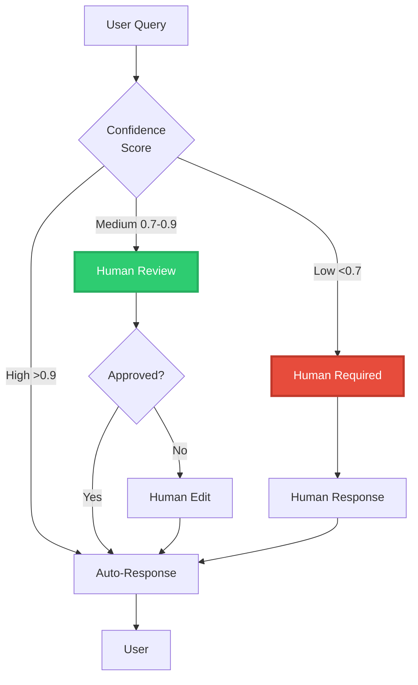

# Parte 7: Human-in-the-Loop - Supervisión y Mejora Continua


## 📖 Índice
1. [Fundamentos Conceptuales](#fundamentos-conceptuales)
2. [Patrones de HITL](#patrones-de-hitl)
3. [Implementación Profesional](#implementación-profesional)
4. [Active Learning y Mejora Continua](#active-learning-y-mejora-continua)

---

## 🎯 Fundamentos Conceptuales

### ¿Por Qué Human-in-the-Loop?

Los sistemas RAG, por avanzados que sean, pueden:
- ❌ Generar respuestas incorrectas (alucinaciones)
- ❌ Recuperar documentos irrelevantes
- ❌ Malinterpretar queries ambiguas
- ❌ Violar políticas de contenido

**Human-in-the-Loop (HITL)** añade supervisión humana en puntos críticos del pipeline.



> [!IMPORTANT]
> **HITL no es un fracaso del sistema**, es una característica de producción. Los mejores sistemas RAG combinan automatización con supervisión humana estratégica.

---

## 🔄 Patrones de HITL

### 1. **Pre-Generation Review** (Validación de Query)

Validar la query del usuario antes de procesarla.

```python
"""
Pre-Generation Review: Validar query antes de procesar
Casos de uso: Contenido sensible, compliance, seguridad
"""

from langchain_openai import ChatOpenAI
from langchain.prompts import ChatPromptTemplate
from typing import Literal, Optional


class QueryValidator:
    """Valida queries antes de procesarlas"""
    
    def __init__(self):
        self.llm = ChatOpenAI(model="gpt-4o-mini", temperature=0)
        
        self.validation_prompt = ChatPromptTemplate.from_messages([
            ("system", """Eres un validador de queries. Evalúa si la query es:
            1. SAFE: Apropiada y segura
            2. REVIEW: Requiere revisión humana
            3. REJECT: Inapropiada o peligrosa
            
            Responde solo con: SAFE, REVIEW, o REJECT
            Luego en nueva línea, explica brevemente por qué.
            """),
            ("human", "Query: {query}")
        ])
    
    def validate(self, query: str) -> dict:
        """Valida una query"""
        
        chain = self.validation_prompt | self.llm
        response = chain.invoke({"query": query})
        
        lines = response.content.strip().split("\n")
        status = lines[0].strip()
        reason = lines[1].strip() if len(lines) > 1 else ""
        
        return {
            "status": status,
            "reason": reason,
            "requires_human": status in ["REVIEW", "REJECT"]
        }


# Uso
if __name__ == "__main__":
    validator = QueryValidator()
    
    test_queries = [
        "¿Qué es machine learning?",  # SAFE
        "¿Cómo puedo hackear una cuenta?",  # REJECT
        "Información médica sobre tratamiento de cáncer",  # REVIEW (sensible)
    ]
    
    for query in test_queries:
        result = validator.validate(query)
        print(f"\nQuery: {query}")
        print(f"Status: {result['status']}")
        print(f"Razón: {result['reason']}")
        print(f"Requiere humano: {result['requires_human']}")
```

### 2. **Post-Generation Review** (Validación de Respuesta)

Validar la respuesta generada antes de mostrarla al usuario.

```python
"""
Post-Generation Review: Validar respuesta con confidence scoring
"""

from langchain_openai import ChatOpenAI
from langchain.prompts import ChatPromptTemplate


class ResponseValidator:
    """Valida respuestas generadas antes de entregarlas"""
    
    def __init__(self, confidence_threshold: float = 0.7):
        self.confidence_threshold = confidence_threshold
        self.llm = ChatOpenAI(model="gpt-4o-mini", temperature=0)
        
        self.validation_prompt = ChatPromptTemplate.from_messages([
            ("system", """Evalúa la calidad de esta respuesta RAG.
            
            Criterios:
            1. Relevancia: ¿Responde la pregunta?
            2. Precisión: ¿Es factualmente correcta según las fuentes?
            3. Completitud: ¿Es completa la respuesta?
            4. Seguridad: ¿Es apropiada y segura?
            
            Responde con un score de 0.0 a 1.0 en la primera línea.
            Luego explica tu evaluación.
            """),
            ("human", """Pregunta: {question}
            
Fuentes:
{sources}

Respuesta generada:
{answer}
            """)
        ])
    
    def validate(self, question: str, answer: str, sources: list) -> dict:
        """Valida una respuesta generada"""
        
        sources_text = "\n".join([f"- {src}" for src in sources])
        
        chain = self.validation_prompt | self.llm
        response = chain.invoke({
            "question": question,
            "answer": answer,
            "sources": sources_text
        })
        
        lines = response.content.strip().split("\n")
        
        try:
            confidence = float(lines[0].strip())
        except:
            confidence = 0.5
        
        explanation = "\n".join(lines[1:]).strip()
        
        return {
            "confidence": confidence,
            "explanation": explanation,
            "requires_review": confidence < self.confidence_threshold,
            "approved": confidence >= self.confidence_threshold
        }


# Uso
if __name__ == "__main__":
    validator = ResponseValidator(confidence_threshold=0.7)
    
    # Caso 1: Respuesta buena
    result = validator.validate(
        question="¿Qué es Python?",
        answer="Python es un lenguaje de programación interpretado, de alto nivel y de propósito general.",
        sources=[
            "Python es un lenguaje interpretado",
            "Python es de alto nivel y versátil"
        ]
    )
    
    print(f"Confidence: {result['confidence']:.2f}")
    print(f"Requiere revisión: {result['requires_review']}")
    print(f"Explicación: {result['explanation']}")
```

### 3. **Feedback Loop** (Retroalimentación Continua)

Capturar feedback del usuario para mejorar el sistema.

```python
"""
Feedback Loop: Capturar y usar feedback de usuarios
"""

from datetime import datetime
import json
from pathlib import Path
from typing import Literal


class FeedbackSystem:
    """Sistema de feedback para mejora continua"""
    
    def __init__(self, feedback_dir: str = "./feedback"):
        self.feedback_dir = Path(feedback_dir)
        self.feedback_dir.mkdir(exist_ok=True)
        self.feedback_file = self.feedback_dir / "feedback.jsonl"
    
    def collect_feedback(
        self,
        query: str,
        response: str,
        sources: list,
        rating: Literal["positive", "negative", "neutral"],
        user_comment: str = "",
        corrected_response: str = ""
    ):
        """Recolecta feedback de usuario"""
        
        feedback_entry = {
            "timestamp": datetime.now().isoformat(),
            "query": query,
            "response": response,
            "sources": sources,
            "rating": rating,
            "user_comment": user_comment,
            "corrected_response": corrected_response
        }
        
        # Guardar en JSONL (una línea por feedback)
        with open(self.feedback_file, "a") as f:
            f.write(json.dumps(feedback_entry, ensure_ascii=False) + "\n")
        
        print(f"✅ Feedback guardado: {rating}")
    
    def get_negative_feedback(self, limit: int = 10) -> list:
        """Obtiene feedback negativo para análisis"""
        
        if not self.feedback_file.exists():
            return []
        
        negative_feedback = []
        
        with open(self.feedback_file, "r") as f:
            for line in f:
                entry = json.loads(line)
                if entry["rating"] == "negative":
                    negative_feedback.append(entry)
                    
                    if len(negative_feedback) >= limit:
                        break
        
        return negative_feedback
    
    def get_feedback_stats(self) -> dict:
        """Estadísticas de feedback"""
        
        if not self.feedback_file.exists():
            return {"total": 0}
        
        stats = {
            "total": 0,
            "positive": 0,
            "negative": 0,
            "neutral": 0
        }
        
        with open(self.feedback_file, "r") as f:
            for line in f:
                entry = json.loads(line)
                stats["total"] += 1
                stats[entry["rating"]] += 1
        
        # Calcular porcentajes
        if stats["total"] > 0:
            stats["positive_rate"] = stats["positive"] / stats["total"]
            stats["negative_rate"] = stats["negative"] / stats["total"]
        
        return stats


# Uso
if __name__ == "__main__":
    feedback_system = FeedbackSystem()
    
    # Simular feedback de usuario
    feedback_system.collect_feedback(
        query="¿Qué es RAG?",
        response="RAG es Retrieval-Augmented Generation...",
        sources=["doc1.pdf", "doc2.pdf"],
        rating="positive",
        user_comment="Respuesta clara y precisa"
    )
    
    feedback_system.collect_feedback(
        query="¿Cómo funciona el transformer?",
        response="Un transformer es un modelo de deep learning...",
        sources=["paper.pdf"],
        rating="negative",
        user_comment="Respuesta demasiado técnica",
        corrected_response="Un transformer es una arquitectura que usa atención para procesar secuencias..."
    )
    
    # Ver estadísticas
    stats = feedback_system.get_feedback_stats()
    print(f"\n📊 Estadísticas de Feedback:")
    print(f"   Total: {stats['total']}")
    print(f"   Positivo: {stats.get('positive', 0)} ({stats.get('positive_rate', 0)*100:.1f}%)")
    print(f"   Negativo: {stats.get('negative', 0)} ({stats.get('negative_rate', 0)*100:.1f}%)")
```

---

## 💻 Implementación Profesional

### Sistema HITL Completo

```python
"""
Ejemplo Avanzado: Sistema RAG con HITL Completo
Incluye: Validación, Confidence Scoring, Feedback, Audit Trail
"""

from langchain_openai import ChatOpenAI, OpenAIEmbeddings
from langchain_chroma import Chroma
from langchain.chains import RetrievalQA
from langchain.schema import Document
from datetime import datetime
from typing import Optional, Literal
import json
from pathlib import Path


class ProfessionalHITLRAG:
    """
    Sistema RAG profesional con Human-in-the-Loop completo
    
    Características:
    - Validación de queries
    - Confidence scoring
    - Aprobación humana cuando es necesario
    - Feedback loop
    - Audit trail completo
    """
    
    def __init__(
        self,
        confidence_threshold: float = 0.7,
        auto_approve_threshold: float = 0.9,
        audit_dir: str = "./audit"
    ):
        self.confidence_threshold = confidence_threshold
        self.auto_approve_threshold = auto_approve_threshold
        self.audit_dir = Path(audit_dir)
        self.audit_dir.mkdir(exist_ok=True)
        
        # Components
        self.llm = ChatOpenAI(model="gpt-4o-mini", temperature=0)
        self.embeddings = OpenAIEmbeddings()
        
        # Validators
        self.query_validator = QueryValidator()
        self.response_validator = ResponseValidator(confidence_threshold)
        
        # Feedback system
        self.feedback_system = FeedbackSystem()
    
    def _log_interaction(self, interaction_data: dict):
        """Registra interacción en audit trail"""
        
        log_file = self.audit_dir / f"audit_{datetime.now().strftime('%Y%m%d')}.jsonl"
        
        with open(log_file, "a") as f:
            f.write(json.dumps(interaction_data, ensure_ascii=False) + "\n")
    
    def _calculate_confidence(
        self,
        query: str,
        answer: str,
        sources: list,
        retrieval_scores: list
    ) -> float:
        """Calcula confidence score combinando múltiples señales"""
        
        # 1. Retrieval confidence (promedio de scores)
        retrieval_conf = sum(retrieval_scores) / len(retrieval_scores) if retrieval_scores else 0
        
        # 2. Response validation
        validation = self.response_validator.validate(
            query,
            answer,
            [src.page_content for src in sources]
        )
        response_conf = validation["confidence"]
        
        # 3. Combinar (weighted average)
        combined_confidence = (retrieval_conf * 0.3) + (response_conf * 0.7)
        
        return combined_confidence
    
    def query(
        self,
        question: str,
        vectorstore: Chroma,
        user_id: str = "anonymous"
    ) -> dict:
        """
        Procesa query con HITL completo
        
        Returns:
            dict con:
            - answer: Respuesta (si aprobada)
            - confidence: Score de confianza
            - requires_human: Si requiere revisión humana
            - status: Estado del procesamiento
            - audit_id: ID para tracking
        """
        
        audit_id = f"{user_id}_{datetime.now().strftime('%Y%m%d%H%M%S')}"
        
        # 1. Validar query
        print(f"\n🔍 Validando query...")
        query_validation = self.query_validator.validate(question)
        
        if query_validation["status"] == "REJECT":
            result = {
                "answer": None,
                "confidence": 0.0,
                "requires_human": True,
                "status": "rejected",
                "reason": query_validation["reason"],
                "audit_id": audit_id
            }
            
            self._log_interaction({
                "audit_id": audit_id,
                "user_id": user_id,
                "query": question,
                "status": "rejected",
                "reason": query_validation["reason"],
                "timestamp": datetime.now().isoformat()
            })
            
            return result
        
        # 2. Recuperar documentos
        print(f"📚 Recuperando documentos...")
        retriever = vectorstore.as_retriever(search_kwargs={"k": 3})
        docs_with_scores = vectorstore.similarity_search_with_score(question, k=3)
        docs = [doc for doc, _ in docs_with_scores]
        scores = [score for _, score in docs_with_scores]
        
        # 3. Generar respuesta
        print(f"💬 Generando respuesta...")
        qa_chain = RetrievalQA.from_chain_type(
            llm=self.llm,
            retriever=retriever,
            return_source_documents=True
        )
        
        result_raw = qa_chain.invoke({"query": question})
        answer = result_raw["result"]
        sources = result_raw["source_documents"]
        
        # 4. Calcular confidence
        print(f"📊 Calculando confidence...")
        confidence = self._calculate_confidence(question, answer, sources, scores)
        
        print(f"   Confidence: {confidence:.2f}")
        
        # 5. Determinar si requiere aprobación humana
        if confidence >= self.auto_approve_threshold:
            status = "auto_approved"
            requires_human = False
            print(f"✅ Auto-aprobado (confidence >= {self.auto_approve_threshold})")
        
        elif confidence >= self.confidence_threshold:
            status = "pending_review"
            requires_human = True
            print(f"⚠️  Requiere revisión (confidence entre {self.confidence_threshold} y {self.auto_approve_threshold})")
        
        else:
            status = "requires_human"
            requires_human = True
            print(f"🚨 Requiere intervención humana (confidence < {self.confidence_threshold})")
        
        # 6. Preparar resultado
        result = {
            "answer": answer if not requires_human else None,
            "draft_answer": answer if requires_human else None,
            "confidence": confidence,
            "requires_human": requires_human,
            "status": status,
            "sources": [doc.page_content for doc in sources],
            "audit_id": audit_id
        }
        
        # 7. Log audit trail
        self._log_interaction({
            "audit_id": audit_id,
            "user_id": user_id,
            "query": question,
            "answer": answer,
            "confidence": confidence,
            "status": status,
            "sources": [doc.page_content[:100] for doc in sources],
            "timestamp": datetime.now().isoformat()
        })
        
        return result
    
    def approve_response(
        self,
        audit_id: str,
        approved: bool,
        edited_answer: Optional[str] = None,
        reviewer_notes: str = ""
    ):
        """Aprueba o rechaza una respuesta pendiente"""
        
        approval_data = {
            "audit_id": audit_id,
            "approved": approved,
            "edited_answer": edited_answer,
            "reviewer_notes": reviewer_notes,
            "timestamp": datetime.now().isoformat()
        }
        
        approval_file = self.audit_dir / "approvals.jsonl"
        with open(approval_file, "a") as f:
            f.write(json.dumps(approval_data, ensure_ascii=False) + "\n")
        
        print(f"✅ Aprobación registrada para {audit_id}")


# Demostración
if __name__ == "__main__":
    # Setup knowledge base
    documents = [
        Document(page_content="RAG combina recuperación con generación de lenguaje"),
        Document(page_content="Los sistemas RAG mejoran la precisión de los LLMs"),
        Document(page_content="Vector databases permiten búsqueda semántica eficiente"),
    ]
    
    embeddings = OpenAIEmbeddings()
    vectorstore = Chroma.from_documents(documents, embeddings)
    
    # Crear sistema HITL
    hitl_system = ProfessionalHITLRAG(
        confidence_threshold=0.7,
        auto_approve_threshold=0.9
    )
    
    # Queries de prueba
    test_queries = [
        ("¿Qué es RAG?", "user_001"),  # Alta confianza
        ("¿Cómo se implementa un transformer desde cero?", "user_002"),  # Baja confianza
    ]
    
    for query, user_id in test_queries:
        print("\n" + "=" * 80)
        print(f"USER {user_id}: {query}")
        print("=" * 80)
        
        result = hitl_system.query(query, vectorstore, user_id)
        
        print(f"\n📋 RESULTADO:")
        print(f"   Status: {result['status']}")
        print(f"   Confidence: {result['confidence']:.2f}")
        print(f"   Requiere humano: {result['requires_human']}")
        
        if result['answer']:
            print(f"   Respuesta: {result['answer'][:100]}...")
        elif result['draft_answer']:
            print(f"   Borrador: {result['draft_answer'][:100]}...")
            print(f"   ⏳ Esperando aprobación humana...")
            
            # Simular aprobación humana
            hitl_system.approve_response(
                audit_id=result['audit_id'],
                approved=True,
                reviewer_notes="Respuesta verificada y aprobada"
            )
```

---

## 🔄 Active Learning y Mejora Continua

### Sistema de Active Learning

```python
"""
Active Learning: Usar feedback para mejorar el sistema
"""

from langchain_openai import OpenAIEmbeddings
from langchain_chroma import Chroma
from langchain.schema import Document


class ActiveLearningRAG:
    """Sistema RAG que aprende de correcciones humanas"""
    
    def __init__(self):
        self.embeddings = OpenAIEmbeddings()
        self.feedback_system = FeedbackSystem()
        
        # Knowledge base principal
        self.main_kb = None
        
        # Knowledge base de correcciones
        self.corrections_kb = Chroma(
            collection_name="human_corrections",
            embedding_function=self.embeddings
        )
    
    def add_correction(
        self,
        query: str,
        wrong_answer: str,
        correct_answer: str,
        explanation: str = ""
    ):
        """Añade una corrección humana al sistema"""
        
        # Crear documento de corrección
        correction_doc = Document(
            page_content=f"Q: {query}\nA: {correct_answer}",
            metadata={
                "type": "human_correction",
                "wrong_answer": wrong_answer,
                "explanation": explanation,
                "timestamp": datetime.now().isoformat()
            }
        )
        
        # Añadir a knowledge base de correcciones
        self.corrections_kb.add_documents([correction_doc])
        
        print(f"✅ Corrección añadida al sistema")
    
    def query_with_learning(self, question: str, main_vectorstore: Chroma) -> dict:
        """
        Query que primero busca en correcciones humanas,
        luego en knowledge base principal
        """
        
        # 1. Buscar en correcciones humanas primero
        corrections = self.corrections_kb.similarity_search_with_score(question, k=1)
        
        if corrections and corrections[0][1] > 0.9:  # Alta similitud
            doc, score = corrections[0]
            
            return {
                "answer": doc.page_content.split("A: ")[1],
                "source": "human_correction",
                "confidence": score,
                "explanation": doc.metadata.get("explanation", "")
            }
        
        # 2. Si no hay corrección relevante, usar KB principal
        docs = main_vectorstore.similarity_search(question, k=3)
        
        # Generar respuesta normalmente...
        return {
            "answer": "Respuesta generada del KB principal",
            "source": "main_kb",
            "confidence": 0.8
        }


# Uso
if __name__ == "__main__":
    active_learning = ActiveLearningRAG()
    
    # Simular corrección humana
    active_learning.add_correction(
        query="¿Qué es un transformer?",
        wrong_answer="Un transformer es un componente eléctrico...",
        correct_answer="En el contexto de ML, un transformer es una arquitectura de red neuronal que usa mecanismos de atención para procesar secuencias.",
        explanation="La respuesta original confundió transformer eléctrico con transformer de ML"
    )
    
    # Próxima vez que se pregunte algo similar, usará la corrección
    result = active_learning.query_with_learning(
        "Explica qué es un transformer",
        main_vectorstore=None  # No se usará si hay corrección
    )
    
    print(f"Respuesta: {result['answer']}")
    print(f"Fuente: {result['source']}")
```

---

## 🎯 Resumen

### Lo que Aprendimos

✅ **HITL** añade supervisión humana estratégica  
✅ **Patrones**: Pre-generation, Post-generation, Feedback Loop  
✅ **Confidence scoring** determina cuándo requiere humano  
✅ **Audit trail** permite tracking y compliance  
✅ **Active learning** mejora el sistema con correcciones  

### Niveles de Automatización

| Confidence | Acción | Justificación |
|------------|--------|---------------|
| **>0.9** | Auto-aprobar | Alta confianza, bajo riesgo |
| **0.7-0.9** | Revisión humana | Confianza media, validar antes de entregar |
| **<0.7** | Requiere humano | Baja confianza, intervención necesaria |

### Consideraciones de Producción

1. **SLAs**: Definir tiempos de respuesta para revisión humana
2. **Escalation**: Proceso para casos complejos
3. **Compliance**: Audit trail para regulaciones (GDPR, HIPAA, etc.)
4. **Métricas**: Tracking de aprobación rate, tiempo de revisión
5. **Feedback**: Sistema para capturar y actuar sobre feedback

---

## 🎓 Conclusión del Módulo

Has completado el recorrido completo del pipeline RAG profesional:

1. ✅ **Document Loaders**: Ingesta de datos
2. ✅ **Text Splitters**: Chunking inteligente
3. ✅ **Embeddings**: Representaciones vectoriales
4. ✅ **Vector Databases**: Búsqueda semántica a escala
5. ✅ **HyDE**: Mejora de retrieval con documentos hipotéticos
6. ✅ **Memory**: Contexto conversacional
7. ✅ **Human-in-the-Loop**: Supervisión y mejora continua

### Próximos Pasos

➡️ **[Volver al Módulo 5](README.md)** para ver el panorama completo  
➡️ **[Módulo 6: IA Confiable](../module6/README.md)** para profundizar en seguridad y ética

---

<div align="center">

**[⬅️ Anterior: Memory](06_memory.md)** | **[Volver al Módulo 5](README.md)** | **[Siguiente Módulo ➡️](../module6/README.md)**

</div>
