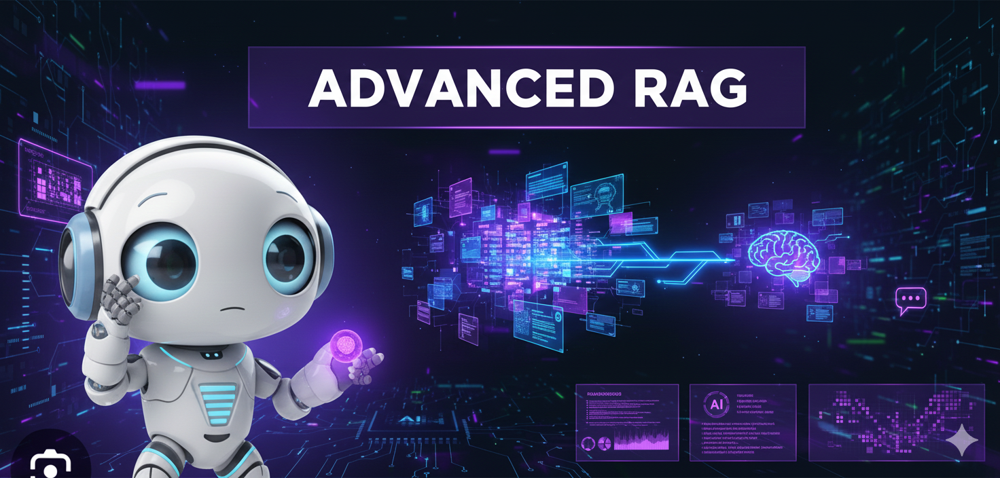
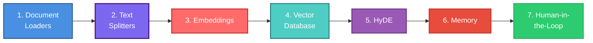

# Módulo 5: RAG Avanzado - Pipeline Completo Paso a Paso




## 🎯 Visión General

Este módulo presenta una **guía completa y profesional** del pipeline RAG, desde los fundamentos hasta técnicas avanzadas de producción. Cada componente está profundamente conceptualizado con código real, actualizado y siguiendo las mejores prácticas de la industria.

> [!NOTE]
> **Estructura del Módulo**: Este módulo está organizado en 7 guías detalladas, cada una cubriendo un componente crítico del pipeline RAG. Puedes estudiarlas secuencialmente o saltar a temas específicos según tus necesidades.

---

## 📊 El Pipeline RAG Completo



---

## 📚 Guías Detalladas

### [Parte 1: Document Loaders](01_document_loaders.md) 📄
**La Puerta de Entrada al RAG**

Aprende a cargar y procesar documentos de múltiples formatos con manejo robusto de errores.

**Temas cubiertos:**
- Fundamentos conceptuales de document loading
- Tipos de documentos y sus desafíos (PDF, Web, CSV, JSON)
- Loaders de LangChain (PyPDF, WebBase, Directory, Custom)
- Enriquecimiento de metadata
- Manejo de errores y validación
- Factory pattern para multi-formato

**Código incluido:**
- ✅ Loader básico con validación
- ✅ Sistema multi-formato con factory pattern
- ✅ Custom loader para formatos propietarios

[**➡️ Ir a Document Loaders**](01_document_loaders.md)

---

### [Parte 2: Text Splitters](02_text_splitters.md) ✂️
**El Arte del Chunking Inteligente**

Domina las estrategias de chunking para optimizar la calidad del retrieval.

**Temas cubiertos:**
- El dilema del chunking (precisión vs contexto)
- Character-based, Recursive, Token-based splitting
- Semantic chunking con embeddings
- Propositional chunking
- Chunking adaptativo según tipo de contenido
- LangChain y LlamaIndex implementations

**Código incluido:**
- ✅ Comparación de estrategias de chunking
- ✅ Semantic chunker con LangChain Experimental
- ✅ Sistema adaptativo multi-framework

[**➡️ Ir a Text Splitters**](02_text_splitters.md)

---

### [Parte 3: Embeddings](03_embeddings.md) 🧮
**Convirtiendo Texto en Vectores Semánticos**

Comprende cómo los embeddings capturan significado y cómo elegir el modelo correcto.

**Temas cubiertos:**
- Fundamentos matemáticos (similitud coseno, distancia euclidiana)
- Modelos de embedding (OpenAI, Cohere, HuggingFace, Google)
- Dimensionalidad y trade-offs
- Matryoshka embeddings (dimensionalidad adaptativa)
- Caché de embeddings para optimización
- Evaluación de calidad

**Código incluido:**
- ✅ Comparación de modelos de embedding
- ✅ Sistema de caché para reducir costos
- ✅ Matryoshka embeddings con dimensiones variables

[**➡️ Ir a Embeddings**](03_embeddings.md)

---

### [Parte 4: Vector Databases](04_vector_databases.md) 🗄️
**Búsqueda Semántica a Escala**

Implementa búsqueda vectorial eficiente con las mejores bases de datos del mercado.

**Temas cubiertos:**
- Algoritmos ANN (HNSW, IVF)
- Vector stores (ChromaDB, Pinecone, Weaviate, FAISS, Qdrant)
- Estrategias de retrieval (Similarity, MMR, Score Threshold)
- Hybrid Search (Vector + BM25)
- Reranking con Cohere
- Pipeline completo de retrieval profesional

**Código incluido:**
- ✅ Implementaciones con ChromaDB, Pinecone, Weaviate, FAISS
- ✅ Hybrid search con EnsembleRetriever
- ✅ Sistema profesional con hybrid search + reranking

[**➡️ Ir a Vector Databases**](04_vector_databases.md)

---

### [Parte 5: HyDE](05_hyde.md) 🔮
**Hypothetical Document Embeddings**

Mejora el retrieval generando documentos hipotéticos que coincidan mejor con tus datos.

**Temas cubiertos:**
- Fundamentos conceptuales de HyDE
- Por qué funciona (estructura lingüística vs contenido)
- Implementación con LangChain
- Multi-shot HyDE (múltiples hipótesis)
- HyDE adaptativo con fallback
- Casos de uso y limitaciones

**Código incluido:**
- ✅ HyDE básico con LangChain
- ✅ Multi-shot HyDE con promedio de embeddings
- ✅ Sistema adaptativo que decide cuándo usar HyDE

[**➡️ Ir a HyDE**](05_hyde.md)

---

### [Parte 6: Memory Systems](06_memory.md) 🧠
**Contexto Conversacional en RAG**

Implementa sistemas de memoria para conversaciones contextuales y coherentes.

**Temas cubiertos:**
- Tipos de memoria (Buffer, Window, Summary, Vector-backed, Entity)
- Memoria conversacional con LangChain
- Memoria híbrida (buffer + summary)
- Vector store-backed memory para retrieval semántico
- Sistema de memoria profesional con persistencia
- Memory multi-nivel

**Código incluido:**
- ✅ RAG con conversation memory
- ✅ Memoria híbrida (buffer reciente + resumen antiguo)
- ✅ Sistema profesional con persistencia y multi-nivel

[**➡️ Ir a Memory Systems**](06_memory.md)

---

### [Parte 7: Human-in-the-Loop](07_human_in_loop.md) 👥
**Supervisión y Mejora Continua**

Añade supervisión humana estratégica para garantizar calidad y seguridad en producción.

**Temas cubiertos:**
- Patrones HITL (Pre-generation, Post-generation, Feedback Loop)
- Confidence scoring para decisiones automáticas
- Validación de queries y respuestas
- Sistema de feedback y audit trail
- Active learning con correcciones humanas
- Compliance y consideraciones de producción

**Código incluido:**
- ✅ Validadores de query y respuesta
- ✅ Sistema de feedback con persistencia
- ✅ RAG profesional con HITL completo
- ✅ Active learning con knowledge base de correcciones

[**➡️ Ir a Human-in-the-Loop**](07_human_in_loop.md)

---

## 🎓 Rutas de Aprendizaje

### 🟢 Ruta Básica (4-6 horas)
Para desarrolladores que quieren entender los fundamentos:

1. [Document Loaders](01_document_loaders.md) - Secciones básicas
2. [Text Splitters](02_text_splitters.md) - Character y Recursive splitting
3. [Embeddings](03_embeddings.md) - OpenAI embeddings
4. [Vector Databases](04_vector_databases.md) - ChromaDB básico

### 🟡 Ruta Intermedia (8-10 horas)
Para desarrolladores construyendo sistemas RAG en producción:

1. Todas las secciones básicas
2. [Text Splitters](02_text_splitters.md) - Semantic chunking
3. [Embeddings](03_embeddings.md) - Comparación de modelos + caché
4. [Vector Databases](04_vector_databases.md) - Hybrid search
5. [Memory Systems](06_memory.md) - Conversation memory

### 🔴 Ruta Avanzada (12+ horas)
Para arquitectos de sistemas RAG de nivel enterprise:

1. Todas las guías completas
2. Implementar todos los ejemplos de código
3. [HyDE](05_hyde.md) - Sistema adaptativo completo
4. [Human-in-the-Loop](07_human_in_loop.md) - HITL profesional + active learning
5. Integrar todos los componentes en un sistema end-to-end

---

## 💻 Ejemplos Prácticos Integrados

### 🟢 Nivel Básico: RAG Simple con ChromaDB
**Archivo:** `examples/basic/01_simple_rag.py`

Sistema RAG básico que integra:
- Document loading con PyPDF
- Recursive text splitting
- OpenAI embeddings
- ChromaDB para storage
- Retrieval simple

### 🟡 Nivel Intermedio: RAG con Hybrid Search
**Archivo:** `examples/intermediate/02_hybrid_rag.py`

Sistema RAG intermedio con:
- Multi-format document loading
- Semantic chunking
- Hybrid search (vector + BM25)
- Conversation memory
- Confidence scoring

### 🔴 Nivel Avanzado: RAG Profesional Completo
**Archivo:** `examples/advanced/03_professional_rag.py`

Sistema RAG de producción con:
- Custom document loaders
- Adaptive chunking
- Multi-model embeddings con caché
- Hybrid search + reranking
- HyDE adaptativo
- Multi-level memory
- Human-in-the-loop completo
- Active learning
- Audit trail

---

## 🛠️ Frameworks y Herramientas

Este módulo cubre implementaciones con múltiples frameworks:

| Framework | Uso Principal | Guías |
|-----------|---------------|-------|
| **LangChain** | Pipeline RAG completo | Todas |
| **LlamaIndex** | Document parsing avanzado | 1, 2 |
| **Cohere** | Embeddings + Reranking | 3, 4 |
| **ChromaDB** | Vector store local | 4 |
| **Pinecone** | Vector store managed | 4 |
| **Weaviate** | Hybrid search nativo | 4 |
| **FAISS** | Alto rendimiento local | 4 |

---

## 📊 Métricas y Evaluación

### Métricas Clave de RAG

```python
# Context Precision: ¿Los documentos recuperados son relevantes?
context_precision = relevant_docs_retrieved / total_docs_retrieved

# Context Recall: ¿Recuperamos todos los documentos relevantes?
context_recall = relevant_docs_retrieved / total_relevant_docs

# Answer Relevancy: ¿La respuesta es relevante a la pregunta?
answer_relevancy = llm_score(question, answer)

# Faithfulness: ¿La respuesta está basada en el contexto?
faithfulness = llm_score(context, answer)
```

### Herramientas de Evaluación

- **RAGAS**: Framework de evaluación de RAG
- **LangSmith**: Observabilidad y debugging
- **Arize Phoenix**: Monitoring de producción

---

## 🎯 Mejores Prácticas Profesionales

### 1. **Chunking**
- ✅ Experimentar con tamaños (200-800 tokens)
- ✅ Usar overlap (20-25%)
- ✅ Preservar estructura semántica
- ✅ Metadata rica en cada chunk

### 2. **Embeddings**
- ✅ Usar caché para reducir costos
- ✅ Batch processing para eficiencia
- ✅ Normalizar para cosine similarity
- ✅ Evaluar calidad con benchmarks

### 3. **Retrieval**
- ✅ Siempre usar hybrid search en producción
- ✅ Implementar reranking (mejora 20-30%)
- ✅ Filtrar por metadata cuando sea posible
- ✅ Usar MMR para diversidad

### 4. **Producción**
- ✅ Implementar HITL para casos críticos
- ✅ Logging y audit trail completo
- ✅ Feedback loop para mejora continua
- ✅ Monitoreo de métricas en tiempo real

---

## 📖 Recursos Adicionales

### Repositorios de Referencia

- [NirDiamant/RAG_Techniques](https://github.com/NirDiamant/RAG_Techniques) - Técnicas avanzadas de RAG
- [LangChain Documentation](https://python.langchain.com/docs/) - Documentación oficial
- [LlamaIndex Documentation](https://docs.llamaindex.ai/) - Guías de LlamaIndex

### Papers Importantes

- **RAG**: [Retrieval-Augmented Generation for Knowledge-Intensive NLP Tasks](https://arxiv.org/abs/2005.11401)
- **HyDE**: [Precise Zero-Shot Dense Retrieval without Relevance Labels](https://arxiv.org/abs/2212.10496)
- **Self-RAG**: [Self-Reflective Retrieval-Augmented Generation](https://arxiv.org/abs/2310.11511)

---

## 🚀 Próximos Pasos

Una vez completado este módulo, estarás preparado para:

1. ✅ Diseñar pipelines RAG de nivel enterprise
2. ✅ Optimizar sistemas existentes con técnicas avanzadas
3. ✅ Implementar supervisión humana y mejora continua
4. ✅ Evaluar y monitorear sistemas RAG en producción

### Continúa tu Aprendizaje

➡️ **[Módulo 6: IA Confiable & Seguridad](../module6/README.md)** - Aprende a construir sistemas AI seguros y éticos

---

<div align="center">

**[⬅️ Módulo Anterior](../module4/README.md)** | **[🏠 Inicio](../README.md)** | **[Siguiente Módulo ➡️](../module6/README.md)**

</div>

---

## 📝 Notas del Autor

> Este módulo ha sido diseñado para ser una **referencia completa y profesional** del pipeline RAG. Cada sección incluye:
> - 🎓 Conceptualización profunda
> - 💻 Código real y actualizado (2024-2025)
> - 🏗️ Ejemplos con múltiples frameworks
> - ✅ Mejores prácticas de la industria
> - 🚀 Patrones de producción

**Última actualización:** Noviembre 2024  
**Frameworks:** LangChain 0.1+, LlamaIndex 0.9+, Cohere SDK 5.0+
