# Case Study 1: Startup Chatbot de Soporte

## 🎯 El Problema

**Empresa:** TechStart (Startup SaaS)
**Challenge:** 
- 500+ tickets de soporte por semana
- Solo 2 personas en support team
- Response time promedio: 12 horas
- Costo: ~$8K/mes en salarios support

**Meta:** Reducir carga 70% con chatbot AI manteniendo calidad

---

## 💡 La Solución

### Arquitectura

```mermaid
graph TB
    User[Usuario] --> Chat[Chatbot UI]
    Chat --> Agent[RAG Agent]
    Agent --> Pinecone[(Pinecone<br/>Knowledge Base)]
    Agent --> OpenAI[OpenAI GPT-4o-mini]
    Agent --> Escalation{¿Necesita<br/>humano?}
    Escalation -->|Sí| Human[Support Team]
    Escalation -->|No| Response[Respuesta al usuario]
```



### Stack Tecnológico

- **Framework:** LangChain
- **LLM:** GPT-4o-mini (costo-efectivo)
- **Vector DB:** Pinecone
- **Frontend:** React + Vercel
- **Backend:** FastAPI + Railway

### Implementación Core

```python
from langchain.agents import create_openai_functions_agent
from langchain_openai import ChatOpenAI
from langchain_pinecone import PineconeVectorStore

llm = ChatOpenAI(model="gpt-4o-mini", temperature=0.3)
vectorstore = PineconeVectorStore.from_existing_index("support-kb")
agent = create_openai_functions_agent(llm, tools, prompt)
```

## 📊 Resultados (6 Meses)

| Métrica | Before | After | Improvement |
|---------|--------|-------|-------------|
| Tickets/week | 500 | 150 | -70% |
| Response Time | 12h | <1min | -99.9% |
| Satisfaction | 3.8/5 | 4.3/5 | +13% |
| Cost | $8K/mo | $940/mo | -88% |

**ROI: 750%** | **Savings: $7K/month**

## 💡 Lessons Learned

**What Worked:**
- Semantic caching (35% hit rate)
- Escalation to humans for edge cases
- Weekly KB updates

**Challenges:**
- Initial hallucinations (solved with strict prompts)
- Cost spikes (added rate limiting)

**Key Optimization:**
```python
# Guardrail: escalación automática
if confidence < 0.7 or "refund" in message:
    escalate_to_human()
```

## ✅ Takeaways

- **Timeline:** 8-10 weeks zero to production
- **Cost:** $1-2K/month for 500-1K users
- **Savings:** 60-70% support load reduction

**For startups:** Start with RAG, measure everything, iterate weekly.
