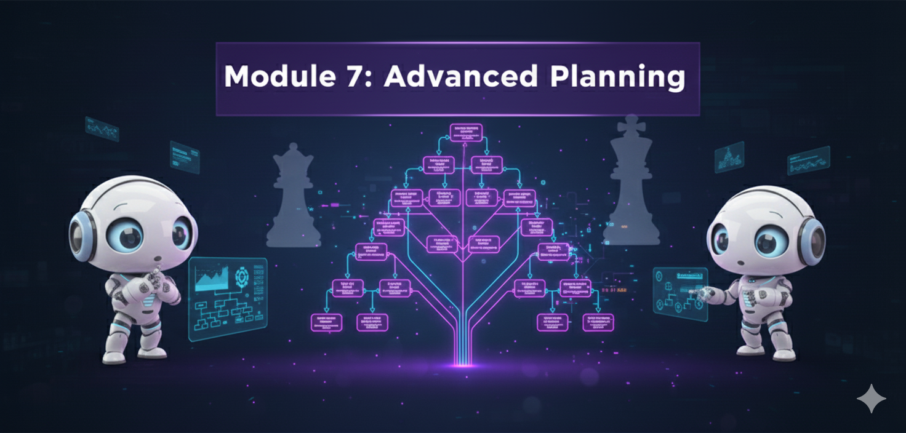

# Módulo 7: Planificación Avanzada y Razonamiento



## 🎯 Objetivos del Módulo
Los agentes simples reaccionan. Los agentes avanzados **planifican**. En este módulo, dotaremos a tus agentes de la capacidad de pensar a largo plazo, descomponer problemas masivos y navegar grafos de decisión complejos.

## 📚 Conceptos Clave

### 1. Planificación Jerárquica
-   Dividir una tarea grande ("Lanzar un producto") en sub-tareas ("Investigación", "Diseño", "Marketing") y asignar cada una a un agente especializado.

### 2. Grafos de Ejecución (DAGs)
-   Modelar flujos de trabajo donde algunas tareas pueden ocurrir en paralelo y otras dependen de resultados previos.
    current_step: int
    results: List[str]

workflow = StateGraph(AgentState)

# Nodos
workflow.add_node("planner", create_plan)
workflow.add_node("executor", execute_step)
workflow.add_node("reviewer", review_progress)

# Aristas
workflow.add_edge("planner", "executor")
workflow.add_conditional_edges(
    "executor",
    should_continue,
    {
        "continue": "executor",
        "review": "reviewer",
        "end": END
    }
)

app = workflow.compile()
```

---

<div align="center">

**[⬅️ Módulo Anterior](../module6/README.md)** | **[🏠 Inicio](../README.md)** | **[Siguiente Módulo ➡️](../module8/README.md)**

</div>

