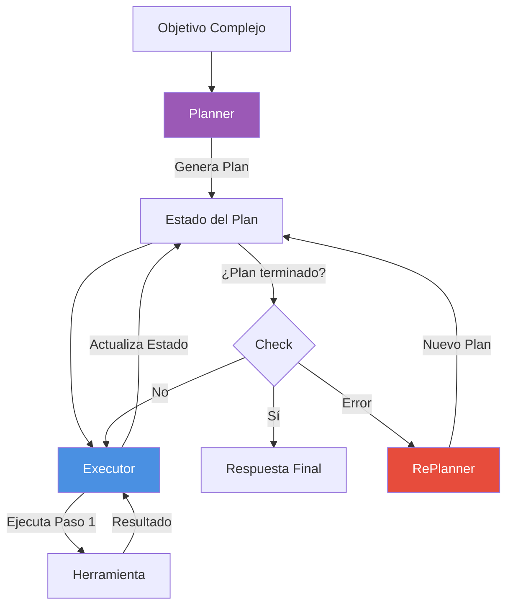
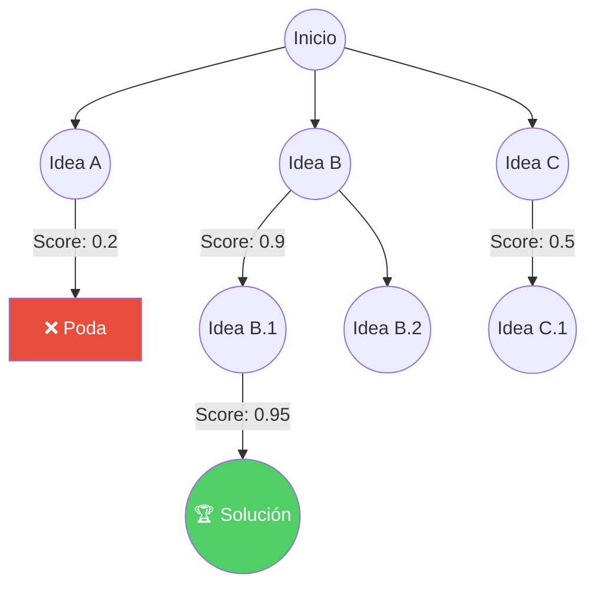

# Módulo 7: Planificación Avanzada y Razonamiento

> *"Un agente reactivo responde. Un agente planificador piensa antes de actuar."*

---

## 🎯 Objetivos del Módulo

Los agentes simples (ReAct) funcionan bien para tareas cortas, pero fallan en objetivos complejos que requieren múltiples pasos y coordinación. En este módulo, aprenderás a construir agentes que **planifican**, **razonan** y **corrigen** sus propios errores.

Aprenderás:
- 🗺️ **Plan-and-Execute:** Separar la planificación de la ejecución para mayor robustez.
- 🌳 **Tree of Thoughts (ToT):** Explorar múltiples caminos de razonamiento antes de decidir.
- 🕸️ **LangGraph Planning:** Implementar grafos de estado cíclicos para agentes autónomos.
- 🔄 **Reflexion:** Permitir que el agente critique y mejore su propio plan.

---

## 📚 Índice

1. [De ReAct a Plan-and-Execute](#1-de-react-a-plan-and-execute)
2. [Tree of Thoughts (ToT)](#2-tree-of-thoughts-tot)
3. [Planificación Jerárquica](#3-planificación-jerárquica)
4. [Proyectos Prácticos](#-proyectos-prácticos)

---

## 1. De ReAct a Plan-and-Execute

El patrón **ReAct** (Reason + Act) es un bucle simple:
`Thought -> Action -> Observation -> Repeat`

**Problema:** Si el agente se equivoca en el paso 1, todo el proceso descarrila. Tiende a perder el objetivo general en tareas largas ("Lost in the middle").

**Solución: Plan-and-Execute**
Separamos el cerebro en dos roles:
1.  **Planner:** Genera un plan completo paso a paso (DAG).
2.  **Executor:** Ejecuta cada paso y reporta resultados.
3.  **Re-Planner:** (Opcional) Ajusta el plan si algo falla.

---

## 2. Tree of Thoughts (ToT)

Inspirado en cómo los humanos resolvemos problemas difíciles: exploramos múltiples posibilidades, evaluamos cuál parece mejor y descartamos las malas.

**Algoritmo ToT:**
1.  **Decomposition:** Romper el problema en pasos.
2.  **Thought Generation (Expand):** Generar k posibles soluciones para el paso actual.
3.  **Evaluation (Score):** Evaluar cada solución (heurística o LLM-judge).
4.  **Search (Prune):** Mantener las mejores, descartar el resto (BFS/DFS).

**Cuándo usar ToT:**
- Escritura creativa compleja.
- Resolución de problemas lógicos/matemáticos.
- Planificación estratégica.

---

## 3. Planificación Jerárquica

Para tareas masivas, un solo agente se satura. Usamos una jerarquía tipo "Jefe-Empleado".

- **Supervisor (Manager):** Recibe la tarea, crea sub-tareas y las asigna.
- **Workers:** Agentes especializados (Coder, Researcher, Writer) que ejecutan y devuelven resultados.
- **Graph State:** Mantiene la memoria compartida y el estado de cada sub-tarea.

**Implementación con LangGraph:**
Usamos un `StateGraph` donde el nodo Supervisor decide a qué nodo Worker enrutar el flujo (Conditional Edge).

---

## 🛠️ Proyectos Prácticos

### 🟢 Nivel Básico: Agente Plan-and-Execute
**Archivo:** [`01_plan_and_execute.py`](01_plan_and_execute.py)
- Implementación usando LangGraph.
- Agente Planner que crea lista de tareas.
- Agente Executor que consume la lista.

### 🟡 Nivel Intermedio: Tree of Thoughts
**Archivo:** [`02_tree_of_thoughts.py`](02_tree_of_thoughts.py)
- Resolución del "Game of 24" o problema lógico.
- Implementación de Expand, Score y Prune.
- Visualización del proceso de pensamiento.

### 🔴 Nivel Avanzado: Planificación Jerárquica
**Archivo:** [`03_hierarchical_planning.py`](03_hierarchical_planning.py)
- Sistema Supervisor-Worker.
- Orquestación de múltiples agentes especializados.
- Manejo de estado compartido complejo.

---

## 💼 Caso de Estudio Real
**[Startup Chatbot de Soporte](CASE_STUDY_STARTUP.md)**
Descubre cómo una startup redujo su carga de soporte en un 70% usando un sistema RAG + Agentes, ahorrando $7k/mes.
- **Stack:** LangChain, Pinecone, FastAPI.
- **Resultados:** ROI de 750%.

## 🎓 Referencias

- **Paper:** ["Tree of Thoughts: Deliberate Problem Solving with Large Language Models"](https://arxiv.org/abs/2305.10601)
- **Paper:** ["Plan-and-Solve Prompting"](https://arxiv.org/abs/2305.04091)
- **LangGraph Docs:** [python.langchain.com/docs/langgraph](https://python.langchain.com/docs/langgraph)

---

**[⬅️ Módulo Anterior](../module6/README.md)** | **[🏠 Inicio](../README.md)** | **[Siguiente Módulo ➡️](../module8/README.md)**

