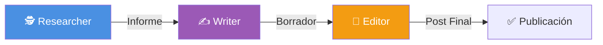
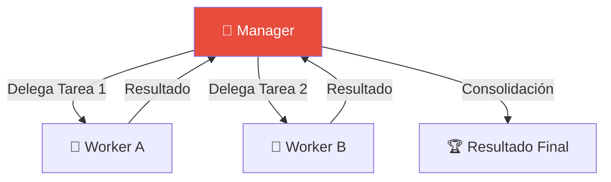

# Módulo 8: Sistemas Multi-Agente (MAS)

> *"El talento gana partidos, pero el trabajo en equipo y la inteligencia ganan campeonatos."* — Michael Jordan

---

## 🎯 Objetivos del Módulo

Un solo agente es limitado. Un **Sistema Multi-Agente (MAS)** es ilimitado. En este módulo, aprenderás a orquestar equipos de agentes especializados que colaboran para resolver problemas complejos, simulando departamentos enteros de una empresa.

Aprenderás a dominar los 3 frameworks líderes:
- 🚣 **CrewAI:** Para procesos estructurados y roles definidos (ej. Marketing, Research).
- 🤖 **Microsoft AutoGen:** Para resolución de problemas conversacionales y generación de código.
- 🕸️ **LangGraph Multi-Agent:** Para control total del estado y orquestación personalizada.

---

## 📚 Índice

1. [Fundamentos de Sistemas Multi-Agente](#1-fundamentos-de-sistemas-multi-agente)
2. [Patrones de Orquestación](#2-patrones-de-orquestación)
3. [Comparativa de Frameworks](#3-comparativa-de-frameworks)
4. [Proyectos Prácticos](#-proyectos-prácticos)

---

## 1. Fundamentos de Sistemas Multi-Agente

Un MAS se compone de múltiples agentes interactuando en un entorno compartido. La clave no es solo tener muchos agentes, sino cómo **colaboran**.

### Ventajas sobre un Agente Único
- **Especialización:** Un agente "Coder" y un "Writer" son mejores que un agente "Generalista".
- **Paralelismo:** Varios agentes pueden trabajar en sub-tareas simultáneamente.
- **Robustez:** Si un agente falla, otro puede corregirlo (ej. Reviewer revisando código).

---

## 2. Patrones de Orquestación

La forma en que los agentes se comunican define la arquitectura del sistema.

### A. Secuencial (Chain)
Los agentes actúan uno tras otro. La salida de A es la entrada de B.
*Ideal para:* Pipelines de contenido (Investigar -> Escribir -> Editar).

### B. Jerárquico (Manager-Worker)
Un "Supervisor" o "Manager" descompone la tarea y delega a los trabajadores.
*Ideal para:* Proyectos complejos donde el plan cambia dinámicamente.

### C. Descentralizado (Group Chat)
Todos los agentes escuchan y hablan en un chat compartido. Un "Router" o reglas de turno deciden quién habla siguiente.
*Ideal para:* Brainstorming, simulación social, resolución colaborativa de problemas.

---

## 3. Comparativa de Frameworks

| Característica | 🚣 CrewAI | 🤖 AutoGen | 🕸️ LangGraph |
|----------------|-----------|------------|---------------|
| **Filosofía** | **Role-Playing:** Agentes con "Backstory" y "Goals". | **Conversacional:** Agentes que "chatean" para resolver tareas. | **State Machine:** Grafos dirigidos y control de flujo explícito. |
| **Mejor para...** | Procesos de negocio, creación de contenido, pipelines fijos. | Generación de código, análisis de datos, simulaciones. | Aplicaciones de producción, lógica compleja, control total. |
| **Curva de Aprendizaje** | ⭐ (Muy Fácil) | ⭐⭐ (Media) | ⭐⭐⭐ (Alta - Requiere entender grafos) |
| **Orquestación** | Secuencial (Default) o Jerárquica. | Group Chat o Two-Agent Chat. | Supervisor, Hierarchical, Custom. |

---

## 🛠️ Proyectos Prácticos

### 🚣 Proyecto 1: El Equipo de Investigación (CrewAI)
**Archivo:** [`01_crewai_research_team.py`](01_crewai_research_team.py)
- **Objetivo:** Crear un reporte completo sobre una tecnología emergente.
- **Roles:** Lead Researcher (busca info), Senior Analyst (encuentra patrones), Tech Writer (escribe).
- **Patrón:** Secuencial.

### 🤖 Proyecto 2: El Equipo de Desarrollo (AutoGen)
**Archivo:** [`02_autogen_coding_team.py`](02_autogen_coding_team.py)
- **Objetivo:** Resolver un problema matemático complejo escribiendo y ejecutando código Python.
- **Roles:** UserProxy (Admin/Executor), Assistant (Coder), Reviewer (QA).
- **Patrón:** Group Chat Descentralizado.

### 🕸️ Proyecto 3: El Supervisor Corporativo (LangGraph)
**Archivo:** [`03_langgraph_supervisor.py`](03_langgraph_supervisor.py)
- **Objetivo:** Sistema de soporte que enruta consultas al especialista adecuado.
- **Roles:** Supervisor (Router), Billing Specialist, Tech Support.
- **Patrón:** Jerárquico (Supervisor).

---

## 🎓 Referencias

- **CrewAI Docs:** [docs.crewai.com](https://docs.crewai.com/)
- **AutoGen Docs:** [microsoft.github.io/autogen](https://microsoft.github.io/autogen/)
- **LangGraph Multi-Agent:** [langchain-ai.github.io/langgraph/tutorials/multi_agent/](https://langchain-ai.github.io/langgraph/tutorials/multi_agent/)

---

**[⬅️ Módulo Anterior](../module7/README.md)** | **[🏠 Inicio](../README.md)** | **[Siguiente Módulo ➡️](../module9/README.md)**

