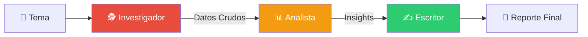
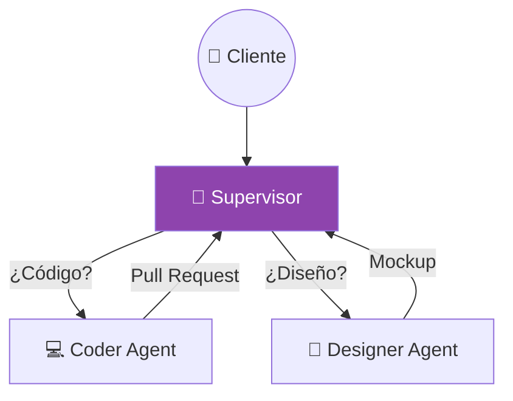

# Módulo 8: Sistemas Multi-Agente (MAS)


> *"El talento gana partidos, pero el trabajo en equipo y la inteligencia ganan campeonatos."* — Michael Jordan

---

## 🎯 Objetivos del Módulo

En el mundo real, un solo empleado no hace todo el trabajo. Tienes departamentos: Ventas, Ingeniería, Legal.
En la IA Enterprise, hacemos lo mismo. **Orquestamos** equipos de agentes especializados.

**Lo que vas a dominar:**
1.  🚣 **CrewAI:** Cómo estructurar "Roles" y "Procesos" secuenciales.
2.  🤖 **AutoGen:** Agentes que conversan y escriben código real.
3.  🕸️ **LangGraph:** Control de estado granular para flujos complejos.
4.  🔌 **MCP (Model Context Protocol):** El estándar universal para conectar herramientas.

---

## 🏗️ 1. Arquitectura de Equipos (Patrones Enterprise)

No basta con poner agentes juntos. Necesitas una **Topología de Comunicación**.

### A. Patrón Secuencial (The Assembly Line)
Ideal para procesos lineales: `Investigar -> Escribir -> Traducir`.
*   **Framework:** CrewAI.
*   **Analogía:** Una línea de montaje de coches.



### B. Patrón Jerárquico (The Boss)
Un "Supervisor" decide quién trabaja. Ideal cuando la tarea varía dinámicamente.
*   **Framework:** LangGraph / CrewAI (Hierarchical).
*   **Analogía:** Un Project Manager asignando tickets.



---

## 🚣 2. CrewAI: Tu Primer Equipo Virtual

CrewAI brilla por su simplicidad basada en roles.

### Anatomía de un Agente CrewAI

```python
from crewai import Agent

# 1. Definir el ROL (Quién es)
researcher = Agent(
    role='Senior Researcher',
    goal='Descubrir tecnologías emergentes en IA',
    backstory="""Eres un veterano de Silicon Valley. 
    Tu olfato para la innovación es legendario.""",
    verbose=True,          # ¡Verlo pensar!
    allow_delegation=False # No puede mandar a otros (es un worker)
)
```

### Anatomía de una Tarea (Qué hace)

```python
from crewai import Task

# 2. Definir la TAREA (Qué debe entregar)
task1 = Task(
    description='Investiga sobre "Agentic Patterns" en 2025.',
    agent=researcher,
    expected_output='Un resumen ejecutivo de 3 puntos clave.'
)
```

---

## 🔌 3. MCP: El Futuro de la Conectividad

El **Model Context Protocol (MCP)** resuelve el problema de "¿Cómo conecto mi agente a mi Base de Datos / Slack / GitHub?".
En lugar de escribir 50 integraciones, usas el estándar MCP.

### Ejemplo: Deep Research con MCP
En el script `06_mcp_deep_research.py`, simulamos cómo un agente usa herramientas MCP para navegar la web "profunda" (sin bloqueos).

```python
# El agente no sabe CÓMO funciona la herramienta, solo sabe que existe.
# MCP se encarga del "CÓMO".
search_agent = Agent(
    role='Web Surfer',
    tools=[mcp_tools.search_web], # Herramienta inyectada vía MCP
    goal='Encontrar fuentes primarias'
)
```

---

## 🛠️ Proyectos Prácticos (Nivel Enterprise)

### 🚣 Proyecto 1: El Equipo de Investigación (CrewAI)
**Archivo:** [`01_crewai_research_team.py`](01_crewai_research_team.py)
-   **Patrón:** Secuencial.
-   **Caso de Uso:** Generación de contenido automatizado.
-   **Reto:** Modifica el script para añadir un agente "Editor" que critique el trabajo del "Escritor".

### 🤖 Proyecto 2: El Equipo de Desarrollo (AutoGen)
**Archivo:** [`02_autogen_coding_team.py`](02_autogen_coding_team.py)
-   **Patrón:** Conversacional (Chat).
-   **Caso de Uso:** Escribir y ejecutar código Python para análisis de datos.
-   **Nota:** AutoGen ejecuta código real en Docker (Sandbox). ¡Cuidado en local!

### 🕸️ Proyecto 3: El Supervisor Corporativo (LangGraph)
**Archivo:** [`03_langgraph_supervisor.py`](03_langgraph_supervisor.py)
-   **Patrón:** Jerárquico (Router).
-   **Caso de Uso:** Sistema de soporte técnico nivel 1 y 2.
-   **Tech:** StateGraph, Conditional Edges.

### 🔌 Proyecto 4: MCP Deep Research (Avanzado)
**Archivo:** [`06_mcp_deep_research.py`](06_mcp_deep_research.py)
-   **Tech:** CrewAI + MCP (Simulado).
-   **Objetivo:** Orquestar búsqueda, lectura profunda y síntesis.

---

## 📊 Comparativa Definitiva

| Característica | 🚣 CrewAI | 🤖 AutoGen | 🕸️ LangGraph |
| :--- | :--- | :--- | :--- |
| **Control** | ⭐⭐ (Medio) | ⭐⭐ (Medio) | ⭐⭐⭐⭐ (Total) |
| **Facilidad** | ⭐⭐⭐⭐ (Alta) | ⭐⭐ (Media) | ⭐ (Baja - Curva alta) |
| **Mejor para...** | Procesos de Negocio | Code Generation | Productos SaaS complejos |
| **Producción** | ✅ Listo | ⚠️ Sandbox requerido | ✅ Estándar industrial |

---

<div align="center">

**[⬅️ Módulo Anterior](../module7/README.md)** | **[🏠 Inicio](../README.md)** | **[Siguiente Módulo ➡️](../module9/README.md)**

</div>
