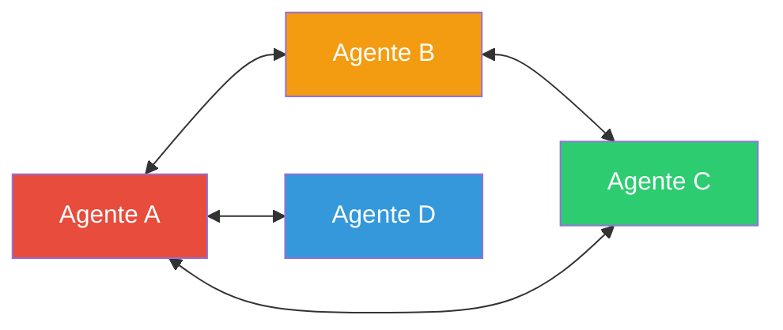

# Módulo 8: Sistemas Multi-Agente (Swarm Intelligence)


> "En 2025, pasamos de equipos jerárquicos a Enjambres (Swarms) descentralizados. La inteligencia emerge de la colaboración, no del control."

## 🎯 Objetivos del Módulo

En la IA Enterprise moderna, ya no solo orquestamos equipos; diseñamos **Swarms**. Sistemas donde múltiples agentes colaboran de forma autónoma y descentralizada.

**Lo que vas a dominar:**
1.  🐝 **Swarm Intelligence:** Patrones de diseño descentralizados (OpenAI Swarm style).
2.  🚣 **CrewAI v1.1:** Flows y procesos jerárquicos avanzados.
3.  🤖 **AutoGen v0.4:** Agentes conversacionales asíncronos.
4.  🕸️ **LangGraph Multi-Agent:** Control total del grafo de comunicación.

---

## 🏗️ Arquitecturas de Agentes (Nov 2025)

### 1. Jerárquica (The Boss)
Un "Supervisor" decide quién trabaja. Clásico y seguro, pero con cuello de botella.
*   **Uso:** Soporte técnico, gestión de proyectos.

### 2. Swarm (The Hive)
Agentes autónomos que se comunican entre sí sin un líder central. Si un agente necesita ayuda, la pide directamente a otro ("Handoff").
*   **Uso:** Investigación compleja, simulación de mercados, verificación de hechos.



---

## 🌍 High Impact Social/Professional Example (Nov 2025)

> **Proyecto: "TruthSwarm" - Sistema de Verificación de Noticias Descentralizado**
>
> Este ejemplo implementa un **Enjambre de Agentes** que colaboran en tiempo real para verificar la veracidad de noticias virales, combatiendo la desinformación.

### El Problema
Las Fake News se propagan más rápido de lo que los humanos pueden verificar. Un sistema centralizado es demasiado lento y sesgado.

### La Solución
Un **Swarm** de agentes especializados donde cada uno verifica un aspecto (fuente, imagen, texto) y consensúan una "Puntuación de Veracidad".

```python
"""
Project: TruthSwarm
Pattern: Decentralized Swarm (Handoffs)
Framework: OpenAI Swarm / LangGraph
"""
from swarm import Swarm, Agent

client = Swarm()

# 1. Definir Agentes Especialistas

def transfer_to_source_verifier():
    return source_verifier

def transfer_to_image_analyst():
    return image_analyst

fact_checker = Agent(
    name="FactChecker",
    instructions="""Eres el coordinador inicial. Analiza el texto.
    - Si hay imágenes sospechosas, llama a ImageAnalyst.
    - Si cita fuentes desconocidas, llama a SourceVerifier.
    - Si todo parece bien, emite un veredicto.""",
    functions=[transfer_to_source_verifier, transfer_to_image_analyst]
)

source_verifier = Agent(
    name="SourceVerifier",
    instructions="""Verifica la reputación del dominio y el autor.
    Busca antecedentes de desinformación.
    Devuelve el control al FactChecker con tu hallazgo.""",
    functions=[] # Podría tener herramientas de búsqueda web
)

image_analyst = Agent(
    name="ImageAnalyst",
    instructions="""Detecta manipulación digital o Deepfakes en imágenes adjuntas.
    Devuelve el control al FactChecker con tu análisis.""",
    functions=[] # Podría tener herramientas de visión
)

# 2. Ejecución del Enjambre
print("🐝 TruthSwarm Active...")

messages = [{"role": "user", "content": "Mira esta noticia: 'Aliens aterrizan en Madrid', fuente: diario-verdad-oculta.com, adjunto: alien.jpg"}]

response = client.run(
    agent=fact_checker,
    messages=messages
)

print(f"🤖 Agente Final: {response.agent.name}")
print(f"💬 Veredicto: {response.messages[-1]['content']}")
```

**Impacto Social:**
- **Velocidad**: Verificación en segundos, no horas.
- **Objetividad**: Múltiples agentes especializados reducen el sesgo de un solo modelo.
- **Escalabilidad**: Puede procesar miles de noticias simultáneamente.

---

## 🛠️ Proyectos Prácticos

### 🚣 Proyecto 1: El Equipo de Investigación (CrewAI)
Implementación clásica secuencial para generar reportes profundos.

### 🤖 Proyecto 2: Coding Swarm (AutoGen)
Un enjambre de agentes (Coder, Reviewer, Tester) que escriben y arreglan software autónomamente.

### 🐝 Proyecto 3: TruthSwarm (OpenAI Swarm)
Implementación del ejemplo de alto impacto usando el patrón de "Handoffs".

---

## 📊 Comparativa Definitiva (Nov 2025)

| Característica | 🚣 CrewAI v1.1 | 🐝 OpenAI Swarm | 🕸️ LangGraph |
| :--- | :--- | :--- | :--- |
| **Paradigma** | Roles & Procesos | Handoffs & Rutinas | Grafos de Estado |
| **Control** | Alto (Estructurado) | Medio (Emergente) | Total (Low-level) |
| **Mejor para...** | Procesos de Negocio | Exploración / Chat | Productos SaaS |
| **Curva** | Baja | Muy Baja | Alta |

---

## 🚀 Próximos Pasos

➡️ **[Módulo 9: Metacognición](../module9/README.md)**

<div align="center">

**[⬅️ Módulo Anterior](../module7/README.md)** | **[🏠 Inicio](../README.md)**

</div>

---

**Última actualización:** Noviembre 2025
**Stack:** OpenAI Swarm, CrewAI v1.1, AutoGen v0.4
**Conceptos:** Swarm Intelligence, Decentralized Handoffs
