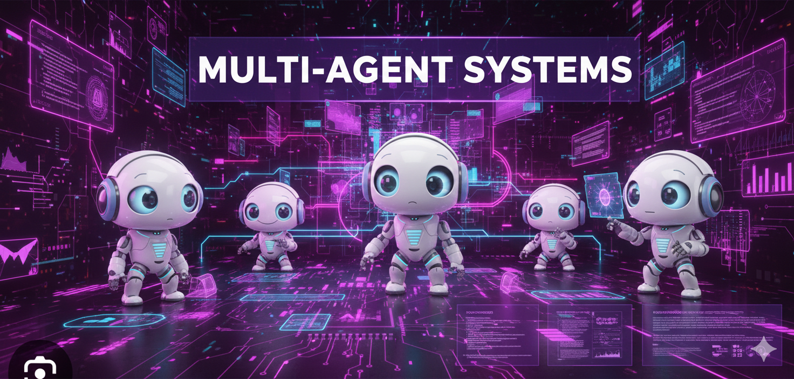

# Módulo 8: Sistemas Multi-Agente (MAS)




## 🎯 Objetivos del Módulo
Un solo agente es un empleado. Múltiples agentes son una empresa. En este módulo, aprenderás a orquestar equipos de agentes especializados que colaboran para resolver problemas que ninguno podría resolver por sí solo.

## 📚 Conceptos Clave

### 1. Patrones de Colaboración
-   **Secuencial:** Agente A -> Agente B -> Agente C.
-   **Jerárquico (Manager/Worker):** Un agente "Jefe" desglosa la tarea y delega a agentes "Trabajadores".
    role='Escritor Tech',
    goal='Escribir artículos virales',
    backstory='Tienes un estilo enganchante...'
)

# Definir Tareas
tarea1 = Task(description='Investiga sobre AI Agents...', agent=investigador)
tarea2 = Task(description='Escribe un post sobre eso...', agent=escritor)

# Formar la Crew
crew = Crew(
    agents=[investigador, escritor],
    tasks=[tarea1, tarea2],
    verbose=2
)

result = crew.kickoff()
```

---

<div align="center">
<a href="../module9/README.md">➡️ Siguiente Módulo: Metacognición</a>
</div>
