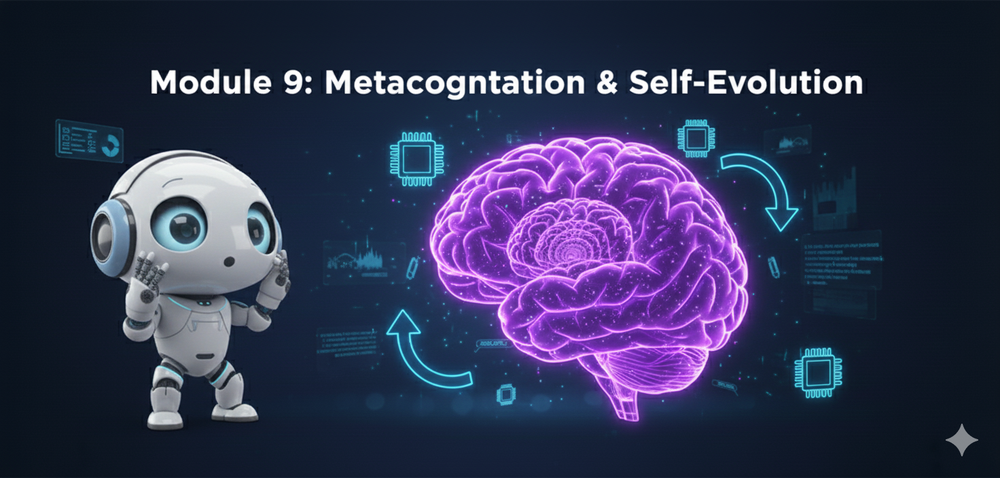
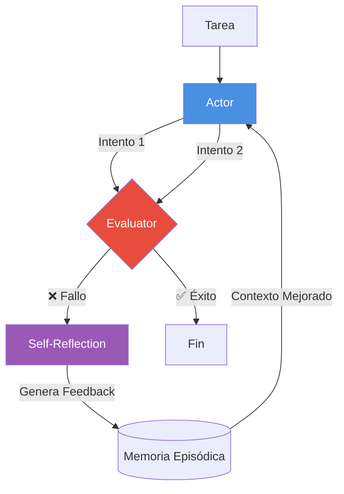

# Módulo 9: Metacognición y Auto-Evolución




> *"La verdadera inteligencia no es saberlo todo, sino saber qué hacer cuando no sabes qué hacer."* — Jean Piaget

---

## 🎯 Objetivos del Módulo

Hasta ahora, nuestros agentes han sido "inteligentes" pero estáticos. Si cometen un error, lo repiten. Si el prompt no es perfecto, fallan.
En este módulo, cruzamos la frontera hacia la **Metacognición**: agentes que piensan sobre su propio pensamiento, critican su trabajo y mejoran sus propios prompts automáticamente.

Aprenderás:
- 🧠 **Reflexion:** Cómo implementar bucles de auto-corrección verbal.
- 📚 **Self-RAG:** Agentes que deciden *cuándo* buscar información y critican lo que encuentran.
- 🧬 **DSPy (Auto-Evolución):** Dejar de escribir prompts manuales y dejar que el agente los optimice matemáticamente.

---

## 📚 Índice

1. [¿Qué es la Metacognición en IA?](#1-qué-es-la-metacognición-en-ia)
2. [Reflexion: El Bucle de Auto-Mejora](#2-reflexion-el-bucle-de-auto-mejora)
3. [Self-RAG: RAG con Criterio](#3-self-rag-rag-con-criterio)
4. [DSPy: Programación de Prompts](#4-dspy-programación-de-prompts)
5. [Proyectos Prácticos](#-proyectos-prácticos)

---

## 1. ¿Qué es la Metacognición en IA?

La metacognición es la capacidad de "pensar sobre el pensamiento". En LLMs, esto se traduce en tres capacidades críticas:

1.  **Self-Monitoring:** "¿Estoy progresando hacia la solución?"
2.  **Self-Correction:** "Cometí un error de sintaxis, debo corregirlo."
3.  **Self-Reflection:** "¿Por qué fallé antes? Ah, olvidé importar la librería."

A diferencia del **Chain-of-Thought (CoT)** que es un razonamiento lineal, la metacognición es un **bucle de retroalimentación**.

---

## 2. Reflexion: El Bucle de Auto-Mejora

El paper *"Reflexion: Language Agents with Verbal Reinforcement Learning"* (Shinn et al., 2023) introdujo una idea revolucionaria: en lugar de actualizar los pesos del modelo (caro), actualizamos su memoria verbal (barato).

### Arquitectura Reflexion



El agente no solo reintenta, sino que **aprende** de su intento fallido mediante una "lección" escrita que se inyecta en el siguiente prompt.

---

## 3. Self-RAG: RAG con Criterio

El RAG tradicional es ciego: siempre busca, siempre confía en lo que encuentra. **Self-RAG** (Self-Reflective RAG) introduce tokens especiales para criticar cada paso.

### El Flujo de Decisión

1.  **Retrieve?** -> ¿Necesito buscar info externa o ya lo sé?
2.  **IsRel?** -> ¿Lo que encontré es relevante para la pregunta?
3.  **IsSup?** -> ¿Mi respuesta está soportada por la evidencia?
4.  **IsUse?** -> ¿Es útil la respuesta final?

Si alguna métrica falla, el agente puede decidir buscar de nuevo o reescribir la respuesta.

---

## 4. DSPy: Programación de Prompts

Escribir prompts a mano ("Actúa como un experto...") es frágil y difícil de escalar. **DSPy** (Declarative Self-improving Python) cambia el paradigma:

- **Tú defines:** La firma (Input -> Output) y la métrica de éxito.
- **DSPy define:** El prompt exacto y los ejemplos few-shot.

El "Optimizador" de DSPy (Teleprompter) prueba miles de variaciones de prompts y ejemplos hasta encontrar la combinación que maximiza tu métrica. ¡Es como un compilador para LLMs!

```python
# En lugar de escribir un prompt largo:
class RAG(dspy.Module):
    def forward(self, question):
        context = self.retrieve(question)
        return self.generate_answer(context, question)

# DSPy optimiza cómo pedirle al modelo que haga esto.
```

---

## 🛠️ Proyectos Prácticos

### 🧠 Proyecto 1: Agente Reflexion (LangGraph)
**Archivo:** [`01_reflexion_agent.py`](01_reflexion_agent.py)
- **Objetivo:** Un agente que escribe código Python.
- **Mecánica:** Escribe código -> Lo ejecuta -> Si falla, lee el error -> Reflexiona -> Reescribe.
- **Resultado:** Código robusto que se arregla solo.

### 📚 Proyecto 2: Self-RAG Minimalista
**Archivo:** [`02_self_rag_minimal.py`](02_self_rag_minimal.py)
- **Objetivo:** Sistema de Q&A que no alucina.
- **Mecánica:** Genera respuesta y luego se auto-critica ("¿Inventé esto?"). Si detecta alucinación, corrige.

### 🧬 Proyecto 3: Auto-Optimización con DSPy
**Archivo:** [`03_dspy_auto_optimizer.py`](03_dspy_auto_optimizer.py)
- **Objetivo:** Crear un clasificador de sentimientos perfecto.
- **Mecánica:** Empezamos con cero ejemplos. DSPy "compila" el programa y encuentra los mejores prompts y ejemplos few-shot automáticamente.

---

## 🎓 Referencias

- **Paper Reflexion:** [arxiv.org/abs/2303.11366](https://arxiv.org/abs/2303.11366)
- **Paper Self-RAG:** [arxiv.org/abs/2310.11511](https://arxiv.org/abs/2310.11511)
- **DSPy Repo:** [github.com/stanfordnlp/dspy](https://github.com/stanfordnlp/dspy)

---

<div align="center">

**[⬅️ Módulo Anterior](../module8/README.md)** | **[🏠 Inicio](../README.md)** | **[Siguiente Módulo ➡️](../module10/README.md)**

</div>
