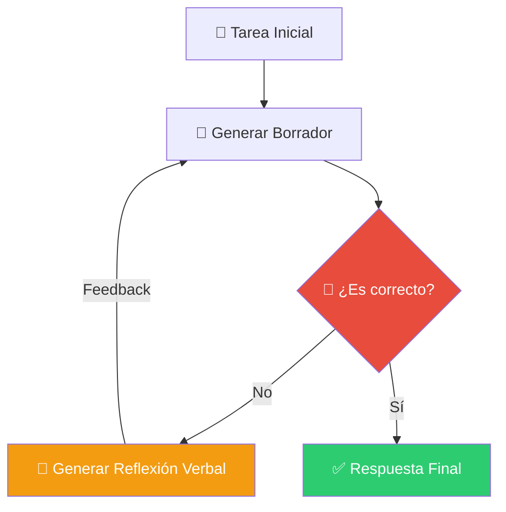

# Módulo 9: Metacognición y Auto-Evolución


> *"No es inteligente quien no comete errores, sino quien aprende de ellos."*

---

## 🎯 Objetivos del Módulo

Hasta ahora, tus agentes eran "inteligentes" pero **estáticos**. Si cometían un error, lo repetían.
En este módulo, cruzamos la frontera final: **Agentes que piensan sobre su propio pensamiento (Metacognición).**

**Lo que vas a dominar:**
1.  🧠 **Reflexion:** El bucle de "Intentar -> Fallar -> Analizar -> Reintentar".
2.  🛡️ **Self-RAG:** Agentes que se critican a sí mismos antes de hablar.
3.  🧬 **DSPy:** Optimización automática de prompts (Auto-Evolución).

---

## 🧠 1. ¿Qué es la Metacognición en IA?

Imagina que estás aprendiendo a programar.
1.  Escribes código.
2.  Falla.
3.  **Te detienes y piensas:** "¿Por qué falló? Ah, olvidé importar la librería."
4.  Corriges.

La mayoría de los agentes (ReAct básico) saltan el paso 3. Simplemente "alucinan" una corrección.
La **Metacognición** es forzar al agente a hacer ese paso 3 explícitamente.

### El Bucle de Reflexión (Visualizado)



---

## 🛡️ 2. Self-RAG: Autocrítica en Tiempo Real

Self-RAG (Self-Reflective Retrieval-Augmented Generation) es una técnica donde el modelo genera "tokens de reflexión" especiales.

El agente se hace 3 preguntas en cada paso:
1.  **Is Relevant?** ¿Lo que recuperé de la base de datos sirve?
2.  **Is Supported?** ¿Lo que estoy diciendo está respaldado por los datos?
3.  **Is Useful?** ¿Responde a la pregunta del usuario?

Si la respuesta es "No", el agente **se detiene y busca de nuevo**.

---

## 🧬 3. DSPy: Programando Prompts, no Strings

Escribir prompts a mano ("Actúa como un experto...") es frágil.
**DSPy** (Declarative Self-improving Python) cambia el juego. En lugar de escribir el prompt, defines la **firma** (Input -> Output) y dejas que un "Optimizador" encuentre el mejor prompt por ti.

### Analogía: Compilador vs Ensamblador
-   **Prompt Engineering Manual:** Es como escribir en Ensamblador. Mueves bits a mano.
-   **DSPy:** Es como un Compilador de C++. Escribes lógica, y el compilador genera el código máquina optimizado.

```python
# Definición en DSPy (Lógica pura)
class RAG(dspy.Module):
    def forward(self, question):
        context = self.retrieve(question)
        return self.generate(context, question)

# ¡El prompt real lo genera y optimiza DSPy automáticamente!
```

---

## 🛠️ Proyectos Prácticos (Nivel Experto)

### 🧠 Proyecto 1: Agente de Reflexión (LangGraph)
**Archivo:** [`01_reflexion_agent.py`](01_reflexion_agent.py)
Un agente que escribe código Python. Si el código falla al ejecutarse, el agente lee el error, reflexiona sobre la causa y se auto-corrige.
-   **Tech:** LangGraph State, PythonREPL Tool.

### 🛡️ Proyecto 2: Self-RAG Minimal
**Archivo:** [`02_self_rag_minimal.py`](02_self_rag_minimal.py)
Implementación simplificada del ciclo Retrieve-Generate-Critique.
-   **Tech:** LangChain, Custom Evaluator.

### 🧬 Proyecto 3: Optimizador Automático (DSPy)
**Archivo:** [`03_dspy_auto_optimizer.py`](03_dspy_auto_optimizer.py)
Un pipeline que mejora su precisión automáticamente analizando ejemplos de entrenamiento.
-   **Tech:** DSPy Teleprompter.

---

<div align="center">

**[⬅️ Módulo Anterior](../module8/README.md)** | **[🏠 Inicio](../README.md)** | **[Siguiente Módulo ➡️](../module10/README.md)**

</div>
